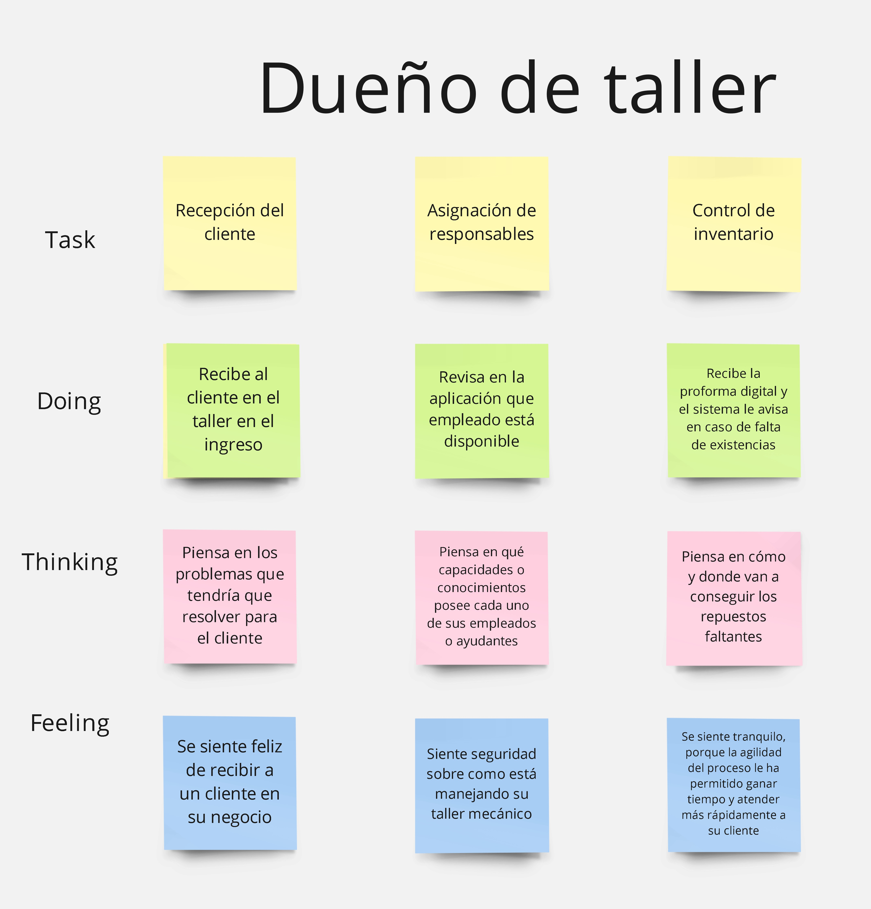
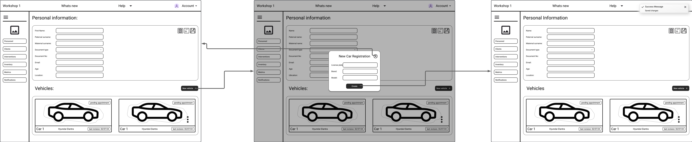
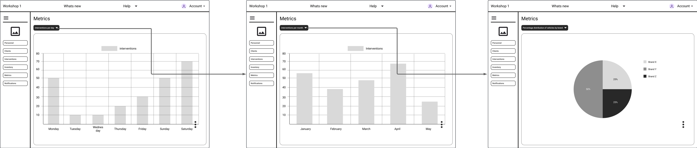
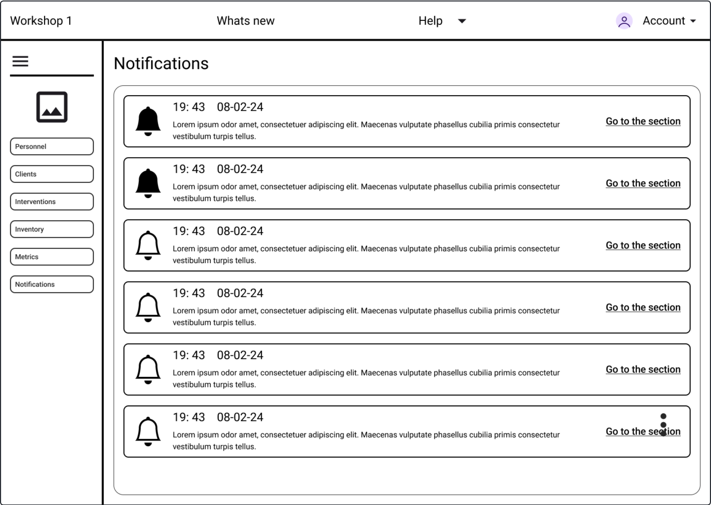
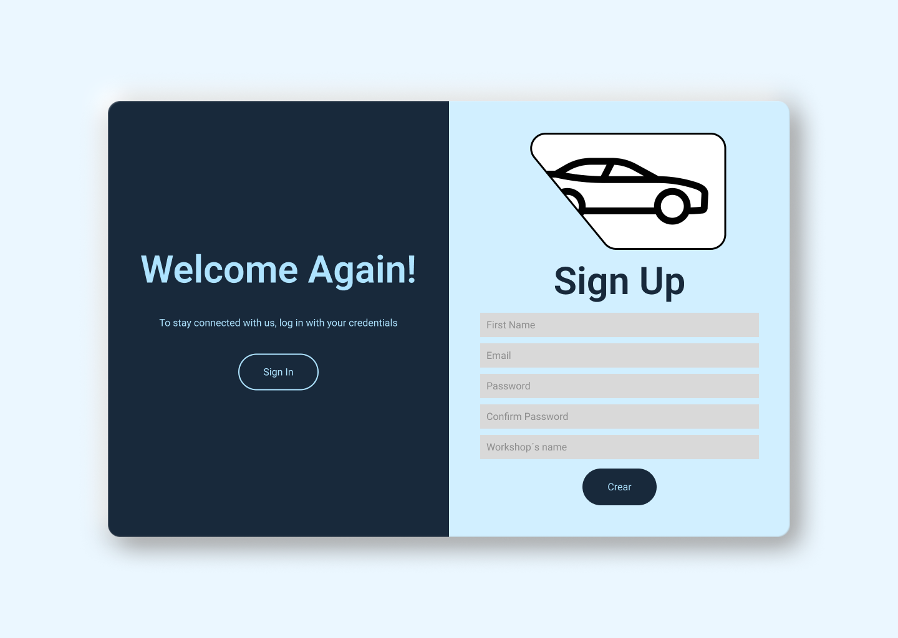
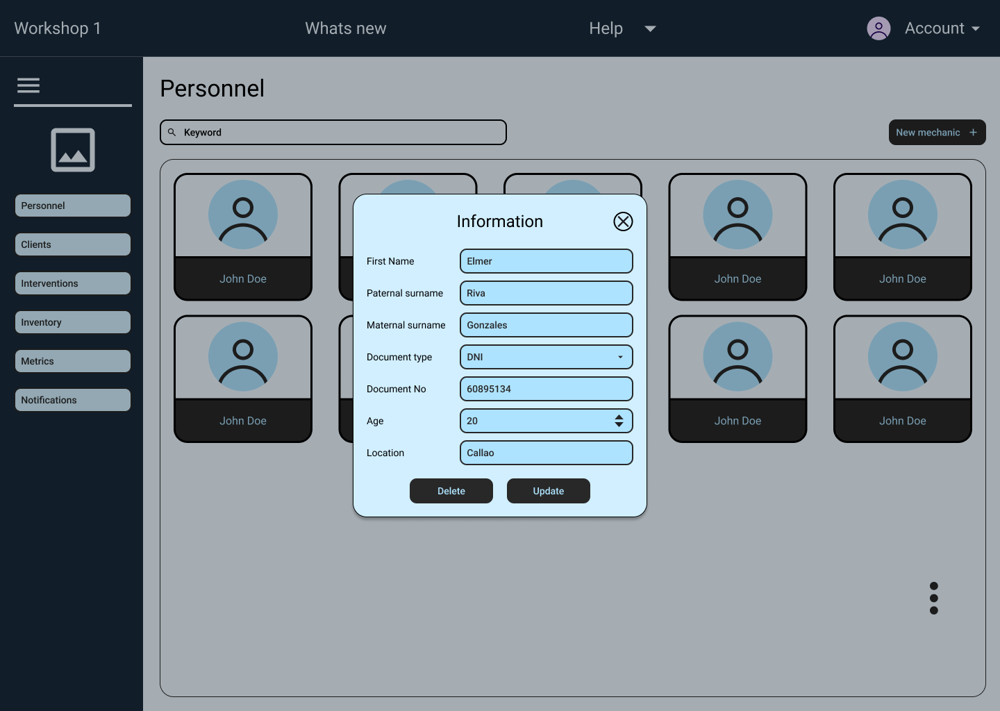
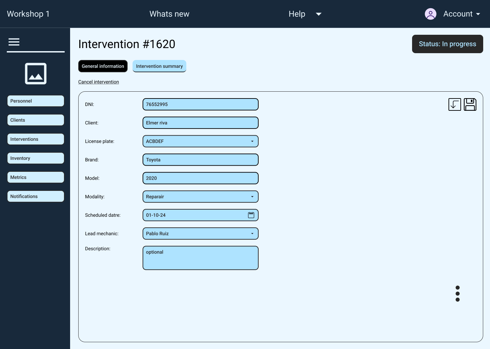
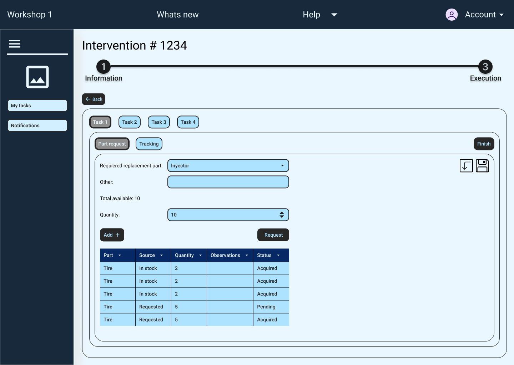
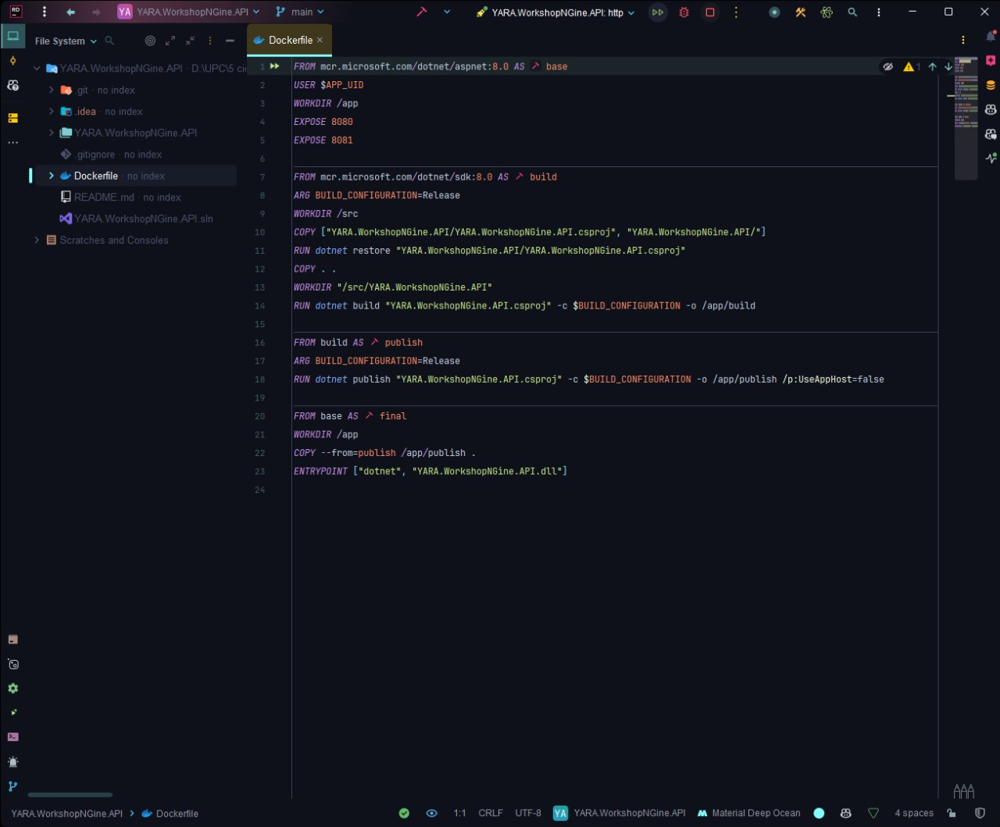
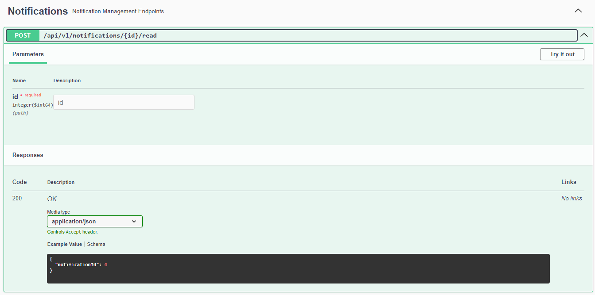

<body>
    <strong>
        <p align="center">
            Universidad Peruana de Ciencias Aplicadas - Ingeniería de Software<br>
            </img>
            <br>SI729 - Desarrollo de Aplicaciones Open Source<br>Velásquez Núñez, Ángel Augusto<br>
            <br>Informe de Trabajo Final<br>
            Startup: YaraSoftware<br>Producto: Workshop N-GINE
        </p>
    </strong>
    <div>
        <h3 align="center">Team Members:</h3>
        <table align="center">
            <tr>
                <th style="text-align:center;">Estudiante</th>
                <th style="text-align:center;">Código</th>
            </tr>
            <tr>
                <td>Gutiérrez Soto, Jhosepmyr Orlando</td>
                <td>202317638</td>
            </tr>
            <tr>
                <td>Hernández Tuiro, Eric Ernesto</td>
                <td>20221C857</td>
            </tr>
            <tr>
                <td>Riva Rodríguez, Elmer Augusto</td>
                <td>202220829</td>
            </tr>
            <tr>
                <td>Quiñonez Tintaya Jojan Jorge</td>
                <td>202218183</td>
            </tr>
        </table>
    </div>
    <p align="center">Agosto 2024</p>
</body>

# Registro de Versiones del Informe
| Versión | Fecha | Autor | Descripción de la modificación |
| ----------- | ----------- | ----------- | ----------- |
| 0.0.0 | 20/08/2024 | Álvaro Orozco Torres | Se agrega la carátula y la tabla de control de versiones |
| 1.0.0 | 01/09/2024 | Henry Reaño Delgadillo | Se agrega la primera sección del Capítulo I: Introducción |
| 1.1.0 | 01/09/2024 | Álvaro Orozco Torres | Se agrega la segunda y tercera sección del Capítulo I: Introducción<br>Se agrega la bibliografía |
| 2.0.0 | 01/09/2024 | Álvaro Orozco Torres | Se agrega la primera y segunda sección del Capítulo II: Requirements Elicitation & Analysis |
| 2.1.0 | 01/09/2024 | Henry Reaño Delgadillo | Se agrega más apartados a la segunda sección del Capítulo II: Requirements Elicitation & Analysis | 
| 2.2.0 | 02/09/2024 | Álvaro Orozco Torres | Se agrega más apartados a la segunda sección del Capítulo II: Requirements Elicitation & Analysis | 
| 2.2.1 | 02/09/2024 | Álvaro Orozco Torres | Se corrige la omisión de añadir el índice correspondiente a las nuevas secciones | 
| 2.2.2 | 02/09/2024 | Álvaro Orozco Torres | Se corrige el formato de presentación de el As-Is Scenario Mapping |
| 2.2.3 | 02/09/2024 | Henry Reaño Delgadillo | Se agrega el link de las entrevistas de Needfinding en la sección Anexos |
| 2.2.4 | 02/09/2024 | Henry Reaño Delgadillo | Se agrega la foto del dueño de taller Enrique Reaño en Registro de entrevistas |
| 2.2.5 | 03/09/2024 | Henry Reaño Delgadillo | Se agrega tres nuevos conceptos en Ubiquitous Language |
| 3.0.0 | 05/09/2024 | Elmer Riva Rodriguez | Se agrega la estructura completa del informe |
| 3.1.0 | 06/09/2024 | Álvaro Orozco Torres | Se agrega la primera sección del Capítulo III: Requirements Specification |
| 3.2.0 | 06/09/2024 | Álvaro Orozco Torres | Se agrega la segunda sección del Capítulo III: Requirements Specification |
| 3.3.0 | 06/09/2024 | Henry Reaño Delgadillo | Se agrega la tercera sección del Capítulo III: Requirements Specification |
| 3.4.0 | 06/09/2024 | Henry Reaño Delgadillo | Se agrega la última sección del Capítulo III: Requirements Specification |
| 4.1.1.1 | 06/09/2024 | Elmer Riva | Se agregan enlaces de Figma y wireframes para pantallas de inicio de sesión y creación de cuenta |
| 4.3.1.1 | 08/09/2024 | Jhosepmyr | Se agregan imágenes de wireframes para la landing page |
| 4.3.2.1 | 08/09/2024 | Jhosepmyr | Se agregan wireframes y secciones de mock-up en el diseño de la landing page |
| 4.4.1.1 | 08/09/2024 | Elmer Riva | Se actualizan imágenes y descripciones de wireframes para el cliente del taller |
| 4.4.1.2 | 08/09/2024 | Elmer Riva | Se actualizan imágenes y descripciones de wireframes para el mecánico |
| 4.4.1.3 | 08/09/2024 | Elmer Riva | Se actualizan imágenes y descripciones de wireframes para el dueño del taller |
| 4.4.1.4 | 06/09/2024 | Elmer Riva | Se agregan imágenes de wireframes para la gestión de inventario, métricas y notificaciones |
| 4.4.1.5 | 06/09/2024 | Elmer Riva | Se agregan wireframes relacionados con el cliente del taller |
| 4.4.1.6 | 06/09/2024 | Jhosepmyr | Se agregan wireframes para la sección de registro de nuevo cliente |
| 4.4.1.7 | 06/09/2024 | Elmer Riva | Se agregan wireframes relacionados con la gestión del dueño del taller |
| 4.4.1.8 | 06/09/2024 | Elmer Riva | Se agregan wireframes para la sección vacía de personal |
| 4.4.1.9 | 06/09/2024 | Elmer Riva | Se agregan wireframes para la edición de la información del personal |
| 4.4.1.10 | 06/09/2024 | Jhosepmyr | Se agregan wireframes para la gestión de personal y el registro de nuevos mecánicos |
| 4.4.2.1 | 08/09/2024 | Elmer Riva | Se agregan wireflows para la web en Desktop Web Browser |
| 4.4.2.2 | 08/09/2024 | Elmer Riva | Se actualizan imágenes y descripciones de wireflow |
| 4.4.2.3 | 07/09/2024 | Jhosepmyr | Se agregan wireflows para los objetivos de usuario: registrar un vehículo, acceder al historial de intervenciones del auto, acceder a la información del dispositivo IoT y agendar una cita |
| 4.4.2.4 | 07/09/2024 | Elmer Riva | Se agregan wireflows para las tareas del mecánico y la gestión de intervenciones |
| 4.4.2.5 | 06/09/2024 | Eric Hernandez | Se agregan wireflows para las interacciones del dueño del taller y el cliente |
| 4.4.2.6 | 06/09/2024 | Jhosepmyr | Se eliminan datos duplicados en una ubicación incorrecta |
| 4.4.2.7 | 06/09/2024 | Jhosepmyr | Se agregan wireflows para la creación de cuenta, inicio de sesión, gestión de empleados, registro de clientes y vehículos, visualización y gestión de información de empleados y clientes |
| 4.4.3.1 | 08/09/2024 | Elmer Riva | Se agregan wireflows para las interacciones del cliente y el taller |
| 4.5.1.1 | 08/09/2024 | Elmer Riva | Se actualizan los enlaces a los videos explicativos de prototipos de aplicaciones web para desktop y móvil |
| 4.5.2.1 | 07/09/2024 | Elmer Riva | Se agregan enlaces a los prototipos de aplicaciones web para cada user persona |
| 4.6.1.1 | 07/09/2024 | Elmer Riva | Se agregan imágenes del modelo C4 en la arquitectura software dirigida por el dominio |
| 4.6.2.1 | 07/09/2024 | Elmer Riva | Se agregan diagramas de contexto y contenedores en la arquitectura software dirigida por el dominio |
| 4.6.3.1 | 07/09/2024 | Elmer Riva | Se agrega el diagrama de componentes de la arquitectura software dirigida por el dominio |
| 4.7.1.1 | 07/09/2024 | Elmer Riva | Se agrega el diagrama de clases |
| 4.7.2.1 | 08/09/2024 | Elmer Riva | Se actualiza el diccionario de clases |
| 4.8.1.1 | 07/09/2024 | Jhosepmyr | Se agrega el diagrama de base de datos |
| 5.0.0 | 07/09/2024 | Henry Reaño Delgadillo | Se agrega una sección del Capítulo V: Product Implementation, Validation & Deployment |
| 5.1.0 | 07/09/2024 | Henry Reaño Delgadillo | Se agrega la sección correspondiente a gestión de código fuente | 
| 5.2.0 | 07/09/2024 | Henry Reaño Delgadillo | Se agrega la sección correspondiente a convenciones en la codificación y configuración de despliegue |
| 5.3.0 | 07/09/2024 | Henry Reaño Delgadillo | Se agrega la sección de sprint planning 1 y sprint backlog 1 | 
| 5.4.0 | 07/09/2024 | Henry Reaño Delgadillo | Se agrega las secciones de evidencias e insights del sprint 1 |
| 5.4.1 | 08/09/2024 | Henry Reaño Delgadillo | Se agrega nuevas fotos relacionadas a la landing page y correción de errores en los insights |
| 5.5.0 | 27/09/2024 | Henry Reaño Delgadillo | Se elimino la participación del miembro retirado del equipo |
| 5.5.1 | 27/09/2024 | Henry Reaño Delgadillo | Se elimino imágenes innecesarias de la carpeta img |
| 5.5.2 | 27/09/2024 | Henry Reaño Delgadillo | Se corrigieron los User Persona y se añadieron descripciones a los mismos |
| 5.5.3 | 27/09/2024 | Henry Reaño Delgadillo | Se corrigieron los User Journey Mapping y se añadieron descripciones a los mismos |
| 5.5.4 | 27/09/2024 | Henry Reaño Delgadillo | Se agrega el Student Outcome hasta trabajo parcial |
| 5.6.0 | 27/09/2024 | Henry Reaño Delgadillo | Se corrigieron los AS-IS y añadieron descripciones a los mismos |
| 5.6.1 | 27/09/2024 | Henry Reaño Delgadillo | Se corrigieron los TO-BE y añadieron descripciones a los mismos |
| 5.6.2 | 27/09/2024 | Henry Reaño Delgadillo | Se corrigio el Impact Mapping y se añadio una descripción para el mismo |
| 5.6.3 | 27/09/2024 | Henry Reaño Delgadillo | Se corrigio los criterios de aceptación de los user stories |
| 5.6.4 | 27/09/2024 | Henry Reaño Delgadillo | Se corrigio la priorización del product backlog |
| 5.7.0 | 27/09/2024 | Henry Reaño Delgadillo | Se agrega el sprint 2 |


<div style="page-break-after: always;"></div>

# Project Collaboration Insights

URL del repositorio para el reporte del proyecto:

[https://github.com/Open-Source-YaraSoftware/Informe](https://github.com/Open-Source-YaraSoftware/Informe)

**TB1**

Para el desarrollo del informe perteneciente a la entrega del TB1, se dividio la implementacion de secciones de la siguiente forma para cada integrante:

| Integrantes              | Tareas Asignadas                                                                                                                                                                    |
|--------------------------|-------------------------------------------------------------------------------------------------------------------------------------------------------------------------------------|
| Eric Hernandez Tuiro     | Descripcion de la startup, desarrollo del Lean UX Process, diseño de las entrevistas, desarrollo de los artefactos y arquitectura de informacion.                                   |
| Elmer Riva Rodriguez     | Desarrollo de las user stories, diseño de la guia de estilos general, diseño de la landing page , diseño de los user flow de la aplicacion web y desarrollo de la arquitectura DDD. |
| Jhosepmyr Gutierrez Soto | Diseño de los wireframes y mockups de la aplicacion web, desarrollo de la arquitectura DDD, desarollo del diagrama de clases y el diagrama de base de datos.                        |

**TP**

Para el desarrollo del informe perteneciente a la entrega del TP, se dividio la implementacion de secciones de la siguiente forma para cada integrante:

| Integrantes              | Tareas Asignadas                                                                                                                                                   |
|--------------------------|--------------------------------------------------------------------------------------------------------------------------------------------------------------------|
| Eric Hernandez Tuiro     | Correccion de los artefactos, correccion de las user stories y completar el diseño de la aplicacion web.                                                           |
| Elmer Riva Rodriguez     | Correccion de la arquitectura C4, completar los user flows y user goals, completar Testing Suite Evidence for Sprint Review y Execution Evidence for Sprint Review |
| Jhosepmyr Gutierrez Soto | Correccion del diagrama de clases y base de datos, completar el sprint planning 2, completar Development Evidence for Sprint Review.                               |


**TB2**

Para el desarrollo del informe perteneciente a la entrega del TB2, se dividio la implementacion de secciones de la siguiente forma para cada integrante:

| Integrantes              | Tareas Asignadas                                                                                                                                    |
|--------------------------|-----------------------------------------------------------------------------------------------------------------------------------------------------|
| Eric Hernandez Tuiro     | Elaboración de video about the product. Elaboración de entrevistas de validación.                                                                   |
| Elmer Riva Rodriguez     | Evaluación según heurísticas, análisis de entrevistas de validación. Testing Suite Evidence for Sprint Review, Execution Evidence for Sprint Review |
| Jhosepmyr Gutierrez Soto | Correccion del diagrama de clases y base de datos, y desarrollo Sprint Planning 3, Development Evidence for Sprint Review                           |

**TF**

Para el desarrollo del informe perteneciente a la entrega del TF, se dividio la implementacion de secciones de la siguiente forma para cada integrante:

| Integrantes                 | Tareas Asignadas                                                                                           |
|-----------------------------|------------------------------------------------------------------------------------------------------------|
| Eric Hernandez Tuiro        | Elaboración y grabación de entrevistas de validación, incluyendo evaluación de cumplimiento de heurísticas |
| Elmer Riva Rodriguez        | Execution Evidence for Sprint Review, Evaluación de del informe en general, y sprint 4 organización.       |
| Jhosepmyr Gutierrez Soto    | Actualización del c4 modeling, sprint planning 4                                                           |
| Jojan JorgeQuiñonez Tintaya | Corrección de errores en el informe, actualización de la bibliografía, actualización de los anexos.        |

El proceso de colaboración en el informe se realizó mediante commits constantes al repositorio de la organización Web-Application-YaraSoftware, donde cada integrante subió sus avances y se realizó una revisión constante de los mismos para asegurar la calidad del informe.

**Github Collaboration Insights**

Github también presenta una herramienta de timeline de las ramas y los procesos de merge que se han realizado en el proyecto. Estas mismas ramas se crearon siguiendo el flujo de trabajo de GitFlow, donde se crearon ramas de feature para cada sección del informe y se realizaron los merges correspondientes a la rama de desarrollo.

Los integrantes son:
* Jhosepmyr Orlando Gutiérrez Soto (jhosepmyr)
* Eric Ernesto Hernández Tuiro (Eric396)
* Elmer Augusto Riva Rodríguez (elmer-riva)
* Jojan Jorge Quiñonez Tintaya (johaanq)

Se explicará el proceso de la division de las ramas más importantes:
* **main**: Rama principal del proyecto, donde se encuentran los cambios finales y aprobados del proyecto.
* **develop**: Rama de desarrollo, donde se encuentran los cambios en desarrollo y se realizan los merges de las ramas de feature.
* **feature-chapter-n**: Ramas de feature para cada sección del informe, donde se realizan los cambios correspondientes a cada sección del informe.
* **feature-sprint-n**: Ramas de feature para cada sprint, donde se realizan los cambios correspondientes a cada sprint del proyecto.
* **hotfix**: Ramas de hotfix para correcciones de errores críticos en el proyecto.


Los siguientes gráficos muestran la cantidad de commits y líneas de código agregadas por cada integrante del equipo en el proyecto.


El siguiente gráfico muestra la cantidad de commits realizados en la semana con mayor actividad en el proyecto.


<div style="page-break-after: always;"></div>

# Contenido

[Capítulo I: Introducción](#capítulo-i-introducción)

[1.1. Startup Profile](#11-startup-profile)

[1.1.1. Descripción de la Startup](#111-descripción-de-la-startup)

[1.1.2. Perfiles de los integrantes del equipo](#112-perfiles-de-los-integrantes-del-equipo)

[1.2. Solution Profile](#12-solution-profile)

[1.2.1. Antecedentes y problemática](#121-antecedentes-y-problematica)

[1.2.2. Lean UX Process](#122-lean-ux-process)

[1.2.2.1. Lean UX Problem Statements](#1221-lean-ux-problem-statements)

[1.2.2.2. Lean UX Assumptions](#1222-lean-ux-assumptions)

[1.2.2.3. Lean UX Hypothesis](#1223-lean-ux-hypothesis)

[1.2.2.4. Lean UX Canvas](#1224-lean-ux-canvas)

[1.3. Segmentos objetivo](#13-segmentos-objetivo)

[Capítulo II: Requirements Elicitation & Analysis](#capítulo-ii-requirements-elicitation--analysis)

[2.1. Competidores](#21-competidores)

[2.1.1. Análisis competitivo](#211-análisis-competitivo)

[2.1.2. Estrategias y tácticas frente a competidores](#212-estrategias-y-tacticas-frente-a-competidores)

[2.2. Entrevistas](#22-entrevistas)

[2.2.1. Diseño de entrevistas](#221-diseño-de-entrevistas)

[2.2.2. Registro de entrevistas](#222-registro-de-entrevistas)

[2.2.3. Análisis de entrevistas](#223-análisis-de-entrevistas)

[2.3. Needfinding](#23-needfinding)

[2.3.1. User Personas](#231-user-personas)

[2.3.2. User Task Matrix](#232-user-task-matrix)

[2.3.3. User Journey Mapping](#233-user-journey-mapping)

[2.3.4. Empathy Mapping](#234-empathy-mapping)

[2.3.5. As-is Scenario Mapping](#235-as-is-scenario-mapping)

[2.4. Ubiquitous Language](#24-ubiquitous-language)

[Capítulo III: Requirements Specification](#capítulo-iii-requirements-specification)

[3.1. To-Be Scenario Mapping](#31-to-be-scenario-mapping)

[3.2. User Stories](#32-user-stories)

[3.3. Impact Mapping](#33-impact-mapping)

[3.4. Product Backlog](#34-product-backlog)

[Capítulo IV: Product Design](#capítulo-iv-product-design)

[4.1. Style Guidelines](#41-style-guidelines)

[4.1.1. General Style Guidelines](#411-general-style-guidelines)

[4.1.2. Web Style Guidelines](#412-web-style-guidelines)

[4.2. Information Architecture](#42-information-architecture)

[4.2.1. Organization Systems](#421-organization-systems)

[4.2.2. Labeling Systems](#422-labeling-systems)

[4.2.3. SEO Tags and Meta Tags](#423-seo-tags-and-meta-tags)

[4.2.4. Searching Systems](#424-searching-systems)

[4.2.5. Navigation Systems](#425-navigation-systems)

[4.3. Landing Page UI Design](#43-landing-page-ui-design)

[4.3.1. Landing Page Wireframe](#431-landing-page-wireframe)

[4.3.2. Landing Page Mock-up](#432-landing-page-mock-up)

[4.4. Web Applications UX/UI Design](#44-web-applications-uxui-design)

[4.4.1. Web Applications Wireframes](#441-web-applications-wireframes)

[4.4.2. Web Applications Wireflow Diagrams](#442-web-applications-wireflow-diagrams)

[4.4.3. Web Applications Mock-ups](#443-web-applications-mock-ups)

[4.4.4. Web Applications User Flow Diagrams](#444-web-applications-user-flow-diagrams)

[4.5. Web Applications Prototyping](#45-web-applications-prototyping)

[4.6. Domain-Driven Software Architecture](#46-domain-driven-software-architecture)

[4.6.1. Software Architecture Context Diagram](#461-software-architecture-context-diagram)

[4.6.2. Software Architecture Container Diagrams](#462-software-architecture-container-diagrams)

[4.6.3. Software Architecture Components Diagrams](#463-software-architecture-components-diagrams)

[4.7. Software Object-Oriented Design](#47-software-object-oriented-design)

[4.7.1. Class Diagrams](#471-class-diagrams)

[4.7.2. Class Dictionary](#472-class-dictionary)

[4.8. Database Design](#48-database-design)

[4.8.1. Database Diagram](#481-database-diagram)

[Capítulo V: Product Implementation, Validation & Deployment](#capítulo-v-product-implementation-validation--deployment)

[5.1. Software Configuration Management](#51-software-configuration-management)

[5.1.1. Software Development Environment Configuration](#511-software-development-environment-configuration)

[5.1.2. Source Code Management](#512-source-code-management)

[5.1.3. Source Code Style Guide & Conventions](#513-source-code-style-guide--conventions)

[5.1.4. Software Deployment Configuration](#514-software-deployment-configuration)

[5.2. Landing Page, Services & Applications Implementation](#52-landing-page-services--applications-implementation)

[5.2.1. Sprint 1](#521-sprint-1)

[5.2.1.1. Sprint Planning 1](#5211-sprint-planning-1)

[5.2.1.2. Sprint Backlog 1](#5212-sprint-backlog-1)

[5.2.1.3. Development Evidence for Sprint Review](#5213-development-evidence-for-sprint-review)

[5.2.1.4. Testing Suite Evidence for Sprint Review](#5214-testing-suite-evidence-for-sprint-review)

[5.2.1.5. Execution Evidence for Sprint Review](#5215-execution-evidence-for-sprint-review)

[5.2.1.6. Services Documentation Evidence for Sprint Review](#5216-services-documentation-evidence-for-sprint-review)

[5.2.1.7. Software Deployment Evidence for Sprint Review](#5217-software-deployment-evidence-for-sprint-review)

[5.2.1.8. Team Collaboration Insights during Sprint](#5218-team-collaboration-insights-during-sprint)

[5.3. Validation Interviews](#53-validation-interviews)

[5.3.1. Diseño de Entrevistas](#531-diseño-de-entrevistas)

[5.3.2. Registro de Entrevistas](#532-registro-de-entrevistas)

[5.3.3. Evaluaciones según heurísticas](#533-evaluaciones-según-heurísticas)

[5.4. Video About-the-Product](#54-video-about-the-product)

[Conclusiones](#conclusiones)

[Conclusiones y recomendaciones](#conclusiones-y-recomendaciones)

[Video About-the-Team](#video-about-the-team)

[Bibliografía](#bibliografía)

[Anexos](#anexos)


# Student Outcome

**ABET – EAC - Student Outcome 3** Capacidad de comunicarse efectivamente con un rango de audiencias. 

| Criterio Especifico                                                    | Acciones Realizadas                                                                                                                                                                                                                                                                                                                                                                                                                                                                                                                                                                                                                                                                                                                                                                                                                                                                                                                                                                                                                                                                                                                                                                                                                                                                                                                                                                                                                                                                                                                                                                                                                                                                                                                                                                                                                                                                                                                                                                                                                                                                                                                                                                                                                                                                                                                                                                                                                                                                                                                                                                                                                                                                                                                                                                                                                                                                                                                                                                                                                                                                                                                                                                                                                                                                                                                                                                                                                                                                                                                                                                                                                                                                                                                                                          | Conclusiones                                                                                                                                                                                                                                                                                                                                                                                                                                                                                                                                                                                                                                                                                                                                                                                                                                                           |
|------------------------------------------------------------------------|------------------------------------------------------------------------------------------------------------------------------------------------------------------------------------------------------------------------------------------------------------------------------------------------------------------------------------------------------------------------------------------------------------------------------------------------------------------------------------------------------------------------------------------------------------------------------------------------------------------------------------------------------------------------------------------------------------------------------------------------------------------------------------------------------------------------------------------------------------------------------------------------------------------------------------------------------------------------------------------------------------------------------------------------------------------------------------------------------------------------------------------------------------------------------------------------------------------------------------------------------------------------------------------------------------------------------------------------------------------------------------------------------------------------------------------------------------------------------------------------------------------------------------------------------------------------------------------------------------------------------------------------------------------------------------------------------------------------------------------------------------------------------------------------------------------------------------------------------------------------------------------------------------------------------------------------------------------------------------------------------------------------------------------------------------------------------------------------------------------------------------------------------------------------------------------------------------------------------------------------------------------------------------------------------------------------------------------------------------------------------------------------------------------------------------------------------------------------------------------------------------------------------------------------------------------------------------------------------------------------------------------------------------------------------------------------------------------------------------------------------------------------------------------------------------------------------------------------------------------------------------------------------------------------------------------------------------------------------------------------------------------------------------------------------------------------------------------------------------------------------------------------------------------------------------------------------------------------------------------------------------------------------------------------------------------------------------------------------------------------------------------------------------------------------------------------------------------------------------------------------------------------------------------------------------------------------------------------------------------------------------------------------------------------------------------------------------------------------------------------------------------------------|------------------------------------------------------------------------------------------------------------------------------------------------------------------------------------------------------------------------------------------------------------------------------------------------------------------------------------------------------------------------------------------------------------------------------------------------------------------------------------------------------------------------------------------------------------------------------------------------------------------------------------------------------------------------------------------------------------------------------------------------------------------------------------------------------------------------------------------------------------------------|
| Comunica oralmente con efectividad a diferentes rangos de audiencia.   | Jhosepmyr:<br> TB1: En este entregable yo participe ordenando al equipo en ocasiones para fomentar el trabajo en equipo constante. <br> TP: Fungi de nuevo lider a partir de este nuevo entregable, proyecte nuevas reuniones y consegui unir al equipo para desarrollar todas las actividades deseadas.<br> TB2: Contribuí a redactar las instrucciones para desplegar el backend de la aplicación elaborada, es to con el objetivo de que futuros developers puedan comprender y replicar el despliegue por su cuenta. <br> TF: Participé activamente en la presentación de los logros y conclusiones del proyecto, contribuyendo al desarrollo de la documentación que reflejó los resultados obtenidos. Además, colaboré en la identificación de áreas de mejora para optimizar las futuras fases del proyecto. <br>Eric:<br> TB1: En este primer entregable participé en todas las reuniones de trabajo y aporté ideas y participé en los debates importantes. Me sentí una pieza importante del equipo al mismo tiempo que consideré que todos los demás lo fueron por igual.<br> TP: En el trabajo parcial manteni unido al equipo en las reuniones grupales donde avanzamos el trabajo, me sentí pieza importante del trabajo. <br> TB2: Realicé avances en el back-end de la aplicación web. Los endpoints creados se encuentran debidamente documentados gracias al uso de la herramienta de swagger-ui. <br> TF: El mantener una comunicación constante con el público objetivo fue esencial para garantizar que sus expectativas se cumplieran de manera efectiva. El equipo implementó reuniones periódicas y utilizó plataformas como GitHub, lo que favoreció una excelente coordinación, trabajo colaborativo y alineación con los objetivos del proyecto. <br> TF: Se llevaron a cabo entrevistas de validación con los usuarios para evaluar su experiencia con la aplicación. Este proceso permitió transmitir el progreso del proyecto, obtener retroalimentación significativa y garantizar que se cumplieran los estándares de satisfacción del cliente. <br> Elmer: <br> TB1: En este primer entregable, trabajé en equipo asumiendo un liderazgo conjunto con mis compañeros. Colaboramos activamente en la toma de decisiones clave, como los flujos de usuario y la arquitectura de la información. Además, distribuimos las responsabilidades de forma equitativa, lo que nos permitió compartir el liderazgo y aprovechar las fortalezas de cada uno para cumplir con los objetivos del proyecto de manera eficiente. <br> TP: Para esta entrega me mantuve bastante abierto a la opinión de los demás y debati acerca de lo que era más correcto para la elaboración del proyecto. <br> TB2: Contribui con la elaboracion del back end y desarrollo del front end de manera que se pueda realizar un avance significativo y bajo los criterios establecidos, manteniendo en cuenta los deseos del cliente. <br> TF: Al elaborar el documento, se destacó la importancia de una comunicación escrita clara y precisa. Hicimos uso de herramientas como WhatsApp, Discord y GitHub para mantener a todos informados sobre los avances, discutir obstáculos y solicitar retroalimentación, lo que fortaleció el trabajo en equipo y permitió la resolución de problemas de manera efectiva. <br> Johan: <br> TB2: En este segundo entregable, mantuve una conunicación constante para facilitar el flujo del trabajo. A medida que avanzaba los cambios, recibia y aplicaba feedback de mis compañeros así me aseguraba de adaptarme a este nuevo proyecto. <br> TF: Durante la elaboración del proyecto se tuvo que comunicar de forma activa al público objetivo el desarrollo del mismo para así lograr mantenernos en línea con lo solicitado  | Consideramos que hemos cumplido con este criterio, ya que las exposiciones orales y entrevistas realizadas han sido fundamentales para mantener a todos informados y continuar con el desarrollo del proyecto. La participación activa en las reuniones y el feedback constante nos ha permitido avanzar correctamente. Un ejemplo concreto fue la reunión con el cliente donde pudimos esclarecer detalles importantes para el futuro desarrollo del proyecto, ajustando nuestras metas a sus expectativas. También, la retroalimentación de los usuarios durante las entrevistas nos permitió mejorar áreas clave de la aplicación, lo que fortaleció la relación con ellos y garantizó su satisfacción.                                                                                                                                                             |
| Comunica por escrito con efectividad a diferentes rangos de audiencia. | Jhosepmyr: <br> TB1: Usualmente escribia por el grupo de discord para reunirnos y notificaba los avances que se realizaban en reuniones rápidas que teníamos a lo largo de los días <br> TP: Para este entregable me comunique bastante con el equipo mediante chat para asignarles las tareas que tienen pendientes y ayudarles en lo que necesiten. <br> TB2: Se organizaron reuniones con el equipo de trabajo para conocer los avances constantes durante el sprint, además de realizar un video de presentación con lo realizado durante el sprint 2. <br> TF: En la presentación final, el equipo expuso de manera clara los logros alcanzados durante el proyecto, presentando además un video resumen del Sprint 4. La comunicación constante a través de reuniones permitió cumplir eficientemente con los objetivos establecidos y asegurar una coordinación adecuada <br> Eric: <br>TB1: Para ayudar a crear un entorno colaborativo saludable trabajé en un entorno colaborativo con los demás miembros del equipo al mismo tiempo que mantuve puntualidad en el cumplimiento de las tareas del trabajo.<br> TP: Durante este entregable ayude a modificar algunos artefactos para comunicar mejor el entendimiento del proyecto a las personas que lo lean. <br> TB2: En la presentación del proyecto se explica a detalle el desarrollo del tercer sprint y la organización del código del proyecto. Se incluye el proceso de deployment y los insights de la colaboración del equipo durante el sprint. <br> Elmer: <br>TB1: En este primer entregable, creé un entorno colaborativo e inclusivo, donde todos los miembros del equipo pudieron participar activamente. Establecimos metas claras desde el principio, como definir los flujos de usuario y la estructura de la UI. Planificamos las tareas de manera organizada, asignando responsabilidades específicas. Por ejemplo, coordinamos el desarrollo de los prototipos interactivos y la revisión conjunta de los User Flow Diagrams, lo que nos permitió cumplir con los objetivos en tiempo. <br> TP: Para el trabajo parcial mantuve mi organización en equipo e incluse mejore como me comunicaba con mi equipo, de esta manera siento que aproveche mis habilidades para potenciar el trabajo que venimos elaborando a lo largo del ciclo. <br> TB2: Realice el sprint backlog del sprint 3, ademas de organizar sprint en trello para la documentacion de avances y organizacion de entregables. <br> TF: En el entregable final, el equipo colaboró estrechamente para establecer metas precisas, asegurando el correcto funcionamiento de la aplicación y una experiencia de usuario óptima. Se asignaron responsabilidades, se resolvieron errores y se mejoró la nomenclatura del código, lo que permitió un desarrollo más organizado y eficiente a futuro. <br> Johan: <br> TB2: Para este entregable, mantuve una comunicación escrita constante con el equipo para asegurar un buen progreso. Avance por parte del backend payment, membership y transaction, para el frontend mockups de login y signup, recibi igual feedbacks de mis compañeros para que mi avance se acople al proyecto. <br> TF: Para el entregable final, se priorizó asegurar que la aplicación funcionara correctamente y brindara una excelente experiencia al usuario. Se realizaron correcciones de bugs y ajustes en la nomenclatura del código, con el objetivo de facilitar un desarrollo futuro más estructurado y fluido.                                                                                                                                                                                                                                                                            | Consideramos que hemos avanzado satisfactoriamente en este criterio, ya que el esfuerzo continuo en la comunicación escrita ha permitido que el equipo mantenga un alto nivel de colaboración, asegurando una coordinación eficaz en todas las fases del proyecto. Un ejemplo claro de esto fue el uso de Trello, donde pudimos organizar de manera visual las tareas del sprint, asignar responsabilidades y hacer seguimiento de los avances en tiempo real. Además, las reuniones y la documentación a través de herramientas como GitHub permitieron que todos los miembros del equipo estuvieran alineados en cuanto a los avances, bloqueos y expectativas. La comunicación escrita efectiva también fue crucial para asegurar que el cliente recibiera actualizaciones regulares sobre el progreso del proyecto, lo que aumentó su confianza en nuestro equipo. |

<div style="page-break-after: always;"></div>

# Capítulo I: Introducción

## 1.1. Startup Profile

### 1.1.1. Descripción de la Startup
Yara Software es una startup conformada por jóvenes estudiantes de la carrera de Ingeniería de Software cuyo objetivo es la creación de productos de software personalizados que optimizan y transforman procesos en sectores laborales que a menudo se pasan por alto en la digitalización.

**Misión:** Nuestra misión es impulsar desarrollo tecnológico a diversos sectores de la industria, favoreciendo el crecimiento económico a través de soluciones de software innovadoras, accesibles y adaptadas a las necesidades de sus usuarios. A través del compromiso con la calidad, la eficiencia y la experiencia de usuario, garantizamos el éxito de nuestros proyectos y favorecemos la integración y adopción de la tecnología en el mundo actual de constante cambio.

**Visión:** Como Startup, aspiramos a ser reconocidos a nivel nacional por nuestro fuerte compromiso con la calidad y la excelencia, alcanzando afianzar a más de 10,000 usuarios a nivel nacional en los próximos cuatro años, posicionándonos como un referente en cuanto a desarrollo tecnológico e innovación en el país.

### 1.1.2. Perfiles de los integrantes del equipo 

| Foto del participante | Nombres y apellidos | Código de estudiante | Carrera | Conocimientos técnicos y habilidades |
| - | - | - | - | - |
|  </img> | Jhosepmyr Orlando Gutiérrez Soto | 202317638 | Ingeniería de Software | Experiencia en desarrollo frontend y backend. Conocimiento alto en BlockChain. Determinación y seguridad en los trabajos en equipo |
|  </img> | Eric Ernesto Hernández Tuiro | 20221C857 | Ingeniería de Software | Programación en C++ y Python. Resolución de problemas y resiliencia ante situaciones de presión. | 
|  </img> | Elmer Augusto Riva Rodríguez | 202220829 | Ingeniería de Software | Diseño de experiencias de usuario y programación con C++ y Python. Competente en la gestión de proyectos grupales. |
|  </img> | Jojan Jorge Quiñonez Tintaya | 202218183 | Ingeniería de Software | He adquirido una base sólida en algoritmos y programación orientada a objetos, lo que me permite enfrentar desafíos de desarrollo con eficacia. |
|  </img> | Mauro Fabricio Lopez de la Cruz | 202218183 | Ingeniería de Software | Tengo conocomiento en c++ , python, html ,css, javascript. Me considero una persona amable con capacidad de tener una muy buena comunnicacion en trabajos en grupo para el desarrollo de proyectos dando y ayudando en la solucion de problemas . |


## 1.2. Solution Profile

### 1.2.1. Antecedentes y problemática

***What?***

La baja rentabilidad, retención y fidelización de clientes.

***Why?***

Porque los talleres mecánicos se enfocan únicamente en la eficiencia del servicio.

***Who?***

A dueños de talleres de mecánica automotriz.

***When?***

En la actualidad, de manera continua a lo largo del tiempo.

***Where?***

En el Perú, principalmente en la ciudad de Lima.

***How?***

Se mide a través del flujo de caja en talleres mecánicos y su ganancia media mensual.

***How much?***

A la gran mayoría de talleres, sobre todo, los más informales.

### 1.2.2. Lean UX Process

#### 1.2.2.1 Lean UX Problem Statements

En la actualidad, el sector de la mecánica automotriz se enfoca principalmente en la eficiencia del servicio a clientes esporádicos con necesidades correctivas. Sin embargo, no aborda la importancia de fidelizar clientes, generar un flujo constante de ingresos y ofrecer información clave sobre el estado del servicio de forma efectiva.

Nuestro producto busca resolver estos problemas mediante funcionalidades de gestión de personal, almacenamiento de información sobre clientes, control de inventario y un sistema de salud vehcular. Para ello, inicialmente, nos enfocaremos en los dueños de talleres automotrices. 

El problema se considerará resuelto cuando los dueños de talleres automotrices puedan administrar eficazmente y atender a un flujo constante de clientes fidelizados.

#### 1.2.2.2. Lean UX Assumptions

***Business Outcomes***
+ Llegar a 2500 usuarios en un año
+ Tener un índice de retención de usuarios del 90%
+ El 20% de nuestros clientes use la suscripción premium

***Users***

**Roberto García - Dueño de taller mecánico**

Objetivos:
+ Ofrecer un servicio eficiente para fidelizar a sus clientes.
+ Controlar mejor los recursos para reducir costos operativos.
+ Mejorar la satisfacción del cliente para aumentar las referencias y reseñas positivas.

Obstáculos:
+ Falta de tiempo para gestionar todos los aspectos del negocio de manera eficiente.
+ Dificultad para implementar nuevas tecnologías
+ Competencia creciente de talleres más grandes y mejor equipados.
+ Incertidumbre en la gestión del inventario lo que puede resultar en repuestos faltantes.

**Juan Pérez - Mecánico**

Objetivos:
+ Realizar su trabajo de manera eficiente.
+ Conocer el estado del vehículo para determinar cómo repararlo.
+ Minimizar el tiempo perdido en la búsqueda de respuestos.

Obstáculos:
+ Falta o dificultad de acceso información sobre el estado del vehículo.
+ Desorganización en el taller, lo que lleva a malentendidos y demoras.
+ Presión para realizar su trabajo rápido.

**María López - Cliente de taller**

Objetivos:
+ Mantener su vehículo en buen estado para evitar problemas inesperados.
+ Recibir un servicio rápido y confiable, sin tener que esperar mucho tiempo.
+ Ahorrar dinero en reparaciones costosas mediante un mantenimiento preventivo efectivo.
+ Sentirse informada y segura sobre el estado de su vehículo y las reparaciones necesarias.

Obstáculos:
+ Tiempo limitado para dejar su coche en el taller, ya que depende de él para su trabajo.
+ Falta de conocimiento técnico, ya que teme que le cobren por reparaciones innecesarias.
+ Incertidumbre sobre la disponibilidad del taller, lo que a veces la lleva a cambiar de lugar si no recibe atención rápida.

***User Outcomes***

**Roberto García - Dueño de taller mecánico**
+ Aumentar la cantidad de clientes atendidos por día
+ Ahorrar tiempo en control de recursos de taller
+ Aumentar la rentabilidad y retención de clientes

**Juan Pérez - Mecánico**
+ Lograr ser más eficiente en el trabajo

**María López - Cliente de taller**
+ Ahorrar en reparaciones de su vehículo
+ Sentirse más satisfechos con el servicio

***Solutions***
+ Sistema de gestión de horarios
+ Historial de vehículos
+ Gestión de inventario
+ Base de datos de clientes
+ Sistema de salud vehicular
+ Sistema de aforo de taller

#### 1.2.2.3. Lean UX Hypothesis
+ Creemos que lograremos llegar a 2500 usuarios en un año si los dueños de talleres logran aumentar la cantidad de clientes atendidos por día mediante el sistema de gestión de horarios
+ Creemos que lograremos tener índice de retención de clientes del 90% si los mecanicos logran ser más eficientes en su trabajo mediante la consulta de historial de vehículos
+ Creemos que lograremos tener índice de retención de clientes del 90% si los dueños de talleres logran ahorrar tiempo en control de recursos de taller mediante sistema de gestión de inventario
+ Creemos que lograremos el 20% de nuestros clientes use la suscripción premium si los dueños de talleres logran aumentar la rentabilidad y retención de clientes mediante base de datos de clientes y venta del acceso a sistema de salud vehicular
+ Creemos que lograremos el 20% de nuestros clientes use la suscripción premium si clientes de taller logran ahorrar en reparaciones de su vehículo mediante sistema de salud vehicular
+ Creemos que lograremos el 20% de nuestros clientes use la suscripción premium si clientes de taller logran sentirse más satisfechos con el servicio mediante sistema de aforo del taller

#### 1.2.2.4. Lean UX Canvas


## 1.3. Segmentos objetivo

***Dueños de taller***

Según un informe de Zippia (2022), en Estados Unidos, el 95.7% de los dueños de taller son hombres y, aunque la edad puede variar según la etnicidad, generalmente se aproxima a los 43 años. Además, el mismo estudio señala que aproximadamente el 42% de los dueños de taller poseen un grado de educación secundaria mientras que el 24% posee un grado técnico superior.

+ Género: Masculino

+ Edad: 43 años

+ Grado de instrucción: Educación secundaria

***Mecánicos***

Según un informe de Zippia (2022), en Estados Unidos, el 96.4% de los mecánicos son hombres y, aunque la edad puede variar según la etnicidad, generalmente se aproxima a los 40 años. Además, el mismo estudio señala que aproximadamente el 47% de los mecánicos poseen un grado de educación secundaria.

+ Género: Masculino

+ Edad: 40 años

+ Grado de instrucción: Educación secundaria

***Clientes de taller***

De acuerdo con datos de MarketWatch (2024), en Estados Unidos, el 49.5% de los vehículos están en manos de hombres. A pesar de esto, son ellos quienes pasan más tiempo al volante y recorren mayores distancias. La mayoría de estos conductores tiene alrededor de 30 años.

+ Género: Masculino

+ Edad: 30 años

<div style="page-break-after: always;"></div>

# Capítulo II: Requirements Elicitation & Analysis

## 2.1. Competidores

### 2.1.1. Análisis competitivo

<table>
    <tr>
        <th colspan="6">Competitive Analysis Landscape</th>
    </tr>
    <tr>
        <td colspan="2" rowspan="2">Competitive Analysis Landscape</td>
        <td colspan="4">Escriba en el recuadro la pregunta que busca responder o el objetivo de este análisis.</td>
    </tr>
    <tr>
        <td colspan="4">El objetivo de este análisis es evaluar el estado actual del mercado de software, identificando el alcance y las características de las soluciones existentes. Esto nos permitirá definir una propuesta de valor única y desarrollar una identidad distintiva para nuestro producto, asegurando que se diferencie claramente en el mercado y satisfaga necesidades no plenamente abordadas por la competencia.</td>
    </tr>
    <tr>
        <td colspan="2"></td>
        <th scope="col">Workshop N-GINE</th>
        <th scope="col">Autodata</th>
        <th scope="col">ServitechApp</th>
        <th scope="col">AutoSoft Taller</th>
    </tr>
    <tr>
        <th scope="row" rowspan="2">Perfil</th>
        <th scope="row">Overview</th>
        <td>Workshop N-GINE es una solución integral que transforma los talleres automotrices mediante tecnología avanzada, enfocándose en la optimización, la eficiencia y la satisfacción del cliente</td>
        <td>Desarrollado por expertos en automoción que comprenden las complejidades del servicio, el mantenimiento, el diagnóstico y la reparación de vehículos. Reduzca los errores y agilice los trabajos</td>
        <td>ServitechApp te permite crear ordenes de trabajo y presupuestos, gestionar la venta de productos, administrar tus clientes y llevar fácilmente el control de tu taller. ¡Puedes personalizarlo en 5 minutos!</td>
        <td>Nuestra innovadora solución combina tecnología de vanguardia y conocimiento especializado para ofrecerte una experiencia sin igual en tu taller automotriz. Ya sea que necesites optimizar la gestión del taller, realizar diagnósticos precisos, recibir asistencia técnica experta, administrar ciclos de mantenimiento, seleccionar las partes adecuadas, encontrar soluciones a problemas o elaborar presupuestos precisos, nuestro asistente de IA está aquí para ayudarte en cada paso del camino</td>
    </tr>
    <tr>
        <th scope="row">Ventaja competitiva ¿Qué valor ofrece a los clientes?</th>
        <td>Foco principal en la optimización de procesos y en la satisfacción de los clientes</td>
        <td>Acceso a documentación de una amplia gama de vehículos, lo que facilita el diagnóstico y reparación de estos</td>
        <td>Alto nivel de personalización e integración con múltiples herramientas multidispositivo, lo que favorece su adopción</td>
        <td>Incorporación de una inteligencia artificial que brinda asistencia personalizada a los usuarios, lo que complementa los diagnósticos de los mecánicos</td>
    </tr>
    <tr>
        <th scope="row" rowspan="2">Perfil de Marketing</th>
        <th scope="row">Mercado Objetivo</th>
        <td>Talleres de mecánica automotriz pequeños y medianos</td>
        <td>Grandes empresas de mecánica y electrónica automotriz</td>
        <td>Talleres de mecánica automotriz y mecánica industrial</td>
        <td>Talleres de mecánica automotriz</td>
    </tr>
    <tr>
        <th scope="row">Estrategias de Marketing</th>
        <td>Prueba gratuita de 30 días</td>
        <td>Prueba sin compromiso del producto por S/5.00</td>
        <td>Prueba sin compromiso del producto gratuita</td>
        <td>Prueba por tiempo limitado de las funcionalidades de inteligencia artificial de forma gratuita</td>
    </tr>
    <tr>
        <th scope="row" rowspan="3">Perfil de Producto</th>
        <th scope="row">Productos y Servicios</th>
        <td>Workshop N-GINE - Regular<br>Workshop N-GINE - Premium<br>Atención al cliente</td>
        <td>Autodata para motos - Motorcycles<br>Autodata para autos y furgonetas - Service & Maintenance<br>Autodata para autos y furgonetas - Diagnostic & Repair<br>Atención al cliente</td>
        <td>ServitechApp - Personal<br>ServitechApp - Plus<br>ServitechApp - Pro<br>Atención al cliente</td>
        <td>AutoSoft Taller - Básico<br>AutoSoft Taller - Profesional<br>Asistente Inteligente (IA)<br>Atención al cliente</td>
    </tr>
    <tr>
        <th scope="row">Precios y costos</th>
        <td>S/59.99 PEN al mes<br>S/99.99 PEN al mes o S/1099.99 PEN al año</td>
        <td>S/86.00 PEN al mes<br>S/172.00 PEN al mes<br>S/310.00 PEN al mes</td>
        <td>$/49.99 USD pago único<br>$/99.99 USD pago único<br>$/159.99 USD pago único</td>
        <td>Desde $/15.99 hasta 44.99 USD al mes o desde $/168.99 hasta 494.99 USD al añoe<br>Desde $/30.99 hasta 99.99 USD al mes o $/336.99 hasta 1,098.99 USD al año<br>$/9.99 al mes</td>
    </tr>
    <tr>
        <th scope="row">Canales de distribución (Web y/o Móvil)</th>
        <td>Página web oficial del producto</td>
        <td>Página web oficial del producto<br>Distribuidores autorizados adicionales</td>
        <td>Página web oficial del producto</td>
        <td>Página web oficial del producto</td>
    </tr>
    <tr>
        <th scope="row" rowspan="5">Análisis SWOT</th>
        <td colspan="5">Realice esto para su startup y sus competidores. Sus fortalezas deberían apoyar sus oportunidades y contribuir a lo que ustedes definen como su posible ventaja competitiva.</td>
    </tr>
    <tr>
        <th scope="row">Fortalezas</th>
        <td>Ecosistema integral de herramientas de optimización de procesos<br>Enfoque en la satisfacción del cliente<br>Aprovechamiento de la tecnología IoT para expandir el alcance y funcionalidades del producto</td>
        <td>Ofrece una amplia gama de información especializada en conjunto con el producto<br>Cuenta con múltiples canales de distribución</td>
        <td>Facilidad de uso y de adopción<br>Acceso al código fuente, lo que permite modificar el programa a las necesidades específicas de cada cliente<br>Modelo de pago único, volviéndose una opción rentable a largo plazo</td>
        <td>Incorporación de una inteligencia artificial que brinda asistencia personalizada a los usuarios, lo que complementa los diagnósticos de los mecánicos.<br>Variedad de opciones de suscripción y modelos de pago, lo que permite adaptarse a diferentes tamaños de talleres.</td>
    </tr>
    <tr>
        <th scope="row">Debilidades</th>
        <td>Startup reciente, lo que puede generar desconfianza por parte de los consumidores<br>Valor agregado dependiente a la suscripción premium</td>
        <td>Modelo de suscripción con pocas opciones disponibles</td>
        <td>Dependencia de un solo canal de distribución</td>
        <td>El costo elevado de las suscripciones puede ser prohibitivo para talleres más pequeños.</td>
    </tr>
    <tr>
        <th scope="row">Oportunidades</th>
        <td>Expansión en mercados emergentes<br>Alianzas estratégicas con fabricantes de autos y distribuidores para mejorar el alcance y la calidad del servicio</td>
        <td>Control de información especializada mediante alianzas estratégicas con fabricantes de autos</td>
        <td>Expansión a desarrollo de software altamente especializado<br>Creación de comunidades de desarrollo que compartan modificaciones del software</td>
        <td>Integración con más herramientas de diagnóstico y gestión automotriz para expandir su funcionalidad.</td>
    </tr>
    <tr>
        <th scope="row">Amenazas</th>
        <td>Competencia creciente en el mercado de software automotriz<br>Resistencia al cambio de parte de talleres tradicionales que prefieren métodos convencionales</td>
        <td>Mercado objetivo limitado, dado que el producto apunta concretamente a grandes empresas de mecánica automotriz</td>
        <td>Poco valor agregado ofrecido directamente por parte de la empresa</td>
        <td>La competencia podría desarrollar funcionalidades similares de IA, socavando por completo su ventaja competitiva.</td>
    </tr>
</table>

### 2.1.2. Estrategias y tácticas frente a competidores

***Fortalecimiento de la Confianza del Consumidor***

Estrategia: Mitigar la desconfianza asociada a ser una startup reciente mediante la construcción de una sólida reputación y demostrando el valor del producto desde el principio.

Tácticas:
+ Implementar un programa de testimonios y estudios de caso con talleres que ya hayan obtenido resultados positivos utilizando Workshop N-GINE.
+ Ofrecer una garantía de satisfacción o un período de devolución de dinero para disminuir el riesgo percibido por nuevos clientes.
+ Participar en ferias y eventos del sector automotriz para fortalecer la presencia de la marca y generar confianza.

***Expansión de Funcionalidades Basadas en IoT y Automatización***

Estrategia: Aprovechar la tecnología IoT y la automatización para ofrecer funcionalidades únicas que mejoren la eficiencia operativa de los talleres.

Tácticas:
+ Desarrollar e integrar sensores y dispositivos IoT para monitorear en tiempo real el estado de los vehículos y los recursos del taller.
+ Incorporar funciones de mantenimiento predictivo que alerten a los talleres sobre posibles problemas antes de que ocurran, optimizando así la eficiencia.
+ Promover estas innovaciones como diferenciadores clave en la comunicación de marketing, destacando el valor de la tecnología avanzada para los talleres.

***Enfoque en la Expansión y Alianzas Estratégicas***

Estrategia: Expandir el mercado objetivo a través de alianzas estratégicas con distribuidores para mejorar el alcance y la calidad del servicio.

Tácticas:
+ Explorar oportunidades en mercados emergentes donde la penetración de software de gestión de talleres es baja, ofreciendo precios competitivos y soporte local.
+ Crear programas de co-marketing con proveedores de piezas de automóviles, promoviendo Workshop N-GINE como parte de un ecosistema integrado de soluciones para talleres.

## 2.2. Entrevistas

### 2.2.1. Diseño de entrevistas

***Dueños de taller***

PARTE I: Iniciaremos brevemente con una sección de presentación

1. Iré rápidamente preguntándole y usted responderá con sus datos, ¿entendido?
+ Edad
+ Nivel de educación
+ Estado civil
+ Miembros en su familia

PARTE II: Ahora, vamos a hacer una serie de preguntas que tienen por objetivo comprender como funciona su negocio. Lo invitamos a describir con cuanta precisión sea necesaria y a emplear el lenguaje técnico al que esté acostumbrado. 

2. ¿De qué operaciones y actividades está a cargo usted en su taller? ¿Podría explicar el proceso para llevarlas a cabo?

3. ¿Utiliza herramientas para registrar el desarrollo o para almacenar información de dichas actividades? ¿Cuáles son y con qué finalidad registra dicha información?

+ (Complementaria) ¿Usted lleva un control de las tareas/reparaciones que realizan los mecánicos en su taller? ¿Se apoya en alguna herramienta?

4. En general, ¿qué dificultades o inconvenientes puede enfrentar durante el desarrollo de dichas actividades?

PARTE III: Finalmente, haremos preguntas relacionadas a la naturaleza y características del producto que queremos desarrollar

5. ¿Qué dispositivo digital le es más afín: celulares, computadoras o laptops?

6. ¿Cuenta usted con alguno o más de uno de estos dispositivos como herramienta de trabajo en su taller? ¿Para qué fines y en qué momentos del trabajo hace uso de ellos?

7. Existe una tecnología que llamó nuestra atención, el puerto OBD. Mediante un escáner conectado a ese puerto, se puede obtener información sobre el estado de un vehículo. En su taller, ¿se hace uso de este scáner y qué tan útil les ha resultado?

+ (Complementaria) ¿Qué condiciones deberían cumplirse para que dicha tecnología les sea más adecuada y comiencen a utlizarla en su taller?

***Mecánicos***

PARTE I: Iniciaremos brevemente con una sección de presentación. 

1. Iré rápidamente preguntandole y usted responderá con sus datos, ¿ok?
+ Edad
+ Nivel de educación
+ Estado civil
+ Miembros en su familia

2. ¿Cuántos años llevas trabajando en la mecánica automotriz y cuál fue su motivación o razón de trabajar en este sector?

PARTE II: Ahora, vamos a hacer una serie de preguntas que tienen por objetivo comprender su quehacer en el trabajo. Lo invitamos a describir con cuanta precisión sea necesaria y a emplear el lenguaje técnico al que esté acostumbrado. 

3. ¿Cómo se les asignan las responsabilidades y actividades aquí en el taller?

4. ¿Qué información consideras esencial tener a disposición al momento de realizar su trabajo? ¿Hace consultas al dueño del vehículo, en manuales u otros recursos?

5. ¿Se lleva un registro escrito de las actividades que realizan? ¿Con qué finalidad?

PARTE III: Finalmente, haremos preguntas relacionadas a la naturaleza y características del producto que queremos desarrollar

5. ¿Qué dispositivo digital le es más afín: celulares, computadoras o laptops?

6. ¿Cuenta usted con alguno o más de uno de estos dispositivos como herramienta de trabajo en su taller? ¿Para qué fines y en qué momentos del trabajo hace uso de ellos?

7. Existe una tecnología que llamó nuestra atención, el puerto OBD. Mediante un escáner conectado a ese puerto, se puede obtener información sobre el estado de un vehículo. ¿Usted hace uso de esta tecnología? ¿Por qué?

+ (Complementaria) Nuestro producto propone que la información del puerto OBD no requiera de un escáner y que pueda ser consultada desde el dispositivo digital de su preferencia. ¿Qué tan significativo sería este cambio para su trabajo?

***Cliente de taller***

PARTE I: Iniciaremos brevemente con una sección de presentación. 

1. Iré rápidamente preguntandole y usted responderá con sus datos, ¿ok?
- Edad
- Nivel de educación
- Estado civil
- Miembros en su familia

PARTE II: Ahora, vamos a hacer una serie de preguntas que tienen por objetivo comprender sus interes y motivaciones en relación a su vehículo.

2. ¿Qué carro tienes? ¿Cuántos años llevas manejando?

3. ¿Qué nivel de entendimiento tienes respecto del funcionamiento técnico de un vehículo?

4. ¿Qué tan importante es para usted el cuidado de su vehículo? ¿Tiene algún mecánico de confianza?

5. ¿Usted lleva su vehículo al taller de forma periódica o cuando cree que su vehículo pudiera tener algún problema?

PARTE III: Finalmente, haremos preguntas relacionadas a la naturaleza y características del producto que queremos desarrollar

6. Si contara con información contínua sobre el estado de su vehículo, ¿esta información lo impulsaría a visitar más frecuentemente a un mecánico en favor del mantenimiento de su vehículo?

7. ¿Le resultaría útil contar con información del aforo y nivel de ocupación de su taller de mecánica de confianza?

### 2.2.2. Registro de entrevistas

[Link del video de entrevistas](https://upcedupe-my.sharepoint.com/:v:/g/personal/u20221e247_upc_edu_pe/ES8DkIjICzxHuXzDnPTW-6wBRsy-hmMG7HxQOQzXi_SNUw?e=VeVmOs&nav=eyJyZWZlcnJhbEluZm8iOnsicmVmZXJyYWxBcHAiOiJTdHJlYW1XZWJBcHAiLCJyZWZlcnJhbFZpZXciOiJTaGFyZURpYWxvZy1MaW5rIiwicmVmZXJyYWxBcHBQbGF0Zm9ybSI6IldlYiIsInJlZmVycmFsTW9kZSI6InZpZXcifSwicGxheWJhY2tPcHRpb25zIjp7InN0YXJ0VGltZUluU2Vjb25kcyI6MzAwLjE0fX0%3D)

<table>
    <tr>
        <th scope="col">Segmento</th>
        <th scope="col">Datos y resumen de entrevista</th>
        <th scope="col">Evidencia fotográfica</th>
    </tr>
    <tr>
        <th rowspan="3" scope="row">Dueños de taller</th>
        <td>
        <strong>Erwin Romel Riva Rodríguez</strong><br>
        Edad: 29 años<br>
        Distrito: Santa Rosa Rodríguez de Mendoza<br>
        Nivel de educación: técnico superior<br>
        Estado civil: conviviente<br>
        Familia: conviviente e hija<br>
        Dispositivo preferido: celular<br>
        Tipo de taller: mecánica y electrónica<br>
        Tiempo de la entrevista: <a href="https://upcedupe-my.sharepoint.com/:v:/g/personal/u20221e247_upc_edu_pe/ES8DkIjICzxHuXzDnPTW-6wBRsy-hmMG7HxQOQzXi_SNUw?e=BAHcae&nav=eyJyZWZlcnJhbEluZm8iOnsicmVmZXJyYWxBcHAiOiJTdHJlYW1XZWJBcHAiLCJyZWZlcnJhbFZpZXciOiJTaGFyZURpYWxvZy1MaW5rIiwicmVmZXJyYWxBcHBQbGF0Zm9ybSI6IldlYiIsInJlZmVycmFsTW9kZSI6InZpZXcifSwicGxheWJhY2tPcHRpb25zIjp7InN0YXJ0VGltZUluU2Vjb25kcyI6MC45NX19">0:00</a><br>
        <br>
        Erwin es responsable de la administración de su taller, además de participar activamente en el trabajo operativo. Actualmente, utiliza un cuaderno para llevar un control del trabajo realizado, especialmente para asegurar transparencia y seguimiento ante sus clientes. Sin embargo, no todos sus empleados siguen este mismo estándar, lo que genera una falta de consistencia en los registros. Entre las principales dificultades que enfrenta, destacan la obtención de repuestos y la falta de información sobre vehículos de marcas menos comunes. Aunque usa dispositivos como celulares y tablets junto con un escáner OBD para diagnósticos, el cual califica de indispensable debido a los modelos de vehículos de sus clientes.
        </td>
        <td></td>
    </tr>
    <tr>
        <td>
        <strong>Enrique Reaño García</strong><br>
        Edad: 53 años<br>
        Distrito: San Juan de Lurigancho<br>
        Nivel de educación: secundaria completa<br>
        Estado civil: conviviente<br>
        Familia: conviviente e hija<br>
        Dispositivo preferido: celular<br>
        Tipo de taller: mecánica<br>
        Tiempo de la entrevista: <a href="https://upcedupe-my.sharepoint.com/:v:/g/personal/u20221e247_upc_edu_pe/ES8DkIjICzxHuXzDnPTW-6wBRsy-hmMG7HxQOQzXi_SNUw?e=wYAM7v&nav=eyJyZWZlcnJhbEluZm8iOnsicmVmZXJyYWxBcHAiOiJTdHJlYW1XZWJBcHAiLCJyZWZlcnJhbFZpZXciOiJTaGFyZURpYWxvZy1MaW5rIiwicmVmZXJyYWxBcHBQbGF0Zm9ybSI6IldlYiIsInJlZmVycmFsTW9kZSI6InZpZXcifSwicGxheWJhY2tPcHRpb25zIjp7InN0YXJ0VGltZUluU2Vjb25kcyI6Mjk5LjkzfX0%3D">4:59</a><br>
        Enrique se encarga de las operaciones de mecánica general y de adaptación en su taller, trabajando como uno más de su equipo. A pesar de usar ocasionalmente cuadernos o su celular para llevar registros, prefiere no hacerlo, lo que podría estar relacionado con su extensa experiencia en el sector. No percibe dificultades significativas en su trabajo debido a su larga trayectoria, lo que le da una confianza natural en sus habilidades. Sin embargo, debido a que la mayoría de sus clientes poseen vehículos antiguos, no ve mucho valor en el uso de tecnologías como el escáner OBD.
        </td>
        <td></td>
    </tr>
    <tr>
        <td>
        <strong>Darío Quispe Llamoca</strong><br>
        Edad: 42 años<br>
        Distrito: Los Olivos<br>
        Nivel de educación: técnico superior<br>
        Estado civil: casado<br>
        Familia: esposa y tres hijas<br>
        Dispositivo preferido: celular<br>
        Tipo de taller: mecánica y electrónica<br>
        Tiempo de la entrevista: <a href="https://upcedupe-my.sharepoint.com/:v:/g/personal/u20221e247_upc_edu_pe/ES8DkIjICzxHuXzDnPTW-6wBRsy-hmMG7HxQOQzXi_SNUw?e=1Rcf8a&nav=eyJyZWZlcnJhbEluZm8iOnsicmVmZXJyYWxBcHAiOiJTdHJlYW1XZWJBcHAiLCJyZWZlcnJhbFZpZXciOiJTaGFyZURpYWxvZy1MaW5rIiwicmVmZXJyYWxBcHBQbGF0Zm9ybSI6IldlYiIsInJlZmVycmFsTW9kZSI6InZpZXcifSwicGxheWJhY2tPcHRpb25zIjp7InN0YXJ0VGltZUluU2Vjb25kcyI6NTk0LjI3fX0%3D">9:54</a><br>
        <br>
        Darío es responsable tanto de la parte operativa como administrativa de su taller. Destaca por su meticulosidad al documentar cada proceso de trabajo, asegurando que todos los pasos queden registrados en un sistema que no solo mejora el control operativo, sino que también optimiza la atención al cliente. Entre las principales dificultades que enfrenta, menciona los errores en los códigos de los manuales de autopartes, la complejidad de manejar solicitudes adicionales de los clientes, y los problemas que pueden surgir si un vehículo o repuesto falla durante las pruebas de calidad.<br>
        Darío utiliza una combinación de computadoras de escritorio y celulares en su trabajo diario, lo que refleja un enfoque moderno y tecnológico en la gestión de su taller. Además, realiza transmisiones en vivo de su negocio, lo que indica una apertura hacia el uso de nuevas tecnologías para promocionar y mejorar la comunicación con sus clientes. Destaca la importancia del escáner OBD en su labor, considerándolo indispensable, y resalta la necesidad de mantenerse actualizado constantemente para ofrecer un servicio de calidad.
        </td>
        <td></td>
    </tr>
    <tr>
        <th rowspan="3" scope="row">Mecánicos</th>
        <td>
        <strong>Jheyson Fernández Santillán</strong><br>
        Edad: 23 años<br>
        Distrito: Santa Rosa Rodríguez de Mendoza<br>
        Nivel de educación: técnico superior<br>
        Estado civil: soltero<br>
        Familia: madre, padre y hermano<br>
        Dispositivo preferido: celular<br>
        Tiempo de la entrevista: <a href="https://upcedupe-my.sharepoint.com/:v:/g/personal/u20221e247_upc_edu_pe/ES8DkIjICzxHuXzDnPTW-6wBRsy-hmMG7HxQOQzXi_SNUw?e=PrjY8W&nav=eyJyZWZlcnJhbEluZm8iOnsicmVmZXJyYWxBcHAiOiJTdHJlYW1XZWJBcHAiLCJyZWZlcnJhbFZpZXciOiJTaGFyZURpYWxvZy1MaW5rIiwicmVmZXJyYWxBcHBQbGF0Zm9ybSI6IldlYiIsInJlZmVycmFsTW9kZSI6InZpZXcifSwicGxheWJhY2tPcHRpb25zIjp7InN0YXJ0VGltZUluU2Vjb25kcyI6ODkzLjI5fX0%3D">14:53</a><br>
        Jheyson ha estado involucrado en la mecánica automotriz por cinco años, motivado por sus lazos familiares. En el taller que trabaja, las responsabilidades se distribuyen entre los mecánicos en función de las características del vehículo y la disponibilidad de cada uno. Su principal preocupación es tener acceso a información precisa sobre la estructura del vehículo para evitar daños durante las reparaciones, la cual obtiene a través de su jefe o investigando en internet usando su celular.<br>
        Utiliza proformas en papel para registrar las actividades realizadas y pendientes, lo que indica un enfoque manual y tradicional en su trabajo. Además, emplea un escáner OBD como herramienta de asistencia para identificar problemas en los vehículos mediante los códigos generados, para así saber por dónde comenzar su trabajo.
        <br>
        </td>
        <td></td>
    </tr>
    <tr>
        <td>
        <strong>Raúl Fernando Reaño García</strong><br>
        Edad: 56 años<br>
        Distrito: San Juan de Lurigancho<br>
        Nivel de educación: técnico superior<br>
        Estado civil: conviviente<br>
        Familia: conviviente e hijo<br>
        Dispositivo preferido: celular<br>
        Tiempo de la entrevista: <a href="https://upcedupe-my.sharepoint.com/:v:/g/personal/u20221e247_upc_edu_pe/ES8DkIjICzxHuXzDnPTW-6wBRsy-hmMG7HxQOQzXi_SNUw?e=Ld4i7N&nav=eyJyZWZlcnJhbEluZm8iOnsicmVmZXJyYWxBcHAiOiJTdHJlYW1XZWJBcHAiLCJyZWZlcnJhbFZpZXciOiJTaGFyZURpYWxvZy1MaW5rIiwicmVmZXJyYWxBcHBQbGF0Zm9ybSI6IldlYiIsInJlZmVycmFsTW9kZSI6InZpZXcifSwicGxheWJhY2tPcHRpb25zIjp7InN0YXJ0VGltZUluU2Vjb25kcyI6MTE2Ny42Mn19">19:27</a><br>
        Lleva aproximadamente 20 años en la mecánica por su fascinación por el funcionamiento de los vehículos. En el taller que trabaja, las responsabilidades se distribuyen y asignan directamente según su importancia y complejidad al momento que un vehículo ingresa. Señala la importancia de obtener información por parte del cliente, la cuál se complementa con búsquedas por internet con su celular de ser necesario. Utiliza un cuaderno como registro del trabajo realizado donde es importante registrar el número de placa del vehículo. En el taller que trabaja, no se hace uso del escáner OBD, dado el tipo de vehículos que recibe en su taller por parte de sus clientes.
        <br>
        </td>
        <td></td>
    </tr>
    <tr>
        <td>
        <strong>Alexis Javier García Escobar</strong><br>
        Edad: 23 años<br>
        Distrito: Los Olivos<br>
        Nivel de educación: secundaria completa<br>
        Estado civil: soltero<br>
        Familia: padre, madre y hermano<br>
        Dispositivo preferido: celular<br>
        Tiempo de la entrevista: <a href="https://upcedupe-my.sharepoint.com/:v:/g/personal/u20221e247_upc_edu_pe/ES8DkIjICzxHuXzDnPTW-6wBRsy-hmMG7HxQOQzXi_SNUw?e=HnxDE0&nav=eyJyZWZlcnJhbEluZm8iOnsicmVmZXJyYWxBcHAiOiJTdHJlYW1XZWJBcHAiLCJyZWZlcnJhbFZpZXciOiJTaGFyZURpYWxvZy1MaW5rIiwicmVmZXJyYWxBcHBQbGF0Zm9ybSI6IldlYiIsInJlZmVycmFsTW9kZSI6InZpZXcifSwicGxheWJhY2tPcHRpb25zIjp7InN0YXJ0VGltZUluU2Vjb25kcyI6MTQ1Mi4wNH19">24:12</a><br>
        Lleva aproximadamente seis años trabajando en mecánica, impulsado por su fascinación por el funcionamiento de los vehículos. En el taller donde labora, las responsabilidades se asignan mediante una hoja de trabajo que describe el problema. Destaca la importancia de obtener información detallada del cliente, incluyendo sus primeras impresiones, y complementa estos datos con su conocimiento técnico y consultas realizadas a través de su celular. Utiliza una hoja de cálculo en Excel para registrar el trabajo realizado, asegurándose de anotar las actividades y las fechas correspondientes. En su trabajo, emplea un escáner OBD para obtener los valores necesarios y determinar la causa de los problemas.
        <br>
        </td>
        <td></td>
    </tr>
    <tr>
        <th rowspan="3" scope="row">Clientes de taller</th>
        <td>
        <strong>Carlos Alberto Ochoa Colonio</strong><br>
        Edad: 24 años<br>
        Distrito: Santiago de Surco<br>
        Nivel de educación: secundaria completa<br>
        Ocupación: estudiante universitario de pregrado<br>
        Estado civil: soltero<br>
        Familia: padre<br>
        Marca de vehículo: Mazda<br>
        Tiempo de la entrevista: <a href="https://upcedupe-my.sharepoint.com/:v:/g/personal/u20221e247_upc_edu_pe/ES8DkIjICzxHuXzDnPTW-6wBRsy-hmMG7HxQOQzXi_SNUw?e=BZc4qj&nav=eyJyZWZlcnJhbEluZm8iOnsicmVmZXJyYWxBcHAiOiJTdHJlYW1XZWJBcHAiLCJyZWZlcnJhbFZpZXciOiJTaGFyZURpYWxvZy1MaW5rIiwicmVmZXJyYWxBcHBQbGF0Zm9ybSI6IldlYiIsInJlZmVycmFsTW9kZSI6InZpZXcifSwicGxheWJhY2tPcHRpb25zIjp7InN0YXJ0VGltZUluU2Vjb25kcyI6MTc0Mi42Nn19">29:02</a>
        <br>
        Carlos, quien conduce un Mazda CX-5 prestado por un familiar, enfatiza la importancia del cuidado del vehículo debido a que no es de su propiedad. Aunque carece de conocimientos técnicos sobre su automóvil, ultimamente está interesado en aprender más. Indicó que confía en un mecánico recomendado, pero no lleva el auto al taller regularmente, solo cuando surgen problemas. La posibilidad de monitorear el estado del vehículo de manera constante le resulta atractiva, ya que reconoce que muchos problemas pueden pasar desapercibidos y requieren tiempo y esfuerzo para ser detectados. Además, le interesa la función de aforo y disponibilidad del taller, recordando una experiencia negativa relacionada con largas colas en el taller y cómo esta funcionalidad podría haberle evitado esa molestia.
        </td>
        <td></td>
    </tr>
    <tr>
        <td>
        <strong>María Angélica Ramos Quispe</strong><br>
        Edad: 19 años<br>
        Distrito: Lurigancho-Chosica<br>
        Nivel de educación: secundaria completa<br>
        Ocupación: estudiante universitario de pregrado<br>
        Estado civil: soltera<br>
        Familia: madre<br>
        Marca de vehículo: Hyundai<br>
        Tiempo de la entrevista: <a href="https://upcedupe-my.sharepoint.com/:v:/g/personal/u20221e247_upc_edu_pe/ES8DkIjICzxHuXzDnPTW-6wBRsy-hmMG7HxQOQzXi_SNUw?e=HF2qOJ&nav=eyJyZWZlcnJhbEluZm8iOnsicmVmZXJyYWxBcHAiOiJTdHJlYW1XZWJBcHAiLCJyZWZlcnJhbFZpZXciOiJTaGFyZURpYWxvZy1MaW5rIiwicmVmZXJyYWxBcHBQbGF0Zm9ybSI6IldlYiIsInJlZmVycmFsTW9kZSI6InZpZXcifSwicGxheWJhY2tPcHRpb25zIjp7InN0YXJ0VGltZUluU2Vjb25kcyI6MjAxNi45N319">33:36</a><br>
        María Angélica tiene 7 años de experiencia manejando, aunque a pesar de su tiempo al volante, no está familiarizada con los aspectos técnicos de su vehículo, lo que le genera preocupaciones sobre la transparencia de los servicios mecánicos. Considera importante el cuidado de su Hyundai Tucson y tiene un mecánico de confianza desde hace 3 años, al que acude solo cuando surgen problemas. La idea de un monitoreo constante del vehículo le parece útil, ya que le ayudaría a evitar accidentes y a mantener el vehículo en buen estado a largo plazo. También encuentra valiosa la funcionalidad que muestra el aforo y la disponibilidad del taller, dado su horario limitado, lo que le permitiría planificar mejor sus visitas al taller dado su tiempo limitado como estudiante.
        </td>
        <td></td>
    </tr>
    <tr>
        <td>
        <strong>Junior Edwars Victoriano Montalvo</strong><br>
        Edad: 21 años<br>
        Distrito: San Juan de Lurigancho<br>
        Nivel de educación: secundaria completa<br>
        Ocupación: repartidor de delivery<br>
        Estado civil: soltero<br>
        Familia: padre, madre y dos hermanos<br>
        Marca de vehículo: Nissan<br>
        Tiempo de la entrevista: <a href="https://upcedupe-my.sharepoint.com/:v:/g/personal/u20221e247_upc_edu_pe/ES8DkIjICzxHuXzDnPTW-6wBRsy-hmMG7HxQOQzXi_SNUw?e=VbozdH&nav=eyJyZWZlcnJhbEluZm8iOnsicmVmZXJyYWxBcHAiOiJTdHJlYW1XZWJBcHAiLCJyZWZlcnJhbFZpZXciOiJTaGFyZURpYWxvZy1MaW5rIiwicmVmZXJyYWxBcHBQbGF0Zm9ybSI6IldlYiIsInJlZmVycmFsTW9kZSI6InZpZXcifSwicGxheWJhY2tPcHRpb25zIjp7InN0YXJ0VGltZUluU2Vjb25kcyI6MjI4Ni4wOX19">38:05</a><br>
        Junior conduce el Nissan Máxima de su padre desde hace casi dos años y admite tener poco conocimiento sobre el funcionamiento técnico del vehículo. A pesar de ello, se preocupa por el cuidado del coche y confía en un mecánico para tareas como el cambio de aceite, que realiza periódicamente. Valora las funciones de monitoreo del estado del vehículo y el aforo del taller, ya que las percibe como herramientas útiles para evitar problemas graves en el futuro y reducir el tiempo de espera en el taller.
        <br>
        </td>
        <td></td>
    </tr>
</table>

Link de la entrevista completa <a href="https://upcedupe-my.sharepoint.com/:v:/g/personal/u20221e247_upc_edu_pe/ES8DkIjICzxHuXzDnPTW-6wBRsy-hmMG7HxQOQzXi_SNUw?nav=eyJyZWZlcnJhbEluZm8iOnsicmVmZXJyYWxBcHAiOiJTdHJlYW1XZWJBcHAiLCJyZWZlcnJhbFZpZXciOiJTaGFyZURpYWxvZy1MaW5rIiwicmVmZXJyYWxBcHBQbGF0Zm9ybSI6IldlYiIsInJlZmVycmFsTW9kZSI6InZpZXcifX0%3D&e=kwDdfv">aquí</a>

### 2.2.3. Análisis de entrevistas

A partir de los datos recopílados en las entrevistas, se utilizaron herramientas de estadística descriptiva como distribución porcentual y medidas de tendencia central como media aritmética para determinar las características con las que construiríamos los User Personas posteriormente.

***Dueños de taller***

+ **Edad:** Las edades de nuestros entrevistados fueron 29, 53 y 42 años. Determinamos una edad representativa de 41 años mediante media aritmética.

+ **Nivel de educación:** Determinamos el nivel de educación representativo en técnico superior, dada su mayor distribución porcentual dentro de la muestra (66.66%). 


+ **Estado civil:** Determinamos el estado civil representativo en conviviente, dada su mayor distribución porcentual dentro de la muestra (66.66%). 


+ **Dispositivo:** Determinamos el dispositivo representativo en celular, dada que todos los entrevistados de la muestra declararon su preferencia por este en su entorno laboral. 


+ **Herramienta de registro:** Determinamos la herramienta de registro de apoyo representativa en cuaderno, dada su mayor distribución porcentual dentro de la muestra (66.66%). 


+ **Uso de tecnología OBD:** A partir de lo descrito por los entrevistados, fue de notar que el uso de la tecnología OBD siempre estuvo ligado a las necesidades específicas de cada taller. Talleres modernos de mecánica y electrónica hacen uso de esta tecnología dedbido al tipo de clientes que reciben, mientras que los de solo mecánica no hacen uso de él.


***Mecánicos***

+ **Edad:** Las edades de nuestros entrevistados fueron 23, 56 y 23 años. Determinamos una edad representativa de 34 años mediante media aritmética.

+ **Nivel de educación:** Determinamos el nivel de educación representativo en técnico superior, dada su mayor distribución porcentual dentro de la muestra (66.66%). 


+ **Estado civil:** Determinamos el estado civil representativo en soltero, dada su mayor distribución porcentual dentro de la muestra (66.66%). 


+ **Dispositivo:** Determinamos el dispositivo representativo en celular, dado que todos los entrevistados de la muestra declararon su preferencia por este en su entorno laboral. 


+ **Asignación de responsabilidades:** Determinamos el método de asignación de responsabilidades representativo en cuaderno, dada su mayor distribución porcentual dentro de la muestra (66.66%). 


+ **Uso de tecnología OBD:** Determinamos el uso de tecnología OBD representativo en sí usa escáner, dada su mayor distribución porcentual dentro de la muestra (66.66%). 


+ **Priorización de información:** Determinamos la priorización de información representativa en cliente primero, dada su mayor distribución porcentual dentro de la muestra (66.66%). 


***Clientes de taller***

+ **Edad:** Las edades de nuestros entrevistados fueron 24, 19 y 21 años. Determinamos una edad representativa de 21 años mediante media aritmética.

+ **Ocupación:** Determinamos la ocupación representativa en estudiante universitario, dada su mayor distribución porcentual dentro de la muestra (66.66%). 


+ **Estado civil:** Determinamos el estado civil representativo en soltero, dado que todos los entrevistados de la muestra declararon estar solteros.


+ **Marca de vehículo:** Concluímos que no se puede determinar una marca de vehículo representativo dado que todos los entrevistados indicaron una marca diferente.


+ **Experiencia manejando:** La cantidad de años manejando de nuestros entrevistados fueron 2, 2 y 7 años. Determinamos una cantidad de años manejando representativa de 3 años mediante media aritmética.

+ **Conocimiento técnico:** Determinamos un nivel de conocimiento técnico representativo en básico, dada su mayor distribución porcentual en la muestra (66.66%).


+ **Técnico de confianza:** Determinamos la relación con técnico de confianza representativa en sí cuenta con técnico de confianza, dado que todos los entrevistados lo indicaron así en la entrevista.


+ **Confianza en el servicio:** Determinamos el nivel de confianza en el servicio representativo en plena confianza, dada su mayor distribución porcentual en la muestra (66.66%).


## 2.3. Needfinding

### 2.3.1. User Personas

Para los segmentos objetivo, se tuvo en cuenta principalmente características demográficas extraídas de la entrevista, tanto para modelar la demografía de los User Personas como sus motivaciones e intereses. De forma complementaria, se tuvo en cuenta algunas habilidades y preferencias por el uso de tecnología y herramientas extraídas de las entrevistas.

***Dueños de taller***


Johan Chávez representa el user persona del segmento objetivo dueño de taller, se ha modelado sus caracteristicas, metas, trasfondo, motivaciones, frustraciones y habilidades en base al analisis de las entrevistas realizadas anteriormente.
Se destaca dentro de este user persona sus habilidades, las cuales van orientadas a la gestión de su taller mecánico, así como los canales que utiliza para comunicarse.

***Mecánicos***


Edilberto Sosa representa el user persona del segmento objetivo mecánicos, se ha modelado sus caracteristicas, metas, trasfondo, motivaciones, frustraciones y habilidades en base al analisis de las entrevistas realizadas anteriormente.
Dentro de este user persona se destaca principalmente los canales que utiliza, así como sus motivaciones.

***Clientes de taller***


Gonzalo Mendoza representa el user persona del segmento objetivo cliente de taller, se ha modelado sus caracteristicas, metas, trasfondo, motivaciones, frustraciones y habilidades en base al analisis de las entrevistas realizadas anteriormente.
Lo que destaca de este user persona son sus habilidades con respecto a la comunicación con un mecánico, además de sus motivaciones relacionadas al cuidado de su vehículo.

### 2.3.2. User Task Matrix

Se considerando los segmentos de Dueños de taller, Mecánicos y Clientes de taller (mediante sus respectivos user personas). 

<table>
    <tr>
        <th scope="col" rowspan="2">Task</th>
        <th scope="col" colspan="2">Johan Chávez</th>
        <th scope="col" colspan="2">Edilberto Sosa</th>
        <th scope="col" colspan="2">Gonzalo Mendoza</th>
    </tr>
    <tr>
        <th scope="col">Frecuencia</th><th scope="col">Importancia</th>
        <th scope="col">Frecuencia</th><th scope="col">Importancia</th>
        <th scope="col">Frecuencia</th><th scope="col">Importancia</th>
    </tr>
    <tr>
        <th scope="row">Llevar un control de inventario</th>
        <td>Alta</td><td>Alta</td>
        <td>Media</td><td>Media</td>
        <td>Baja</td><td>Baja</td>
    </tr>
    <tr>
        <th scope="row">Evaluar el estado de vehículo</th>
        <td>Media</td><td>Alta</td>
        <td>Alta</td><td>Alta</td>
        <td>Media</td><td>Alta</td>
    </tr>
    <tr>
        <th scope="row">Designar responsabilidades</th>
        <td>Alta</td><td>Alta</td>
        <td>Baja</td><td>Media</td>
        <td>Baja</td><td>Baja</td>
    </tr>
    <tr>
        <th scope="row">Hacer proformas</th>
        <td>Alta</td><td>Alta</td>
        <td>Baja</td><td>Media</td>
        <td>Media</td><td>Alta</td>
    </tr>
    <tr>
        <th scope="row">Ejecutar tareas y procedimientos de reparación</th>
        <td>Media</td><td>Alta</td>
        <td>Alta</td><td>Alta</td>
        <td>Baja</td><td>Media</td>
    </tr>
    <tr>
        <th scope="row">Llevar su vehículo al taller</th>
        <td>Baja</td><td>Media</td>
        <td>Baja</td><td>Baja</td>
        <td>Alta</td><td>Alta</td>
    </tr>
</table>

+ Johan Chávez: Como dueño, tiene una alta frecuencia y responsabilidad en la gestión del taller, destacando en tareas administrativas como control de inventario, designación de responsabilidades y elaboración de proformas. Participa menos en tareas operativas como evaluaciones y reparaciones, aunque sigue siendo importante para él.

+ Edilberto Sosa: Su enfoque está en las tareas operativas, como la evaluación del estado del vehículo y la ejecución de reparaciones. Tiene menor involucramiento en tareas administrativas, aunque podría ayudar en ciertas ocasiones.

+ Gonzalo Mendoza: Como cliente, se enfoca principalmente en la interacción con el taller, evaluando la importancia de obtener diagnósticos precisos y proformas claras. No participa en la gestión ni en la reparación directa.

### 2.3.3. User Journey Mapping

***Dueños de taller***


Dentro del User Journey Mapping del dueño de taller se modelo el proceso de un día de trabajo rutinario, haciendo especial enfásis en como vive las necesidades de su taller y las criticas que recibe de sus mecánicos con respecto a la gestión del taller. 

***Mecánicos***


Dentro del User Journey Mapping del mecánico se ha modelado el proceso de un día de trabajo rutinario, se hizo enfásis en la reparación de un vehículo y cómo actua el mecánico ante los inconvenientes que ocurren durante la intervención.

***Clientes de taller***


Dentro del User Journey Mapping del cliente de taller se modelo el caso de un cliente que busca un taller mecánico debido a que su vehículo ha sufrido un desperfecto. Se hace especial enfásis en la elección del taller, el tiempo de espera y la reflexión final del cliente de taller.

### 2.3.4. Empathy Mapping

***Dueños de taller***


***Mecánicos***


***Clientes de taller***


### 2.3.5. As-Is Scenario Mapping

Para realizar esta sección de As-Is Scenario Mapping, en grupo, empatizamos imaginándonos en los zapatos de quienes serían nuestros usuarios, tratando de obtener descripciones que reflejen los pain points indicados en el Empathy Mapping, Aunque se consideraron más Tasks, el resultado de este proceso fue delimitado por el alcance de nuestro proyecto.

***Dueños de taller***


El presente AS-IS del dueño de taller modela el caso de recepción de un cliente hasta el control del inventario para la intervención de un vehículo del cliente que llega. Se hace enfásis en las emociones del dueño de taller con respecto a las situaciones que le aquejan en su taller. 

***Mecánicos***


El caso modelado para el AS-IS del mecánico es la recepción de un cliente hasta la ejecución de las tareas de una intervención. Se modela cada paso y se refleja los sentimientos y quehaceres del mecánico en cada uno de ellos. El enfoque principal es entender lo que siente un mecánico en su flujo constante de intervenciones.

***Clientes de taller***


En el AS-IS del cliente de taller se modela su llegada al taller hasta la espera de la intervención realizada a su vehículo. Pasos como la recepción de la proforma o la explicación del problema que tiene el vehículo nos permiten entender las necesidades del cliente y cómo se siente respecto a las situaciones que le ocurren en un taller mecánico.

## 2.4. Ubiquitous Language

+ Vehicle (Vehículo): Objeto principal de las reparaciones y mantenimientos en un taller de mecánica automotriz. Incluye automóviles, camiones, motocicletas, y otros tipos de transporte que requieren servicios para mantener su funcionamiento adecuado.

+ Customer (Cliente): Persona o entidad que solicita y paga por los servicios de mantenimiento o reparación de un vehículo.

+ Mechanic (Mecánico): Profesional que realiza el mantenimiento y las reparaciones de vehículos.

+ Service (Servicio): Término general que abarca todas las actividades o procesos que se realizan a un vehículo, incluyendo tanto el mantenimiento preventivo como las reparaciones correctivas.

+ Preventive Maintenance (Mantenimiento Preventivo): Actividades programadas que se realizan para prevenir fallos en el vehículo antes de que ocurran. Esto incluye cambios de aceite, revisiones de frenos, y reemplazos de filtros.

+ Corrective Maintenance (Mantenimiento Correctivo): Reparaciones realizadas para corregir fallos que ya han ocurrido en el vehículo. Implica la identificación del problema y la sustitución o reparación de los componentes defectuosos.

+ Task (Tarea): Actividad o proceso específico que forma parte del servicio o mantenimiento de un vehículo. Cada tarea tiene un objetivo particular, como cambiar el aceite, revisar los frenos, o reemplazar una pieza defectuosa.

+ Intervention (Intervención): Acción llevada a cabo por un mecánico para revisar, ajustar, o reparar alguna parte del vehículo que presente anomalías. Una intervención puede incluir revisiones, diagnósticos, reparación y mantenimiento de uno o más componentes.

+ Repair (Reparación): Proceso mediante el cual se corrigen fallos o se reemplazan componentes defectuosos en un vehículo para restaurar su funcionamiento óptimo. Esto puede incluir la sustitución de piezas, ajustes mecánicos o eléctricos, y otros trabajos necesarios para resolver un problema específico identificado en el vehículo.

+ Maintenance (Mantenimiento): Conjunto de tareas programadas y regulares realizadas en un vehículo para asegurar su funcionamiento continuo y prevenir fallos futuros.

+ Inspection (Inspección): Proceso de revisión detallada de un vehículo para identificar posibles problemas o áreas que requieren mantenimiento. Puede incluir una evaluación visual y pruebas funcionales de los sistemas del vehículo.

+ Diagnostic (Diagnóstico): Proceso de identificar problemas o fallos en un vehículo mediante la evaluación de síntomas y el uso de herramientas especializadas para determinar la causa subyacente.

+ Diagnostic Tool (Herramienta de Diagnóstico): Dispositivo o equipo utilizado para analizar y diagnosticar problemas en un vehículo, como escáneres OBD o herramientas de análisis de sistemas.

+ Diagnostic Code (Código de Diagnóstico): Código alfanumérico generado por un escáner de diagnóstico que indica un problema específico en el sistema electrónico del vehículo.

+ Proforma (Proforma): Documento preliminar que detalla una estimación de los costos de reparación o mantenimiento para un vehículo. Este documento incluye una descripción de los servicios o reparaciones propuestos, el costo estimado de las piezas y la mano de obra, y otros detalles relevantes.

+ Repair Order (Orden de Reparación): Documento o registro que detalla las reparaciones o servicios solicitados para un vehículo, incluyendo las tareas a realizar, las piezas necesarias, y la información del cliente.

+ Labor (Mano de Obra): Coste asociado al trabajo manual realizado por un mecánico o técnico durante el mantenimiento o reparación de un vehículo. Este costo generalmente se calcula en función del tiempo que el técnico dedica a completar las tareas y puede incluir tarifas por hora o por trabajo realizado.

+ Component (Componente): Parte individual de un sistema dentro del vehículo. Los componentes pueden necesitar mantenimiento o reemplazo según su estado y función.

+ Replacement Part (Repuesto): Componente o parte que se utiliza para reemplazar una pieza defectuosa o desgastada en un vehículo.

+ Warranty (Garantía): Compromiso ofrecido por el fabricante o proveedor de repuestos que cubre los costos de reparación o reemplazo de piezas defectuosas durante un periodo específico. Puede aplicarse a repuestos nuevos o servicios realizados.

+ Record (Registro): Registro de todos los servicios y reparaciones realizadas en un vehículo a lo largo del tiempo. Incluye detalles sobre los trabajos realizados, las piezas utilizadas, y las fechas de los servicios.

+ Driving Test (Prueba de Manejo): Evaluación del funcionamiento del vehículo realizada por un mecánico después de realizar una reparación o servicio, para verificar que los problemas se hayan resuelto y que el vehículo funcione correctamente.

# Capítulo III: Requirements Specification

## 3.1. To-Be Scenario Mapping

Se realizó una lluvia de ideas sobre cómo cambiaría la experiencia de nuestros usuarios mediante los features que habíamos proyectado durante la fase de Lean UX. De esa forma, pudimos determinar las áreas de mejora y el efecto concreto que tendrían. Se modelaron los mismos casos del escenario As-Is, aplicando ahora los features del proyecto.

***Dueños de taller***



Durante el proceso diseñado para el dueño de taller nos podemos dar cuenta que el mismo ya no tiene sentimientos negativos vinculados a la recepción de clientes, asignación de responsabilidades ni control de inventario, pues la solución le propone una mejora significativa con respecto a lo que anteriormente hacía.

***Mecánicos***


El mecánico utilizando la aplicación web nota un cambio radical en su forma de trabajo , no solo ha mejora en cuanto a eficiencia, sino también en comodidad. 

***Clientes de taller***


El cliente, probablemente sea el segmento objetivo que note más la diferencia con respecto a lo que vivía anteriormente. Notamos que la automatización mediante la aplicación web permite que el cliente sea un actor que unicamente se preocupa por su vehículo, más no por nada más. 

## 3.2. User Stories

Se elaboraron historias de usuario, historias técnicas (para el API) e historias de sitio web estático, denotadas por US, TS y SWR respectivamente. Se aplicaron buenas prácticas como INVEST. En el cuadro a continuación, se visualizarán dichas historias de usuario, las épicas y sus respectivos criterios de aceptación.

<table>
    <tr>
        <th scope="col">Epic / Story ID</th>
        <th scope="col">Título</th>
        <th scope="col">Descripción</th>
        <th scope="col">Criterios de aceptación</th>
        <th scope="col">Relacionado con (Epic ID)</th>
    </tr>
    <!---->
    <tr>
        <td scope="row" rowspan="4">US-01</td>
        <td rowspan="4">Formulario de registro</td>
        <td rowspan="4">Como dueño de taller quiero registrar una cuenta de usuario para empezar a utilizar la aplicación para gestionar mi taller</td>
        <td>Scenario: Registro exitoso
Given el dueño de taller está en la página de registro
And ha completado todos los campos requeridos con datos válidos
When el dueño de taller ordena "Registrar"
Then envía un correo de confirmación a la dirección de correo electrónico especificada
And se debe ser redirigido a la página de confirmación de registro</td>
        <td rowspan="4">EP-06</td>
    </tr>
    <tr>
        <td>Scenario: Datos inválidos en el registro
Given el dueño de taller está en la página de registro
And ha completado todos los campos requeridos con datos inválidos
When el dueño de taller ordena "Registrar"
Then se muestra un mensaje de error indicando que los datos son inválidos
And el dueño de taller permanece en la página de registro</td>
    </tr>
    <tr>
        <td>Scenario: Campos requeridos incompletos en el registro
Given el dueño de taller está en la página de registro
And no ha completado todos los campos requeridos
When el dueño de taller ordena "Registrar"
Then se debe mostrar un mensaje de error indicando que los campos requeridos están incompletos
And el dueño de taller permanece en la página de registro
</td>
    </tr>
    <tr>
        <td> Scenario Outline: Validación de datos inválidos en el registro Given el dueño de taller está en la página de registro
And introduce &ldatoinvalido&gt en el campo &ltcampo&gt
When el dueño de taller ordena "Registrar"
Then se debe mostrar un mensaje de error "&ltmensaje de error&gt"
And el dueño de taller permanece en la página de registro</td>
    </tr>
    <!---->
    <tr>
        <td scope="row" rowspan="4">US-02</td>
        <td rowspan="4">Pantalla de login</td>
        <td rowspan="4">Como usuario quiero acceder a mi cuenta para usar las funcionalidades de la aplicación</td>
        <td>Scenario: Inicio de sesión exitoso
Given que el usuario está en la pagina de login
And ha completado los campos requeridos con datos asociados a una cuenta
When el usuario ordena "Entrar"
Then el sistema carga la información de su cuenta y accede a la pantalla principal</td>
        <td rowspan="4">EP-06</td>
    </tr>
    <tr>
        <td>Scenario: Datos inválidos en el login
Given que el usuario está en la pagina de login
And ha completado los campos requeridos con datos que no están asociados a una cuenta
When el usuario ordena "Entrar"
Then el sistema muestra un mensaje de error indicando que los datos son inválidos
And el usuario permanece en la pantalla de login
</td>
    </tr>
    <tr>
        <td>Scenario: Datos incompletos en el login
Given que el usuario está en la página de login
And no ha completado todos los campos requeridos
When el usuario ordena "Entrar"
Then el sistema muestra un mensaje de error indicando que los datos son inválidos
And el usuario permanece en la pantalla de login
</td>
    </tr>
    <tr>
        <td>
Scenario Outline: Validación de datos en el login
Given que el usuario está en la página de login
And completa el campo <campo> con <dato>
When el usuario ordena "Entrar"
Then el sistema muestra el mensaje de error "<mensaje de error>"
And el usuario permanece en la pantalla de login</td>
    </tr>
    <!---->
    <tr>
        <td scope="row" rowspan="4">US-03</td>
        <td rowspan="4">Creación de cuentas de taller</td>
        <td rowspan="4">Como dueño de taller quiero registrar a mis clientes y personal en el sistema para gestionar la información de las intervenciones y tareas en el taller</td>
        <td>Scenario Outline: Registro exitoso
Given el dueño de taller se encuentra en la página de <página>
And ha completado todos los campos requeridos con datos válidos
When ordena "Registrar"
Then el sistema envía un correo de confirmación a la dirección de correo electrónico especificada</td>
        <td rowspan="4">EP-06</td>
    </tr>
    <tr>
        <td>Scenario Outline: Datos inválidos en el registro
Given el dueño de taller está en la página de <página>
And ha completado todos los campos requeridos con datos inválidos
When ordena "Registrar"
Then el sistema muestra un mensaje de error indicando que los datos son inválidos</td>
    </tr>
    <tr>
        <td>Scenario Outline: Campos requeridos incompletos en el registro
Given el dueño de taller está en la página de <página>
And no ha completado todos los campos requeridos
When ordena "Registrar"
Then el sistema muestra un mensaje de error indicando que los campos requeridos están incompletos
And el dueño de taller permanece en la página de registro
</td>
    </tr>
    <tr>
        <td> Scenario Outline: Validación de datos inválidos en el registro
Given el dueño de taller está en la página de registro
And introduce <dato inválido> en el campo <campo>
When hace clic en el botón "Registrar"
Then el sistema muestra un mensaje de error "<mensaje de error>"
And el dueño de taller permanece en la página de registro
</td>
    </tr>
    <!---->
    <tr>
        <td scope="row" rowspan="4">US-04</td>
        <td rowspan="4">Personal</td>
        <td rowspan="4">Como dueño de taller quiero visualizar mi lista de empleados saber qué empleados están registrados en el sistema</td>
        <td>Scenario: Sin empleados
Given el dueño de taller no tiene personal registrado
When se carga la lista de empleados
Then el sistema muestra un mensaje indicando que no hay ningún personal registrado
And el sistema muestra la opción de registrar personal al centro de la interfaz</td>
        <td rowspan="4">EP-03</td>
    </tr>
    <tr>
        <td>Scenario: Lista de empleados
Given el dueño de taller tiene al menos un empleado
When se carga la lista de empleados
Then el sistema muestra la información básica de los empleados</td>
    </tr>
    <tr>
        <td>Scenario: Filtrado de empleados por nombre
Given el dueño de taller tiene al menos un empleado
And se encuentra en la lista de empleados
When el dueño de taller ingresa texto de búsqueda
Then el sistema muestra la información básica de los empleados que presenten coincidencias con el texto de filtrado
</td>
    </tr>
    <tr>
        <td>Scenario: Filtrado de empleados por estado
Given el dueño de taller tiene al menos un empleado
And se encuentra en la lista de empleados
When el usuario ordena una de las categorías de estado de empleado
Then el sistema muestra la información básica de los empleados que presenten coincidencias con el estado seleccionado</td>
    </tr>
    <!---->
    <tr>
        <td scope="row" rowspan="5">US-05</td>
        <td rowspan="5">Detalles de empleado</td>
        <td rowspan="5">Como dueño de taller quiero manejar la información de mis empleados para gestionar sus cuentas</td>
        <td>Scenario: Detalles de empleado
Given el dueño de taller tiene al menos un empleado
And se encuentra en la lista de empleados
When se dirige a un empleado con estado activo
Then el sistema muestra la información completa de dicho empleado</td>
        <td rowspan="5">EP-05</td>
    </tr>
    <tr>
        <td>Scenario: Actualizar datos de empleado
Given el dueño de taller se encuentra en los detalles de un empleado
And ha cambiado datos del empleado
When ordena "Actualizar"
Then el sistema actualiza los datos correspondientes del empleado</td>
    </tr>
    <tr>
        <td>Scenario: Actualizar correo de empleado
Given el dueño de taller se encuentra en los detalles de un empleado
And ha cambiado datos del empleado
When ordena "Actualizar"
Then el sistema envía una confirmación de cambio de correo a la nueva dirección de correo
</td>
    </tr>
    <tr>
        <td>Scenario: Eliminación de empleado
Given el dueño de taller se encuentra en los detalles de un empleado
When ordena "Eliminar"
Then el sistema cambia el estado del empleado a inactivo</td>
    </tr>
    <tr>
        <td>Scenario: Restaurar empleado
Given el dueño de taller tiene al menos un empleado
And se encuentra en lista de empleados
When se dirige a un empleado con estado inactivo
Then el sistema muestra la información completa de dicho empleado</td>
    </tr>
    <!---->
    <tr>
        <td scope="row" rowspan="3">US-06</td>
        <td rowspan="3">Clientes</td>
        <td rowspan="3">Como dueño de taller quiero visualizar mi lista de clientes para saber quiénes son mis clientes</td>
        <td>Scenario: Lista de clientes
Given el dueño de taller cuenta con al menos un empleado
When ingresa a la lista de clientes
Then el sistema muestra la información básica de los clientes</td>
        <td rowspan="3">EP-03</td>
    </tr>
    <tr>
        <td>Scenario: Filtrado de clientes por nombre
Given el dueño de taller tiene al menos un cliente
And se encuentra en la lista de clientes
When ingresa texto de búsqueda
Then el sistema muestra la información básica de los clientes que presenten coincidencias con el texto de búsqueda
</td>
    </tr>
    <tr>
        <td>Scenario: Filtrado de clientes por estado
Given el dueño de taller tiene al menos un cliente
And se encuentra en la lista de clientes
When ordena una de las categorías de estado de cliente
Then el sistema muestra la información básica de los clientes que presenten coincidencias con el estado seleccionado</td>
    </tr>
    <!---->
    <tr>
        <td scope="row" rowspan="5">US-07</td>
        <td rowspan="5">Detalles de clientes</td>
        <td rowspan="5">Como dueño de taller quiero manejar información de mis clientes para mantener sus datos actualizados y aprovecharlos</td>
        <td>Scenario: Detalles de cliente
Given el dueño de taller tiene al menos un cliente
And se encuentra en la lista de clientes
When se dirige a un cliente con estado activo
Then el sistema muestra la información completa de dicho cliente
And sus vehículos registrados</td>
        <td rowspan="5">EP-05</td>
    </tr>
    <tr>
        <td>Scenario: Actualizar datos de cliente
Given el dueño de taller se encuentra en los detalles de un cliente
And ha cambiado datos del cliente
When ordena "Actualizar"
Then el sistema actualiza los datos correspondientes del cliente</td>
    </tr>
    <tr>
        <td>Scenario: Actualizar correo de cliente
Given el dueño de taller se encuentra en los detalles de un cliente
And ha cambiado datos del cliente
When ordena "Actualizar"
Then el sistema envía una confirmación de cambio de correo a la nueva dirección de correo</td>
    </tr>
    <tr>
        <td>Scenario: Eliminación de cliente
Given el dueño de taller se encuentra en los detalles de un cliente
When ordena "Eliminar"
Then el sistema cambia el estado del cliente a inactivo</td>
    </tr>
    <tr>
        <td>Scenario: Restaurar cliente
Given el dueño de taller tiene al menos un cliente
And se encuentra en la lista de clientes
When se dirige a un cliente con estado inactivo
Then el sistema muestra la información completa de dicho cliente</td>
    </tr>
    <!---->
    <tr>
        <td scope="row" rowspan="4">US-08</td>
        <td rowspan="4">Intervenciones</td>
        <td rowspan="4">Como dueño de taller quiero visualizar las intervenciones para controlar los servicios realizados y pendientes en el taller</td>
        <td>Scenario: Lista de intervenciones
Given el dueño de taller tiene al menos una intervención registrada
When se carga la lista de intervenciones
Then el sistema muestra todas las intervenciones y su información más relevante</td>
        <td rowspan="4">EP-03</td>
    </tr>
    <tr>
        <td>Scenario: Filtrado de intervenciones por texto
Given el dueño de taller tiene al menos una intervención registrada
And se encuentra en la lista de intervenciones
When ingresa texto de búsqueda
Then el sistema muestra las intervenciones que coincidan con el texto de búsqueda</td>
    </tr>
    <tr>
        <td>Scenario: Filtrado de intervenciones por estado
Given el dueño de taller tiene al menos una intervención registrada
And se encuentra en la lista de intervenciones
When ordena un estado de búsqueda
Then el sistema muestra las intervenciones que coincidan con el estado de búsqueda</td>
    </tr>
    <tr>
        <td>Scenario: Ordenamiento por campos
Given el dueño de taller tiene al menos una intervención registrada
And se encuentra en la lista de intervenciones
When ordena uno de los campos
Then el sistema ordena y muestra las intervenciones según el campo seleccionado</td>
    </tr>
    <!---->
    <tr>
        <td scope="row" rowspan="4">US-09</td>
        <td rowspan="4">Creación de intervenciones</td>
        <td rowspan="4">Como dueño de taller quiero poder gestionar las intervenciones de mi taller para organizar eficientemente a mis mecánicos</td>
        <td>Scenario: Crear intervención desde mis intervenciones
Given el dueño de taller se encuentra en la lista de intervenciones
When ordena "Realizar intervención"
Then el sistema muestra un formulario de creación de intervención</td>
        <td rowspan="4">EP-03</td>
    </tr>
    <tr>
        <td>Scenario: Crear intervención desde vehículos de cliente
Given el dueño de taller se encuentra observando una falla de un vehículo
When ordena "Realizar intervención"
Then el sistema muestra un formulario de creación de intervención
</td>
    </tr>
    <tr>
        <td>Scenario: Registro de intervención exitoso
Given el dueño de taller se encuentra en el formulario de creación de intervención
And ha llenado correctamente todos los campos solicitados
When ordena "Crear"
Then el sistema registra una nueva intervención
And le asigna el estado pendiente</td>
    </tr>
    <tr>
        <td>Scenario: Registro de intervención fallido
Given el dueño de taller se encuentra en el formulario de creación de intervención
And no ha llenado correctamente todos los campos solicitados o ha cometido un error en la entrada
When ordena "Crear"
Then el sistema muestra un mensaje de error indicando los campos que requieren corrección o son inválidos</td>
    </tr>
    <!---->
    <tr>
        <td scope="row" rowspan="5">US-10</td>
        <td rowspan="5">Detalles de intervención</td>
        <td rowspan="5">Como dueño de taller quiero visualizar los detalles asociados a una intervención para tener un control claro y detallado del trabajo realizado y gestionar los cambios de los clientes</td>
        <td>Scenario: Detalles de generales de intervención
Given el dueño de taller tiene al menos una intervención registrada
And se encuentra en la lista de intervenciones
When se dirige a una intervención
Then el sistema muestra los detalles generales de la intervención como la placa del vehículo, cliente y personal a cargo</td>
        <td rowspan="5">EP-03</td>
    </tr>
    <tr>
        <td>Scenario: Resumen de intervención
Given el dueño de taller se encuentra en los detalles generales de intervención
When se dirige a resumen de intervención
Then el sistema muestra la información específica de las tareas y observaciones realizadas en la intervención</td>
    </tr>
    <tr>
        <td>Scenario: Modificar intervención
Given el dueño de taller se encuentra en los detalles generales de intervención
And la intervención se encuentra en estado pendiente
When se ordena un campo de la intervención
Then se debe permitir modificar los valores registrados</td>
    </tr>
    <tr>
        <td>Scenario: Guardar cambios
Given el dueño de taller se encuentra en los detalles generales de intervención
And ha modificado los valores en algún campo
When ordena "Guardar"
Then el sistema actualiza los cambios realizados</td>
    </tr>
    <tr>
        <td>Scenario: Cancelar intervención
Given el dueño de taller se encuentra en los detalles generales de intervención o en resumen de intervención
And la intervención se encuentra en estado pendiente
When ordena "Cancelar intervención"
Then el sistema elimina la intervención</td>
    </tr>
    <!---->
    <tr>
        <td scope="row" rowspan="6">US-11</td>
        <td rowspan="6">Existencias de inventario</td>
        <td rowspan="6">Como dueño de taller quiero poder manejar existencias en mi inventario para asegurar que siempre haya disponibilidad de piezas y materiales necesarios para las intervenciones eficientemente</td>
        <td>Scenario: Visualización de existencias
Given el dueño de taller cuenta con registros de inventario
When se carga el inventario del taller
Then el sistema muestra las existencias en el inventario, considerando el nombre, cantidad, límite y descripción</td>
        <td rowspan="6">EP-04</td>
    </tr>
    <tr>
        <td>Scenario: Añadir entrada
Given el dueño de taller se encuentra en el inventario del taller
When ordena "Añadir entrada"
Then el sistema crea una nueva entrada que reciba valores por teclado</td>
    </tr>
    <tr>
        <td>Scenario: Modificar entrada
Given el dueño de taller se encuentra en el inventario del taller
When ordena "Modificar entrada"
Then el sistema permite modificar los valores de entradas de inventario
And muestra la opción de guardar o descartar cambios</td>
    </tr>
    <tr>
        <td>Scenario: Guardar cambios
Given el dueño de taller se encuentra en el inventario del taller
And ha realizado cambios en alguna entrada
When ordena "Guardar cambios"
Then el sistema guarda los cambios correspondientes</td>
    </tr>
    <tr>
        <td>Scenario: Deshacer cambio
Given el dueño de taller se encuentra en el inventario del taller
And ha realizado cambios en alguna entrada
When ordena "Deshacer"
Then el sistema redirige al dueño de taller a la pantalla anterior
And devuelve al estado previo antes de realizar modificaciones
</td>
    </tr>
    <tr>
        <td>Scenario: Ordenamiento por campos
Given el dueño de taller cuenta con al menos una entrada de inventario
And se encuentra en el inventario del taller
When se dirige a uno de los campos
Then el sistema ordena las entradas de inventario según el campo seleccionado</td>
    </tr>
    <!---->
    <tr>
        <td scope="row" rowspan="4">US-12</td>
        <td rowspan="4">Solicitudes de inventario</td>
        <td rowspan="4">Como dueño de taller quiero manejar solicitudes de inventario realizadas por los mecánicos para conocer los materiales y repuestos necesarios para las intervenciones pendientes</td>
        <td>Scenario: Visualización de solicitudes de inventario
Given el dueño de taller cuenta con solicitudes de inventario pendientes
When se cargan las solicitudes de inventario
Then el sistema muestra la lista de solicitudes pendientes, incluyendo campos como mecánico solicitante, pieza y cantidad solicitada y fecha de solicitud</td>
        <td rowspan="4">EP-04</td>
    </tr>
    <tr>
        <td>Scenario: Guardar cambios
Given el dueño de taller se encuentra en las solicitudes de inventario
And ha seleccionado una o más solicitudes
When ordena "Guardar cambios"
Then el sistema elimina las solicitudes de la lista seleccionadas
And notifica a los mecánicos correspondientes que se consiguió lo solicitado</td>
    </tr>
    <tr>
        <td>Scenario: Deshacer cambio
Given el dueño de taller se encuentra en las solicitudes de inventario
And ha seleccionado una o más solicitudes
When ordena "Deshacer"
Then el sistema deshace los cambios
And restaura al estado previo antes de realizar modificaciones</td>
    </tr>
    <tr>
        <td>Scenario: Ordenamiento por campos
Given el dueño de taller cuenta con al menos una solicitud de inventario
And se encuentra en las solicitudes de inventario
When se dirige a uno de los campos
Then el sistema ordena y muestra las solicitudes de inventario según el campo seleccionado</td>
    </tr>
    <!---->
    <tr>
        <td scope="row" rowspan="4">US-13</td>
        <td rowspan="4">Métricas</td>
        <td rowspan="4">Como dueño de taller quiero contar con métricas de rendimiento de mi negocio y características de clientes para conocer el rendimiento y tomar mejores decisiones que mejoren la eficiencia</td>
        <td>Scenario: Total de intervenciones por día
Given el dueño de taller se encuentra en métricas
When ordena "intervenciones - día"
Then el sistema muestra un histograma que resume la cantidad de intervenciones realizadas por día</td>
        <td rowspan="4">EP-05</td>
    </tr>
    <tr>
        <td>Scenario: Total de intervenciones por mes
Given el dueño de taller se encuentra en métricas
When ordena "intervenciones - mes"
Then el sistema muestra un histograma que resuma la cantidad de intervenciones realizadas por mes</td>
    </tr>
    <tr>
        <td>Scenario: Vehículos de cliente por marca
Given el dueño de taller se encuentra en métricas
When ordena "marcas de vehículo"
Then el sistema muestra un gráfico de torta que indique la distribución porcentual de las marcas de vehículo</td>
    </tr>
    <tr>
        <td>Scenario: Intervenciones según tipo de intervención
Given el dueño de taller se encuentra en métricas
When ordena "tipo de intervención"
Then el sistema muestra un gráfico de barras que indique la distribución porcentual de los tipos de intervención realizados en total</td>
    </tr>
    <!---->
    <tr>
        <td scope="row" rowspan="2">US-14</td>
        <td rowspan="2">Notificaciones</td>
        <td rowspan="2">Como usuario quiero recibir notificaciones para estar al tanto y llevar un registro de eventos importantes de la aplicación</td>
        <td>Scenario: Visualización de notificaciones
Given el usuario cuenta con al menos una notificación
When se cargan las notificaciones
Then el sistema muestra las notificaciones del usuario, incluyendo datos como fecha y hora, nombre y vínculo relacionado</td>
        <td rowspan="2">EP-05</td>
    </tr>
    <tr>
        <td>Scenario: Vínculos relacionados
Given el usuario cuenta con al menos una notificación
And se encuentra en la interfaz de notificaciones
When se dirige al vinculo asociado de la notificación
Then el sistema redirige al vinculo asociado</td>
    </tr>
    <!---->
    <tr>
        <td scope="row" rowspan="2">US-15</td>
        <td rowspan="2">US-15 Mis tareas (líder)</td>
        <td rowspan="2">Como mecánico quiero poder visualizar las intervenciones donde funjo como líder para asignar tareas a mis compañeros</td>
        <td>Scenario: Visualización de tareas
Given el mecánico es líder de una intervención pendiente
When se cargan las tareas
Then el sistema muestra las intervenciones correspondientes considerando campos como cliente, fecha y modalidad
And muestra una etiqueta que indique que el usuario es líder de intervención</td>
        <td rowspan="2">EP-03</td>
    </tr>
    <tr>
        <td>Scenario: Más información
Given el mecánico es líder de una intervención pendiente
When ordena "Más información"
Then el sistema muestra detalles de la intervención con secciones información, diagnóstico y preparación y supervisión</td>
    </tr>
    <!---->
    <tr>
        <td scope="row" rowspan="2">US-16</td>
        <td rowspan="2">US-16 Mis tareas (asistente)</td>
        <td rowspan="2">Como mecánico quiero poder visualizar mis tareas pendientes para poder hacer seguimiento del trabajo que queda por hacer en mis vehículos.</td>
        <td>Scenario: Visualización de tareas
Given el mecánico es responsable de una tarea en una intervención pendiente
When se carga las tareas
Then el sistema muestra las intervenciones correspondientes considerando campos como cliente, fecha y modalidad
And muestra una etiqueta que indique que el usuario es asistente</td>
        <td rowspan="2">EP-03</td>
    </tr>
    <tr>
        <td>Scenario: Más información
Given el mecánico es responsable de una tarea en una intervención pendiente
When ordena "Más información"
Then el sistema muestra detalles de la intervención con secciones información y ejecución</td>
    </tr>
    <!---->
    <tr>
        <td scope="row" rowspan="4">US-17</td>
        <td rowspan="4">Información de intervención</td>
        <td rowspan="4">Como mecánico quiero consultar información relevante de la intervención para realizar un mejor diagnóstico</td>
        <td>Scenario: Información IoT
Given el mecánico se encuentra en los detalles de una intervención
When se carga el contenido del IoT
Then el sistema muestra un resumen de la información más reciente obtenida por análisis OBD-IoT del vehículo considerando componente, estado y código de error</td>
        <td rowspan="4">EP-03</td>
    </tr>
    <tr>
        <td>Scenario: Información general
Given el mecánico se encuentra en los detalles de una intervención
When se carga el contenido de la intervención
Then el sistema muestra la información general de la intervención como cliente, vehículo, modalidad, fecha, entre otros.</td>
    </tr>
    <tr>
        <td>Scenario: Registro de intervenciones
Given el mecánico se encuentra en los detalles de una intervención
When se carga el contenido de la intervención
Then el sistema muestra la lista de intervenciones anteriores</td>
    </tr>
    <tr>
        <td>Scenario: Acceso a detalles de intervenciones
Given el mecánico se encuentra en los detalles de una intervención
And hay al menos un registro de intervención anterior
When ordena "Leer más"
Then el sistema muestra los detalles de la intervención seleccionada</td>
    </tr>
    <!---->
    <tr>
        <td scope="row" rowspan="5">US-18</td>
        <td rowspan="5">Diagnóstico de intervención</td>
        <td rowspan="5">Como mecánico quiero poder modelar el diagnóstico de intervención para registrar la secuencia de tareas que se deben realizar para terminar el trabajo</td>
        <td>Scenario: Distribución de tareas
Given el mecánico se encuentra en diagnóstico y preparación de una intervención
And es líder de la intervención
And se tiene al menos una tarea
When se carga la información de la intervención
Then el sistema muestra la lista de tareas correspondientes a la intervención</td>
        <td rowspan="5">EP-03</td>
    </tr>
    <tr>
        <td>Scenario: Añadir tarea
Given el mecánico se encuentra en diagnóstico y preparación de una intervención
And es líder de la intervención
And ha redactado una tarea
And ha escogido un mecánico
When ordena "Agregar"
Then el sistema añade una nueva tarea
And reinicia el estado de la casilla de texto</td>
    </tr>
    <tr>
        <td>Scenario: Eliminar tarea
Given el mecánico se encuentra en diagnóstico y preparación de una intervención
And es líder de la intervención
And la intervención tiene al menos una tarea
When ordena "Eliminar"
Then el sistema elimina la tarea correspondiente</td>
    </tr>
    <tr>
        <td>Scenario: Guardar cambios
Given el dueño de taller se encuentra en diagnóstico y preparación de una intervención
And es líder de la intervención
And ha realizado cambios en alguna entrada
When ordena "Guardar cambios"
Then el sistema actualiza los datos cambiados</td>
    </tr>
    <tr>
        <td> Scenario: Deshacer cambios
Given el dueño de taller se encuentra en diagnóstico y preparación de una intervención
And es líder de la intervención
And ha realizado cambios en alguna entrada
When ordena "Deshacer"
Then el sistema revierte los cambios realizados
And regresa al estado previo del último guardado</td>
    </tr>
    <!---->
    <tr>
        <td scope="row" rowspan="4">US-19</td>
        <td rowspan="4">Ejecución de intervención</td>
        <td rowspan="4">Como mecánico quiero poder modelar el diagnóstico de intervención para registrar la secuencia de tareas que se deben realizar para terminar el trabajo</td>
        <td>Scenario: Visualización de solicitudes de inventario
Given el mecánico se encuentra ejecutando una intervención
When se carga las solicitudes de inventario
Then el sistema muestra la lista de solicitudes pendientes de la intervención, incluyendo campos como mecánico solicitante, pieza y cantidad solicitada y fecha de solicitud</td>
        <td rowspan="4">EP-03</td>
    </tr>
    <tr>
        <td>Scenario: Guardar cambios
Given el mecánico se encuentra en las solicitudes de inventario
And ha seleccionado una o más solicitudes
When ordena "Guardar cambios"
Then el sistema elimina las solicitudes de la lista seleccionadas
And notifica a los mecánicos correspondientes que se consiguió lo solicitado</td>
    </tr>
    <tr>
        <td>Scenario: Deshacer cambio
Given el mecánico se encuentra en las solicitudes de inventario
And ha seleccionado una o más solicitudes
When ordena "Deshacer"
Then el sistema deshace los cambios
And devuelve al estado previo antes de realizar modificaciones</td>
    </tr>
    <tr>
        <td>Scenario: Seguimiento de solicitudes de inventario
Given el mecánico se encuentra ejecutando una intervención
When se carga el seguimiento de la intervención
Then se muestra el registro de las tareas completadas </td>
    </tr>
    <!---->
    <tr>
        <td scope="row" rowspan="3">US-20</td>
        <td rowspan="3">Supervisión de intervención</td>
        <td rowspan="3">Como mecánico quiero poder verificar el cumplimiento de todas las tareas de intervención para poder registrar el trabajo como terminado</td>
        <td>Scenario: Visualización de estado de tareas
Given el mecánico se encuentra en  supervisión de una intervención
And es líder de la intervención
When se carga el contenido de la interfaz
Then el sistema muestra toda la lista de tareas y su estado correspondiente</td>
        <td rowspan="3">EP-03</td>
    </tr>
    <tr>
        <td>Scenario: Tareas completadas
Given el mecánico se encuentra en  supervisión de una intervención
And es líder de la intervención
And todas las tareas se encuentran en estado finalizado
When se carga el contenido de la intervención
Then el sistema muestra la opción de finalizar tarea</td>
    </tr>
    <tr>
        <td>Scenario: Finalizar intervención
Given el mecánico se encuentra en supervisión de una intervención
And es líder de la intervención
And todas las tareas tienen estado terminado
When ordena "Finalizar"
Then el sistema cambia el estado de la intervención a finalizado
And muestra un mensaje de intervención terminada exitosamente</td>
    </tr>
    <!---->
    <tr>
        <td scope="row" rowspan="6">US-21</td>
        <td rowspan="6">Registro de vehículos</td>
        <td rowspan="6">Como usuario quiero poder registrar vehículos para poder asociar y monitorear su información mediante la aplicación</td>
        <td>Scenario: Visualización de vehículos
Given el usuario tiene al menos un vehículo registrado
When se cargan los vehículos
Then el sistema muestra todos los vehículos y su información más relevante</td>
        <td rowspan="6">EP-05</td>
    </tr>
    <tr>
        <td>Scenario: Agregar vehículos
Given el usuario se encuentra en los vehículos
When se ordena "Agregar vehículo"
Then el sistema muestra un formulario para registrar vehículo</td>
    </tr>
    <tr>
        <td>Scenario: Agregar vehículo con éxito
Given el usuario está en el formulario de agregar vehículo
And ha completado todos los campos requeridos con datos válidos
When ordena "Registrar"
Then el sistema agrega el vehículo a la lista de mis vehículos</td>
    </tr>
    <tr>
        <td>Scenario: Datos inválidos en el registro
Given el usuario está en el formulario de agregar vehículo
And ha completado todos los campos requeridos con datos inválidos
When ordena "Registrar"
Then el sistema muestra un mensaje de error indicando que los datos son inválidos</td>
    </tr>
    <tr>
        <td>Scenario: Campos requeridos incompletos
Given el usuario está en el formulario de agregar vehículo
And no ha completado todos los campos requeridos
When ordena "Registrar"
Then el sistema muestra un mensaje de error indicando que los campos requeridos están incompletos</td>
    </tr>
    <tr>
        <td>Scenario: Eliminar vehículo
Given el usuario se encuentra en los detalles de un vehículo
When ordena "Eliminar vehículo"
Then el sistema elimina el vehículo correspondiente de su lista de vehículos</td>
    </tr>
    <!---->
    <tr>
        <td scope="row" rowspan="2">US-22</td>
        <td rowspan="2">Linea de tiempo de registro de intervenciones</td>
        <td rowspan="2">Como usuario quiero acceder al registro de intervenciones de un vehículo para utilizar la información para tomar mejores decisiones</td>
        <td>Scenario: Línea de tiempo de historial de intervenciones
Given el usuario se encuentra en los detalles de un vehículo o información de intervención
And hay al menos una intervención registrada
When se dirige a registro de intervenciones
Then el sistema muestra la lista ordenada cronológicamente de intervenciones realizadas al vehículo correspondiente</td>
        <td rowspan="2">EP-05</td>
    </tr>
    <tr>
        <td>Scenario: Detalles de intervención
Given el usuario se encuentra en los detalles de vehículo o información de intervención
And hay al menos una intervención registrada
When se dirige a detalles de intervención
Then el sistema muestra la información completa correspondiente a dicha intervención</td>
    </tr>
    <!---->
    <tr>
        <td scope="row" rowspan="2">US-23</td>
        <td rowspan="2">Información IoT de vehículo</td>
        <td rowspan="2">Como usuario quiero acceder a la información generada por el dispositivo IoT del vehículo para conocer el estado actual del vehículo más rápidamente</td>
        <td>Scenario: Mostrar información IoT
Given el usuario se encuentra en detalles de un vehículo
When se dirige a información IoT
Then el sistema muestra la información generada por el dispositivo, incluyendo campos como componente, estado y código de error</td>
        <td rowspan="2">EP-05</td>
    </tr>
    <tr>
        <td>Scenario: Detalles de código de error
Given el usuario se encuentra en información IoT de un vehículo
And al menos un componente genera un código de error
When se dirige a uno de los códigos de error
Then el sistema muestra un mensaje con el significado del código de error</td>
    </tr>
    <!---->
    <tr>
        <td scope="row" rowspan="3">US-24</td>
        <td rowspan="3">Agendar cita de intervención</td>
        <td rowspan="3">Como usuario quiero agendar citas de intervención para ahorrarme tiempo</td>
        <td>Scenario: Registro exitoso
Given el usuario se encuentra agendando una cita
And ha completado todos los campos requeridos con datos válidos
When ordena "Agendar"
Then el sistema envía una notificación al taller correspondiente
And es redirigido a la página de información de vehículo</td>
        <td rowspan="3">EP-05</td>
    </tr>
    <tr>
        <td>Scenario: Fecha inválida en el registro
Given el usuario se encuentra agendando una cita
And ha selecciona una fecha inválida
When ordena "Agendar"
Then el sistema muestra un mensaje de error indicando que la fecha es inválida
And permanece en la página de registro</td>
    </tr>
    <tr>
        <td>Scenario: Modalidad incompleta
Given el usuario se encuentra agendando una cita
And ha no ha seleccionado una modalidad
When ordena "Agendar"
Then el sistema muestra un mensaje de error indicando que es necesario seleccionar una modalidad
And permanece en la página de registro</td>
    </tr>
    <!---->
    <tr>
        <td scope="row" rowspan="1">US-25</td>
        <td rowspan="1">Agendar cita de intervención</td>
        <td rowspan="1">Como usuario quiero agendar citas de intervención para ahorrarme tiempo</td>
        <td>Scenario: Redirección a rol
Given el usuario se encuentra en la pantalla de login
And ha completado todos los campos requeridos con datos válidos
When el usuario ordena "Agendar"
And el sistema valida su <rol>
Then el sistema carga la información de su cuenta
And carga las <secciones> correspondientes a su cuenta en la pantalla principal</td>
        <td rowspan="1">EP-05</td>
    <!---->
<tr>
    <th scope="row" rowspan="4">TS-01</th>
    <td rowspan="4">Manage Interventions through RESTful API</td>
    <td rowspan="4">Como Developer, quiero gestionar intervenciones a través del API, para que estén disponibles las funcionalidades de creación, actualización y estado de las intervenciones en la aplicación.</td>
    <td>Scenario: Retrieve all Interventions<br>
        Given: El endpoint GET /api/v1/interventions está disponible<br>
        When: Se envía una solicitud GET sin parámetros<br>
        Then: Se recibe una respuesta con estado 200<br>
        And: El cuerpo de la respuesta incluye una lista de todas las Interventions
    </td>
    <td rowspan="4">EP-01</td>
</tr>
<tr>
    <td>Scenario: Create a new Intervention<br>
        Given: El endpoint POST /api/v1/interventions está disponible<br>
        When: Se envía una solicitud POST con valores para workshopId, mechanicLeaderId, vehicleId, scheduledAt, type, status, y description<br>
        Then: Se recibe una respuesta con estado 201<br>
        And: El cuerpo de la respuesta incluye la nueva Intervention con un id único
    </td>
</tr>
<tr>
    <td>Scenario: Retrieve details of a specific Intervention<br>
        Given: El endpoint GET /api/v1/interventions/{interventionId} está disponible<br>
        When: Se envía una solicitud GET con un interventionId válido<br>
        Then: Se recibe una respuesta con estado 200<br>
        And: El cuerpo de la respuesta incluye los detalles de la Intervention
    </td>
</tr>
<tr>
    <td>Scenario: Update an existing Intervention<br>
        Given: El endpoint PUT /api/v1/interventions/{interventionId} está disponible<br>
        When: Se envía una solicitud PUT con un interventionId válido y nuevos valores para actualizar<br>
        Then: Se recibe una respuesta con estado 200<br>
        And: Los detalles de la Intervention se actualizan correctamente
    </td>
</tr>
<!---->

<!---->
<tr>
    <th scope="row" rowspan="3">TS-02</th>
    <td rowspan="3">Manage Intervention Status through RESTful API</td>
    <td rowspan="3">Como Developer, quiero gestionar los estados de las intervenciones a través del API, para que estén disponibles las funcionalidades de seguimiento del progreso y confirmación o cancelación de las intervenciones.</td>
    <td>Scenario: Mark an Intervention as In Progress<br>
        Given: El endpoint POST /api/v1/interventions/{interventionId}/in-progresses está disponible<br>
        When: Se envía una solicitud POST con un interventionId válido<br>
        Then: Se recibe una respuesta con estado 200<br>
        And: El estado de la Intervention se actualiza a IN_PROGRESS
    </td>
    <td rowspan="3">EP-01</td>
</tr>
<tr>
    <td>Scenario: Confirm an Intervention<br>
        Given: El endpoint POST /api/v1/interventions/{interventionId}/confirmations está disponible<br>
        When: Se envía una solicitud POST con un interventionId válido<br>
        Then: Se recibe una respuesta con estado 200<br>
        And: El estado de la Intervention se actualiza a COMPLETED
    </td>
</tr>
<tr>
    <td>Scenario: Cancel an Intervention<br>
        Given: El endpoint POST /api/v1/interventions/{interventionId}/cancellations está disponible<br>
        When: Se envía una solicitud POST con un interventionId válido<br>
        Then: Se recibe una respuesta con estado 200<br>
        And: El estado de la Intervention se actualiza a CANCELED
    </td>
</tr>
<!---->

<!---->
<tr>
    <th scope="row" rowspan="4">TS-03</th>
    <td rowspan="4">Manage Tasks within an Intervention through RESTful API</td>
    <td rowspan="4">Como Developer, quiero gestionar las tareas dentro de una intervención a través del API, para que estén disponibles las funcionalidades de creación, actualización y eliminación de tareas en la aplicación.</td>
    <td>Scenario: Retrieve all Tasks for an Intervention<br>
        Given: El endpoint GET /api/v1/interventions/{interventionId}/tasks está disponible<br>
        When: Se envía una solicitud GET con un interventionId válido<br>
        Then: Se recibe una respuesta con estado 200<br>
        And: El cuerpo de la respuesta incluye una lista de todas las Tasks asociadas a la Intervention
    </td>
    <td rowspan="4">EP-01</td>
</tr>
<tr>
    <td>Scenario: Create a new Task for an Intervention<br>
        Given: El endpoint POST /api/v1/interventions/{interventionId}/tasks está disponible<br>
        When: Se envía una solicitud POST con valores para mechanicAssignedId, state, y description<br>
        Then: Se recibe una respuesta con estado 201<br>
        And: El cuerpo de la respuesta incluye la nueva Task
    </td>
</tr>
<tr>
    <td>Scenario: Update a Task within an Intervention<br>
        Given: El endpoint PUT /api/v1/interventions/{interventionId}/tasks/{taskId} está disponible<br>
        When: Se envía una solicitud PUT con un taskId válido y nuevos valores para actualizar<br>
        Then: Se recibe una respuesta con estado 200<br>
        And: Los detalles de la Task se actualizan correctamente
    </td>
</tr>
<tr>
    <td>Scenario: Delete a Task from an Intervention<br>
        Given: El endpoint DELETE /api/v1/interventions/{interventionId}/tasks/{taskId} está disponible<br>
        When: Se envía una solicitud DELETE con un taskId válido<br>
        Then: Se recibe una respuesta con estado 204<br>
        And: La Task se elimina de la Intervention
    </td>
</tr>
<!---->

<!---->
<tr>
    <th scope="row" rowspan="2">TS-04</th>
    <td rowspan="2">Manage Task State Transitions through RESTful API</td>
    <td rowspan="2">Como Developer, quiero gestionar las transiciones de estado de las tareas a través del API, para que estén disponibles las funcionalidades de inicio y confirmación de tareas en la aplicación.</td>
    <td>Scenario: Mark a Task as In Progress<br>
        Given: El endpoint POST /api/v1/interventions/{interventionId}/tasks/{taskId}/in-progresses está disponible<br>
        When: Se envía una solicitud POST con un taskId válido<br>
        Then: Se recibe una respuesta con estado 200<br>
        And: El estado de la Task se actualiza a IN_PROGRESS
    </td>
    <td rowspan="2">EP-01</td>
</tr>
<tr>
    <td>Scenario: Confirm a Task<br>
        Given: El endpoint POST /api/v1/interventions/{interventionId}/tasks/{taskId}/confirmations está disponible<br>
        When: Se envía una solicitud POST con un taskId válido<br>
        Then: Se recibe una respuesta con estado 200<br>
        And: El estado de la Task se actualiza a DONE
    </td>
</tr>
<!---->

<!---->
<tr>
    <th scope="row" rowspan="4">TS-05</th>
    <td rowspan="4">Manage Checkpoints for Tasks through RESTful API</td>
    <td rowspan="4">Como Developer, quiero gestionar los checkpoints de una tarea a través del API, para que estén disponibles las funcionalidades de seguimiento detallado en la aplicación.</td>
    <td>Scenario: Retrieve all Checkpoints for a Task<br>
        Given: El endpoint GET /api/v1/interventions/{interventionId}/tasks/{taskId}/checkpoints está disponible<br>
        When: Se envía una solicitud GET con un taskId válido<br>
        Then: Se recibe una respuesta con estado 200<br>
        And: El cuerpo de la respuesta incluye una lista de todos los Checkpoints asociados a la Task
    </td>
    <td rowspan="4">EP-01</td>
</tr>
<tr>
    <td>Scenario: Create a new Checkpoint for a Task<br>
        Given: El endpoint POST /api/v1/interventions/{interventionId}/tasks/{taskId}/checkpoints está disponible<br>
        When: Se envía una solicitud POST con valores para name<br>
        Then: Se recibe una respuesta con estado 201<br>
        And: El cuerpo de la respuesta incluye el nuevo Checkpoint
    </td>
</tr>
<tr>
    <td>Scenario: Update a Checkpoint for a Task<br>
        Given: El endpoint PUT /api/v1/interventions/{interventionId}/tasks/{taskId}/checkpoints/{checkpointId} está disponible<br>
        When: Se envía una solicitud PUT con un checkpointId válido y nuevos valores para actualizar<br>
        Then: Se recibe una respuesta con estado 200<br>
        And: Los detalles del Checkpoint se actualizan correctamente
    </td>
</tr>
<tr>
    <td>Scenario: Delete a Checkpoint from a Task<br>
        Given: El endpoint DELETE /api/v1/interventions/{interventionId}/tasks/{taskId}/checkpoints/{checkpointId} está disponible<br>
        When: Se envía una solicitud DELETE con un checkpointId válido<br>
        Then: Se recibe una respuesta con estado 204<br>
        And: El Checkpoint se elimina de la Task
    </td>
</tr>
<!---->
<tr>
    <th scope="row" rowspan="3">TS-06</th>
    <td rowspan="3">Manage Workshops through RESTful API</td>
    <td rowspan="3">Como Developer, quiero gestionar talleres a través del API, para que estén disponibles las funcionalidades de visualización, creación y actualización de talleres en la aplicación.</td>
    <td>Scenario: Retrieve details of a specific Workshop<br>
        Given: El endpoint GET /api/v1/workshops/{workshopId} está disponible<br>
        When: Se envía una solicitud GET con un workshopId válido<br>
        Then: Se recibe una respuesta con estado 200<br>
        And: El cuerpo de la respuesta incluye los detalles del Workshop
    </td>
    <td rowspan="3">EP-02</td>
</tr>
<tr>
    <td>Scenario: Update an existing Workshop<br>
        Given: El endpoint PUT /api/v1/workshops/{workshopId} está disponible<br>
        When: Se envía una solicitud PUT con un workshopId válido y nuevos valores para actualizar<br>
        Then: Se recibe una respuesta con estado 200<br>
        And: Los detalles del Workshop se actualizan correctamente
    </td>
</tr>
<tr>
    <td>Scenario: Create a new Workshop<br>
        Given: El endpoint POST /api/v1/workshops está disponible<br>
        When: Se envía una solicitud POST con valores para name<br>
        Then: Se recibe una respuesta con estado 201<br>
        And: El cuerpo de la respuesta incluye el nuevo Workshop con un id único y el name registrado
    </td>
</tr>
<!---->

<!---->
<tr>
    <th scope="row" rowspan="1">TS-07</th>
    <td rowspan="1">Retrieve Workshop Interventions through RESTful API</td>
    <td rowspan="1">Como Developer, quiero obtener todas las intervenciones asociadas a un taller a través del API, para que estén disponibles las funcionalidades de planificación y gestión de intervenciones en la aplicación.</td>
    <td>Scenario: Retrieve all Interventions for a Workshop<br>
        Given: El endpoint GET /api/v1/workshops/{workshopId}/interventions está disponible<br>
        When: Se envía una solicitud GET con un workshopId válido<br>
        Then: Se recibe una respuesta con estado 200<br>
        And: El cuerpo de la respuesta incluye una lista de todas las Interventions asociadas al Workshop
    </td>
    <td>EP-02</td>
</tr>
<!---->

<!---->
<tr>
    <th scope="row" rowspan="2">TS-08</th>
    <td rowspan="2">Manage Clients within a Workshop through RESTful API</td>
    <td rowspan="2">Como Developer, quiero gestionar los clientes de un taller a través del API, para que estén disponibles las funcionalidades de creación y recuperación de clientes en la aplicación.</td>
    <td>Scenario: Retrieve all Clients for a Workshop<br>
        Given: El endpoint GET /api/v1/workshops/{workshopId}/clients está disponible<br>
        When: Se envía una solicitud GET con un workshopId válido<br>
        Then: Se recibe una respuesta con estado 200<br>
        And: El cuerpo de la respuesta incluye una lista de todos los Clients asociados al Workshop
    </td>
    <td rowspan="2">EP-02</td>
</tr>
<tr>
    <td>Scenario: Add a new Client to a Workshop<br>
        Given: El endpoint POST /api/v1/workshops/{workshopId}/clients está disponible<br>
        When: Se envía una solicitud POST con valores para el nuevo cliente<br>
        Then: Se recibe una respuesta con estado 201<br>
        And: El cuerpo de la respuesta incluye el nuevo Client con un id único y los valores registrados
    </td>
</tr>
<!---->

<!---->
<tr>
    <th scope="row" rowspan="2">TS-09</th>
    <td rowspan="2">Manage Mechanics within a Workshop through RESTful API</td>
    <td rowspan="2">Como Developer, quiero gestionar los mecánicos de un taller a través del API, para que estén disponibles las funcionalidades de asignación y gestión de mecánicos en la aplicación.</td>
    <td>Scenario: Retrieve all Mechanics for a Workshop<br>
        Given: El endpoint GET /api/v1/workshops/{workshopId}/mechanics está disponible<br>
        When: Se envía una solicitud GET con un workshopId válido<br>
        Then: Se recibe una respuesta con estado 200<br>
        And: El cuerpo de la respuesta incluye una lista de todos los Mechanics asociados al Workshop
    </td>
    <td rowspan="2">EP-02</td>
</tr>
<tr>
    <td>Scenario: Add a new Mechanic to a Workshop<br>
        Given: El endpoint POST /api/v1/workshops/{workshopId}/mechanics está disponible<br>
        When: Se envía una solicitud POST con valores para el nuevo mecánico<br>
        Then: Se recibe una respuesta con estado 201<br>
        And: El cuerpo de la respuesta incluye el nuevo Mechanic con un id único y los valores registrados
    </td>
</tr>
<!---->
<tr>
    <th scope="row" rowspan="4">TS-10</th>
    <td rowspan="4">Manage Products through RESTful API</td>
    <td rowspan="4">Como Developer, quiero gestionar los productos a través del API, para que estén disponibles las funcionalidades de creación, actualización y eliminación de productos en la aplicación.</td>
    <td>Scenario: Retrieve all Products<br>
        Given: El endpoint GET /api/v1/products está disponible<br>
        When: Se envía una solicitud GET sin parámetros<br>
        Then: Se recibe una respuesta con estado 200<br>
        And: El cuerpo de la respuesta incluye una lista de todos los Products
    </td>
    <td rowspan="4">EP-02</td>
</tr>
<tr>
    <td>Scenario: Create a new Product<br>
        Given: El endpoint POST /api/v1/products está disponible<br>
        When: Se envía una solicitud POST con valores para name, description, stockQuantity, lowStockThreshold, y workshopId<br>
        Then: Se recibe una respuesta con estado 201<br>
        And: El cuerpo de la respuesta incluye el nuevo Product con un id único y los valores registrados
    </td>
</tr>
<tr>
    <td>Scenario: Update an existing Product<br>
        Given: El endpoint PUT /api/v1/products/{productId} está disponible<br>
        When: Se envía una solicitud PUT con un productId válido y nuevos valores para actualizar<br>
        Then: Se recibe una respuesta con estado 200<br>
        And: Los detalles del Product se actualizan correctamente
    </td>
</tr>
<tr>
    <td>Scenario: Delete a Product<br>
        Given: El endpoint DELETE /api/v1/products/{productId} está disponible<br>
        When: Se envía una solicitud DELETE con un productId válido<br>
        Then: Se recibe una respuesta con estado 204<br>
        And: El Product se elimina de manera permanente
    </td>
</tr>
<!---->
<tr>
    <th scope="row" rowspan="5">TS-11</th>
    <td rowspan="5">Manage Product Requests through RESTful API</td>
    <td rowspan="5">Como Developer, quiero gestionar las solicitudes de productos a través del API, para que estén disponibles las funcionalidades de creación, actualización y aceptación o rechazo de solicitudes en la aplicación.</td>
    <td>Scenario: Retrieve all Product Requests<br>
        Given: El endpoint GET /api/v1/product-requests está disponible<br>
        When: Se envía una solicitud GET sin parámetros<br>
        Then: Se recibe una respuesta con estado 200<br>
        And: El cuerpo de la respuesta incluye una lista de todas las Product Requests
    </td>
    <td rowspan="5">EP-03</td>
</tr>
<tr>
    <td>Scenario: Create a new Product Request<br>
        Given: El endpoint POST /api/v1/product-requests está disponible<br>
        When: Se envía una solicitud POST con valores para requestedQuantity, taskId, productId, workshopId, y status<br>
        Then: Se recibe una respuesta con estado 201<br>
        And: El cuerpo de la respuesta incluye la nueva Product Request con un id único y los valores registrados
    </td>
</tr>
<tr>
    <td>Scenario: Update an existing Product Request<br>
        Given: El endpoint PUT /api/v1/product-requests/{productRequestId} está disponible<br>
        When: Se envía una solicitud PUT con un productRequestId válido y nuevos valores para actualizar<br>
        Then: Se recibe una respuesta con estado 200<br>
        And: Los detalles de la Product Request se actualizan correctamente
    </td>
</tr>
<tr>
    <td>Scenario: Accept a Product Request<br>
        Given: El endpoint POST /api/v1/product-requests/{productRequestId}/accept está disponible<br>
        When: Se envía una solicitud POST con un productRequestId válido<br>
        Then: Se recibe una respuesta con estado 200<br>
        And: El estado de la Product Request se actualiza a ACCEPTED
    </td>
</tr>
<tr>
    <td>Scenario: Reject a Product Request<br>
        Given: El endpoint POST /api/v1/product-requests/{productRequestId}/reject está disponible<br>
        When: Se envía una solicitud POST con un productRequestId válido<br>
        Then: Se recibe una respuesta con estado 200<br>
        And: El estado de la Product Request se actualiza a REJECTED
    </td>
</tr>
<!---->
<tr>
    <th scope="row" rowspan="5">TS-12</th>
    <td rowspan="5">Manage Vehicles through RESTful API</td>
    <td rowspan="5">Como Developer, quiero gestionar vehículos a través del API, para que estén disponibles las funcionalidades de creación, actualización, recuperación y eliminación de vehículos en la aplicación.</td>
    <td>Scenario: Retrieve all Vehicles<br>
        Given: El endpoint GET /api/v1/vehicles está disponible<br>
        When: Se envía una solicitud GET sin parámetros<br>
        Then: Se recibe una respuesta con estado 200<br>
        And: El cuerpo de la respuesta incluye una lista de todos los Vehicles
    </td>
    <td rowspan="5">EP-04</td>
</tr>
<tr>
    <td>Scenario: Create a new Vehicle<br>
        Given: El endpoint POST /api/v1/vehicles está disponible<br>
        When: Se envía una solicitud POST con valores para licensePlate, brand, model, image, userId, y iotDeviceId<br>
        Then: Se recibe una respuesta con estado 201<br>
        And: El cuerpo de la respuesta incluye un nuevo Vehicle con un id único y todos los valores registrados
    </td>
</tr>
<tr>
    <td>Scenario: Retrieve details of a specific Vehicle<br>
        Given: El endpoint GET /api/v1/vehicles/{vehicleId} está disponible<br>
        When: Se envía una solicitud GET con un vehicleId válido<br>
        Then: Se recibe una respuesta con estado 200<br>
        And: El cuerpo de la respuesta incluye los detalles del Vehicle
    </td>
</tr>
<tr>
    <td>Scenario: Update an existing Vehicle<br>
        Given: El endpoint PUT /api/v1/vehicles/{vehicleId} está disponible<br>
        When: Se envía una solicitud PUT con un vehicleId válido y nuevos valores para actualizar<br>
        Then: Se recibe una respuesta con estado 200<br>
        And: Los detalles del Vehicle se actualizan correctamente
    </td>
</tr>
<tr>
    <td>Scenario: Delete a Vehicle<br>
        Given: El endpoint DELETE /api/v1/vehicles/{vehicleId} está disponible<br>
        When: Se envía una solicitud DELETE con un vehicleId válido<br>
        Then: Se recibe una respuesta con estado 204<br>
        And: El Vehicle se elimina de manera permanente
    </td>
</tr>
<!---->
<tr>
    <th scope="row" rowspan="1">TS-13</th>
    <td rowspan="1">Manage IoT Devices through RESTful API</td>
    <td rowspan="1">Como Developer, quiero recuperar dispositivos IoT asociados a un vehículo a través del API, para que estén disponibles las funcionalidades de monitoreo y gestión de dispositivos IoT en la aplicación.</td>
    <td>Scenario: Retrieve all IoT Devices for a Vehicle<br>
        Given: El endpoint GET /api/v1/iot-devices está disponible<br>
        When: Se envía una solicitud GET con un vehicleId como parámetro de consulta<br>
        Then: Se recibe una respuesta con estado 200<br>
        And: El cuerpo de la respuesta incluye una lista de todos los IoTDevices asociados al vehicleId especificado
    </td>
    <td>EP-05</td>
</tr>
<!---->
<tr>
    <th scope="row" rowspan="3">TS-14</th>
    <td rowspan="3">Manage Profiles through RESTful API</td>
    <td rowspan="3">Como Developer, quiero gestionar perfiles a través del API, para que estén disponibles las funcionalidades de visualización y actualización de perfiles en la aplicación.</td>
    <td>Scenario: Retrieve all Profiles<br>
        Given: El endpoint GET /api/v1/profiles está disponible<br>
        When: Se envía una solicitud GET sin parámetros<br>
        Then: Se recibe una respuesta con estado 200<br>
        And: El cuerpo de la respuesta incluye una lista de todos los Profiles
    </td>
    <td rowspan="3">EP-06</td>
</tr>
<tr>
    <td>Scenario: Retrieve details of a specific Profile<br>
        Given: El endpoint GET /api/v1/profiles/{profileId} está disponible<br>
        When: Se envía una solicitud GET con un profileId válido<br>
        Then: Se recibe una respuesta con estado 200<br>
        And: El cuerpo de la respuesta incluye los detalles del Profile, como firstName, lastName, dni, email, age, location, y userId
    </td>
</tr>
<tr>
    <td>Scenario: Update an existing Profile<br>
        Given: El endpoint PUT /api/v1/profiles/{profileId} está disponible<br>
        When: Se envía una solicitud PUT con un profileId válido y nuevos valores para actualizar<br>
        Then: Se recibe una respuesta con estado 200<br>
        And: Los detalles del Profile se actualizan correctamente
    </td>
</tr>
<!---->
<tr>
    <th scope="row" rowspan="2">TS-15</th>
    <td rowspan="2">Manage User Authentication and Registration through RESTful API</td>
    <td rowspan="2">Como Developer, quiero gestionar el registro y autenticación de usuarios a través del API, para que estén disponibles las funcionalidades de creación de cuentas y gestión de sesiones en la aplicación.</td>
    <td>Scenario: User Registration (Sign-Up)<br>
        Given: El endpoint POST /api/v1/authentication/sign-up está disponible<br>
        When: Se envía una solicitud POST con valores para username, password, state, role, y workshopId<br>
        Then: Se recibe una respuesta con estado 201<br>
        And: El cuerpo de la respuesta incluye un nuevo User con un id único y los valores registrados<br>
        And: La contraseña se almacena de manera segura (hash)
    </td>
    <td rowspan="2">EP-07</td>
</tr>
<tr>
    <td>Scenario: User Authentication (Sign-In)<br>
        Given: El endpoint POST /api/v1/authentication/sign-in está disponible<br>
        When: Se envía una solicitud POST con valores para username y password<br>
        Then: Se recibe una respuesta con estado 200<br>
        And: El cuerpo de la respuesta incluye un token de autenticación válido si las credenciales son correctas<br>
        And: Se recibe una respuesta con estado 401 si las credenciales son incorrectas
    </td>
</tr>
<!---->
<tr>
    <th scope="row">TS-16</th>
    <td>Manage Notifications through RESTful API</td>
    <td>Como Developer, quiero recuperar notificaciones para un usuario a través del API, para que estén disponibles las funcionalidades de mostrar y gestionar notificaciones en la aplicación.</td>
    <td>Scenario: Retrieve all Notifications for a User<br>
        Given: El endpoint GET /api/v1/notifications está disponible<br>
        When: Se envía una solicitud GET con un userId como parámetro de consulta<br>
        Then: Se recibe una respuesta con estado 200<br>
        And: El cuerpo de la respuesta incluye una lista de todas las Notifications asociadas al userId, con detalles como date, content, state, y endpoint
    </td>
    <td>EP-08</td>
</tr>
<!---->
<tr>
    <th scope="row">TS-17</th>
    <td>Manage Plans through RESTful API</td>
    <td>Como Developer, quiero poder visualizar todos los planes a través del API, para que estén disponibles las funcionalidades de selección y comparación de planes en la aplicación.</td>
    <td>Scenario: Retrieve all Plans<br>
        Given: El endpoint GET /api/v1/plans está disponible<br>
        When: Se envía una solicitud GET sin parámetros<br>
        Then: Se recibe una respuesta con estado 200<br>
        And: El cuerpo de la respuesta incluye una lista de todos los Plans con detalles como price, durationInMonths, type, cycle, y restricciones como maxMechanics, maxClients, y metricsAvailable
    </td>
    <td>EP-09</td>
</tr>
<!---->
<tr>
    <th scope="row" rowspan="4">TS-18</th>
    <td rowspan="4">Manage Subscriptions through RESTful API</td>
    <td rowspan="4">Como Developer, quiero gestionar las suscripciones a través del API, para que estén disponibles las funcionalidades de creación, recuperación y cancelación de suscripciones para talleres en la aplicación.</td>
    <td>Scenario: Retrieve all Subscriptions for a Workshop<br>
        Given: El endpoint GET /api/v1/subscriptions está disponible<br>
        When: Se envía una solicitud GET con un workshopId como parámetro de consulta<br>
        Then: Se recibe una respuesta con estado 200<br>
        And: El cuerpo de la respuesta incluye una lista de todas las SubscriptionItems asociadas al workshopId, con detalles como status, startedAt, endedAt, isTrial, y trialEndsAt
    </td>
    <td rowspan="4">EP-10</td>
</tr>
<tr>
    <td>Scenario: Create a new Subscription<br>
        Given: El endpoint POST /api/v1/subscriptions está disponible<br>
        When: Se envía una solicitud POST con valores para workshopId, userId, planId, y otros detalles necesarios<br>
        Then: Se recibe una respuesta con estado 201<br>
        And: El cuerpo de la respuesta incluye la nueva SubscriptionItem con un id único y los valores registrados
    </td>
</tr>
<tr>
    <td>Scenario: Retrieve the Latest Subscription for a Workshop<br>
        Given: El endpoint GET /api/v1/subscriptions/latest está disponible<br>
        When: Se envía una solicitud GET con un workshopId como parámetro de consulta<br>
        Then: Se recibe una respuesta con estado 200<br>
        And: El cuerpo de la respuesta incluye la última SubscriptionItem activa o relevante asociada al workshopId
    </td>
</tr>
<tr>
    <td>Scenario: Cancel an Existing Subscription<br>
        Given: El endpoint POST /api/v1/subscriptions/{subscriptionId}/cancel está disponible<br>
        When: Se envía una solicitud POST con un subscriptionId válido<br>
        Then: Se recibe una respuesta con estado 200<br>
        And: El estado de la SubscriptionItem se actualiza a CANCELLED, y cancelledAt se establece con la fecha y hora actuales
    </td>
</tr>
<!---->
<tr>
    <th scope="row" rowspan="2">TS-19</th>
    <td rowspan="2">Manage Invoices through RESTful API</td>
    <td rowspan="2">Como Developer, quiero gestionar las facturas a través del API, para que estén disponibles las funcionalidades de creación y recuperación de facturas para talleres en la aplicación.</td>
    <td>Scenario: Create a new Invoice<br>
        Given: El endpoint POST /api/invoices está disponible<br>
        When: Se envía una solicitud POST con valores para subscriptionId, workshopId, planId, amount, status, issueDate, dueDate, y paymentDate<br>
        Then: Se recibe una respuesta con estado 201<br>
        And: El cuerpo de la respuesta incluye la nueva Invoice con un id único y los valores registrados
    </td>
    <td rowspan="2">EP-11</td>
</tr>
<tr>
    <td>Scenario: Retrieve all Invoices for a Workshop<br>
        Given: El endpoint GET /api/invoices está disponible<br>
        When: Se envía una solicitud GET con un workshopId como parámetro de consulta<br>
        Then: Se recibe una respuesta con estado 200<br>
        And: El cuerpo de la respuesta incluye una lista de todas las Invoices asociadas al workshopId, con detalles como amount, status, issueDate, dueDate, y paymentDate
    </td>
</tr>
<!---->
<tr>
    <td scope="row" rowspan="5">SWR-01</td>
    <td rowspan="5">Hero Section</td>
    <td rowspan="5">Como visitante de landing page quiero ver una presentación clara y atractiva en la hero section que hacen mis clientes para captar rápidamente la propuesta de valor del sitio y decidir si el producto o servicio es relevante para mi taller</td>
    <td>Visibilidad: La hero section debe ocupar la parte superior visible de la página sin necesidad de hacer scroll.</td>
    <td rowspan="5">EP-01</td>
</tr>
<tr>
    <td>Propuesta de Valor: Debe haber un mensaje claro y conciso que explique la propuesta de valor del producto.</td>
</tr>
<tr>
    <td>Diseño Atractivo: Debe incluir una imagen que atraiga al usuario</td>
</tr>
<tr>
    <td>Llamada a la Acción: Debe haber al menos un botón de llamada a la acción visible que dirija a los usuarios a la sección Contáctanos.</td>
</tr>
<tr>
    <td>Responsividad: La hero section debe ser completamente funcional y visualmente atractiva en dispositivos móviles y de escritorio.</td>
</tr>
<!---->
<tr>
    <td scope="row" rowspan="3">SWR-02</td>
    <td rowspan="3">About the Product</td>
    <td rowspan="3">Como visitante de landing page quiero leer una descripción detallada del producto para entender cómo el producto puede resolver mis problemas específicos y mejorar la gestión de mi taller</td>
    <td>Descripción Clara: La sección debe contener una descripción precisa del producto</td>
    <td rowspan="3">EP-01</td>
</tr>
<tr>
    <td>Beneficios Relevantes: Debe explicar cómo cada característica del producto se traduce en beneficios</td>
</tr>
<tr>
    <td>Contenido Visual: La sección debe incluir un vídeo que dé a conocer las funcionalidades del producto</td>
</tr>
<!---->
<tr>
    <td scope="row" rowspan="4">SWR-03</td>
    <td rowspan="4">Beneficios</td>
    <td rowspan="4">Como visitante de landing page quiero ver una lista de beneficios potenciales para evaluar de manera rápida cómo el producto puede contribuir a la eficiencia y éxito de mi taller</td>
    <td>Lista de Beneficios: La sección debe listar claramente los principales beneficios del producto de manera ordenada y destacada.</td>
    <td rowspan="4">EP-01</td>
</tr>
<tr>
    <td>Claridad: Cada beneficio debe estar descrito de forma clara y breve, utilizando viñetas o un formato de lista para facilitar la lectura.</td>
</tr>
<tr>
    <td>Relevancia: Los beneficios listados deben ser relevantes para los problemas comunes que enfrenta un dueño de taller.</td>
</tr>
<tr>
    <td>Visualización: Debe haber elementos visuales, como íconos o imágenes, que acompañen cada beneficio para facilitar la comprensión.</td>
</tr>
<!---->
<tr>
    <td scope="row" rowspan="3">SWR-04</td>
    <td rowspan="3">Testimonios</td>
    <td rowspan="3">Como visitante de landing page quiero leer testimonios de otros usuarios que han utilizado la aplicación web para evaluar de manera rápida cómo el producto puede contribuir a la eficiencia y éxito de mi taller</td>
    <td>Testimonios: La sección debe mostrar testimonios genuinos de clientes, preferiblemente con nombres y detalles del negocio.</td>
    <td rowspan="3">EP-01</td>
</tr>
<tr>
    <td>Formato Atractivo: Los testimonios deben estar presentados de manera clara y visualmente atractiva, utilizando citas o bloques de texto destacados.</td>
</tr>
<tr>
    <td>Autenticidad: Deben incluir fotos o logotipos de los clientes, si es posible, para aumentar la credibilidad.</td>
</tr>
<!---->
<tr>
    <td scope="row" rowspan="3">SWR-05</td>
    <td rowspan="3">About Us</td>
    <td rowspan="3">Como visitante de landing page quiero conocer más sobre la empresa en la sección "About Us" para entender mejor la experiencia y credibilidad de la empresa detrás del producto antes de considerar una compra.</td>
    <td>Historia de la Empresa: La sección debe proporcionar una descripción clara de la historia y misión de la empresa.</td>
    <td rowspan="3">EP-01</td>
</tr>
<tr>
    <td>Equipo: Debe incluir información sobre el equipo clave de la empresa, como biografías cortas y fotos.</td>
</tr>
<tr>
    <td>Diseño: La información debe estar presentada de manera visualmente atractiva y fácil de leer.</td>
</tr>
<!---->
<tr>
    <td scope="row" rowspan="5">SWR-06</td>
    <td rowspan="5">Planes y precios</td>
    <td rowspan="5">Como visitante de landing page quiero ver los planes y precios disponibles en la sección "Planes y precios" para comparar las opciones y decidir cuál se ajusta mejor a mi presupuesto y necesidades.</td>
    <td>Lista de Planes: La sección debe mostrar claramente todos los planes disponibles con sus respectivos precios.</td>
    <td rowspan="5">EP-01</td>
</tr>
<tr>
    <td>Comparación de Características: Debe haber una comparación clara de las características incluidas en cada plan.</td>
</tr>
<tr>
    <td>Transparencia: Los precios deben ser claramente visibles y sin cargos ocultos.</td>
</tr>
<tr>
    <td>Llamada a la Acción: Debe haber botones o enlaces que permitan a los usuarios seleccionar un plan o contactar para obtener más información.</td>
</tr>
<tr>
    <td>Diseño: La sección debe estar diseñada de manera que facilite la comparación y toma de decisiones, usando tablas o listas claras.</td>
</tr>
<!---->
<tr>
    <td scope="row" rowspan="5">SWR-07</td>
    <td rowspan="5">Formulario de contacto</td>
    <td rowspan="5">Como visitante de landing page quiero encontrar un formulario de contacto fácil de usar para poder hacer preguntas específicas sobre el producto y recibir asistencia antes de tomar una decisión de compra.</td>
    <td>Accesibilidad: El formulario debe ser fácilmente accesible desde la página de contacto.</td>
    <td rowspan="5">EP-01</td>
</tr>
<tr>
    <td>Campos Relevantes: Debe incluir campos para nombre, correo electrónico, mensaje y cualquier otra información necesaria para una consulta efectiva.</td>
</tr>
<tr>
    <td>Validación: Debe haber validación en los campos para asegurar que la información ingresada es correcta (por ejemplo, validación de formato de correo electrónico).</td>
</tr>
<tr>
    <td>Confirmación: Debe haber un mensaje de confirmación que indique al usuario que su mensaje ha sido enviado correctamente.</td>
</tr>
<tr>
    <td>Estética: El formulario debe estar diseñado de manera limpia y fácil de usar, tanto en dispositivos móviles como de escritorio.</td>
</tr>
<!---->
<tr>
    <td scope="row" rowspan="4">SWR-08</td>
    <td rowspan="4">Footer</td>
    <td rowspan="4">Como visitante de landing page quiero acceder a enlaces importantes en el footer para encontrar rápidamente información adicional, como políticas de privacidad, términos de servicio y detalles de contacto de la empresa</td>
    <td>Enlaces Importantes: El footer debe incluir enlaces a políticas de privacidad, términos de servicio y detalles de contacto.</td>
    <td rowspan="4">EP-01</td>
</tr>
<tr>
    <td>Información de Contacto: Debe haber información de contacto accesible, como dirección de correo electrónico y número de teléfono.</td>
</tr>
<tr>
    <td>Redes Sociales: Debe haber enlaces a las redes sociales de la empresa, si están disponibles.</td>
</tr>
<tr>
    <td>Diseño Consistente: El footer debe estar diseñado de manera que sea coherente con el resto del sitio web y visualmente accesible.</td>
</tr>
<!---->
<tr>
    <td scope="row" rowspan="4">SWR-09</td>
    <td rowspan="4">Internacionalización</td>
    <td rowspan="4">Como visitante de landing page quiero que la landing page sea accesible en español e inglés para que pueda acceder a la información en el idioma que prefiera y proporcionar una experiencia adecuada para usuarios de diferentes regiones</td>
    <td>Soporte para Idiomas: La landing page debe ofrecer versiones en español e inglés.</td>
    <td rowspan="4">EP-09</td>
</tr>
<tr>
    <td>Selector de Idioma: Debe haber un selector de idioma visible y accesible que permita a los usuarios cambiar entre español e inglés.</td>
</tr>
<tr>
    <td>Traducción Completa: Todo el contenido de la página, incluidos textos, botones, y mensajes, debe estar traducido correctamente y ser coherente en ambos idiomas.</td>
</tr>
<tr>
    <td>Manejo de Enlaces: Los enlaces y botones de navegación deben redirigir a las versiones correspondientes del sitio en el idioma seleccionado.</td>
</tr>
<!---->
<tr>
    <td scope="row" rowspan="6">EP-01</td>
    <td rowspan="6">Landing Page</td>
    <td rowspan="6">Como visitante de la landing page quiero tener acceso a toda la información relevante sobre el producto, precios, testimonios y medios de contacto para evaluar si el producto es adecuado para mi taller y obtener asistencia fácilmente</td>
    <td>Scenario: Visualización de la presentación y propuesta de valor<br>Given un visitante accede a la landing page<br>When llega a la sección de "Hero" y "About the Product"<br>Then debe poder visualizar una presentación clara y atractiva del producto y leer una descripción detallada que explique cómo el producto puede mejorar la gestión de su taller</td>
    <td rowspan="6">SWR-01<br>SWR-02<br>SWR-03<br>SWR-04<br>SWR-05<br>SWR-06<br>SWR-07<br>SWR-08<br>SWR-09</td>
</tr>
<tr>
    <td>Scenario: Visualización de beneficios y testimonios<br>Given un visitante accede a la landing page<br>When navega a la sección de beneficios y testimonios<br>Then debe poder ver una lista de beneficios potenciales y leer testimonios de otros usuarios para evaluar cómo el producto puede contribuir a la eficiencia de su taller</td>
</tr>
<tr>
    <td>Scenario: Visualización de planes, precios y detalles de la empresa<br>Given un visitante accede a la landing page<br>When llega a la sección de "Planes y precios" y "About Us"<br>Then debe poder comparar los planes y precios disponibles, y conocer la experiencia y credibilidad de la empresa detrás del producto</td>
</tr>
<tr>
    <td>Scenario: Uso del formulario de contacto<br>Given un visitante necesita hacer preguntas sobre el producto<br>When navega a la sección de contacto<br>Then debe poder encontrar y utilizar un formulario de contacto fácil de usar para recibir asistencia antes de tomar una decisión de compra</td>
</tr>
<tr>
    <td>Scenario: Acceso a enlaces importantes en el footer<br>Given un visitante está interesado en más detalles legales y de contacto<br>When llega al footer de la página<br>Then debe poder acceder a enlaces importantes como políticas de privacidad, términos de servicio, y detalles de contacto de la empresa</td>
</tr>
<tr>
    <td>Scenario: Acceso a la landing page en múltiples idiomas<br>Given un visitante de una región de habla hispana o inglesa accede a la landing page<br>When cambia el idioma entre español e inglés<br>Then debe poder acceder a toda la información de la página en su idioma preferido</td>
</tr>
<!---->
<tr>
    <td scope="row" rowspan="7">EP-02</td>
    <td rowspan="7">RESTful API</td>
    <td rowspan="7">Como equipo de desarrollo quiero proporcionar una API RESTful completa para gestionar usuarios, vehículos, intervenciones, tareas, inventario y notificaciones para que los desarrolladores puedan interactuar de manera eficiente con el sistema de gestión del taller</td>
    <td>Scenario: Gestión de usuarios<br>Given un desarrollador desea gestionar usuarios en el sistema<br>When utiliza los endpoints de la API RESTful<br>Then debe poder crear, consultar, actualizar y eliminar usuarios</td>
    <td rowspan="7">TS-01<br>TS-02<br>TS-03<br>TS-04<br>TS-05<br>TS-06<br>TS-07<br>TS-08<br>TS-09<br>TS-10<br>TS-11<br>TS-12<br>TS-13<br>TS-14<br>TS-15<br>TS-16<br>TS-17<br>TS-18<br>TS-19<br>TS-20<br>TS-21<br>TS-22</td>
</tr>
<tr>
    <td>Scenario: Gestión de vehículos<br>Given un desarrollador desea gestionar vehículos en el sistema<br>When utiliza los endpoints de la API RESTful<br>Then debe poder crear, consultar, actualizar y eliminar vehículos</td>
</tr>
<tr>
    <td>Scenario: Gestión de intervenciones<br>Given un desarrollador desea gestionar intervenciones en el sistema<br>When utiliza los endpoints de la API RESTful<br>Then debe poder crear, consultar, actualizar y eliminar intervenciones</td>
</tr>
<tr>
    <td>Scenario: Gestión de tareas dentro de intervenciones<br>Given un desarrollador desea gestionar tareas dentro de una intervención<br>When utiliza los endpoints de la API RESTful<br>Then debe poder crear, consultar, actualizar y eliminar tareas asociadas a una intervención</td>
</tr>
<tr>
    <td>Scenario: Gestión de inventario<br>Given un desarrollador desea gestionar el inventario del taller<br>When utiliza los endpoints de la API RESTful<br>Then debe poder crear, consultar, actualizar y eliminar ítems de inventario</td>
</tr>
<tr>
    <td>Scenario: Gestión de solicitudes de repuestos<br>Given un desarrollador desea gestionar solicitudes de repuestos en el sistema<br>When utiliza los endpoints de la API RESTful<br>Then debe poder crear, consultar y actualizar solicitudes de repuestos</td>
</tr>
<tr>
    <td>Scenario: Gestión de notificaciones<br>Given un desarrollador desea gestionar notificaciones en el sistema<br>When utiliza los endpoints de la API RESTful<br>Then debe poder crear, consultar y actualizar notificaciones</td>
</tr>
<!---->
<tr>
    <td scope="row" rowspan="6">EP-03</td>
    <td rowspan="6">Control de intervenciones</td>
    <td rowspan="6">Como dueño de taller o mecánico quiero gestionar y controlar las intervenciones, tareas y vehículos de manera eficiente para asegurarme de que las reparaciones se realicen correctamente y que el taller funcione sin problemas</td>
    <td>Scenario: Visualización de listas de clientes, empleados e intervenciones<br>Given el dueño de taller desea gestionar su taller<br>When accede a la interfaz de clientes, empleados o intervenciones<br>Then debe poder visualizar las listas con la información básica de cada uno para saber quiénes están registrados y qué intervenciones están en curso</td>
    <td rowspan="6">US-04<br>US-06<br>US-08<br>US-09<br>US-10<br>US-15<br>US-16<br>US-17<br>US-18<br>US-19<br>US-20</td>
</tr>
<tr>
    <td>Scenario: Gestión de intervenciones<br>Given el dueño de taller desea organizar las reparaciones en el taller<br>When accede a la interfaz de intervenciones<br>Then debe poder crear, modificar y asignar intervenciones a los mecánicos para mantener el control sobre el trabajo en curso</td>
</tr>
<tr>
    <td>Scenario: Detalles de intervención y registro de diagnóstico<br>Given un mecánico o dueño de taller desea ver o actualizar una intervención<br>When accede a los detalles de una intervención<br>Then debe poder visualizar el estado actual, registrar diagnósticos, actualizar tareas, y modificar el progreso de la intervención</td>
</tr>
<tr>
    <td>Scenario: Visualización y gestión de tareas por mecánico<br>Given un mecánico tiene tareas asignadas en el taller<br>When accede a su lista de "Mis tareas"<br>Then debe poder visualizar sus tareas pendientes, marcar tareas como completadas, y actualizar el estado de las mismas</td>
</tr>
<tr>
    <td>Scenario: Supervisión de la intervención<br>Given un mecánico está finalizando una intervención<br>When accede a la interfaz de supervisión de intervención<br>Then debe poder verificar que todas las tareas estén completadas y marcar la intervención como finalizada</td>
</tr>
<tr>
    <td>Scenario: Registro y asociación de vehículos<br>Given un dueño de taller desea gestionar los vehículos asociados al taller<br>When accede a la interfaz de vehículos<br>Then debe poder registrar nuevos vehículos y asociarlos a futuras intervenciones<br>And los mecánicos no deben tener acceso para registrar o asociar vehículos</td>
</tr>
<!---->
<tr>
    <td scope="row" rowspan="2">EP-04</td>
    <td rowspan="2">Gestión de inventarios y repuestos</td>
    <td rowspan="2">Como dueño de taller quiero gestionar eficientemente las existencias de inventario y las solicitudes de repuestos para asegurar que siempre haya disponibilidad de materiales necesarios para las intervenciones y poder manejar las solicitudes realizadas por los mecánicos</td>
    <td>Scenario: Manejo de existencias de inventario<br>Given el dueño de taller necesita mantener un inventario adecuado<br>When accede a la interfaz de inventario<br>Then debe poder gestionar las existencias de piezas y materiales, asegurando que la disponibilidad esté siempre actualizada y sea suficiente para las intervenciones</td>
    <td rowspan="2">US-11<br>US-12</td>
</tr>
<tr>
    <td>Scenario: Creación y manejo de solicitudes de inventario<br>Given los mecánicos realizan solicitudes de inventario<br>When el dueño de taller accede a las solicitudes<br>Then debe poder crear, revisar y manejar esas solicitudes para asegurar que los materiales y repuestos necesarios para las intervenciones sean aprobados y gestionados de manera efectiva</td>
</tr>
<!---->
<tr>
    <td scope="row" rowspan="8">EP-05</td>
    <td rowspan="8">Registro y trazabilidad de información</td>
    <td rowspan="8">Como usuario de la aplicación (dueño de taller o cliente) quiero gestionar y acceder a información detallada sobre notificaciones, métricas, vehículos, intervenciones, y datos de clientes y empleados para mantenerme informado, tomar decisiones basadas en datos y asegurar una gestión eficiente de todas las operaciones</td>
    <td>Scenario: Recepción de notificaciones<br>Given un usuario está utilizando la aplicación<br>When se produce un evento importante<br>Then el usuario debe recibir notificaciones para estar al tanto y llevar un registro de estos eventos importantes</td>
    <td rowspan="8">US-05<br>US-07<br>US-13<br>US-14<br>US-21<br>US-22<br>US-23<br>US-24</td>
</tr>
<tr>
    <td>Scenario: Acceso a métricas de rendimiento<br>Given el dueño de taller desea evaluar el rendimiento de su negocio<br>When accede a las métricas<br>Then debe poder consultar las métricas de rendimiento del negocio y las características de los clientes para tomar decisiones informadas y mejorar la eficiencia</td>
</tr>
<tr>
    <td>Scenario: Registro y monitoreo de vehículos<br>Given un usuario necesita registrar un vehículo<br>When accede a la interfaz de vehículos<br>Then debe poder registrar y asociar vehículos para monitorear su información y estado mediante la aplicación</td>
</tr>
<tr>
    <td>Scenario: Acceso a información IoT del vehículo<br>Given un usuario tiene un vehículo con dispositivo IoT<br>When accede a la información del dispositivo<br>Then debe poder ver el estado actual del vehículo más rápidamente para tomar decisiones informadas</td>
</tr>
<tr>
    <td>Scenario: Agendar citas de intervención<br>Given un usuario desea programar una intervención<br>When accede a la interfaz de citas<br>Then debe poder agendar citas de intervención para optimizar su tiempo</td>
</tr>
<tr>
    <td>Scenario: Manejo de intervenciones<br>Given un usuario necesita revisar el historial de intervenciones<br>When accede al registro de intervenciones<br>Then debe poder consultar la información sobre intervenciones previas para tomar decisiones informadas</td>
</tr>
<tr>
    <td>Scenario: Manejo de información de clientes<br>Given el dueño de taller necesita actualizar información de clientes<br>When accede a la interfaz de detalles de clientes<br>Then debe poder gestionar y mantener actualizados los datos de sus clientes para aprovechar la información disponible</td>
</tr>
<tr>
    <td>Scenario: Manejo de información de empleados<br>Given el dueño de taller necesita gestionar la información de empleados<br>When accede a la interfaz de detalles de empleados<br>Then debe poder actualizar y gestionar las cuentas de sus empleados para asegurar una administración eficiente</td>
</tr>
<!---->
<tr>
    <td scope="row" rowspan="3">EP-06</td>
    <td rowspan="3">Cuentas y gestión de credenciales</td>
    <td rowspan="3">Como dueño de taller o usuario de la aplicación quiero registrar y gestionar cuentas de usuario para acceder a las funcionalidades de la aplicación y administrar la información de mi taller y equipo de trabajo para comenzar a utilizar la aplicación de manera efectiva y gestionar el taller de manera eficiente</td>
    <td>Scenario: Registro de cuenta de usuario<br>Given un dueño de taller necesita usar la aplicación<br>When accede al formulario de registro<br>Then debe poder registrar una cuenta de usuario para empezar a gestionar su taller</td>
    <td rowspan="3">US-01<br>US-02<br>US-03</td>
</tr>
<tr>
    <td>Scenario: Acceso a la cuenta<br>Given un usuario tiene una cuenta en la aplicación<br>When accede a la pantalla de login<br>Then debe poder iniciar sesión para utilizar las funcionalidades de la aplicación</td>
</tr>
<tr>
    <td>Scenario: Creación de cuentas para clientes y personal<br>Given el dueño de taller necesita gestionar la información de su taller<br>When registra clientes y personal en el sistema<br>Then debe poder crear cuentas para ellos para gestionar las intervenciones y tareas en el taller</td>
</tr>
</table>

## 3.3. Impact Mapping

Es esta sección, elaboramos el impact mapping. Para ello, refinamos nuestras hipótesis desarrolladas durante el proceso Lean UX mediante SMART, reemplazamos los segmentos de clientes con los User Personas elaborados en el capítulo II y conectamos las funcionalidades que conducirían a estos a sus objetivos con los deliverables especificados en el Product Backlog.


Dentro del Impact Mapping podemos observar como todos los segmentos objetivos se encuentran vinculados a una acción que los representa y que a su vez los conecta con un business goal planteado anteriormente. Tanto dueño de taller, mecánico, cliente de taller toman un papel crucial para el cumplimiento de los objetivos planteados por la YaraSoftware. 

## 3.4. Product Backlog

Para elaborar el Product backlog se priorizo por el método MoSCoW y se estimo a través de story points con la escala de Fibonacci.

| # Orden | User Story ID | Título                                                          | Descripción                                                                                                                                                                                                                                    | Story points (1/2/3/5/8) |
|---------|---------------|-----------------------------------------------------------------|------------------------------------------------------------------------------------------------------------------------------------------------------------------------------------------------------------------------------------------------|--------------------------|
| 1       | SWR-01        | Hero Section                                                    | Como visitante de landing page quiero ver una presentación clara y atractiva en la hero section que hacen mis clientes para captar rápidamente la propuesta de valor del sitio y decidir si el producto o servicio es relevante para mi taller | 1                        |
| 2       | SWR-03        | Beneficios                                                      | Como visitante de landing page quiero ver una lista de beneficios potenciales para evaluar de manera rápida cómo el producto puede contribuir a la eficiencia y éxito de mi taller                                                             | 2                        |
| 3       | SWR-07        | Formulario de contacto                                          | Como visitante de landing page quiero encontrar un formulario de contacto fácil de usar para poder hacer preguntas específicas sobre el producto y recibir asistencia antes de tomar una decisión de compra.                                   | 2                        |
| 4       | SWR-06        | Planes y precios                                                | Como visitante de landing page quiero ver los planes y precios disponibles en la sección "Planes y precios" para comparar las opciones y decidir cuál se ajusta mejor a mi presupuesto y necesidades.                                          | 2                        |
| 5       | SWR-02        | About the Product                                               | Como visitante de landing page quiero leer una descripción detallada del producto para entender cómo el producto puede resolver mis problemas específicos y mejorar la gestión de mi taller                                                    | 1                        |
| 6       | SWR-04        | Testimonios                                                     | Como visitante de landing page quiero leer testimonios de otros usuarios que han utilizado la aplicación web para evaluar de manera rápida cómo el producto puede contribuir a la eficiencia y éxito de mi taller                              | 3                        |
| 7       | SWR-09        | Internacionalización                                            | Como visitante de landing page quiero que la landing page sea accesible en español e inglés para que pueda acceder a la información en el idioma que prefiera y proporcionar una experiencia adecuada para usuarios de diferentes regiones     | 2                        |
| 8       | SWR-05        | About Us                                                        | Como dueño de taller visitante de landing page quiero conocer más sobre la empresa en la sección "About Us" para entender mejor la experiencia y credibilidad de la empresa detrás del producto antes de considerar una compra.                | 2                        |
| 9       | SWR-08        | Footer                                                          | Como visitante de landing page quiero acceder a enlaces importantes en el footer para encontrar rápidamente información adicional, como políticas de privacidad, términos de servicio y detalles de contacto de la empresa                     | 3                        |
| 13      | US-03         | Creación de cuentas de taller                                   | Como dueño de taller quiero registrar a mis clientes y personal en el sistema para gestionar la información de las intervenciones y tareas en el taller                                                                                        | 3                        |
| 14      | US-06         | Clientes                                                        | Como dueño de taller quiero visualizar mi lista de clientes para saber quiénes son mis clientes                                                                                                                                                | 3                        |
| 15      | US-04         | Personal                                                        | Como dueño de taller quiero visualizar mi lista de empleados saber qué empleados están registrados en el sistema                                                                                                                               | 2                        |
| 19      | US-21         | Registro de vehículos                                           | Como usuario quiero poder registrar vehículos para poder asociar y monitorear su información mediante la aplicación                                                                                                                            | 2                        |
| 24      | US-09         | Creación de intervenciones                                      | Como dueño de taller quiero poder gestionar las intervenciones de mi taller para organizar eficientemente a mis mecánicos                                                                                                                      | 5                        |
| 29      | US-15         | Mis tareas (lider)                                              | Como mecánico quiero poder visualizar mis tareas pendientes para poder hacer seguimiento del trabajo que queda por hacer en mis vehículos.                                                                                                     | 3                        |
| 30      | US-16         | Mis tareas (asistente)                                          | Como mecánico quiero poder visualizar mis tareas pendientes para poder hacer seguimiento del trabajo que queda por hacer en mis vehículos.                                                                                                     | 2                        |
| 31      | US-17         | Información de intervención                                     | Como mecánico quiero consultar información relevante de la intervención para realizar un mejor diagnóstico                                                                                                                                     | 1                        |
| 32      | US-18         | Diagnóstico de intervención                                     | Como mecánico quiero poder modelar el diagnóstico de intervención para registrar la secuencia de tareas que se deben realizar para terminar el trabajo                                                                                         | 3                        |
| 33      | US-19         | Ejecución de intervención                                       | Como mecánico quiero controlar la ejecución de las tareas de una intervención para  controlar y conocer el desarrollo de las tareas correspondientes                                                                                           | 5                        |
| 34      | US-20         | Supervisión de intervención                                     | Como mecánico quiero poder verificar el cumplimiento de todas las tareas de intervención para poder registrar el trabajo como terminado                                                                                                        | 2                        |
| 35      | US-08         | Intervenciones                                                  | Como dueño de taller quiero visualizar las intervenciones para controlar los servicios realizados y pendientes en el taller                                                                                                                    | 2                        |
| 36      | US-10         | Detalles de intervención                                        | Como dueño de taller quiero visualizar los detalles asociados a una intervención para tener un control claro y detallado del trabajo realizado y gestionar los cambios de los clientes                                                         | 5                        |
| 37      | US-07         | Detalles de clientes                                            | Como dueño de taller quiero manejar información de mis clientes para mantener sus datos actualizados y aprovecharlos                                                                                                                           | 2                        |
| 38      | US-05         | Detalles de empleado                                            | Como dueño de taller quiero manejar la información de mis empleados para gestionar sus cuentas                                                                                                                                                 | 2                        |
| 39      | US-22         | Registro de intervenciones                                      | Como usuario quiero acceder al registro de intervenciones de un vehículo para utilizar la información para tomar mejores decisiones                                                                                                            | 2                        |
| 43      | US-11         | Existencias de inventario                                       | Como dueño de taller quiero poder manejar existencias en mi inventario para asegurar que siempre haya disponibilidad de piezas y materiales necesarios para las intervenciones eficientemente                                                  | 2                        |
| 47      | US-12         | Solicitudes de inventario                                       | Como dueño de taller quiero crear y manejar solicitudes de inventario realizadas por los mecánicos para conocer los materiales y repuestos necesarios para las intervenciones pendientes                                                       | 2                        |
| 48      | US-01         | Formulario de registro                                          | Como dueño de taller quiero registrar una cuenta de usuario para empezar a utilizar la aplicación para gestionar mi taller                                                                                                                     | 2                        |
| 49      | US-02         | Pantalla de login                                               | Como usuario quiero acceder a mi cuenta para usar las funcionalidades de la aplicación                                                                                                                                                         | 3                        |
| 50      | US-23         | Información IoT de vehículo                                     | Como usuario quiero acceder a la información generada por el dispositivo IoT del vehículo para conocer el estado actual del vehículo más rápidamente                                                                                           | 3                        |
| 51      | US-24         | Agendar cita de intervención                                    | Como usuario quiero agendar citas de intervención para ahorrarme tiempo                                                                                                                                                                        | 2                        |
| 54      | US-14         | Notificaciones                                                  | Como usuario quiero recibir notificaciones para estar al tanto y llevar un registro de eventos importantes de la aplicación                                                                                                                    | 5                        |
| 55      | US-13         | Métricas                                                        | Como dueño de taller quiero contar con métricas de rendimiento de mi negocio y características de clientes para conocer el rendimiento y tomar mejores decisiones que mejoren la eficiencia                                                    | 5                        |
| 56      | TS-01         | Manage Interventions through RESTful API                        | Como Developer, quiero gestionar intervenciones a través del API, para que estén disponibles las funcionalidades de creación, actualización y estado de las intervenciones en la aplicación                                                    | 3                        |
| 57      | TS-02         | Manage Intervention Status through RESTful API                  | Como Developer, quiero gestionar los estados de las intervenciones a través del API, para que estén disponibles las funcionalidades de seguimiento del progreso y confirmación o cancelación de las intervenciones                             | 2                        |
| 58      | TS-03         | Manage Tasks within an Intervention through RESTful API         | Como Developer, quiero gestionar las tareas dentro de una intervención a través del API, para que estén disponibles las funcionalidades de creación, actualización y eliminación de tareas en la aplicación                                    | 3                        |
| 59      | TS-04         | Manage Task State Transitions through RESTful API               | Como Developer, quiero gestionar las transiciones de estado de las tareas a través del API, para que estén disponibles las funcionalidades de inicio y confirmación de tareas en la aplicación                                                 | 2                        |
| 60      | TS-05         | Manage Checkpoints for Tasks through RESTful API                | Como Developer, quiero gestionar los checkpoints de una tarea a través del API, para que estén disponibles las funcionalidades de seguimiento detallado en la aplicación                                                                       | 3                        |
| 61      | TS-06         | Manage Workshops through RESTful API                            | Como Developer, quiero gestionar talleres a través del API, para que estén disponibles las funcionalidades de visualización, creación y actualización de talleres en la aplicación                                                             | 2                        |
| 62      | TS-07         | Retrieve Workshop Interventions through RESTful API             | Como Developer, quiero obtener todas las intervenciones asociadas a un taller a través del API, para que estén disponibles las funcionalidades de planificación y gestión de intervenciones en la aplicación                                   | 1                        |
| 63      | TS-08         | Manage Clients within a Workshop through RESTful API            | Como Developer, quiero gestionar los clientes de un taller a través del API, para que estén disponibles las funcionalidades de creación y recuperación de clientes en la aplicación                                                            | 2                        |
| 64      | TS-09         | Manage Mechanics within a Workshop through RESTful API          | Como Developer, quiero gestionar los mecánicos de un taller a través del API, para que estén disponibles las funcionalidades de asignación y gestión de mecánicos en la aplicación                                                             | 2                        |
| 65      | TS-10         | Manage Products through RESTful API                             | Como Developer, quiero gestionar los productos a través del API, para que estén disponibles las funcionalidades de creación, actualización y eliminación de productos en la aplicación                                                         | 3                        |
| 66      | TS-11         | Manage Product Requests through RESTful API                     | Como Developer, quiero gestionar las solicitudes de productos a través del API, para que estén disponibles las funcionalidades de creación, actualización y aceptación o rechazo de solicitudes en la aplicación                               | 3                        |
| 67      | TS-12         | Manage Vehicles through RESTful API                             | Como Developer, quiero gestionar vehículos a través del API, para que estén disponibles las funcionalidades de creación, actualización, recuperación y eliminación de vehículos en la aplicación                                               | 3                        |
| 68      | TS-13         | Manage IoT Devices through RESTful API                          | Como Developer, quiero recuperar dispositivos IoT asociados a un vehículo a través del API, para que estén disponibles las funcionalidades de monitoreo y gestión de dispositivos IoT en la aplicación                                         | 1                        |
| 69      | TS-14         | Manage Profiles through RESTful API                             | Como Developer, quiero gestionar perfiles a través del API, para que estén disponibles las funcionalidades de visualización y actualización de perfiles en la aplicación                                                                       | 2                        |
| 70      | TS-15         | Manage User Authentication and Registration through RESTful API | Como Developer, quiero gestionar el registro y autenticación de usuarios a través del API, para que estén disponibles las funcionalidades de creación de cuentas y gestión de sesiones en la aplicación                                        | 3                        |
| 71      | TS-16         | Manage Notifications through RESTful API                        | Como Developer, quiero recuperar notificaciones para un usuario a través del API, para que estén disponibles las funcionalidades de mostrar y gestionar notificaciones en la aplicación                                                        | 2                        |
| 72      | TS-17         | Manage Plans through RESTful API                                | Como Developer, quiero poder visualizar todos los planes a través del API, para que estén disponibles las funcionalidades de selección y comparación de planes en la aplicación                                                                | 1                        |
| 73      | TS-18         | Manage Subscriptions through RESTful API                        | Como Developer, quiero gestionar las suscripciones a través del API, para que estén disponibles las funcionalidades de creación, recuperación y cancelación de suscripciones para talleres en la aplicación                                    | 3                        |
| 74      | TS-19         | Manage Invoices through RESTful API                             | Como Developer, quiero gestionar las facturas a través del API, para que estén disponibles las funcionalidades de creación y recuperación de facturas para talleres en la aplicación                                                           | 3                        |

Para llevar un correcto orden del Product Backlog se utilizó la herramienta Pivotal Tracker.


Enlace a Pivotal Tracker: [https://www.pivotaltracker.com/n/projects/2716371](https://www.pivotaltracker.com/n/projects/2716371)


# Capítulo IV: Product Design
## 4.1. Style Guidelines

### 4.1.1. General Style Guidelines

### Branding
#### Descripción general de la marca
<div style="display: grid; justify-content: center; align-items: center;">

</div>

<b>Yara Software</b> es una startup emergente fundada por jóvenes estudiantes de Ingeniería de Software, comprometidos con la creación de soluciones digitales personalizadas que optimizan y transforman procesos en sectores a menudo pasados por alto en la digitalización. Nos enfocamos en proporcionar herramientas tecnológicas innovadoras que favorecen el crecimiento y la eficiencia en diversas industrias. Y como primer producto de nuestra desarrolladora tenemos a un software enfocado en la gestión de talleres de mecánica automotriz.

#### Misión:
Nuestra misión es impulsar el desarrollo tecnológico en diversos sectores de la industria, favoreciendo el crecimiento económico a través de soluciones de software innovadoras, accesibles y adaptadas a las necesidades de sus usuarios.
#### Visión:
Como startup, aspiramos a ser reconocidos a nivel nacional por nuestro fuerte compromiso con la calidad y la excelencia, alcanzando afianzar a más de 10,000 usuarios a nivel nacional en los próximos cuatro años, posicionándonos como un referente en cuanto a desarrollo tecnológico e innovación en el país.

#### Producto 
Nuestro primer producto es un software especializado en la gestión de talleres de mecánica automotriz. Esta solución está diseñada para optimizar la administración de estos talleres, mediante herramientas como agenda de citas, distribución de tareas, control de inventario y métricas de rendimiento.

#### Nombre de producto
El nombre de nuestro producto es Workshop N-GINE. La idea surge de la combinación de las palabras “Workshop” y “Engine,” evocando la esencia de un taller de mecánica automotriz mediante la centralidad del motor en este ámbito. Asimismo, este nombre refleja la finalidad del software, que se centra en la creación de un sistema para optimizar la gestión de talleres.

#### Logo de producto
<div style="display: grid; justify-content: center; align-items: center;">

</div>

El logo de Workshop N-GINE presenta un engranaje central rodeado por un círculo compuesto por dos flechas curvas que se entrelazan, formando un ciclo continuo. Especificamente, el engranaje central representa la maquinaria, herramientas que son el núcleo de la operación en un taller mecánico. Y las flechas curvas sugieren un ciclo de mejora continua, destacando el enfoque del software en la optimización constante de procesos.

#### Color
<div style="display: grid; justify-content: center; align-items: center;">

</div>
Consideramos que los colores son protagonistas de la primera impresión de nuestros usuarios. Por lo tanto, nos hemos guiado de la psicología del color para seleccionar una paleta que refleje profesionalismo, confianza y eficiencia, características esenciales para WorkShop N-GINE.

Los Primary Colors están compuestos por el azul intenso (#0067B8), el azul oscuro (#062865) y un azul claro (#EBF7FF). El azul intenso simboliza confianza, seguridad y profesionalismo, valores que son clave para un software destinado a la gestión de talleres automotrices. Este color tiene la capacidad de transmitir seriedad y estabilidad. El azul oscuro refuerza estas percepciones, además de añadir un toque de sofisticación. Por otro lado, el azul claro suaviza la paleta, aportando una sensación de frescura que facilita la navegación y hace que la interfaz sea más acogedora para el usuario.

En los Secondary Colors se presentan diferentes tonalidades que añaden versatilidad a la paleta. Colores como el azul profundo (#011936) y el gris medio (#465362) permiten crear contrastes que destacan elementos clave en la interfaz. Asimismo, la elección de múltiples tonalidades dentro de los secundarios permite una mayor flexibilidad en el diseño, asegurando que se puedan resaltar distintos niveles de información sin perder la cohesión visual. Estas variaciones de tono también ayudan a dirigir la atención del usuario hacia áreas específicas de la interfaz.

Los Wireframe Colors como el gris claro (#D9D9D9), el gris medio (#8E8E8E) y el negro (#282828) proporcionan una base neutra que es esencial para la estructura inicial del diseño. Estos colores permiten trabajar de manera eficiente en la maquetación sin que los detalles de color final distraigan del propósito de la funcionalidad.

Los Alert Colors han sido seleccionados para garantizar que las notificaciones y alertas sean de rápida comprensión. El azul (#0397D3) para enlaces e información, el verde (#38C976) para éxito, el amarillo (#FFB84D) para advertencias, y el rojo (#FE5050) para errores aseguran que cada tipo de alerta sea inmediatamente identificable.

#### Tipografía
<div style="display: grid; justify-content: center; align-items: center;">

</div>
La tipografía seleccionada para WorkShop N-GINE es Roboto, un tipo de letra ampliamente utilizado en el diseño moderno por su versatilidad y claridad. Roboto es una fuente de Google que combina un estilo limpio, lo que facilita la legibilidad tanto en tamaños grandes como pequeños.

En cuanto al tono de comunicación, el uso de Roboto en varias dimensiones de peso y tamaño permite ajustar el tono visual de la interfaz de acuerdo con las necesidades de comunicación del momento. Para un tono más formal y serio, los tamaños más grandes y el uso de negritas (como en los encabezados) ayudan a establecer una jerarquía visual clara. En contraste, un tono más casual puede ser alcanzado utilizando tamaños más pequeños o regulares, lo que sugiere accesibilidad sin comprometer la profesionalidad.

Además, la neutralidad de Roboto contribuye a que la comunicación sea respetuosa, al mismo tiempo que puede adaptarse a momentos de entusiasmo o incluso irreverencia si se juega con variaciones en el tamaño, peso y uso del color en el texto. Esta flexibilidad es fundamental para un producto como WorkShop N-GINE, que necesita conectar con diferentes tipos de usuarios en tres contextos variados.

#### Tono de comunicación
El tono de comunicación adoptará un enfoque serio, formal, respetuoso y sereno. Este tono refuerza la percepción de profesionalismo, que es esencial en un sistema que maneja aspectos críticos de la gestión de talleres automotrices. Asimismo, al mantener una comunicación serena y respetuosa, se busca generar confianza en los usuarios, asegurándoles que están interactuando con una solución técnica avanzada. Además, este tono promueve un ambiente de tranquilidad, alineándose con la misión de ofrecer un servicio de alta calidad.

### 4.1.2. Web Style Guidelines

#### Componentes
#### Menú desplegable de perfil
<div style="display: grid; justify-content: center; align-items: center;">
  
</div>
<br>
El componente es un menú desplegable de perfil en Workshop N-GINE, implementado utilizando el componente "mat-menu" de Angular Material. Ubicado en ambos lados superiores de la pantalla, contiene íconos de usuario que permiten a los usuarios acceder y modificar su información de cuenta. Al hacer clic en estos íconos, se despliega un panel emergente donde se muestran diversas opciones y configuraciones relacionadas con el perfil del usuario.

#### Header
<div style="display: grid; justify-content: center; align-items: center;">
  
</div>
<br>
El componente es una barra de navegación implementada con mat-toolbar, que incluye íconos de perfil con menús desplegables mediante mat-menu en ambos extremos. Estos permiten al usuario acceder a opciones de cuenta y configuraciones, manteniendo un diseño simple y funcional.

#### Rectangular buttons
<div style="display: grid; justify-content: center; align-items: center;">
  
</div>
<br>
El componente es un botón de acción principal, sera implementado con mat-button de Angular Material. Su diseño minimalista permite realizar acciones clave, como enviar formularios o confirmar procesos, manteniendo una apariencia clara y funcional.

#### Circular buttons
<div style="display: grid; justify-content: center; align-items: center;">
  
</div>
<br>
El componente es un conjunto de botones de acción implementado con mat-button y mat-icon de Angular Material. Incluye opciones para eliminar, editar, cancelar y confirmar operaciones, permitiendo al usuario ejecutar las tareas vinculadas de manera intutitva

#### Campo de búsqueda
<div style="display: grid; justify-content: center; align-items: center;">
  
</div>
<br>
El componente es un campo de búsqueda implementado con mat-form-field y mat-icon. Permite al usuario realizar búsquedas dentro de la aplicación de manera clara y eficiente, con un diseño minimalista que incluye un ícono de lupa.

#### Input con label
<div style="display: grid; justify-content: center; align-items: center;">
  
</div>
<br>
El componente es un campo de entrada de texto, sera implementado con mat-form-field de Angular Material. Se utilizara dentro de un formulario para capturar información de manera clara y funcional.

#### Sección de atajos
<div style="display: grid; justify-content: center; align-items: center;">
  
</div>
<br>
El componente es una sección de atajos implementada con `Card` y `Button` de PrimeVue. Facilita el acceso rápido a funciones importantes de la plataforma, como la creación de clientes y la programación de citas, permitiendo acciones rápidas y eficientes con botones claramente definidos.

#### User card
<div style="display: grid; justify-content: center; align-items: center;">
  
</div>
<br>
El componente es una tarjeta de perfil de usuario, diseñado para mostrar información clave sobre el usuario dentro de la plataforma, como el nombre, foto de perfil o roles asociados. Implementado con mat-card de Angular Material, esta tarjeta utiliza un diseño limpio. Este tipo de componente sera ideal para interfaces donde se requiere identificar rápidamente a los usuarios, permitiendo que se despliegue información básica del perfil, o seda acceso a funcionalides relacionadas al usuario. La flexibilidad de mat-card también permite añadir más detalles en futuras expansiones del componente, como botones de acción o información adicional; lo cual sera fundamental en varaciones de la tarjeta por cada usuario.

#### Task card
<div style="display: grid; justify-content: center; align-items: center;">
  
</div>
<br>
Es una tarjeta de tareas para mecánicos, que sera implementada con mat-card. Muestra información clave como el cliente, vehículo, fecha y modalidad del servicio. Asimismo, incluye un enlace para acceder a más detalles de la tarea.

#### Menú desplegable
<div style="display: grid; justify-content: center; align-items: center;">
  
</div>
<br>
Será implementado con mat-menu de Angular Material. Facilita la navegación ofreciendo acceso rápido a las principales funciones de la plataforma a través de una lista organizada de opciones.

#### Column table
<div style="display: grid; justify-content: center; align-items: center;">
  
</div>
<br>
El componente es una tabla de columnas a implementar con mat-table de Angular Material. Permite organizar datos de manera estructurada, con opciones de ordenación en cada columna mediante flechas desplegables, facilitando la gestión de la información.

#### Notification card
<div style="display: grid; justify-content: center; align-items: center;">
  
</div>
<br>
Este componente de tarjeta de notificación puede implementarse utilizando mat-card de Angular Material para estructurar la notificación, y puede complementarse con mat-icon para incluir íconos que refuercen el tipo de alerta o mensaje. El diseño está orientado a destacar información clave para que el usuario gestione las notificaciones de manera eficiente.

#### Resumen de intervención
<div style="display: grid; justify-content: center; align-items: center;">
  
</div>
<br>
Este componente de resumen de intervención facilita la presentación de información importante como el tipo de intervención, los responsables, y el tiempo invertido en la tarea. El uso de mat-card asegurara una disposición organizada para ofrecer a los usuarios acceso a los resultados de las actividades realizadas.

## 4.2. Information Architecture

### 4.2.1. Organization Systems

Para organizar de manera eficiente y completa nuestra aplicación Workshop N-GINE, utilizaremos jerarquía visual para crear un organizador visual basada en una estructura jerárquica para diseñar un sistema que cumpla con las necesidades del usuario.

***Dueño de Vehículo***

<div style="display: grid; justify-content: center; align-items: center;">
  
</div>

<br>

***Mecánico***


<div style="display: grid; justify-content: center; align-items: center;">
  
</div>

<br>

***Dueño de Taller***


<div style="display: grid; justify-content: center; align-items: center;">
  
</div>


<br><br>
Debido a la complejidad se han realizado tres organizadores visuales, uno por cada segmento objetivo. Analizando la organización para el dueño del taller: las secciones principales de esta organización son: Información, Personal, Clientes, Intervención, Obligación, Inventario, Métricas, y Notificaciones. 


Cada sección principal puede contener contenidos secundarios, que representan tanto las funcionalidades encargadas de activar eventos, por ejemplo, botones, como secciones secundarias que tienen sus propios contenidos. A modo de ejemplo tenemos la sección "Intervención", la cual tiene varios contenidos secundarios como formato, progreso, etc. Estos son elementos interactivos que en conjunto crear la sección "intervención". Existe un contenido secundario "Intervención X", que hace referencia a cuando se presiona una intervención dentro de la sección. Esto es una sección secundaria ya que al presionarlo genera una nueva sección con varios contenidos secundarios en ella.

También existen contenidos secundarios con los que se puede interactuar mediante la misma validación pero con diferentes condiciones que provoca distintos eventos. Estos contenidos secundarios aparecen con el color verde.

En Workshop N-GINE, utilizaremos esquemas de categorización de contenido para optimizar la experiencia del usuario por defecto, sin necesidad de que el usuario realice una acción de búsqueda o filtrado previa, lo cual agilizará la gestión de datos que tenga que realizar el usuario. Las categorizaciones de contenido utilizadas son las siguientes:

**Alfabético:** Utilizada para ordenar los clientes, personal, y el inventario. Permite al usuario buscar de una forma cómoda datos en los cuales el nombre es un elemento principal. 

**Cronológico:** Utilizada para ordenar las intervenciones, obligaciones, y notificaciones. Permite al usuario buscar datos en los cuales la fecha resulta una prioridad.

### 4.2.2. Labeling Systems

La interfaz de nuestra aplicación debe ser eficiente, pero también clara y sencilla para el usuario. Por ello las etiquetas utilizadas en nuestra aplicación deben de ser capaces de explicar en la menor cantidad de palabras su funcionalidad. Por ello hemos diseñado etiquetas para la navegación principal para las tres versiones de nuestra aplicación:

***Dueño del taller***

**Información:** Acceso a la información general del taller mecánico automotriz, con botones para editar, guardar y cancelar cambios.

**Personal:** Acceso a la información del personal que trabaja en el taller.

**Clientes:** Acceso a los datos de los clientes actuales del taller incluyendo su información general y  datos de sus vehículos.

**Intervención:** Acceso a las herramientas para visualizar las intervenciones que se están realizando en el taller junto con sus datos generales y sus estados de cumplimiento y/o crear nuevas intervenciones.

**Obligación:** Acceso a las intervenciones ya asignadas al personal según nivel de responsabilidad, las cuales se convierten en obligaciones. 

**Inventario:** Acceso al inventario del taller.
Métricas: Acceso a las métricas sobre el rendimiento del taller.

**Notificaciones:** Acceso a la lista de notificaciones para el usuario.

***Mecánico***

**Obligación:** Acceso a las intervenciones ya asignadas al personal según nivel de responsabilidad, las cuales se convierten en obligaciones. 

**Notificaciones:** Acceso a la lista de notificaciones para el usuario.

***Dueño de vehículo***

**Vehículos:** Acceso a los vehículos registrados del usuario con información detallada de estos

**Notificaciones:** Acceso a la lista de notificaciones para el usuario.

### 4.2.3. SEO Tags and Meta Tags

Como desarrolladores de aplicaciones web, valorizamos como nos vemos frente a los motores de búsqueda y buscamos cumplir con SEO (Search Engine Optimizarion), el proceso para mejorar la visibilidad de un sitio web. Para ello utilizamos Meta tags, elementos de html que proveen información personalizada sobre nuestro sitio web. Hemos usado las mismas meta tags tanto para nuestra Landing Page como para nuestra aplicación web, salvo por su contenido en dos meta tags específicos:

**Author:** Procedimiento estándar para definir el autor intelectual del sitio web: “YaraSoftware”

**Viewport:**  Controla la apariencia de la aplicación para que se adapte a diferentes tipos de dispositivos: “width=device-width, initial-scale=1.0”

**Charset:** Define el conjunto de caracteres utilizados: “UTF-8”

**Keywords:**** Define palabras clave que pueden ayudar a ser encontrados por el motor de búsqueda: “taller, mecánico, gestión, automotriz, organizar”

**Tittle:** Define el título con el que será visible en el navegador web como un resultado de búsqueda. La Landing Page y el sitio web tienen diferentes “Tittle”.

**Description:** Provee de una descripción breve de la página que es visible desde el navegador web debajo del título de la página. La Landing Page y el sitio web tienen diferentes “Description”.

***Landing Page***

**Tittle:** “Workshop N-GINE | Gestiona tu taller y clientes en una sola aplicación ”

**Description:** “Conoce nuestra aplicación de gestión de talleres mecánicos automotrices enfocado en brindar una buena experiencia a los talleres y sus clientes.”

***Web Application***

**Tittle:** “Sistema de gestión de taller de mecánica automotriz | Workshop N-GINE”

**Description:** “Workshop N-GINE es una propuesta para todos los dueños de talleres mecánicos automotrices que desean una herramienta que mejore su relación con sus clientes y al mismo tiempo les permita gestionar mejor su taller”

### 4.2.4. Searching Systems

Nuestras aplicaciones utilizaran sistemas de búsqueda avanzados para facilitar y mejorar la experiencia del usuario. Reconocemos que cuanta más información maneje una aplicación, más difícil le resulta al usuario poder trabajar a un nivel eficiente. Por ello nos hemos enfocado en implementar las siguientes herramientas que permitan a los usuarios manejar estos datos de forma rápida y simple:

**Búsqueda por palabra clave:** El usuario puede ingresar una palabra clave en un buscador y el sistema le mostrará coincidencias. Esta herramienta está implementada en las secciones principales Personal, Clientes, e Intervención.

**Filtro de intervenciones por estado:** El usuario puede apretar cuatro botones con filtros establecidos cuyos nombres son: “Pendientes”, “Progreso”, “Terminados”, “Todo”. Mediante estos, el usuario es capaz de filtrar y visualizar las intervenciones según su estado de culminación se forma rápida e intuitiva.

### 4.2.5. Navigation Systems

En Yara Software nos preocupamos por que la navegación resulte lo más eficiente y cómoda para el usuario. La navegación está enfocada en conceptos como la usabilidad para que resulte útil al usuario mediante una interfaz. Hemos utilizado las siguientes técnicas para la Landing Page y la Aplicación:

***Landing Page***

**Barra de Menú superior:** Se mantiene siempre en el superior de la página mientras se desplaza hacia abajo. Tiene enlaces a las secciones: Conoce más, Beneficios, Testimonios, Nosotros, Plan, Contáctanos.

**Scroll Down Interactivo:** Al interactuar con la página y ser redirigido a secciones de esta se producen transiciones y animaciones suaves.

**Call to Action:** En las secciones Home, Conoce más, y Plan se encuentran botones de “Comenzar” 

***Web Application***

**Navegación principal:** Mediante un menú desplegable que aparece a la izquierda de la página. Contiene botones que redirigen a las secciones principales de la aplicación como por ejemplo Personal, que muestra la información detallada sobre el personal que trabaja en el taller.

**Accesibilidad y Usabilidad:** Utilizamos el enfoque “Responsive Design” para que la navegación se mantenga eficiente al ser utilizada en desktop o dispositivos móviles. Empleamos tamaños de texto y contrastes de color adecuados para que la información de la interfaz se mantenga accesible dependiendo del nivel de habilidad visual del usuario. 

## 4.3. Landing Page UI Design

### 4.3.1. Landing Page Wireframe

#### Landing Page para Desktop Web Browser

En primer lugar, se presenta la landing page vista desde un navegador web en escritorio. Esta página incluye secciones importantes para el usuario, donde se destacan los beneficios del producto, los planes de pago disponibles, así como la misión, visión y valores de la startup. Además, se incorpora un apartado que muestra las experiencias de los clientes con la aplicación y un formulario que permite a los usuarios enviar cualquier consulta especifica.

<br>
<div style="display: grid; justify-content: center; align-items: center;">
  
</div>

<br>
<div style="display: grid; justify-content: center; align-items: center;">
  
</div>

<br>
<div style="display: grid; justify-content: center; align-items: center;">
  
</div>

<br>
<div style="display: grid; justify-content: center; align-items: center;">
  
</div>

<br>
<div style="display: grid; justify-content: center; align-items: center;">
  
</div>

<br>
<div style="display: grid; justify-content: center; align-items: center;">
  
</div>

<br>
<div style="display: grid; justify-content: center; align-items: center;">
  
</div>

<br>
<div style="display: grid; justify-content: center; align-items: center;">
  
</div>

#### Landing Page para Mobile Web Browser

Se presenta ahora la versión de la landing page optimizada para navegadores móviles. Esta mantiene los mismos contenidos que la versión de escritorio, pero adaptados a las proporciones de los dispositivos móviles. Contar con una landing page responsiva es fundamental, ya que facilita a los usuarios el acceso a la misma información sin dificultades, sin importar el dispositivo desde el cual ingresen.

<br>
<div style="display: grid; justify-content: center; align-items: center;">
  
</div>

<br>
<div style="display: grid; justify-content: center; align-items: center;">
  
</div>

<br>
<div style="display: grid; justify-content: center; align-items: center;">
  
</div>

### 4.3.2. Landing Page Mock-up

#### Landing Page para Desktop Web Browser

El wireframe de la landing page para la vista en navegador de escritorio fue útil para estructurar la disposición de los elementos. Con este esquema en mano, se desarrolló el mock-up de la página, manteniendo los mismos contenidos previamente descritos. En la siguiente imagen se puede observar cómo se aplicaron la paleta de colores primarios y secundarios, así como la tipografía previamente definida.

<br>
<div style="display: grid; justify-content: center; align-items: center;">
  
</div>

<br>
<div style="display: grid; justify-content: center; align-items: center;">
  
</div>

<br>
<div style="display: grid; justify-content: center; align-items: center;">
  
</div>

<br>
<div style="display: grid; justify-content: center; align-items: center;">
  
</div>

<br>
<div style="display: grid; justify-content: center; align-items: center;">
  
</div>

<br>
<div style="display: grid; justify-content: center; align-items: center;">
  
</div>

<br>
<div style="display: grid; justify-content: center; align-items: center;">
  
</div>

<br>
<div style="display: grid; justify-content: center; align-items: center;">
  
</div>


#### Landing Page para Mobile Web Browser


La versión mock-up de la landing page para navegadores móviles incorpora los mismos elementos descritos anteriormente. Se observa que el contraste de colores entre el fondo y el texto, junto con la tipografía elegida, garantiza una lectura fácil y comprensible tanto en dispositivos móviles como en escritorio.

<br>
<div style="display: grid; justify-content: center; align-items: center;">
  
</div>

<br>
<div style="display: grid; justify-content: center; align-items: center;">
  
</div>

<br>
<div style="display: grid; justify-content: center; align-items: center;">
  
</div>

## 4.4. Web Applications UX/UI Design

### 4.4.1. Web Applications Wireframes
Enlace para acceder al [Figma](https://www.figma.com/design/PqvO9VXswNOC5KVgjpDSql/Sketch?node-id=138-1515&t=UuW8xHide0QWH0vh-1)

### Web Application Wireframes para Desktop Web Browser

#### Wireframes asociados al dueño del taller

#### Iniciar sesión 
La imagen muestra la pantalla de inicio de sesión para la aplicación Workshop N-GINE. En esta sección, los usuarios pueden ingresar sus credenciales, como correo electrónico y contraseña, para acceder al sistema. Además, ofrece una opción para crear una cuenta nueva en caso de no estar registrado, invitando a los nuevos usuarios a unirse con el mensaje "Hello, Friend!" y un botón para iniciar sesión.
<br>
<div style="display: grid; justify-content: center; align-items: center;">
  
</div>

#### Crear cuenta 
Esta imagen muestra la pantalla de creación de cuenta en Workshop N-GINE. Aquí, los usuarios que desean registrarse pueden completar sus datos, como nombre, correo electrónico, contraseña, y nombre del taller, para poder empezar a utilizar la plataforma. El lado izquierdo de la pantalla da la bienvenida a los usuarios recurrentes con el mensaje "Welcome again!" y proporciona la opción de iniciar sesión si ya tienen una cuenta creada.
<br>
<div style="display: grid; justify-content: center; align-items: center;">
  
</div>

#### Gestión de personal
En esta vista, se muestra una lista de los empleados registrados en el taller, presentados en formato de tarjetas. Cada tarjeta contiene el nombre del empleado. En la parte superior derecha, el usuario puede agregar nuevos mecánicos utilizando el botón "New mechanic", lo que permite un acceso rápido para añadir personal adicional.
<br>
<div style="display: grid; justify-content: center; align-items: center;">
  
</div>

#### Registro de nuevo mecánico
Esta imagen presenta el proceso de "Registro de nuevo personal" en Workshop N-GINE. Al seleccionar la opción "Nuevo mecánico", el dueño de taller puede ingresar los datos personales del nuevo empleado, como nombre, apellidos, tipo de documento, número de documento, edad y ubicación. Este formulario facilita la adición de nuevos miembros al equipo de trabajo, asegurando que toda la información relevante quede registrada.
<br>
<div style="display: grid; justify-content: center; align-items: center;">
  
</div>

#### Editar información de personal
En esta pantalla se ofrece al dueño del taller la posibilidad de ajustar los detalles de un miembro del equipo. Aquí se pueden editar campos importantes como el nombre, apellidos, documento de identidad, edad y ubicación del empleado. Además, se incluyen botones que permiten actualizar la información o eliminar al mecánico del sistema.
<br>
<div style="display: grid; justify-content: center; align-items: center;">
  
</div>

#### Seccion personal vacía
Cuando no hay personal registrado en el sistema, la pantalla mostrará un mensaje indicando la ausencia de personal. Se incluye un botón "Registrar" en el centro, que permite iniciar el proceso de incorporación del primer miembro del equipo de manera rápida
<br>
<div style="display: grid; justify-content: center; align-items: center;">
  
</div>

#### Gestión de clientes
La imagen muestra la sección "Clients", donde el administrador del taller puede visualizar una lista detallada de los clientes registrados. En esta interfaz, se presentan los datos esenciales como el nombre completo, número de documento, y dirección de correo electrónico de cada cliente. Además, se permite agregar nuevos clientes a través de un botón dedicado. Este sistema simplifica la organización y acceso rápido a la información de los clientes, optimizando la interacción y gestión de los datos de los mismos.<br>
<div style="display: grid; justify-content: center; align-items: center;">
  
</div>

#### Registro de nuevo cliente
En esta sección se permite al administrador registrar un nuevo cliente mediante un formulario sencillo que solicita datos personales como el nombre, apellidos, tipo y número de documento, así como la edad y ubicación. La opción de registro facilita la inclusión de nuevos clientes en el sistema de manera ágil, permitiendo que el taller mantenga actualizada su base de clientes con toda la información relevante.<br>
<div style="display: grid; justify-content: center; align-items: center;">
  
</div>

#### Información de clientes y vehículos

La imagen muestra una vista con información de clientes y vehículos, donde el administrador puede ver los detalles personales del cliente junto con la información de sus vehículos registrados en el sistema. Este formato ofrece una visión integral, permitiendo al taller gestionar tanto la información del cliente como de los vehículos en un solo lugar, optimizando la fluidez de la información y la eficiencia en el servicio al cliente.<br>
<div style="display: grid; justify-content: center; align-items: center;">
  
</div>

#### Registro de nuevo vehículo

El formulario para registrar un nuevo vehículo permite al administrador añadir vehículos a la cuenta del cliente de manera rápida y sencilla. Los campos a llenar incluyen la placa del vehículo, la marca y el modelo. Esto facilita la actualización continua de la base de datos vehicular del taller, mejorando la precisión y el control sobre los vehículos atendidos en el establecimiento.<br>
<div style="display: grid; justify-content: center; align-items: center;">
  
</div>

#### Registro de actividades del vehículo

La interfaz de "Registro de Actividades" muestra un resumen visual de las intervenciones o reparaciones realizadas en un vehículo a lo largo del tiempo. Cada intervención incluye su estado, la fecha de realización y un enlace para ver más detalles. Este registro ayuda al taller y al cliente a realizar un seguimiento claro y ordenado del historial de mantenimiento del vehículo, mejorando la transparencia y el servicio brindado.<br>
<div style="display: grid; justify-content: center; align-items: center;">
  
</div>

#### Información general de intervención
Esta pantalla presenta información general de intervención, donde el administrador del taller puede visualizar y gestionar los detalles clave de una intervención en curso. Los campos incluyen la modalidad del servicio (reparación o mantenimiento), la fecha programada, el mecánico líder asignado y una descripción opcional. Además, el estado de la intervención se muestra claramente en la parte superior derecha, permitiendo al administrador controlar el progreso o la finalización del servicio. Esta vista es esencial para llevar un seguimiento preciso y efectivo de los trabajos realizados en el taller.
<br>
<div style="display: grid; justify-content: center; align-items: center;">  </div>

#### Resumen de intervención
La pantalla "Resumen de Intervención" permite ver el tipo de intervención realizada, junto con un campo de observaciones opcional para anotar detalles adicionales. Además, se presenta una lista de tareas relacionadas con la intervención, cada una con su respectivo estado para facilitar el control de avance. Esta vista está diseñada para que el administrador pueda tener una visión clara y detallada de todo el trabajo realizado en el vehículo, asegurando una correcta trazabilidad de las reparaciones y mantenimientos.<br>

<div style="display: grid; justify-content: center; align-items: center;">  </div>

#### Información IoT del vehículo

Esta pantalla permite al administrador y al cliente visualizar el estado técnico de los componentes del vehículo en tiempo real. Cada parte se clasifica según su estado y, en caso de fallos, se proporciona el código de error. Esta funcionalidad permite una gestión más preventiva, ofreciendo datos actualizados que pueden ayudar a anticipar problemas mecánicos y mejorar el mantenimiento preventivo del automóvil.<br>
<div style="display: grid; justify-content: center; align-items: center;">
  
</div>

#### Vista de intervenciones
El wireframe muestra la sección "Interventions" que contiene un buscador y filtros de estado (Pendiente, En progreso, Completada, Todas). Se visualiza una tabla con las intervenciones listadas por cliente, auto, modalidad, fecha de registro, fecha de intervención y estado; y un botón permite programar nuevas intervenciones.
<div style="display: grid; justify-content: center; align-items: center;">
  
</div>


#### Intervención de vehículo

La imagen refleja la interfaz de gestión de una intervención, donde el administrador puede ingresar los detalles generales de la reparación o servicio que se está llevando a cabo. Los campos incluyen la modalidad del servicio, fecha programada, mecánico encargado y una descripción opcional. Esta sección permite al taller gestionar de manera eficiente los servicios realizados, con la posibilidad de modificar y actualizar información sobre la marcha.<br>
<div style="display: grid; justify-content: center; align-items: center;">
  
</div>

#### Resumen de intervención

En el resumen de intervención, se puede observar el tipo de trabajo realizado, las observaciones, y las tareas que componen la intervención mecánica. Este apartado brinda un resumen claro y detallado de cada intervención, lo que permite al personal del taller y al cliente visualizar fácilmente las tareas realizadas y el estado de cada una de ellas. Esta transparencia contribuye a un servicio más eficiente y comprensible para todas las partes involucradas.<br>
<div style="display: grid; justify-content: center; align-items: center;">
  
</div>

#### Inventario de existencias

En esta pantalla se presenta el inventario de existencias del taller, donde se detallan las partes disponibles, la cantidad en stock y su respectivo límite. El sistema permite realizar un seguimiento detallado de los componentes disponibles, lo que ayuda a mantener el taller abastecido y evita la escasez de productos críticos. Además, se permite eliminar partes innecesarias o que ya no están en stock.<br>
<div style="display: grid; justify-content: center; align-items: center;">
  
</div>

#### Solicitudes de inventario

La interfaz de "Solicitudes de Inventario" ofrece una vista detallada de las solicitudes de partes o componentes por parte de los mecánicos o administradores del taller. Se incluyen detalles como la cantidad solicitada, la ID de la intervención relacionada, la fecha de la solicitud y observaciones adicionales. Esto facilita la gestión y el control del flujo de materiales dentro del taller, asegurando que se cumplan las demandas en tiempo y forma.<br>
<div style="display: grid; justify-content: center; align-items: center;">
  
</div>

#### Métricas de intervenciones por día

En la pantalla de "Métricas de intervenciones por día", el administrador puede visualizar el número de intervenciones realizadas en el taller durante cada día de la semana. Esta información es crucial para comprender los picos de demanda y optimizar la planificación de las intervenciones, permitiendo una mejor organización y uso de los recursos disponibles en el taller.<br>
<div style="display: grid; justify-content: center; align-items: center;">
  
</div>

#### Métricas de intervenciones por mes

La imagen refleja las "Métricas de intervenciones por mes", proporcionando una visión más amplia sobre el rendimiento del taller a lo largo de varios meses. Con esta información, el administrador puede detectar patrones de demanda estacionales o fluctuaciones en el volumen de trabajo, permitiendo ajustar la capacidad operativa del taller de manera efectiva.<br>
<div style="display: grid; justify-content: center; align-items: center;">
  
</div>

#### Distribución de vehículos por marca

En esta sección, se presenta un gráfico de torta que muestra la distribución porcentual de los vehículos atendidos en el taller, desglosada por marca. Esta información permite al administrador identificar qué marcas de vehículos son más frecuentes en el taller, lo que puede ayudar en la planificación de inventarios y en la especialización de los servicios ofrecidos.<br>
<div style="display: grid; justify-content: center; align-items: center;">
  
</div>

#### Notificaciones

La pantalla de "Notificaciones" muestra las alertas importantes para el administrador del taller, como recordatorios de citas, actualizaciones de estado de intervenciones, o avisos sobre inventario. Cada notificación incluye la hora y la fecha en la que fue emitida, así como un enlace para ir a la sección correspondiente y gestionar la acción requerida.<br>
<div style="display: grid; justify-content: center; align-items: center;">
  
</div>

#### Wireframes asociados a los mecánicos

#### Mis tareas
La sección Mis Tareas está diseñada para que los usuarios tengan un seguimiento detallado de las intervenciones asignadas. A través de una lista organizada, se muestra información clave como el cliente, el vehículo, la modalidad de reparación, el tipo de tarea asignada, y su estado actual.
<br>
<div style="display: grid; justify-content: center; align-items: center;">  </div>

#### Primera etapa de una intervención como lider
La primera etapa se enfoca en la recopilación de la información general del vehículo y el cliente, junto con un diagnóstico detallado proporcionado por el sistema IoT. En esta vista, se presentan los componentes del vehículo que muestran fallas, así como su estado y los códigos de falla registrados. Esta información es crucial para definir los próximos pasos en el proceso de intervención.
<br>
<div style="display: grid; justify-content: center; align-items: center;">  </div>

#### Segunda etapa de una intervención como lider
En esta fase, Diagnóstico y preparación, los mecánicos asignados pueden visualizar y distribuir las tareas necesarias para completar la intervención. También se muestra el diagnóstico del vehículo, donde se identifica el tipo de reparación necesario y se pueden añadir observaciones específicas. Los mecánicos pueden gestionar las tareas distribuidas a cada uno para asegurar un control preciso del trabajo.
<br>
<div style="display: grid; justify-content: center; align-items: center;">  </div>

#### Tercera etapa, Ejecución
En la fase de Ejecución, el progreso de las tareas asignadas se puede revisar de manera estructurada. Los mecánicos pueden agregar puntos de control para marcar las tareas finalizadas, así como solicitar repuestos específicos para completar la intervención.
##### Tercera etapa para mecánico lider
<br>
<div style="display: grid; justify-content: center; align-items: center;">  </div>
<br>
<div style="display: grid; justify-content: center; align-items: center;">  </div>

##### Tercera etapa para mecánico asignado
<br>
<div style="display: grid; justify-content: center; align-items: center;">  </div>
<br>
<div style="display: grid; justify-content: center; align-items: center;">  </div>

#### Cuarta etapa, supervisión
En la fase final de Supervisión, se realiza un seguimiento del estado de todas las tareas completadas y pendientes. El jefe de taller o mecánico líder puede verificar que todas las intervenciones se hayan realizado de manera correcta y según lo planeado. Además, se muestra un resumen del tiempo total avanzado, lo que permite una evaluación de la eficiencia en el proceso de reparación.
<br>
<div style="display: grid; justify-content: center; align-items: center;">  </div>

#### Información general de intervención
Esta pantalla presenta información general de intervención, donde el administrador del taller puede visualizar y gestionar los detalles clave de una intervención en curso. Los campos incluyen la modalidad del servicio (reparación o mantenimiento), la fecha programada, el mecánico líder asignado y una descripción opcional. Además, el estado de la intervención se muestra claramente en la parte superior derecha, permitiendo al administrador controlar el progreso o la finalización del servicio. Esta vista es esencial para llevar un seguimiento preciso y efectivo de los trabajos realizados en el taller.
<br>
<div style="display: grid; justify-content: center; align-items: center;">  </div>

#### Resumen de intervención
La pantalla "Resumen de Intervención" permite ver el tipo de intervención realizada, junto con un campo de observaciones opcional para anotar detalles adicionales. Además, se presenta una lista de tareas relacionadas con la intervención, cada una con su respectivo estado para facilitar el control de avance. Esta vista está diseñada para que el administrador pueda tener una visión clara y detallada de todo el trabajo realizado en el vehículo, asegurando una correcta trazabilidad de las reparaciones y mantenimientos.
<br>
<div style="display: grid; justify-content: center; align-items: center;">  </div>

#### Notificaciones
La sección Notificaciones ofrece un resumen rápido de las actualizaciones importantes para el equipo de trabajo. Desde recordatorios sobre intervenciones hasta cambios en las tareas asignadas, los mecánicos lideres y asignados pueden mantenerse informados de cualquier evento relevante. Cada notificación está organizada por fecha y hora para garantizar un flujo de trabajo ágil.
<br>
<div style="display: grid; justify-content: center; align-items: center;">  </div>

#### Wireframes asociados al cliente de taller

#### Vehículos
En esta sección, los usuarios pueden visualizar una lista de sus vehículos registrados. Cada tarjeta de vehículo muestra información importante como el modelo, la marca, la última revisión y el estado actual de la cita. Si un vehículo tiene una cita pendiente, el usuario podrá notarlo fácilmente y proceder a agendar o verificar más detalles.
<br> <div style="display: grid; justify-content: center; align-items: center;">  </div>

#### Registro de actividades
Aquí se pueden observar las intervenciones pasadas realizadas en el vehículo. Cada una está representada en una línea de tiempo, facilitando la identificación rápida de intervenciones completadas. El usuario puede acceder a detalles adicionales de cada intervención y ver los técnicos responsables de cada servicio.
<br> <div style="display: grid; justify-content: center; align-items: center;">  </div>

#### Información IoT
Se incluye un monitoreo en tiempo real del estado de cada componente del vehículo. El sistema IoT detecta y reporta cualquier fallo en los componentes, mostrando los códigos de error asociados y facilitando así el diagnóstico y la reparación del vehículo.
<br> <div style="display: grid; justify-content: center; align-items: center;">  </div>

#### Nueva Intervención
La opción de "Nueva Intervención" permite a los usuarios agendar citas para intervenciones en sus vehículos. El usuario deberá seleccionar la placa del vehículo, la modalidad de servicio, la fecha de la intervención y una descripción opcional para proporcionar más contexto sobre el servicio que se solicita.
<br> <div style="display: grid; justify-content: center; align-items: center;">  </div>

#### Registro Nuevo Carro
Si un usuario desea añadir un vehículo nuevo, esta opción facilita el registro. El usuario solo necesita proporcionar la placa del vehículo, la marca y el modelo para crear el registro. Posteriormente, el vehículo será visible en la lista principal.
<br> <div style="display: grid; justify-content: center; align-items: center;">  </div>

#### Detalles de la intervención
El historial de intervenciones permite al usuario revisar el estado de cada tarea realizada en el vehículo. Se detalla la fecha, el técnico encargado y el estado de la intervención. También se puede visualizar notas relacionadas con la intervención en curso.
<br> <div style="display: grid; justify-content: center; align-items: center;">  </div>
<br> <div style="display: grid; justify-content: center; align-items: center;">  </div>

#### Notificaciones
La sección Notificaciones ofrece un resumen rápido de las actualizaciones importantes para el cliente. Desde recordatorios sobre intervenciones hasta cambios en el estado del vehículo. Cada notificación está organizada por fecha y hora.
<br>
<div style="display: grid; justify-content: center; align-items: center;">  </div>

### 4.4.2. Web Applications Wireflow Diagrams

Enlace para acceder al [Lucid Chart](https://lucid.app/lucidchart/fb26e9b9-b73b-458c-a066-ce7342dd4275/edit?viewport_loc=-22784%2C-3867%2C43177%2C23208%2C0_0&invitationId=inv_2df26de4-6d0c-46fb-9c95-77201218901e)

#### User goal: Registro de cuenta
User persona: Dueño de taller

Explicación del flujo: El flujo de registro de cuenta en WorkShop N-GINE comienza con una pantalla de bienvenida que solicita al dueño del taller iniciar sesión o, si no tiene una cuenta, registrarse. Al presionar el botón "Create account", el usuario es redirigido a un formulario donde ingresa su nombre, correo electrónico y contraseña. Tras completar estos datos y hacer clic en "Crear", el usuario es llevado al panel principal de la aplicación, donde puede acceder a secciones clave como Personal, Clientes, Intervenciones, Mis Tareas, Inventario, Métricas y Notificaciones. La primera vista disponible es la sección de Personal vacia.
<br>
<div style="display: grid; justify-content: center; align-items: center;">
  
</div>

#### User goal: Acceder a la cuenta
User persona: Dueño de taller, cliente de taller,  mecánico

Explicación del flujo: El flujo de acceso a la cuenta en WorkShop N-GINE comienza en la pantalla de Inicio de sesión, donde el usuario (dueño de taller, mecánico o cliente) ingresa su correo electrónico y contraseña. Si ya tiene una cuenta, hace clic en Login. En caso contrario, puede elegir crear una nueva cuenta mediante el botón de registro. Una vez que el usuario accede, el sistema pregunta cuál es su rol (dueño, mecánico o cliente), lo que determina las funcionalidades a las que podrá acceder. Si es dueño del taller, el usuario es redirigido al panel de Personnel, donde puede gestionar el equipo de trabajo. Si es mecánico o cliente, el flujo lo dirige a la sección correspondiente, como My cars o Tasks.
<br>
<div style="display: grid; justify-content: center; align-items: center;">
  
</div>

#### Registrar personal
User persona: Dueño de taller

Explicación del flujo: Para registrar personal en el sistema, el dueño del taller accede a la sección de "Personnel" desde el menú principal. Si no hay personal registrado, se muestra un botón de "Register" en el centro de la pantalla. Si ya existen registros, el usuario puede agregar un nuevo miembro del personal haciendo clic en el botón "New mechanic", ubicado en la esquina superior derecha de la ventana de "Personnel". Al hacer clic, se despliega un formulario emergente que solicita información relevante del nuevo empleado, como nombre, apellidos, tipo y número de documento, edad y ubicación. Una vez que se completan todos los campos requeridos, el dueño del taller selecciona el botón "Crear". El nuevo miembro del personal queda registrado, aparece en la lista de empleados y se muestra un Success message en una ventana emergente.
<br>
<div style="display: grid; justify-content: center; align-items: center;">
  
</div>

#### Registrar cliente
User persona: Dueño de taller

Explicación del flujo: Para registrar a un cliente en el sistema, el dueño de taller inicia el flujo desde la ventana de "Clients" dentro del sistema. Desde esta vista, el usuario puede visualizar una lista de los clientes existentes, con información como nombre completo, número de documento y correo electrónico. Para agregar un nuevo cliente, el dueño de taller selecciona el botón "Nuevo cliente" en la esquina superior derecha de la pantalla. Al hacer clic en este botón, se despliega un formulario emergente donde el usuario debe ingresar los datos del nuevo cliente, como nombre, apellidos, tipo de documento, número de documento, edad y ubicación. Una vez completados todos los campos requeridos, el usuario hace clic en el botón "Crear". El nuevo cliente queda registrado en el sistema, su información se refleja en la lista principal de clientes y se muestra un Success message en una ventana emergente.
<br>
<div style="display: grid; justify-content: center; align-items: center;">
  
</div>

#### User Goal: Registrar vehículos de clientes.
User Persona: Dueño de taller.

Explicación del flujo: El flujo comienza cuando el dueño del taller accede a la interfaz de Clientes y selecciona un cliente específico para visualizar o actualizar la información de sus vehículos. Dentro del perfil del cliente, hay una sección donde se listan los vehículos asociados a dicho cliente, mostrando información relevante como marca, modelo, placa y estado del vehículo.

Para registrar un nuevo vehículo, el dueño del taller hace clic en el botón "Add vehicle". Esto despliega un formulario que solicita información como la marca, el modelo, el número de placa, año de fabricación, y cualquier otra información relevante. Una vez que se ha completado el formulario correctamente, el dueño del taller hace clic en "Create". El sistema valida la información y, si es correcta, el vehículo se asocia automáticamente al cliente correspondiente y aparece en la lista de vehículos registrados. El formulario se cierra, y el dueño del taller puede visualizar el nuevo vehículo en el perfil del cliente.
<br>
<div style="display: grid; justify-content: center; align-items: center;">
  
</div>


#### Visualizar la lista de empleados
User persona: Dueño de taller

Explicación del flujo: Para visualizar la lista de empleados, el dueño del taller realiza login y accede a la sección de "Personnel" desde el menú principal, ubicado en el lateral izquierdo de la pantalla. Al ingresar a esta sección, se despliega una vista general que muestra todas las tarjetas de los empleados registrados, organizadas en formato de cuadrícula. Cada tarjeta contiene la información básica del empleado, como su nombre. En la parte superior, el dueño del taller cuenta con un campo de búsqueda que le permite filtrar la lista de empleados por palabras clave, facilitando la localización rápida de un empleado específico.
<br>
<div style="display: grid; justify-content: center; align-items: center;">
  
</div>

#### Manejar información de empleados
User persona: Dueño de taller

Explicación del flujo: el dueño del taller accede a la sección de "Personnel" desde el menú principal. En esta pantalla se despliegan las tarjetas de los empleados registrados. Al seleccionar una tarjeta de empleado, se abre un formulario emergente con la información completa del empleado, incluyendo campos como nombre, apellidos, tipo de documento, número de documento, edad y ubicación. El dueño del taller puede editar los datos y luego elegir entre dos opciones: actualizar la información del empleado o eliminarlo del sistema.
<br>
<div style="display: grid; justify-content: center; align-items: center;">
  
</div>

#### Visualizar lista de clientes.
User persona: dueño de taller

Explicación del flujo: el dueño del taller accede a la sección de "Clients" desde el menú principal. En esta pantalla se muestra una tabla que incluye información relevante de cada cliente, como su nombre completo, número de documento y correo electrónico. El dueño del taller puede ordenar y filtrar la información utilizando la barra de búsqueda o las flechas desplegables en los encabezados de las columnas. Esto facilita la gestión y consulta rápida de los datos de los clientes registrados en el sistema
<br>
<div style="display: grid; justify-content: center; align-items: center;">
  
</div>

#### User Goal: Manejar información de clientes.
User Persona: Dueño de taller.

Explicación del flujo: el dueño del taller accede a la sección "Clients" desde el menú principal. Una vez en esta vista, selecciona un cliente de la lista, lo que le redirige a una nueva pantalla donde se muestran los detalles completos del cliente seleccionado, incluyendo nombre, apellidos, tipo de documento, número de documento, correo electrónico, edad y ubicación. En esta vista, el dueño del taller tiene la opción de guardar los datos modificados del cliente. Además, se muestra una sección donde puede visualizar los vehículos asociados al cliente.
<br>
<div style="display: grid; justify-content: center; align-items: center;">
  
</div>

#### User goal: Acceder al registro de intervenciones de un carro.
User persona: Dueño de taller

Explicación de flujo: el usuario comienza desde la interfaz principal del taller y accede a la sección de Clients, donde puede seleccionar un cliente y visualizar su información personal, junto con una lista de los vehículos asociados. Al hacer clic en uno de los vehículos registrados, se despliega una nueva vista con los detalles del vehículo, incluyendo una línea de tiempo que muestra el historial de todas las intervenciones realizadas en ese vehículo, organizadas de manera cronológica.

El usuario puede revisar esta línea de tiempo para obtener una visión general de las intervenciones. Al hacer clic en una intervención específica, se accede a una vista detallada de la intervención, que incluye la modalidad, la fecha programada, los mecánicos asignados, y una descripción del trabajo realizado. Si la intervención ya está finalizada, se muestra con el estado correspondiente en el encabezado. Además, en esta sección, se puede visualizar la secuencia de tareas asignadas y completadas durante la intervención, permitiendo al usuario ver el progreso o el resultado final del trabajo realizado en su vehículo.
<br>


#### User goal: : Acceder a información de dispositivo IoT.
User persona: Dueño de taller

Explicación del flujo: Al seleccionar un cliente específico, se despliega la información personal del cliente, incluyendo los vehículos que tiene asociados. El usuario, dueño de taller, selecciona uno de los vehículos registrados para acceder a su información detallada. Una vez seleccionado el vehículo, el dueño del taller accede a una interfaz donde puede ver el registro de actividades o elegir la opción de "IoT information". Esta última pestaña despliega todos los datos capturados por el dispositivo IoT instalado en el vehículo, proporcionando información detallada sobre los diferentes componentes del auto, su estado actual, y cualquier código de falla detectado. Esta información se presenta de manera clara y organizada, permitiendo que el dueño del taller tenga una visión rápida del estado del vehículo sin necesidad de realizar inspecciones manuales.
<br>
<div style="display: grid; justify-content: center; align-items: center;">
  
</div>

#### User goal: Agendar cita
User persona: Cliente de taller

Explicación del flujo: El flujo comienza cuando el usuario accede a la pantalla de "Intervenciones" en la cual se muestra una lista de las intervenciones actuales, organizadas en categorías como pendientes, en progreso, y terminadas. Para agendar una nueva intervención, el usuario hace clic en el botón "Sechedule intervention". Esto abre un formulario donde el usuario puede ingresar los datos requeridos, como el número de documento del cliente, la placa del vehículo, la modalidad de intervención, la fecha, el mecánico líder asignado, y una descripción opcional. Una vez que el formulario está completo, el usuario hace clic en "Schedule" para confirmar la cita. Si los campos ingresados son correctos, se registra la intervención y se muestra un mensaje de éxito indicando que la cita fue agendada con éxito. Finalmente, la nueva intervención se añade automáticamente a la lista de intervenciones en la pantalla principal. 
<br>
<div style="display: grid; justify-content: center; align-items: center;">
  
</div>


#### User Goal: Visualizar intervenciones
User Persona: Dueño de taller.

Explicación del flujo: el dueño del taller accede a la sección "Interventions" desde el menú principal. Al cargar esta interfaz, se muestra una lista de todas las intervenciones registradas, con información relevante como el cliente, el auto, la modalidad del servicio, la fecha de registro, la fecha de intervención, y el estado de la misma (pendiente, en progreso, o terminada). El usuario puede utilizar la barra de búsqueda para filtrar intervenciones por palabras clave, lo que le permite encontrar intervenciones específicas más rápidamente. También tiene la opción de filtrar por estado de la intervención utilizando los botones de estado en la parte superior de la lista (pendientes, en progreso, terminadas, o todas). Si lo desea, puede ordenar las intervenciones al hacer clic en cualquiera de los campos de la tabla, como el nombre del cliente, el auto, o las fechas.
<br>
<div style="display: grid; justify-content: center; align-items: center;">
  
</div>

#### User Goal: Gestionar intervenciones
User Persona: Dueño de taller.

Explicación del flujo: el dueño del taller accede a la sección de "Intervenciones" desde el menú principal, donde puede visualizar todas las intervenciones registradas, ya sea pendientes, en progreso o terminadas. Al hacer clic en "Agendar intervención", se despliega un formulario para crear una nueva intervención. En este formulario, el dueño del taller debe completar información del cliente, como el número de documento, la placa del vehículo, la modalidad del servicio, la fecha de la intervención, el mecánico líder, y una descripción del servicio. Una vez completado el formulario y validada la información, el usuario puede hacer clic en "Agendar" para registrar la intervención. Esta nueva intervención aparecerá automáticamente en la lista con el estado "pendiente", facilitando la organización de las tareas y la asignación de responsabilidades a los mecánicos del taller. 
<br>
<div style="display: grid; justify-content: center; align-items: center;">
  
</div>

#### User Goal: Visualizar detalles de intervención
User Persona: Dueño de taller.
Explicación del flujo: El flujo comienza cuando el dueño de taller accede a la lista de intervenciones pendientes, en progreso o terminadas. Al hacer clic en una intervención específica, se despliega una vista detallada que contiene dos pestañas principales: "General information" y "Intervention summary" En la pestaña "General information" el dueño de taller puede ver todos los datos clave de la intervención, tales como el cliente asociado, la placa del vehículo, la marca y modelo del auto, la modalidad del servicio (por ejemplo, reparación o mantenimiento), la fecha programada y el mecánico líder a cargo. Además, puede agregar observaciones opcionales relacionadas con la intervención en curso. En la pestaña "Intervention summary" se presenta un desglose de las tareas asignadas al equipo de mecánicos. El dueño de taller puede revisar el tipo de intervención y las observaciones relevantes del trabajo, así como una lista detallada de las tareas completadas y pendientes. Cada tarea está etiquetada con el nombre del mecánico asignado y el estado correspondiente (completado o pendiente), lo que permite una supervisión efectiva del progreso.
<br>
<div style="display: grid; justify-content: center; align-items: center;">
  
</div>

### User Goal: Gestionar solicitudes de inventario
User persona: dueño de taller
Explicación del flujo: En el flujo de gestión de solicitudes de inventario, el dueño del taller accede a la sección de "Inventory" desde el menú lateral, donde puede visualizar dos pestañas principales: "Stock" y "Requests". Al entrar en la pestaña de "Requests", el dueño del taller visualiza todas las solicitudes realizadas por los mecánicos, mostrando información clave como el nombre de la parte solicitada, la cantidad requerida, el nombre del mecánico solicitante, y la fecha de solicitud. El dueño puede seleccionar una o más solicitudes pendientes para resolverlas. Al hacer clic en el botón de "Resolve request", que es una checkbox, y a posterior se presiona el icono representativo de "Save", las solicitudes seleccionadas desaparecen de la lista y se notifica a los mecánicos correspondientes que las piezas solicitadas han sido aprobadas o resueltas. El flujo también permite ordenar las solicitudes por diferentes criterios, como nombre de la pieza o cantidad solicitada, facilitando la gestión eficiente del inventario y asegurando que el taller cuente con los repuestos necesarios para las intervenciones pendientes.
<br>
<div style="display: grid; justify-content: center; align-items: center;">
  
</div>

#### User goal: Obtener métricas de rendimiento.
User Persona: Dueño de taller.

Explicación del flujo: Comienza en la interfaz de Metrics, a la cual el usuario accede desde el menú principal. En esta pantalla, el dueño de taller puede visualizar gráficos con datos clave que muestran el rendimiento de su negocio. El primer gráfico presenta el número de intervenciones por día, permitiendo al usuario identificar los días más ocupados en el taller y, por lo tanto, optimizar la distribución de recursos. Al seleccionar diferentes opciones en el menú desplegable, el dueño puede cambiar la visualización a intervenciones por mes, lo que proporciona una visión a largo plazo del rendimiento del taller. Finalmente, el usuario también puede consultar gráficos de distribución porcentual de vehículos por marca, lo que le permite analizar las marcas de vehículos que más frecuentemente son atendidas.
<br>
<div style="display: grid; justify-content: center; align-items: center;">
  
</div>

#### User goal: Recibir notificaciones
User Persona: Dueño de taller, mecánico, cliente de taller

Explicación del flujo: En el flujo de recibir notificaciones, el usuario accede a la sección de "Notifications" desde el menú lateral. Al cargar la interfaz, se muestran todas las notificaciones que ha recibido, con información relevante como la fecha, la hora, el evento relacionado y un vínculo que lo lleva a la sección correspondiente. Las notificaciones están dispuestas en tarjetas individuales, organizadas en una lista vertical, lo que facilita la visualización cronológica de los eventos importantes. Si el usuario desea obtener más detalles sobre una notificación, puede hacer clic en el vínculo de "Ve a la sección", lo que lo redirige a la interfaz correspondiente dentro de la aplicación, permitiéndole tomar acciones o revisar información relacionada con la notificación recibida.
<br>
<div style="display: grid; justify-content: center; align-items: center;">
  
</div>

#### User Goal: Visualizar tareas pendientes como mecánico lider 
User Persona: Mecánico.

Explicación del flujo: En el flujo de visualización de tareas pendientes como mecánico líder, el usuario, que es un mecánico, accede a la sección "My Tasks" desde el menú lateral de la aplicación. Al ingresar, se carga una tabla con las tareas pendientes en las que el mecánico es líder, organizadas con campos como identificador de tarea, cliente, auto, fecha, modalidad, tipo de tarea y estado. Si el mecánico desea más información sobre alguna tarea específica, puede hacer clic en la tarea, lo que lo lleva a una pantalla detallada de la intervención. En esta pantalla, se despliegan las secciones clave como la información general del cliente y el vehículo, los detalles del diagnóstico y preparación, la ejecución de la intervención, y la supervisión de los procesos. Este flujo permite al mecánico tener una visión clara de sus responsabilidades, ayudando a gestionar de manera eficiente las intervenciones pendientes bajo su liderazgo.
<br>
<div style="display: grid; justify-content: center; align-items: center;">
  
</div>

#### User Goal: Visualizar tareas pendientes como mecánico asistente
User Persona: Mecánico.

Explicación del flujo: El mecánico accede a la sección My Tasks desde el menú lateral de la aplicación. Al ingresar, se carga una tabla con todas las tareas asignadas al mecánico, organizadas con campos como identificador de tarea, cliente, auto, fecha, modalidad, tipo de tarea y estado. El mecánico puede identificar fácilmente las tareas pendientes, ya que están claramente etiquetadas como "pendientes" o "en progreso". Si el mecánico necesita más detalles sobre alguna tarea específica, puede hacer clic en la tarea, lo que lo redirige a una pantalla detallada de la intervención. En esta pantalla, se despliega la información general del cliente y del vehículo, así como la etapa de ejecución de la intervención. 
<br>
<div style="display: grid; justify-content: center; align-items: center;">
  
</div>

#### User goal: Consultar información de intervención
User persona: Mecánico

Explicación de flujo: En este flujo de consulta de información de intervención, el mecánico comienza en la interfaz de "My Tasks" donde se despliega una lista de intervenciones asignadas. Al seleccionar una intervención específica, el mecánico es redirigido a una pantalla con la información detallada de la intervención. Esta pantalla contiene varias secciones clave. En primer lugar, la "General information", que incluye detalles del cliente, el vehículo, la modalidad del servicio, las fechas de registro, inicio y finalización, y una descripción del servicio. A continuación, el mecánico puede acceder a la sección de "IoT information", donde se muestra un resumen del análisis OBD-IoT del vehículo, indicando el estado de los componentes y los códigos de error detectados. Adicionalmente, se presenta una lista de "Intervenciones Anteriores", lo que permite al mecánico revisar registros históricos relacionados con el vehículo. Si desea ver más detalles sobre alguna intervención previa, el mecánico puede hacer clic en "Read more", accediendo a una vista detallada de esa intervención específica. Cuando el mecánico selecciona "Read more" en la lista de intervenciones anteriores, accede a una vista detallada de la intervención específica. Esta vista está diseñada para proporcionar información clave que permita comprender en profundidad lo ocurrido durante la intervención pasada. En la parte superior de la pantalla, se muestran los detalles generales como el tipo de intervención (por ejemplo, reparación o mantenimiento), la fecha en que se realizó y el mecánico responsable de dicha intervención. En la sección de detalles técnicos, el mecánico puede ver un desglose de las tareas realizadas durante esa intervención, con información sobre los componentes del vehículo que fueron diagnosticados o reemplazados, junto con el estado final de esos componentes (por ejemplo, "reparado", "reemplazado", "sin cambios"). Si durante la intervención se detectaron códigos de error específicos mediante el sistema OBD-IoT, también se muestran estos códigos junto con su descripción, ayudando al mecánico a entender el problema que se atendió. Adicionalmente, se proporciona un campo de observaciones, donde el mecánico anterior pudo haber registrado notas importantes o recomendaciones para intervenciones futuras. Esto es especialmente útil para dar seguimiento a posibles problemas recurrentes o recomendaciones de mantenimiento preventivo.
<br>
<div style="display: grid; justify-content: center; align-items: center;">
  
</div>

#### User goal: Modelar diagnóstico de intervención.
User Persona: Mecánico.

Explicación de flujo: En la interfaz de diagnóstico y preparación de una intervención, el mecánico líder tiene la capacidad de modelar el diagnóstico de la intervención. Este flujo comienza con la visualización de las tareas asignadas para la intervención. El sistema carga la lista de tareas que se deben realizar, cada una de ellas asociada a un mecánico asignado. Si el mecánico desea añadir una nueva tarea, puede hacerlo completando un campo de texto con la descripción de la tarea, seleccionando un mecánico responsable y haciendo clic en el botón "Add". Esto añadirá la tarea a la lista y restablecerá el campo de texto para que pueda añadir otra tarea de manera inmediata. El flujo también incluye opciones para guardar los cambios realizados en las tareas. Al hacer clic en el icono de "Guardar cambios", el sistema registrará las modificaciones realizadas y mostrará un mensaje de éxito ("Changes saved"), confirmando que las tareas actualizadas han sido guardadas correctamente en el sistema.
<br>
<div style="display: grid; justify-content: center; align-items: center;">
  
</div>

#### User goal: Controlar ejecución de tareas
User persona: Mecánico

Explicación de flujo: El flujo comienza en la pestaña "Part request" dentro de la interfaz de ejecución de la intervención. Al ingresar, el mecánico tiene acceso a una lista de solicitudes de repuestos necesarios para completar las tareas asignadas a la intervención. Cada solicitud incluye detalles como el nombre del mecánico solicitante, el repuesto requerido, la cantidad solicitada y el estado actual de la solicitud.

En esta etapa, el mecánico puede agregar nuevas solicitudes de repuestos mediante un formulario que permite seleccionar el repuesto necesario, verificar la cantidad disponible en el inventario, y definir la cantidad requerida. Una vez completada la información, el mecánico puede hacer clic en "Add" para incluir la nueva solicitud a la lista.

Además, el mecánico tiene la opción de actualizar el estado de las solicitudes ya existentes. Puede seleccionar una o varias solicitudes, y luego hacer clic en "Save changes" para confirmar que los repuestos solicitados han sido gestionados. Esto también notifica a los mecánicos correspondientes que las piezas solicitadas están disponibles, permitiendo continuar con las tareas asignadas.

Si el mecánico realiza cambios pero decide revertirlos antes de guardarlos, puede hacer clic en "Redone", lo que restaurará la lista de solicitudes al estado previo antes de las modificaciones. Una vez que todas las solicitudes de repuestos hayan sido atendidas, el mecánico puede proceder al seguimiento del avance de la intervención o continuar con la ejecución de las tareas pendientes.
<br>
<div style="display: grid; justify-content: center; align-items: center;">
  
</div>

#### User goal: Verificar cumplimiento de tareas
User persona: Mecánico

Explicación del flujo: El flujo comienza en la pestaña de Execution dentro de una intervención. En esta etapa, el mecánico líder accede al seguimiento de las tareas asignadas y revisa su estado. A medida que las tareas son completadas por los mecánicos asignados, el estado de cada tarea se actualiza en tiempo real, mostrando si están en progreso, pendientes o finalizadas. Una vez que todas las tareas en la pestaña de Execution han sido completadas, el mecánico líder puede pasar a la pestaña de Supervisión, que ofrece una visión más detallada del progreso total de la intervención. En esta pestaña, se muestra un resumen de todas las tareas realizadas, los tiempos registrados y el estado final de cada una. Si todas las tareas han sido completadas con éxito, el sistema habilita el botón "End" en la parte superior. Al hacer clic en este botón, el mecánico líder puede finalizar la intervención, lo que cambia su estado a "Finalizada" en todo el sistema. Finalmente, el sistema redirige al usuario a la ventana de tareas.
<br>
<div style="display: grid; justify-content: center; align-items: center;">
  
</div>

#### User Goal: Registrar su propio vehículo.
User Persona: cliente de taller.

Explicación del flujo: El flujo inicia cuando el dueño del carro, como cliente del taller, accede a su perfil dentro de la aplicación y navega a la sección de My cars. Si ya tiene vehículos registrados, se despliega una lista que muestra detalles de cada vehículo como marca, modelo, placa, estado de mantenimiento, entre otros.

Si el dueño del carro desea agregar un nuevo vehículo, hace clic en el botón "Add vehicle", lo que abre un formulario para introducir la información del nuevo vehículo, como marca, modelo, número de placa, año de fabricación y otros detalles necesarios. Una vez que el cliente ha llenado todos los campos obligatorios correctamente, hace clic en "Register". El sistema valida la información ingresada, y si todo está en orden, el nuevo vehículo se agrega a la lista de vehículos registrados del cliente. El formulario se cierra automáticamente, y el cliente puede ver el nuevo vehículo registrado en su sección de My cars, con la opción de monitorear su estado o programar futuras intervenciones en el taller.
<br>
<div style="display: grid; justify-content: center; align-items: center;">
  
</div>

#### User goal: Acceder al registro de intervenciones de un carro.
User persona: Cliente de taller

Explicación de flujo: el usuario comienza desde la vista principal de sus vehículos registrados. Puede seleccionar uno de sus vehículos para visualizar su información detallada y el historial de intervenciones. Una vez seleccionado el vehículo, se despliega una nueva interfaz que muestra una línea de tiempo cronológica con todas las intervenciones asociadas al vehículo, permitiendo al usuario ver rápidamente un resumen de cada intervención, como la fecha y el tipo de servicio realizado.

Al hacer clic en una intervención específica dentro de esta línea de tiempo, el usuario accede a los detalles completos de la intervención. En esta vista detallada, se muestra toda la información relevante de la intervención, como la modalidad, la fecha programada, el mecánico líder, las observaciones adicionales, y el estado de la intervención. Además, el usuario puede acceder a un resumen de las tareas ejecutadas durante la intervención, con un desglose de las tareas y su estado actual.
<br>
<div style="display: grid; justify-content: center; align-items: center;">
  
</div>

#### User goal: : Acceder a información de dispositivo IoT.
User persona: Cliente de taller

Explicación del flujo: El flujo comienza cuando el cliente del taller accede a la pantalla de "My cars", donde puede visualizar los autos que ha registrado, junto con información básica como la fecha de la última revisión y cualquier cita pendiente. Al seleccionar uno de los vehículos, el cliente es dirigido a una nueva pantalla que ofrece dos opciones: "Activities log", que muestra el historial de intervenciones, y "IoT information", que permite consultar el estado actual del vehículo. Al elegir "Información IoT", se despliega un panel con el estado de los distintos componentes del automóvil, acompañado de los códigos de error que han sido generados por el sistema. Esta información permite al cliente evaluar rápidamente el estado de su vehículo y, si es necesario, tomar la decisión de agendar una cita para mantenimiento o reparación. 
<br>
<div style="display: grid; justify-content: center; align-items: center;">
  
</div>

#### User goal: Agendar cita
User persona: Cliente de taller

Explicación del flujo: El flujo para agendar una cita como cliente de taller comienza en la pantalla de detalles del vehículo, asociada a la opción My cars, donde el usuario visualiza el historial de intervenciones y la información IoT. El usuario selecciona el vehículo correspondiente y accede a la opción "Schedule appointment". Al hacer clic, se despliega un formulario donde el usuario debe ingresar la información relevante, como la placa del vehículo, la modalidad de la intervención (por ejemplo, reparación o mantenimiento), la fecha deseada y una descripción opcional de la intervención. Una vez que el usuario completa el formulario, hace clic en el botón "Schedule". Si los datos son correctos, la cita se registra en el sistema y se muestra un mensaje de éxito que indica que la cita ha sido agendada correctamente.
<br>
<div style="display: grid; justify-content: center; align-items: center;">
  
</div>

### 4.4.3. Web Applications Mock-ups
Enlace para acceder al [Figma](https://www.figma.com/design/PqvO9VXswNOC5KVgjpDSql/Sketch?node-id=138-1515&t=UuW8xHide0QWH0vh-1)

### Web Application mock-ups para Desktop Web Browser

#### mock-ups asociados al dueño del taller

#### Iniciar sesión 
La imagen muestra la pantalla de inicio de sesión para la aplicación Workshop N-GINE. En esta sección, los usuarios pueden ingresar sus credenciales, como correo electrónico y contraseña, para acceder al sistema. Además, ofrece una opción para crear una cuenta nueva en caso de no estar registrado, invitando a los nuevos usuarios a unirse con el mensaje "Hello, Friend!" y un botón para iniciar sesión.
<br>
<div style="display: grid; justify-content: center; align-items: center;">
  
</div>

#### Crear cuenta 
Esta imagen muestra la pantalla de creación de cuenta en Workshop N-GINE. Aquí, los usuarios que desean registrarse pueden completar sus datos, como nombre, correo electrónico, contraseña, y nombre del taller, para poder empezar a utilizar la plataforma. El lado izquierdo de la pantalla da la bienvenida a los usuarios recurrentes con el mensaje "Welcome again!" y proporciona la opción de iniciar sesión si ya tienen una cuenta creada.
<br>
<div style="display: grid; justify-content: center; align-items: center;">
  
</div>

#### Gestión de personal
En esta vista, se muestra una lista de los empleados registrados en el taller, presentados en formato de tarjetas. Cada tarjeta contiene el nombre del empleado. En la parte superior derecha, el usuario puede agregar nuevos mecánicos utilizando el botón "New mechanic", lo que permite un acceso rápido para añadir personal adicional.
<br>
<div style="display: grid; justify-content: center; align-items: center;">
  
</div>

#### Registro de nuevo mecánico
Esta imagen presenta el proceso de "Registro de nuevo personal" en Workshop N-GINE. Al seleccionar la opción "Nuevo mecánico", el dueño de taller puede ingresar los datos personales del nuevo empleado, como nombre, apellidos, tipo de documento, número de documento, edad y ubicación. Este formulario facilita la adición de nuevos miembros al equipo de trabajo, asegurando que toda la información relevante quede registrada.
<br>
<div style="display: grid; justify-content: center; align-items: center;">
  
</div>

#### Editar información de personal
En esta pantalla se ofrece al dueño del taller la posibilidad de ajustar los detalles de un miembro del equipo. Aquí se pueden editar campos importantes como el nombre, apellidos, documento de identidad, edad y ubicación del empleado. Además, se incluyen botones que permiten actualizar la información o eliminar al mecánico del sistema.
<br>
<div style="display: grid; justify-content: center; align-items: center;">
  
</div>

#### Seccion personal vacía
Cuando no hay personal registrado en el sistema, la pantalla mostrará un mensaje indicando la ausencia de personal. Se incluye un botón "Registrar" en el centro, que permite iniciar el proceso de incorporación del primer miembro del equipo de manera rápida
<br>
<div style="display: grid; justify-content: center; align-items: center;">
  
</div>

#### Gestión de clientes
La imagen muestra la sección "Clients", donde el administrador del taller puede visualizar una lista detallada de los clientes registrados. En esta interfaz, se presentan los datos esenciales como el nombre completo, número de documento, y dirección de correo electrónico de cada cliente. Además, se permite agregar nuevos clientes a través de un botón dedicado. Este sistema simplifica la organización y acceso rápido a la información de los clientes, optimizando la interacción y gestión de los datos de los mismos.<br>
<div style="display: grid; justify-content: center; align-items: center;">
  
</div>

#### Registro de nuevo cliente
En esta sección se permite al administrador registrar un nuevo cliente mediante un formulario sencillo que solicita datos personales como el nombre, apellidos, tipo y número de documento, así como la edad y ubicación. La opción de registro facilita la inclusión de nuevos clientes en el sistema de manera ágil, permitiendo que el taller mantenga actualizada su base de clientes con toda la información relevante.<br>
<div style="display: grid; justify-content: center; align-items: center;">
  
</div>

#### Información de clientes y vehículos

La imagen muestra una vista con información de clientes y vehículos, donde el administrador puede ver los detalles personales del cliente junto con la información de sus vehículos registrados en el sistema. Este formato ofrece una visión integral, permitiendo al taller gestionar tanto la información del cliente como de los vehículos en un solo lugar, optimizando la fluidez de la información y la eficiencia en el servicio al cliente.<br>
<div style="display: grid; justify-content: center; align-items: center;">
  
</div>

#### Registro de nuevo vehículo

El formulario para registrar un nuevo vehículo permite al administrador añadir vehículos a la cuenta del cliente de manera rápida y sencilla. Los campos a llenar incluyen la placa del vehículo, la marca y el modelo. Esto facilita la actualización continua de la base de datos vehicular del taller, mejorando la precisión y el control sobre los vehículos atendidos en el establecimiento.<br>
<div style="display: grid; justify-content: center; align-items: center;">
  
</div>

#### Registro de actividades del vehículo

La interfaz de "Registro de Actividades" muestra un resumen visual de las intervenciones o reparaciones realizadas en un vehículo a lo largo del tiempo. Cada intervención incluye su estado, la fecha de realización y un enlace para ver más detalles. Este registro ayuda al taller y al cliente a realizar un seguimiento claro y ordenado del historial de mantenimiento del vehículo, mejorando la transparencia y el servicio brindado.<br>
<div style="display: grid; justify-content: center; align-items: center;">
  
</div>

#### Información general de intervención
Esta pantalla presenta información general de intervención, donde el administrador del taller puede visualizar y gestionar los detalles clave de una intervención en curso. Los campos incluyen la modalidad del servicio (reparación o mantenimiento), la fecha programada, el mecánico líder asignado y una descripción opcional. Además, el estado de la intervención se muestra claramente en la parte superior derecha, permitiendo al administrador controlar el progreso o la finalización del servicio. Esta vista es esencial para llevar un seguimiento preciso y efectivo de los trabajos realizados en el taller.
<br>
<div style="display: grid; justify-content: center; align-items: center;">  </div>

#### Resumen de intervención
La pantalla "Resumen de Intervención" permite ver el tipo de intervención realizada, junto con un campo de observaciones opcional para anotar detalles adicionales. Además, se presenta una lista de tareas relacionadas con la intervención, cada una con su respectivo estado para facilitar el control de avance. Esta vista está diseñada para que el administrador pueda tener una visión clara y detallada de todo el trabajo realizado en el vehículo, asegurando una correcta trazabilidad de las reparaciones y mantenimientos.<br>

<div style="display: grid; justify-content: center; align-items: center;">  </div>

#### Información IoT del vehículo

Esta pantalla permite al administrador y al cliente visualizar el estado técnico de los componentes del vehículo en tiempo real. Cada parte se clasifica según su estado y, en caso de fallos, se proporciona el código de error. Esta funcionalidad permite una gestión más preventiva, ofreciendo datos actualizados que pueden ayudar a anticipar problemas mecánicos y mejorar el mantenimiento preventivo del automóvil.<br>
<div style="display: grid; justify-content: center; align-items: center;">
  
</div>

#### Vista de intervenciones
El wireframe muestra la sección "Interventions" que contiene un buscador y filtros de estado (Pendiente, En progreso, Completada, Todas). Se visualiza una tabla con las intervenciones listadas por cliente, auto, modalidad, fecha de registro, fecha de intervención y estado; y un botón permite programar nuevas intervenciones.
<div style="display: grid; justify-content: center; align-items: center;">
  
</div>


#### Intervención de vehículo

La imagen refleja la interfaz de gestión de una intervención, donde el administrador puede ingresar los detalles generales de la reparación o servicio que se está llevando a cabo. Los campos incluyen la modalidad del servicio, fecha programada, mecánico encargado y una descripción opcional. Esta sección permite al taller gestionar de manera eficiente los servicios realizados, con la posibilidad de modificar y actualizar información sobre la marcha.<br>
<div style="display: grid; justify-content: center; align-items: center;">
  
</div>

#### Resumen de intervención

En el resumen de intervención, se puede observar el tipo de trabajo realizado, las observaciones, y las tareas que componen la intervención mecánica. Este apartado brinda un resumen claro y detallado de cada intervención, lo que permite al personal del taller y al cliente visualizar fácilmente las tareas realizadas y el estado de cada una de ellas. Esta transparencia contribuye a un servicio más eficiente y comprensible para todas las partes involucradas.<br>
<div style="display: grid; justify-content: center; align-items: center;">
  
</div>

#### Inventario de existencias

En esta pantalla se presenta el inventario de existencias del taller, donde se detallan las partes disponibles, la cantidad en stock y su respectivo límite. El sistema permite realizar un seguimiento detallado de los componentes disponibles, lo que ayuda a mantener el taller abastecido y evita la escasez de productos críticos. Además, se permite eliminar partes innecesarias o que ya no están en stock.<br>
<div style="display: grid; justify-content: center; align-items: center;">
  
</div>

#### Solicitudes de inventario

La interfaz de "Solicitudes de Inventario" ofrece una vista detallada de las solicitudes de partes o componentes por parte de los mecánicos o administradores del taller. Se incluyen detalles como la cantidad solicitada, la ID de la intervención relacionada, la fecha de la solicitud y observaciones adicionales. Esto facilita la gestión y el control del flujo de materiales dentro del taller, asegurando que se cumplan las demandas en tiempo y forma.<br>
<div style="display: grid; justify-content: center; align-items: center;">
  
</div>

#### Métricas de intervenciones por día

En la pantalla de "Métricas de intervenciones por día", el administrador puede visualizar el número de intervenciones realizadas en el taller durante cada día de la semana. Esta información es crucial para comprender los picos de demanda y optimizar la planificación de las intervenciones, permitiendo una mejor organización y uso de los recursos disponibles en el taller.<br>
<div style="display: grid; justify-content: center; align-items: center;">
  
</div>

#### Métricas de intervenciones por mes

La imagen refleja las "Métricas de intervenciones por mes", proporcionando una visión más amplia sobre el rendimiento del taller a lo largo de varios meses. Con esta información, el administrador puede detectar patrones de demanda estacionales o fluctuaciones en el volumen de trabajo, permitiendo ajustar la capacidad operativa del taller de manera efectiva.<br>
<div style="display: grid; justify-content: center; align-items: center;">
  
</div>

#### Distribución de vehículos por marca

En esta sección, se presenta un gráfico de torta que muestra la distribución porcentual de los vehículos atendidos en el taller, desglosada por marca. Esta información permite al administrador identificar qué marcas de vehículos son más frecuentes en el taller, lo que puede ayudar en la planificación de inventarios y en la especialización de los servicios ofrecidos.<br>
<div style="display: grid; justify-content: center; align-items: center;">
  
</div>

#### Notificaciones

La pantalla de "Notificaciones" muestra las alertas importantes para el administrador del taller, como recordatorios de citas, actualizaciones de estado de intervenciones, o avisos sobre inventario. Cada notificación incluye la hora y la fecha en la que fue emitida, así como un enlace para ir a la sección correspondiente y gestionar la acción requerida.<br>
<div style="display: grid; justify-content: center; align-items: center;">
  
</div>

#### Mock-ups asociados a los mecánicos

#### Mis tareas
La sección Mis Tareas está diseñada para que los usuarios tengan un seguimiento detallado de las intervenciones asignadas. A través de una lista organizada, se muestra información clave como el cliente, el vehículo, la modalidad de reparación, el tipo de tarea asignada, y su estado actual.
<br>
<div style="display: grid; justify-content: center; align-items: center;">  </div>

#### Primera etapa de una intervención como lider
La primera etapa se enfoca en la recopilación de la información general del vehículo y el cliente, junto con un diagnóstico detallado proporcionado por el sistema IoT. En esta vista, se presentan los componentes del vehículo que muestran fallas, así como su estado y los códigos de falla registrados. Esta información es crucial para definir los próximos pasos en el proceso de intervención.
<br>
<div style="display: grid; justify-content: center; align-items: center;">  </div>

#### Segunda etapa de una intervención como lider
En esta fase, Diagnóstico y preparación, los mecánicos asignados pueden visualizar y distribuir las tareas necesarias para completar la intervención. También se muestra el diagnóstico del vehículo, donde se identifica el tipo de reparación necesario y se pueden añadir observaciones específicas. Los mecánicos pueden gestionar las tareas distribuidas a cada uno para asegurar un control preciso del trabajo.
<br>
<div style="display: grid; justify-content: center; align-items: center;">  </div>

#### Tercera etapa, Ejecución
En la fase de Ejecución, el progreso de las tareas asignadas se puede revisar de manera estructurada. Los mecánicos pueden agregar puntos de control para marcar las tareas finalizadas, así como solicitar repuestos específicos para completar la intervención.
##### Tercera etapa para mecánico lider
<br>
<div style="display: grid; justify-content: center; align-items: center;">  </div>
<br>
<div style="display: grid; justify-content: center; align-items: center;">  </div>

##### Tercera etapa para mecánico asignado
<br>
<div style="display: grid; justify-content: center; align-items: center;">  </div>
<br>
<div style="display: grid; justify-content: center; align-items: center;">  </div>

#### Cuarta etapa, supervisión
En la fase final de Supervisión, se realiza un seguimiento del estado de todas las tareas completadas y pendientes. El jefe de taller o mecánico líder puede verificar que todas las intervenciones se hayan realizado de manera correcta y según lo planeado. Además, se muestra un resumen del tiempo total avanzado, lo que permite una evaluación de la eficiencia en el proceso de reparación.
<br>
<div style="display: grid; justify-content: center; align-items: center;">  </div>

#### Información general de intervención
Esta pantalla presenta información general de intervención, donde el administrador del taller puede visualizar y gestionar los detalles clave de una intervención en curso. Los campos incluyen la modalidad del servicio (reparación o mantenimiento), la fecha programada, el mecánico líder asignado y una descripción opcional. Además, el estado de la intervención se muestra claramente en la parte superior derecha, permitiendo al administrador controlar el progreso o la finalización del servicio. Esta vista es esencial para llevar un seguimiento preciso y efectivo de los trabajos realizados en el taller.
<br>
<div style="display: grid; justify-content: center; align-items: center;">  </div>

#### Resumen de intervención
La pantalla "Resumen de Intervención" permite ver el tipo de intervención realizada, junto con un campo de observaciones opcional para anotar detalles adicionales. Además, se presenta una lista de tareas relacionadas con la intervención, cada una con su respectivo estado para facilitar el control de avance. Esta vista está diseñada para que el administrador pueda tener una visión clara y detallada de todo el trabajo realizado en el vehículo, asegurando una correcta trazabilidad de las reparaciones y mantenimientos.
<br>
<div style="display: grid; justify-content: center; align-items: center;">  </div>

#### Notificaciones
La sección Notificaciones ofrece un resumen rápido de las actualizaciones importantes para el equipo de trabajo. Desde recordatorios sobre intervenciones hasta cambios en las tareas asignadas, los mecánicos lideres y asignados pueden mantenerse informados de cualquier evento relevante. Cada notificación está organizada por fecha y hora para garantizar un flujo de trabajo ágil.
<br>
<div style="display: grid; justify-content: center; align-items: center;">  </div>

#### Mock-ups asociados al cliente de taller

#### Vehículos
En esta sección, los usuarios pueden visualizar una lista de sus vehículos registrados. Cada tarjeta de vehículo muestra información importante como el modelo, la marca, la última revisión y el estado actual de la cita. Si un vehículo tiene una cita pendiente, el usuario podrá notarlo fácilmente y proceder a agendar o verificar más detalles.
<br> <div style="display: grid; justify-content: center; align-items: center;">  </div>

#### Registro de actividades
Aquí se pueden observar las intervenciones pasadas realizadas en el vehículo. Cada una está representada en una línea de tiempo, facilitando la identificación rápida de intervenciones completadas. El usuario puede acceder a detalles adicionales de cada intervención y ver los técnicos responsables de cada servicio.
<br> <div style="display: grid; justify-content: center; align-items: center;">  </div>

#### Información IoT
Se incluye un monitoreo en tiempo real del estado de cada componente del vehículo. El sistema IoT detecta y reporta cualquier fallo en los componentes, mostrando los códigos de error asociados y facilitando así el diagnóstico y la reparación del vehículo.
<br> <div style="display: grid; justify-content: center; align-items: center;">  </div>

#### Nueva Intervención
La opción de "Nueva Intervención" permite a los usuarios agendar citas para intervenciones en sus vehículos. El usuario deberá seleccionar la placa del vehículo, la modalidad de servicio, la fecha de la intervención y una descripción opcional para proporcionar más contexto sobre el servicio que se solicita.
<br> <div style="display: grid; justify-content: center; align-items: center;">  </div>

#### Registro Nuevo Carro
Si un usuario desea añadir un vehículo nuevo, esta opción facilita el registro. El usuario solo necesita proporcionar la placa del vehículo, la marca y el modelo para crear el registro. Posteriormente, el vehículo será visible en la lista principal.
<br> <div style="display: grid; justify-content: center; align-items: center;">  </div>

#### Detalles de la intervención
El historial de intervenciones permite al usuario revisar el estado de cada tarea realizada en el vehículo. Se detalla la fecha, el técnico encargado y el estado de la intervención. También se puede visualizar notas relacionadas con la intervención en curso.
<br> <div style="display: grid; justify-content: center; align-items: center;">  </div>
<br> <div style="display: grid; justify-content: center; align-items: center;">  </div>

#### Notificaciones
La sección Notificaciones ofrece un resumen rápido de las actualizaciones importantes para el cliente. Desde recordatorios sobre intervenciones hasta cambios en el estado del vehículo. Cada notificación está organizada por fecha y hora.
<br>
<div style="display: grid; justify-content: center; align-items: center;">  </div>

### 4.4.4. Web Applications User Flow Diagrams
Enlace para acceder al [Lucid Chart](https://lucid.app/lucidchart/fb26e9b9-b73b-458c-a066-ce7342dd4275/edit?viewport_loc=-22784%2C-3867%2C43177%2C23208%2C0_0&invitationId=inv_2df26de4-6d0c-46fb-9c95-77201218901e)

#### User goal: Registro de cuenta
User persona: Dueño de taller

Explicación del flujo: El flujo registro de cuenta en WorkShop N-GINE comienza con una pantalla de bienvenida en la que el dueño del taller puede iniciar sesión o registrarse si aún no tiene una cuenta. Al presionar el botón "Create account", el usuario es redirigido al formulario de registro donde ingresa su nombre, correo electrónico, contraseña y nombre del taller. Si se completa correctamente el formulario y se presiona "Crear", el sistema redirige al usuario nuevamente a la pantalla de inicio de sesión con un mensaje de confirmación. Tras iniciar sesión exitosamente, el usuario es dirigido al panel principal de la aplicación, donde puede acceder a secciones clave. La primera vista disponible es la sección de Personal vacía, con un botón para añadir personal.

Si los campos del formulario de registro no se llenan correctamente o hay errores en los datos ingresados, el usuario verá un mensaje de error emergente que indica el problema específico (por ejemplo, "correo electrónico inválido" o "contraseña no coincide"). El usuario deberá corregir los errores antes de poder continuar con el proceso de registro.
<br>
<div style="display: grid; justify-content: center; align-items: center;">
  
</div>

#### User goal: Acceder a la cuenta
User persona: Dueño de taller, cliente de taller,  mecánico

Explicación del flujo: El proceso de inicio de sesión en WorkShop N-GINE arranca con una pantalla donde el dueño del taller debe ingresar su correo electrónico y contraseña. Una vez completados estos campos y presionado el botón "Iniciar Sesión", el sistema verifica las credenciales ingresadas. Si las credenciales son correctas, el usuario es redirigido directamente al panel principal de la aplicación. Desde ahí, puede navegar por las secciones clave como Personal, Clientes, Intervenciones, Inventario, Métricas y Notificaciones. En este caso, el sistema mostrará la vista de Personal con una lista de empleados registrados. En caso de que los datos sean incorrectos, el sistema desplegará un mensaje emergente de error, detallando cuál es el problema (por ejemplo, "Contraseña incorrecta"). Esto obligará al usuario a corregir los campos antes de poder continuar con el inicio de sesión.
<br>
<div style="display: grid; justify-content: center; align-items: center;">
  
</div>

#### Registrar personal
User persona: Dueño de taller

Explicación del flujo: El proceso de gestión de personal en WorkShop N-GINE comienza cuando el dueño del taller accede a la sección de Personnel desde el panel principal. Si no hay empleados registrados, el sistema muestra un mensaje indicando "No registered personnel" y un botón para añadir nuevo personal. El usuario puede hacer clic en el botón New mechanic para iniciar el proceso de registro de un nuevo mecánico. Una vez que el usuario presiona el botón, aparece un formulario de registro donde se deben ingresar los datos del mecánico, como nombre, edad, ubicación, etc. Si los datos se completan correctamente, el usuario puede hacer clic en Save, y el sistema agregará el nuevo mecánico a la lista de personal, mostrando un mensaje de confirmación exitoso. Si el usuario no completa correctamente el formulario (por ejemplo, si falta algún dato obligatorio), se mostrará un mensaje de error emergente, indicando la necesidad de corregir los errores antes de poder continuar con el registro del nuevo mecánico.
<br>
<div style="display: grid; justify-content: center; align-items: center;">
  
</div>

#### Registrar cliente
User persona: Dueño de taller

Explicación del flujo: El flujo de gestión de clientes en WorkShop N-GINE inicia cuando el usuario accede a la sección de Clients desde el menú principal. Al visualizar la tabla de clientes registrados, puede decidir añadir un nuevo cliente presionando el botón New Client. Al hacerlo, se despliega una ventana modal de registro donde se ingresan los datos del cliente, como nombre, documento de identidad, edad y correo electrónico. Si los datos ingresados son correctos y únicos, el sistema guarda el nuevo cliente y actualiza la tabla de clientes, mostrando un mensaje de éxito que confirma la acción. En caso de que la información ingresada ya exista en el sistema (por ejemplo, si el documento de identidad coincide con un cliente registrado previamente), el sistema despliega un mensaje de error indicando que el cliente ya está registrado. El usuario deberá corregir los datos antes de poder completar el proceso de registro del nuevo cliente.
<br>
<div style="display: grid; justify-content: center; align-items: center;">
  
</div>

#### Visualizar la lista de empleados
User persona: Dueño de taller

Explicación del flujo: El flujo de acceso a la sección de Personnel en WorkShop N-GINE comienza con la pantalla de inicio de sesión. El usuario ingresa su correo electrónico y contraseña para acceder al sistema. Si las credenciales son correctas, se redirige al usuario a la vista de gestión de personal. Si el usuario tiene empleados registrados, se muestra una tabla en formato de tarjetas con los perfiles de los mecánicos. Si no hay personal registrado, la vista de Personnel mostrará un mensaje que indica "No registered personnel" y un botón Register para agregar nuevos empleados. De esta manera, el usuario puede gestionar el personal de su taller de forma rápida y eficiente.
<br>
<div style="display: grid; justify-content: center; align-items: center;">
  
</div>

#### Manejar información de empleados
User persona: Dueño de taller

Explicación del flujo: En el proceso de edición de información del personal en WorkShop N-GINE, el usuario accede primero a la vista de Personnel, donde se muestran los perfiles de los mecánicos en formato de tarjetas. El usuario selecciona el perfil que desea editar, lo que abre una ventana modal con la información actual del empleado. El usuario puede modificar los datos del mecánico, como nombre, apellido, y otros campos. Al presionar el botón Update, el sistema despliega un cuadro de confirmación, pidiendo al usuario verificar la acción. Si el usuario confirma, los cambios se guardan y el sistema muestra un mensaje emergente indicando que la operación fue exitosa. Si el proceso es exitoso, el sistema actualiza la información del mecánico en la tabla principal de Personnel, reflejando los nuevos datos ingresados.
<br>
<div style="display: grid; justify-content: center; align-items: center;">
  
</div>

#### Visualizar lista de clientes.
User persona: dueño de taller

Explicación del flujo: el usuario accede a la vista de Personnel desde el panel principal. Desde esta pantalla, puede seleccionar la opción Clients en el menú lateral para ser redirigido a la vista de gestión de clientes. Si el dueño del taller ya ha registrado clientes, el sistema muestra una tabla con la información de los clientes, incluyendo su nombre, documento de identidad y correo electrónico. En caso contrario, si no hay clientes registrados, se mostrará una pantalla vacía con un botón para añadir nuevos clientes.
<br>
<div style="display: grid; justify-content: center; align-items: center;">
  
</div>

#### User Goal: Manejar información de clientes.
User Persona: Dueño de taller.

Explicación del flujo:El proceso de gestión de clientes en WorkShop N-GINE comienza cuando el usuario accede a la sección de Clients desde el panel principal, donde puede ver una tabla con la información de los clientes registrados. Al seleccionar un cliente, el sistema muestra una nueva pantalla con los datos personales del cliente, como nombre, edad, y ubicación, además de los vehículos registrados a nombre del cliente. El usuario tiene la opción de editar la información del cliente. Si se realizan cambios, al presionar Confirm, el sistema verifica la validez de los nuevos datos. Si los datos ingresados ya existen en el sistema (por ejemplo, un número de identificación duplicado), se muestra un mensaje emergente de error indicando que el cliente ya está registrado. Si los cambios son exitosos, el sistema guarda la nueva información y muestra un mensaje de confirmación, actualizando tanto los datos del cliente como la tabla en la vista de Clients.
<br>
<div style="display: grid; justify-content: center; align-items: center;">
  
</div>

#### User Goal: Visualizar intervenciones
User Persona: Dueño de taller.

Exxplicación del flujo: el dueño del taller acceder a la vista de Interventions desde la pantalla de Personnel utilizando el menú lateral. Si hay intervenciones registradas, el sistema muestra una tabla con información detallada de cada intervención, incluyendo el cliente, el vehículo, el tipo de intervención, y el estado actual (por ejemplo, pendiente, en progreso, o completado). En caso de que no haya intervenciones registradas, la vista de Interventions mostrará un mensaje indicando que no se ha encontrado información sobre intervenciones. Esta vista permite al usuario gestionar fácilmente las intervenciones de los vehículos, programar nuevas o realizar un seguimiento del estado de las actuales.
<br>
<div style="display: grid; justify-content: center; align-items: center;">
  
</div>

#### User Goal: Gestionar intervenciones
User Persona: Dueño de taller.

Explicación del flujo: el dueño de taller accede a la sección de Interventions, donde puede ver una tabla con las intervenciones de los vehículos en diferentes estados: pendiente, en progreso y completado. Para agendar una nueva intervención, el usuario presiona el botón Schedule intervention, lo que abre un formulario modal donde se ingresan detalles como el número de documento del cliente, matrícula del vehículo, modalidad, y descripción de la intervención. Después de completar el formulario, el usuario hace clic en Schedule. Si la disponibilidad de horario es adecuada, el sistema registra la nueva intervención y actualiza la tabla, mostrando un mensaje de éxito. Sin embargo, si el horario seleccionado ya está ocupado o no es válido, el sistema despliega un mensaje de error emergente que indica que el horario no está disponible. El usuario deberá corregir los datos para proceder con la programación de la intervención.
 
<br>
<div style="display: grid; justify-content: center; align-items: center;">
  
</div>

#### User Goal: Visualizar detalles de intervención
User Persona: Dueño de taller.
Explicación del flujo: El flujo de actualización y gestión de una intervención en WorkShop N-GINE comienza con el usuario accediendo a la sección de Interventions. Aquí, el usuario selecciona una intervención específica de la lista, que lo redirige a una nueva vista donde se muestran los detalles de la intervención seleccionada. El usuario tiene la opción de actualizar el estado de la intervención, como pasarla a "En progreso" o "Completado". Si los datos ingresados son correctos y la intervención puede continuar según lo previsto, el sistema guarda los cambios y muestra un mensaje emergente de éxito. La intervención también se actualiza en la tabla principal, reflejando el nuevo estado. Si surge algún problema (por ejemplo, horarios de intervención en conflicto), el sistema desplegará un mensaje de error, pidiendo al usuario resolver el conflicto antes de continuar. El flujo asegura que los datos se gestionan de forma precisa y oportuna, permitiendo mantener control sobre el progreso de cada intervención en el taller.
<br>
<div style="display: grid; justify-content: center; align-items: center;">
  
</div>

#### User Goal: Gestionar solicitudes de inventario
User persona: dueño de taller
Explicación del flujo: El usuario accede a la sección de "Inventory" donde puede ver las partes disponibles. En esta pantalla, el usuario puede interactuar con dos funcionalidades: eliminar ítems o actualizar cantidades.

Eliminar Ítems: El usuario selecciona varios ítems utilizando casillas de verificación. Una vez que el usuario elige los ítems que desea eliminar, aparece un cuadro de confirmación. Si el usuario confirma la acción, se muestra un mensaje emergente que confirma que los ítems han sido eliminados exitosamente del inventario.

Actualizar Cantidades: El usuario también tiene la opción de modificar las cantidades de las partes en stock. Después de hacer los cambios deseados, el usuario guarda los ajustes, lo que genera un mensaje emergente que confirma que las cantidades han sido actualizadas correctamente.

Si un ítem seleccionado para eliminación o actualización ya no existe en el inventario, el sistema mostrará un mensaje de error emergente notificando al usuario de la situación.
<br>
<div style="display: grid; justify-content: center; align-items: center;">
  
</div>

#### User goal: Gestionar solicitudes de inventario
User persona: dueño de taller

Explicación de flujo: El usuario ingresa a la sección de "Inventory" y selecciona ítems para realizar una solicitud marcando las casillas correspondientes. Una vez realizada la selección, aparece un cuadro de diálogo de confirmación para verificar la solicitud. Al presionar "Confirm", se muestra un mensaje emergente indicando que la solicitud ha sido satisfecha con éxito. Si los ítems solicitados no están disponibles, se muestra un mensaje de error.
<br>
<div style="display: grid; justify-content: center; align-items: center;">
  
</div>

#### User goal: Obtener métricas de rendimiento.
User Persona: Dueño de taller.

Explicación del flujo: El usuario accede a la sección de "Metrics" donde puede visualizar diferentes gráficos que muestran datos importantes. El primer gráfico muestra la cantidad de intervenciones por día de la semana, mientras que otro gráfico detalla la cantidad de intervenciones por mes. Además, el usuario puede ver un gráfico circular que muestra la distribución porcentual de vehículos por marca. Estas visualizaciones ayudan a entender el comportamiento de las intervenciones y la composición del parque vehicular.
<br>
<div style="display: grid; justify-content: center; align-items: center;">
  
</div>

#### User goal: Recibir notificaciones
User Persona: Dueño de taller, mecánico, cliente de taller

Explicación del flujo: El usuario accede a la sección de "Notifications" donde puede visualizar las notificaciones recientes en un formato de lista, junto con enlaces para redirigirlo a la sección relevante. Si hay notificaciones disponibles, se muestra la lista completa.

En el caso de que no existan notificaciones, el usuario verá un mensaje que indica que no hay notificaciones por el momento y que debe volver más tarde.
<br>
<div style="display: grid; justify-content: center; align-items: center;">
  
</div>

## 4.5. Web Applications Prototyping

El propósito de esta sección es describir los posibles User Flows que se han diseñado para la aplicación web en navegador para desktop y mobile. A través de prototipos interactivos, se busca representar los flujos de interacción del usuario, mostrando cómo cada usuario, ya sea dueño del taller, mecánico o cliente, navega por la plataforma para completar sus tareas.

A continuación, se presentan los enlaces a los videos explicativos que detallan los flujos de usuario relacionados:
<br>
<br>
Enlace para acceder al video de explicación del [Web Application Prototyping en Desktop](https://upcedupe-my.sharepoint.com/:v:/g/personal/u20221e247_upc_edu_pe/EQDDt5JYu4RNiKoEeWK5yIsB-FVvHmC0VUK2tQ3PcrsrTQ?nav=eyJyZWZlcnJhbEluZm8iOnsicmVmZXJyYWxBcHAiOiJTdHJlYW1XZWJBcHAiLCJyZWZlcnJhbFZpZXciOiJTaGFyZURpYWxvZy1MaW5rIiwicmVmZXJyYWxBcHBQbGF0Zm9ybSI6IldlYiIsInJlZmVycmFsTW9kZSI6InZpZXcifX0%3D&e=29fVAp)

Enlace para acceder al video de explicación del [Web Application Prototyping en Mobile](https://upcedupe-my.sharepoint.com/:v:/g/personal/u20221e247_upc_edu_pe/EeL_TENVGtJEgeqo1F-PRPUByNw_WtCRx6Qj2WFdZtekmA?nav=eyJyZWZlcnJhbEluZm8iOnsicmVmZXJyYWxBcHAiOiJTdHJlYW1XZWJBcHAiLCJyZWZlcnJhbFZpZXciOiJTaGFyZURpYWxvZy1MaW5rIiwicmVmZXJyYWxBcHBQbGF0Zm9ybSI6IldlYiIsInJlZmVycmFsTW9kZSI6InZpZXcifX0%3D&e=gIVKlA)

Asimismo, a continuación se presentan los enlaces que llevan a los flujos por cada user persona:
Enlace para acceder al [Web Application prototype para Dueño de taller en Desktop](https://www.figma.com/proto/PqvO9VXswNOC5KVgjpDSql/Sketch?node-id=646-15803&node-type=FRAME&t=bjZZ32OEbZOtQ8Kq-1&scaling=min-zoom&content-scaling=fixed&page-id=138%3A1515&starting-point-node-id=646%3A15803&show-proto-sidebar=1)

Enlace para acceder al [Web Application prototype para Dueño de taller en Mobile](https://www.figma.com/proto/PqvO9VXswNOC5KVgjpDSql/Sketch?node-id=818-21021&node-type=FRAME&t=Ea73gbC0hjTzKbpQ-1&scaling=min-zoom&content-scaling=fixed&page-id=138%3A1515&starting-point-node-id=818%3A21021&show-proto-sidebar=1)

Enlace para acceder al [Web Application prototype para Mecanico en Desktop](https://www.figma.com/proto/PqvO9VXswNOC5KVgjpDSql/Sketch?node-id=569-20217&node-type=FRAME&t=7gVU3ZwNXM6TLi3z-1&scaling=min-zoom&content-scaling=fixed&page-id=138%3A1515&starting-point-node-id=569%3A20217&show-proto-sidebar=1)

Enlace para acceder al [Web Application prototype para Mecanico en Mobile](https://www.figma.com/proto/PqvO9VXswNOC5KVgjpDSql/Sketch?node-id=837-26154&node-type=FRAME&t=CZYe5rS7aUEh0ODm-1&scaling=min-zoom&content-scaling=fixed&page-id=138%3A1515&starting-point-node-id=837%3A26154&show-proto-sidebar=1)

Enlace para acceder al [Web Application prototype para Cliente de taller en Desktop](https://www.figma.com/proto/PqvO9VXswNOC5KVgjpDSql/Sketch?node-id=569-23587&node-type=FRAME&t=DjYjNwCQy27e8BfB-1&scaling=min-zoom&content-scaling=fixed&page-id=138%3A1515&starting-point-node-id=569%3A23587&show-proto-sidebar=1)

Enlace para acceder al [Web Application prototype para Cliente de taller en Mobile](https://www.figma.com/proto/PqvO9VXswNOC5KVgjpDSql/Sketch?node-id=818-23532&node-type=FRAME&t=XjxMdzq3JYYDYEGk-1&scaling=min-zoom&content-scaling=fixed&page-id=138%3A1515&starting-point-node-id=818%3A23532&show-proto-sidebar=1)


## 4.6. Domain-Driven Software Architecture
Esta sección presenta una visión general de la arquitectura basada en DDD, desglosada en diferentes niveles de detalle que van desde el contexto general del sistema hasta los componentes más específicos que lo constituyen.

### 4.6.1. Software Architecture Context Diagram
Workshop N-GINE es un sistema centralizado para gestionar talleres automotrices. Interactúa con tres tipos de usuarios: el dueño del taller, quien gestiona el personal y clientes; los mecánicos, que supervisan y ejecutan tareas de reparación; y los clientes, que consultan el estado de sus vehículos. El sistema también se conecta con OBD IoT, que proporciona datos en tiempo real sobre los vehículos, y con Gmail para enviar notificaciones por correo electrónico. A continuación, presento el diagrama hecho en Structurizr:
<br>
<div style="display: grid; justify-content: center; align-items: center;">
  
</div>

### 4.6.2. Software Architecture Container Diagrams
El Container Diagram de Workshop N-GINE muestra los principales contenedores que forman parte del sistema y sus interacciones. El sistema está compuesto por una aplicación de página única (SPA), una API RESTful, y una base de datos central. Estos componentes permiten a los dueños de taller, mecánicos, y clientes interactuar con el sistema. Los usuarios acceden al sistema a través de una Landing Page que redirige a la SPA, donde se gestionan las principales operaciones. El sistema también recibe información de OBD IoT para los diagnósticos de vehículos y se apoya en Gmail para enviar notificaciones por correo.A continuación, presento el diagrama hecho en Structurizr:
<br>
<div style="display: grid; justify-content: center; align-items: center;">
  
</div>

### 4.6.3. Software Architecture Components Diagrams
Los diagramas de componentes proporcionan una representación clara y detallada de los diferentes bounded contexts que estructuran la aplicación Workshop N-GINE. A continuación se presenta una breve descripción de cada contexto y los principales componentes que lo constituyen:

#### Inventory management bounded context
El diagrama de gestión de inventario muestra cómo una Single Page Application (SPA) interactúa con varios componentes para gestionar productos y solicitudes de inventario. Los controladores manejan las solicitudes API, mientras que los servicios de comando y consulta gestionan las operaciones de actualización y recuperación de datos. Los repositorios almacenan información en una base de datos central, lo que permite un flujo eficiente y directo de gestión de inventario y solicitudes.


#### Service management bounded context
El diagrama de contenedores ilustra la arquitectura de un sistema de gestión de servicios enfocado en la administración de intervenciones, vehículos y talleres mediante una Single Page Application (SPA). La SPA interactúa con varios controladores y servicios, organizados en consultas y comandos para manejar operaciones específicas de intervenciones, usuarios y datos de talleres. Los servicios externos gestionan la autenticación y perfilado de usuarios, mientras que los repositorios almacenan y recuperan datos esenciales en la base de datos, garantizando una arquitectura escalable y eficiente.


#### Profile management bounded context
El diagrama de gestión de perfiles muestra cómo una Single Page Application (SPA) interactúa con servicios para manejar roles, permisos y perfiles de usuario. Los controladores procesan solicitudes API relacionadas con la gestión de perfiles y roles, mientras que los servicios de comando realizan actualizaciones y sincronización con un sistema externo de IAM. Los servicios de consulta recuperan datos de perfiles y roles desde repositorios, los cuales almacenan esta información en una base de datos central. Todo el flujo asegura un manejo ordenado y preciso de datos de usuarios y permisos


#### Communication management bounded context
El diagrama de gestión de comunicaciones muestra cómo una Single Page Application (SPA) se conecta a un controlador central para gestionar tareas de comunicación, como mensajes y notificaciones. Los servicios de comando manejan el envío y la actualización de mensajes, mientras que los servicios de consulta recuperan datos históricos y detalles de notificaciones. Los repositorios almacenan mensajes y datos de notificaciones en una base de datos, y los servicios externos (como Gmail y un SMS Gateway) se integran para enviar correos electrónicos y mensajes SMS, asegurando una comunicación eficiente y estructurada.


#### Subscription management bounded context
El diagrama de gestión de suscripciones muestra cómo una Single Page Application (SPA) interactúa con controladores para manejar suscripciones y planes. Los controladores procesan solicitudes API para gestionar operaciones de suscripción y facturación. Los servicios de comando realizan acciones como la creación y actualización de suscripciones y planes, mientras que los servicios de consulta recuperan información relevante. Los datos se almacenan en repositorios conectados a una base de datos central, y el servicio de notificaciones envía correos electrónicos mediante Gmail para mantener a los usuarios informados sobre los cambios en sus suscripciones.


#### Billing management bounded context
El diagrama de gestión de facturación muestra cómo una Single Page Application (SPA) se comunica con un controlador de facturación para gestionar la generación de facturas y el procesamiento de pagos. Los servicios de consulta y comando manejan la recuperación de datos y las actualizaciones para facturas y pagos. Los repositorios almacenan datos relacionados con facturas y pagos en una base de datos central. El servicio de notificaciones envía recordatorios y actualizaciones de facturación a los clientes a través de Gmail, mientras que un gateway de pago externo procesa los pagos de forma segura.## 4.7. Software Object-Oriented Design


#### Device management bounded context
El diagrama de gestión de dispositivos describe cómo una Single Page Application (SPA) interactúa con un controlador para gestionar dispositivos y diagnósticos. Los servicios de comando y consulta se encargan de las operaciones de escritura y lectura de datos de los dispositivos, que se almacenan en un repositorio conectado a una base de datos. La fachada de gestión de dispositivos expone datos relevantes a otros contextos, mientras que el servicio de gestión de códigos procesa códigos y datos diagnósticos obtenidos de dispositivos IoT OBD integrados en vehículos. Esto permite una gestión eficiente de los dispositivos y la interpretación de información de diagnóstico en tiempo real.
<br>


#### Identity and Access Management Bounded Context
Este diagrama representa el contexto de Identity and Access Management (IAM) dentro de la aplicación Workshop N-GINE, encargado de la autenticación, gestión de usuarios y control de roles. Su propósito es garantizar un acceso seguro y controlado a los recursos del sistema mediante la gestión de usuarios y sus respectivas autorizaciones.
<br>


## 4.7. Software Object-Oriented Design
En esta sección se describen los Diagramas de Clases, que representan la estructura del sistema, y el Diccionario de Clases, que documenta los atributos y métodos de cada clase utilizada.

### 4.7.1. Class Diagrams


### 4.7.2. Class Dictionary
`Identity and Access Management`

**Class User**

Esta clase representa un aggregate root que encapsula la información de un usuario en el sistema. Contiene atributos como id, username, password, state, role y workshopId.

| Attribute  | Type          | Description                                                 |
|------------|---------------|-------------------------------------------------------------|
| id         | int           | Unique identifier for the user                              |
| username   | string        | Username for the user account                               |
| password   | string        | Password for the user account                               |
| state      | AccountStatus | Status of the user account (e.g., active, inactive, hidden) |
| role       | Role          | Role assigned to the user                                   |
| workshopId | Long          | Identifier for the workshop associated with the user        |

**Class Role**

Esta clase representa una entity que define los roles disponibles en el sistema. Contiene atributos como id y name.

| Attribute | Type   | Description                    |
|-----------|--------|--------------------------------|
| id        | Long   | Unique identifier for the role |
| name      | String | Name of the role               |

`Profile Management`

**Class Profile**

Esta clase representa un aggregate root que encapsula la información de un perfil de usuario. Contiene atributos como id, firstName, lastName, dni, email, age, location y userId.

| Attribute | Type    | Description                       |
|-----------|---------|-----------------------------------|
| id        | Long    | Unique identifier for the profile |
| firstName | string  | First name of the user            |
| lastName  | string  | Last name of the user             |
| dni       | Number  | Identification number of the user |
| email     | string  | Email address of the user         |
| age       | Integer | Age of the user                   |
| location  | String  | Location of the user              |
| userId    | Long    | Identifier of the associated user |

`Service Management`

**Class Workshop**

Esta clase representa un aggregate root que encapsula la información de un taller. Contiene atributos como id y name.

| Attribute | Type   | Description                        |
|-----------|--------|------------------------------------|
| id        | Long   | Unique identifier for the workshop |
| name      | String | Name of the workshop               |

**Class Vehicle**

Esta clase representa un aggregate root que encapsula la información de un vehículo. Contiene atributos como id, licensePlate, brand, model, image, userId y iotDeviceId.

| Attribute    | Type   | Description                                               |
|--------------|--------|-----------------------------------------------------------|
| id           | Long   | Unique identifier for the vehicle                         |
| licensePlate | String | License plate of the vehicle                              |
| brand        | String | Brand of the vehicle                                      |
| model        | String | Model of the vehicle                                      |
| image        | String | Image URL of the vehicle                                  |
| userId       | long   | Identifier of the user who owns the vehicle               |
| iotDeviceId  | Long   | Identifier for the IoT device associated with the vehicle |

**Class Intervention**

Esta clase representa un aggregate root que encapsula la información de una intervención. Contiene atributos como id, workshopId, mechanicLeaderId, vehicleId, scheduledAt, startedAt, completedAt, type, status, taskList y description.

| Attribute        | Type                 | Description                                                 |
|------------------|----------------------|-------------------------------------------------------------|
| id               | Long                 | Unique identifier for the intervention                      |
| workshopId       | Long                 | Identifier of the workshop associated with the intervention |
| mechanicLeaderId | Long                 | Identifier of the mechanic leader for the intervention      |
| vehicleId        | Long                 | Identifier of the vehicle for the intervention              |
| scheduledAt      | LocalDateTime        | Scheduled date and time for the intervention                |
| startedAt        | LocalDateTime        | Start date and time of the intervention                     |
| completedAt      | LocalDateTime        | Completion date and time of the intervention                |
| type             | InterventionType     | Type of intervention (e.g., reparation, maintenance)        |
| status           | InterventionStatuses | Current status of the intervention                          |
| taskList         | List<Task>           | List of tasks associated with the intervention              |
| description      | String               | Description of the intervention                             |

**Class Task**

Esta clase representa una entity que encapsula la información de una tarea. Contiene atributos como id, mechanicAssignedId, intervention, tracking, state y description.

| Attribute          | Type             | Description                                                  |
|--------------------|------------------|--------------------------------------------------------------|
| id                 | Long             | Unique identifier for the task                               |
| mechanicAssignedId | Long             | Identifier of the mechanic assigned to the task              |
| intervention       | Intervention     | Intervention associated with the task                        |
| tracking           | List<Checkpoint> | List of checkpoints tracking the task                        |
| state              | TaskState        | Current state of the task (e.g., pending, in progress, done) |
| description        | String           | Description of the task                                      |

**Class Checkpoint**

Esta clase representa una entity que encapsula la información de un checkpoint. Contiene atributos como id, name y task.

| Attribute | Type   | Description                          |
|-----------|--------|--------------------------------------|
| id        | Long   | Unique identifier for the checkpoint |
| name      | String | Name of the checkpoint               |
| task      | Task   | Task associated with the checkpoint  |

`Inventory Management`

**Class Product**

Esta clase representa un aggregate root que encapsula la información de un producto en el inventario. Contiene atributos como id, name, description, stockQuantity, lowStockThreshold y workshopId.

| Attribute         | Type    | Description                                      |
|-------------------|---------|--------------------------------------------------|
| id                | Long    | Unique identifier for the product                |
| name              | String  | Name of the product                              |
| description       | String  | Description of the product                       |
| stockQuantity     | Integer | Current stock quantity of the product            |
| lowStockThreshold | Integer | Threshold quantity to trigger low stock alerts   |
| workshopId        | Long    | Identifier of the workshop that owns the product |

**Class ProductRequest**

Esta clase representa un aggregate root que encapsula la información de una solicitud de producto. Contiene atributos como id, requestedQuantity, taskId, productId, workshopId y status.

| Attribute         | Type                   | Description                                                       |
|-------------------|------------------------|-------------------------------------------------------------------|
| id                | Long                   | Unique identifier for the product request                         |
| requestedQuantity | Integer                | Quantity of the product requested                                 |
| taskId            | Long                   | Identifier of the task associated with the product request        |
| productId         | Long                   | Identifier of the requested product                               |
| workshopId        | Long                   | Identifier of the workshop making the request                     |
| status            | ProductRequestStatuses | Status of the product request (e.g., pending, accepted, rejected) |

`Device Management`

**Class IoTDevice**

Esta clase representa un aggregate root que encapsula la información de un dispositivo IoT. Contiene atributos como id, codeList, vehicleId.

| Attribute | Type       | Description                                        |
|-----------|------------|----------------------------------------------------|
| id        | Long       | Unique identifier for the IoT device               |
| codeList  | List<Code> | List of codes associated with the IoT device       |
| vehicleId | Long       | Identifier of the vehicle linked to the IoT device |

**Class Code**

Esta clase representa una entity que encapsula la información de un código generado por un dispositivo IoT. Contiene atributos como id, component, errorCode, description, lastUpdated, iot, state.

| Attribute   | Type      | Description                             |
|-------------|-----------|-----------------------------------------|
| id          | int       | Unique identifier for the code          |
| component   | string    | Component name associated with the code |
| errorCode   | string    | Error code generated by the IoT device  |
| description | string    | Description of the error or code        |
| lastUpdated | Date      | Date when the code was last updated     |
| iot         | IoT       | IoT device associated with the code     |
| state       | CodeState | State of the code (e.g., failed, good)  |

`Communication Management`

**Class Notification**

Esta clase representa un aggregate root que encapsula la información de una notificación. Contiene atributos como id, date, content, userId, state, endpoint.

| Attribute | Type              | Description                                             |
|-----------|-------------------|---------------------------------------------------------|
| id        | int               | Unique identifier for the notification                  |
| date      | datetime          | Date and time when the notification was created         |
| content   | string            | Content of the notification                             |
| userId    | Long              | Identifier of the user associated with the notification |
| state     | NotificationState | State of the notification (e.g., read, unread)          |
| endpoint  | string            | Endpoint URL related to the notification                |


`Subscription Management`

**Class SubscriptionItem**

Esta clase representa un aggregate root que encapsula la información de un ítem de suscripción. Contiene atributos como id, workshopId, userId, planId, status, startedAt, endedAt, cancelledAt, isTrial, trialEndsAt.

| Attribute   | Type               | Description                                                                               |
|-------------|--------------------|-------------------------------------------------------------------------------------------|
| id          | Long               | Unique identifier for the subscription item                                               |
| workshopId  | Long               | Identifier of the workshop associated with the subscription                               |
| userId      | Long               | Identifier of the user who owns the subscription                                          |
| planId      | Long               | Identifier of the associated plan                                                         |
| status      | SubscriptionStatus | Current status of the subscription (e.g., pending activation, active, cancelled, expired) |
| startedAt   | LocalDateTime      | Date and time when the subscription started                                               |
| endedAt     | LocalDateTime      | Date and time when the subscription ended                                                 |
| cancelledAt | LocalDateTime      | Date and time when the subscription was cancelled                                         |
| isTrial     | Boolean            | Indicates if the subscription is a trial                                                  |
| trialEndsAt | LocalDateTime      | Date and time when the trial period ends                                                  |

**Class Plan**

Esta clase representa una entity que encapsula la información de un plan de suscripción. Contiene atributos como id, price, durationInMonths, type, cycle, maxMechanics, maxClients, maxActiveInterventions, maxItems, metricsAvailable.

| Attribute              | Type         | Description                                       |
|------------------------|--------------|---------------------------------------------------|
| id                     | Long         | Unique identifier for the plan                    |
| price                  | Decimal      | Price of the plan                                 |
| durationInMonths       | Integer      | Duration of the plan in months                    |
| type                   | PlanType     | Type of the plan (e.g., basic, standard, premium) |
| cycle                  | BillingCycle | Billing cycle of the plan (e.g., monthly, annual) |
| maxMechanics           | Integer      | Maximum number of mechanics allowed               |
| maxClients             | Integer      | Maximum number of clients allowed                 |
| maxActiveInterventions | Integer      | Maximum number of active interventions allowed    |
| maxItems               | Integer      | Maximum number of items allowed in inventory      |
| metricsAvailable       | Boolean      | Indicates if metrics are available with the plan  |


`Billing Management`

**Class Invoice**

Esta clase representa un aggregate root que encapsula la información de una factura. Contiene atributos como id, subscriptionId, workshopId, planId, amount, status, issueDate, dueDate, paymentDate.

| Attribute      | Type          | Description                                                   |
|----------------|---------------|---------------------------------------------------------------|
| id             | Long          | Unique identifier for the invoice                             |
| subscriptionId | Long          | Identifier of the associated subscription                     |
| workshopId     | Long          | Identifier of the workshop linked to the invoice              |
| planId         | Long          | Identifier of the plan related to the invoice                 |
| amount         | Integer       | Amount to be paid in the invoice                              |
| status         | InvoiceStatus | Current status of the invoice (e.g., pending, paid, rejected) |
| issueDate      | LocalDateTime | Date and time when the invoice was issued                     |
| dueDate        | LocalDateTime | Date and time when the invoice is due                         |
| paymentDate    | LocalDateTime | Date and time when the invoice was paid                       |

## 4.8. Database Design

Para el proyecto Workshop N-GINE se ha seleccionado el motor de base de datos MySQL debido a su escalabilidad y su interfaz intuitiva, lo cual facilita su uso. Esta elección se basa en la experiencia del equipo con motores de bases de datos similares, como Microsoft SQL Server, lo que asegura una transición fluida. MySQL ofrece la capacidad de expandir los recursos de la base de datos conforme el taller crezca permitiendo que el sistema maneje eficientemente mayores volúmenes de datos y las necesidades crecientes del negocio.

### 4.8.1. Database Diagram


# Capítulo V: Product Implementation, Validation & Deployment
## 5.1. Software Configuration Management
En este apartado, el equipo define las decisiones y convenciones que asegurará la consistencia a lo largo del ciclo de vida del proyecto.Con el fin de establecer normativas claras para cada proceso a fin de mantener una uniformidad y eficiencia operativa.

### 5.1.1. Software Development Environment Configuration

Aquí se describe y proporciona las rutas específicas para acceder a los productos de software necesarios, diferenciando entre software basado en modelos SaaS (Software as a Service), para el cual se indica una ruta de referencia. Asimismo se respetan las restricciones impuestas sobre los productos de software y herramientas permitidas para su uso.

#### Requirements Management

**Trello**: Es una herramienta muy utilizada para la gestión de proyectos, especialmente en marcos de trabajo ágiles como Scrum.  
**Utilidad en el proyecto**:
- Gestión de tareas: Asignación y seguimiento de tareas individuales y de equipo.
- Planificación de sprints: Organización y planificación de sprints en metodologías ágiles.
- [Ruta de referencia](https://trello.com/)

#### Product UX/UI Design

| Nombre          | Propósito                                                              | Ruta de referencia / Descarga                |
|-----------------|------------------------------------------------------------------------|----------------------------------------------|
| Uxpressia       | Elaboración de user personas, empathy maps, journey maps, impact maps  | https://uxpressia.com/w/k4lMq                |
| Miro            | As-Is To-Be Scenarios maps                                             | https://miro.com/es/                         |
| Figma           | Elaboración de wireframes, mockups y prototipes                        | https://www.figma.com/                       |
| LucidChart      | Elaboración de wireflows, user flows                                   | https://www.lucidchart.com/                  |
| Structurizer    | Elaboración de diagrama C4                                             | https://www.structurizr.com/                 |
| Draw.io         | Elaboración de diagrama UML                                            | https://app.diagrams.net/                    |
| Vertabelo       | Diseño de bases de datos                                               | https://vertabelo.com/                       |

#### Software Testing

**Gherkin**: Es un lenguaje de etiquetado utilizado para describir casos de prueba de los criterios de aceptación de la estructura de una user story.  
**Utilidad en el proyecto**:
- Criterios de aceptación: Define claramente los criterios de aceptación de una user story.
- Lenguaje claro: Usa un lenguaje sencillo y entendible por todos los miembros del equipo.
- Estructura: Facilita la estructura de los escenarios de prueba utilizando palabras clave como Given, When, Then, And.
- Automatización de pruebas: Integra fácilmente con herramientas de automatización de pruebas para ejecutar los escenarios definidos.
- [Ruta de referencia](https://specflow.org/learn/gherkin/)

#### Software Development

| Nombre              | Propósito                                                | Ruta de referencia / Descarga                  |
|---------------------|----------------------------------------------------------|-----------------------------------------------|
| WebStorm            | IDE para el desarrollo frontend con soporte completo      | https://www.jetbrains.com/webstorm/           |
| Angular Material    | Biblioteca de componentes de interfaz de usuario          | https://material.angular.io/                  |
| Angular             | Framework de desarrollo frontend                         | https://angular.io/                           |
| Spring Boot         | Framework para el desarrollo de backend en Java           | https://spring.io/projects/spring-boot        |
| Typescript          | Lenguaje de programación para desarrollo de frontend      | https://www.typescriptlang.org/               |
| Java                | Lenguaje de programación para desarrollo backend          | https://www.java.com/                         |
| MySQL               | Sistema de gestión de bases de datos                      | https://www.mysql.com/                        |
| HTML5               | Creación y estructura de páginas web                      | https://developer.mozilla.org/en-US/docs/Web/HTML |
| CSS                 | Estilos y presentación de las páginas web                 | https://developer.mozilla.org/en-US/docs/Web/CSS  |

#### Software Deployment

**Netlify**: Plataforma de alojamiento web que permite el despliegue continuo, integración y gestión de sitios web estáticos y aplicaciones web modernas.  
**Utilidad en el proyecto**:
- Despliegue continuo: Automatiza el proceso de despliegue con cada cambio en el código.
- Integración con Git: Sincronización con repositorios Git para despliegues automáticos.
- [Ruta de referencia](https://www.netlify.com/)

#### Software Documentation and Project Management

| Nombre              | Propósito                     | Ruta de referencia / Descarga |
|---------------------|-------------------------------|-------------------------------|
| Pivotal Tracker      | Control de proyectos           | https://www.pivotaltracker.com/ |
| Git                 | Control de versiones           | https://git-scm.com/           |
| Github              | Plataforma de desarrollo       | https://github.com/            |

### 5.1.2. Source Code Management

## Modelo Git Flow en Workshop N-GINE

En el proyecto **Workshop N-GINE** se adoptará el modelo **Git Flow**, implementando sus convenciones de flujo de trabajo para optimizar la organización y el control de versiones. Dada la centralidad de Git en esta metodología, su uso será crucial, y la gestión de los repositorios se realizará a través de **GitHub**. A continuación, se describe el funcionamiento de **Git Flow** como el workflow principal para el control de versiones. Además, se proporcionarán enlaces a los repositorios de GitHub que contienen los productos específicos: la **Landing Page** y los archivos **Gherkin**.

### Repositorios de GitHub:
- **[Organización Workshop N-GINE en GitHub](https://github.com/Open-Source-YaraSoftware/Workshop-N-GINE-FrontEnd)**.
- **[Repositorio de la Landing Page](https://github.com/Open-Source-YaraSoftware/Landing-page)**.
- **[Repositorio del Informe](https://github.com/Web-Application-YaraSoftware/Informe)**.
- **[Repositorio del FrontEnd](https://github.com/Open-Source-YaraSoftware/Workshop-N-GINE-FrontEnd)**.
- **[Repositorio del BackEnd](https://github.com/Open-Source-YaraSoftware/Workshop-N-GINE-Platform)**.

### Flujo de Trabajo Git Flow

El modelo de flujo de trabajo adoptado para el desarrollo del proyecto se basa en la propuesta de **Vincent Driessen**, detallada en su documento "[A successful Git branching model](https://nvie.com/posts/a-successful-git-branching-model/)". Este enfoque estructura de manera eficiente las ramificaciones y la integración, facilitando la gestión del ciclo de vida del software.

#### Estructura de Branches (ramas)

<div style="display: grid; justify-content: center; align-items: center;">
  
</div>

1. **Main branch (Rama principal):**
   - Esta rama es la columna vertebral del proyecto, albergando únicamente las versiones finales y estables del software. Los cambios solo se integrarán aquí tras una rigurosa fase de pruebas y validación en las ramas secundarias dedicadas.

2. **Develop branch (Rama de desarrollo):**
   - Funciona como el eje central del desarrollo activo. Aquí se realizan las integraciones diarias de los avances, sirviendo como plataforma para la consolidación del trabajo colaborativo y el mantenimiento de los avances continuos del proyecto.

3. **Feature branches (Ramas de funcionalidad):**
   - Cada nueva funcionalidad se desarrolla de manera independiente en su propia rama, permitiendo un enfoque modular del desarrollo. Estas ramas se nombran siguiendo un patrón descriptivo y único, como `feature/nombre-de-la-funcionalidad`. Una vez finalizadas, se integran de vuelta a la rama de desarrollo.

4. **Release branches (Ramas de lanzamiento):**
   - Estas ramas se derivan de la rama de desarrollo para preparar nuevas versiones del software, ajustando errores menores y asegurando que todo funcione correctamente antes de su lanzamiento oficial. Se emplea el sistema de **versionamiento semántico** para etiquetar estas versiones, por ejemplo, `release/1.0.0`.

5. **Hotfix branches (Ramas de corrección):**
   - Se establecen para resolver de manera urgente y eficiente los errores críticos encontrados en la rama principal que impactan negativamente la experiencia del usuario. Tras la corrección, se reintegran rápidamente a la rama principal y, posteriormente, a la rama de desarrollo para asegurar la coherencia del sistema.

### Versionamiento Semántico

Para la gestión y etiquetado de las versiones en las ramas de lanzamiento, se emplea el sistema de **Versionamiento Semántico** (Semantic Versioning 2.0.0). Este sistema permite clarificar el impacto de los cambios realizados mediante la estructura **MAJOR.MINOR.PATCH**, donde cada incremento en el número se basa en la naturaleza de las modificaciones:
- **MAJOR:** cambios incompatibles.
- **MINOR:** añadidos compatibles.
- **PATCH:** correcciones de errores que no afectan la compatibilidad.

### Convenciones de Commits

Para estandarizar los mensajes de commits, se adoptará la especificación **Conventional Commits**, basada en las **Angular Commit Guidelines**. Cada commit deberá seguir la siguiente estructura para asegurar claridad y uniformidad en el historial de cambios:

```bash
git commit -m "<type>[optional scope]: <title>" -m "<description>"
```
### Tipos de Commits:

- **chore:** cambios de mantenimiento o tareas menores que no modifican la funcionalidad del software.
- **feat:** nueva característica para el usuario.
- **fix:** corrección de un error para el usuario.
- **docs:** cambios en la documentación.
- **style:** formateo, faltas de ortografía, etc.; no cambia el código.
- **refactor:** modificación del código que ni añade una característica ni corrige un error.
- **test:** añadir pruebas faltantes o corregir pruebas existentes.

Cada mensaje de commit debe proporcionar suficiente información para entender el cambio sin necesidad de referirse a fuentes externas.

### 5.1.3. Source Code Style Guide & Conventions

#### HTML: Buenas Prácticas

Algunas prácticas recomendadas para mantener un código HTML coherente, sostenible y ordenado son las siguientes:

- **Cerrar todos los elementos HTML**: Es fundamental cerrar cada etiqueta, por ejemplo: `<p>Este es un párrafo.</p>`.
- **Uso exclusivo de minúsculas**: Aunque HTML permite usar mayúsculas y minúsculas en los nombres de los elementos y atributos, se recomienda usar solo minúsculas para mejorar la legibilidad y organización del código.
- **Usar comillas para atributos con espacios**: Siempre rodear con comillas los atributos que contengan espacios.
- **Incluir `alt`, `width` y `height` en las imágenes**: Para mejorar la accesibilidad y optimizar la carga del contenido, especificar siempre el texto alternativo (`alt`) y las dimensiones (`width` y `height`) de las imágenes. Ejemplo:

```html

```
#### CSS: Buenas Prácticas

En el uso de CSS, estas son las recomendaciones para mantener un código limpio y fácil de mantener:

- **Nombres de clases breves y descriptivos**: Los nombres de las clases deben ser concisos pero suficientemente descriptivos para indicar su función.
- **Separar palabras con guiones en nombres de clases e IDs**: Se deben usar guiones para separar palabras en nombres de clases e identificadores.
- **Omitir la unidad de medida para el valor 0**: No es necesario añadir una unidad de medida cuando el valor es 0 (por ejemplo, usar `0` en vez de `0px`).
- **Separar cada declaración y selector en líneas nuevas**: Esto mejora la legibilidad del código al facilitar la lectura y el mantenimiento.

### 5.1.4. Software Deployment Configuration

## Despliegue de la Landing Page de Workshop N-GINE

En esta sección, se detalla la configuración necesaria para el despliegue de la solución, incluyendo los pasos requeridos para ejecutar un despliegue o publicación efectiva de la **Landing Page**. Se explican los procedimientos que deben seguirse desde los repositorios de código fuente hasta la implementación final en el entorno de producción, asegurando que todos los componentes estén correctamente configurados y que la solución esté lista para su uso público. Esto implica la integración continua, pruebas automáticas y estrategias de despliegue que facilitan la transición del código desde el desarrollo hasta su disponibilidad final para los usuarios.

### Despliegue de la Landing Page

Para el despliegue eficiente del proyecto de la **Landing Page**, es imprescindible cumplir con ciertos prerrequisitos técnicos. Es necesario establecer una cuenta vinculada entre **GitHub** y **Netlify**. Adicionalmente, todos los archivos del proyecto deben estar organizados y alojados adecuadamente en un repositorio de GitHub. Una vez asegurado el cumplimiento de estos criterios, se procederá con los siguientes pasos para el despliegue:

1. **Ingresar a Netlify**  
   Accede a la plataforma utilizando tus credenciales de GitHub seleccionando la opción **"Log in with GitHub"**.  

  <div style="display: grid; justify-content: center; align-items: center;">
    
  </div>

2. **Autorizar a Netlify**  
   Otorga autorización a Netlify para acceder a tu cuenta de GitHub. Luego, navega a la sección **"Sites"** y selecciona **"Add new site"**, seguido de **"Import an existing project"** para iniciar el proceso de importación del proyecto.  

  <div style="display: grid; justify-content: center; align-items: center;">
    
  </div>

3. **Seleccionar el repositorio**  
   Selecciona la opción **"Deploy with GitHub"**. Configura el acceso al repositorio de tu organización y después elige el repositorio específico sobre el cual realizarás el despliegue.

  <div style="display: grid; justify-content: center; align-items: center;">
    
  </div>

4. **Organización y proyecto**  
   Si el repositorio se encuentra bajo una organización, elige la opción **"Add another organization"**. Luego, selecciona el proyecto específico asociado a esa organización.

  <div style="display: grid; justify-content: center; align-items: center;">
    
  </div>

5. **Configurar el despliegue**  
   Procede a configurar el despliegue especificando el equipo de Netlify correspondiente y la rama del repositorio que se utilizará para el despliegue, en este caso, la rama `main`.

  <div style="display: grid; justify-content: center; align-items: center;">
    
  </div>

6. **Finalizar el despliegue**  
   Espera a que la plataforma complete el proceso de despliegue. Una vez finalizado, serás redirigido automáticamente al inicio, donde se te mostrará el enlace a la página web recién desplegada.

  <div style="display: grid; justify-content: center; align-items: center;">
    
  </div>

Con este procedimiento, la página desplegada quedará vinculada y autorizada con el repositorio de la organización. Cada vez que se realice un commit en la rama correspondiente, la **Landing Page** se actualizará automáticamente, eliminando la necesidad de repetir los pasos de despliegue previos.

**[Enlace para acceder a la Landing Page](https://open-workshop-n-gine-landing-page.netlify.app/)**.

**Frontend Web Application Deployment**

La aplicación web se desplegará en Netlify, una plataforma de alojamiento web y despliegue continuo.
Se seguirán los siguientes pasos para el despliegue de la aplicación web, considerando que se ha realizado la configuración de la landing page:

1. Conectar el repositorio de la aplicación web en GitHub a Netlify.
   
2. Configurar las opciones de despliegue, como el directorio de construcción y las variables de entorno.
   
   
3. Desplegar la aplicación web en Netlify.
   

Enlace para acceder a la aplicación web desplegada:

[https://open-workshop-n-gine.netlify.app/](https://open-workshop-n-gine.netlify.app/)

**Web Services Deployment**

La API RESTful se desplegará en Railway, una plataforma de alojamiento web y despliegue continuo.
Se seguirán los siguientes pasos para el despliegue de la API RESTful:

1. Acceder a Railway con una cuenta de GitHub.
   
2. Crear un nuevo proyecto en Railway y configurar la base de datos.
   
3. Obtener las credenciales de la base de datos y configurar la conexión en el proyecto de la API.
   
4. Preparar el archivo Dockerfile en el proyecto de la API.
   
5. Agregar el proyecto desde GitHub a Railway y configurar el despliegue.
   
6. Cargar y configurar el proyecto en Railway.
   

Enlace para acceder a la documentación Swagger de la API RESTful desplegada:

[https://workshop-n-gine-platform-production.up.railway.app/api/v1/swagger-ui/index.html](https://workshop-n-gine-platform-production.up.railway.app/api/v1/swagger-ui/index.html)

**Frontend Web Application Deployment**

La aplicación web se desplegará en Netlify, una plataforma de alojamiento web y despliegue continuo.
Se seguirán los siguientes pasos para el despliegue de la aplicación web, considerando que se ha realizado la configuración de la landing page:

1. Conectar el repositorio de la aplicación web en GitHub a Netlify.
   
2. Configurar las opciones de despliegue, como el directorio de construcción y las variables de entorno.
   
   
3. Desplegar la aplicación web en Netlify.
   

Enlace para acceder a la aplicación web desplegada:

[https://open-workshop-n-gine.netlify.app/](https://open-workshop-n-gine.netlify.app/)

**Web Services Deployment**

La API RESTful se desplegará en Railway, una plataforma de alojamiento web y despliegue continuo.
Se seguirán los siguientes pasos para el despliegue de la API RESTful:

1. Acceder a Railway con una cuenta de GitHub.
   
2. Crear un nuevo proyecto en Railway y configurar la base de datos.
   
3. Obtener las credenciales de la base de datos y configurar la conexión en el proyecto de la API.
   
4. Preparar el archivo Dockerfile en el proyecto de la API.
   
5. Agregar el proyecto desde GitHub a Railway y configurar el despliegue.
   
6. Cargar y configurar el proyecto en Railway.
   

Enlace para acceder a la documentación Swagger de la API RESTful desplegada:

[https://workshop-n-gine-platform-production.up.railway.app/api/v1/swagger-ui/index.html](https://workshop-n-gine-platform-production.up.railway.app/api/v1/swagger-ui/index.html)


## 5.2. Landing Page, Services & Applications Implementation

### 5.2.1. Sprint 1

#### 5.2.1.1. Sprint Planning 1

| **Sprint #**                    | Sprint 1                                                                                                                                                                                                                                                                                                                                                                                                                           |
|---------------------------------|------------------------------------------------------------------------------------------------------------------------------------------------------------------------------------------------------------------------------------------------------------------------------------------------------------------------------------------------------------------------------------------------------------------------------------|
| **Sprint Planning Background**  |                                                                                                                                                                                                                                                                                                                                                                                                                                    |
| Date                            | 2024/09/03                                                                                                                                                                                                                                                                                                                                                                                                                         |
| Time                            | 21:00                                                                                                                                                                                                                                                                                                                                                                                                                              |
| Location                        | Videollamada grupal mediante la plataforma Discord                                                                                                                                                                                                                                                                                                                                                                                 |
| Prepared By                     | Jhosepmyr Orlando Gutierrez Soto                                                                                                                                                                                                                                                                                                                                                                                                   |
| Attendees (to planning meeting) | Elmer Riva Rodriguez, Eric Hernandez Tuiro y Jhosepmyr Gutiérrez Soto                                                                                                                                                                                                                                                                                                                                                              |
| Sprint Goal & User Stories      |                                                                                                                                                                                                                                                                                                                                                                                                                                    |
| Sprint 1 Goal                   | Nuestro enfoque está en crear una landing page inicial que presente claramente nuestro producto y a nuestro equipo a los visitantes. <br> Creemos que esto entregará una primera impresión sólida y generará interés en los visitantes potenciales de nuestro sitio web. <br> Esto se confirmará cuando la landing page esté en línea y comencemos a recibir visitas y suscripciones a través de un formulario básico de contacto. |
| Sprint 1 Velocity               | 20                                                                                                                                                                                                                                                                                                                                                                                                                                 |
| Sum of Story Points             | 20                                                                                                                                                                                                                                                                                                                                                                                                                                 |


#### 5.2.1.2. Sprint Backlog 1

En el primer sprint backlog, el equipo se centrará en la creación de la landing page inicial del producto Workshop.

La herramienta de gestión de proyectos Trello se utilizará para organizar y priorizar las tareas del sprint.

Esta herramienta permite a los miembros del equipo colaborar en la definición de las tareas, asignarlas a los miembros del equipo y realizar un seguimiento del progreso.


Enlace al tablero de Trello del Sprint 1:
[https://trello.com/b/PvVqjtgB/sprint-1](https://trello.com/b/PvVqjtgB/sprint-1)

A continuación, se procede a detallar en una tabla las user story vinculadas a sus tareas, con una breve descripción, estimación en horas y que miembro del equipo la llevo acabo.

<table border="1" style="width:100%; text-align: center;">
  <tr>
    <th colspan="2">Sprint #</th>
    <th colspan="5">Sprint 1</th>
  </tr>
  <tr>
    <th colspan="2">User Story</th>
    <th colspan="5">Work-Item / Task</th>
  </tr>
  <tr>
    <th>Id</th>
    <th>Title</th>
    <th>Id</th>
    <th>Title</th>
    <th>Description</th>
    <th>Estimation (Hours)</th>
    <th>Assigned To</th>
    <th>Status (To-do / In-Process / To-Review / Done)</th>
  </tr>
  <tr>
    <td>SWR-01</td>
    <td>Hero Section</td>
    <td>WI-01</td>
    <td>Diseño de hero section</td>
    <td>Creación del diseño visual de la sección hero, incluyendo la elección de colores, tipografía, y disposición de los elementos.</td>
    <td>2</td>
    <td>Jhosepmyr Gutiérrez Soto</td>
    <td>Done</td>
  </tr>
  <tr>
    <td>SWR-01</td>
    <td>Hero Section</td>
    <td>WI-02</td>
    <td>Implementación de barra de navegación y menu</td>
    <td>Desarrollo de la barra de navegación y el menú en la sección hero, asegurando que sea responsive y accesible.</td>
    <td>1</td>
    <td>Jhosepmyr Gutiérrez Soto</td>
    <td>Done</td>
  </tr>
  <tr>
    <td>SWR-01</td>
    <td>Hero Section</td>
    <td>WI-03</td>
    <td>Inserción de imagen de hero section</td>
    <td>Inserción y optimización de la imagen principal en la sección hero, asegurando que se cargue rápidamente.</td>
    <td>1</td>
    <td>Jhosepmyr Gutiérrez Soto</td>
    <td>Done</td>
  </tr>
  <tr>
    <td>SWR-02</td>
    <td>About the product</td>
    <td>WI-04</td>
    <td>Diseño de sección about the product</td>
    <td>Diseño visual de la sección que describe el producto, con un enfoque en la usabilidad y la claridad de la información.</td>
    <td>3</td>
    <td>Jhosepmyr Gutiérrez Soto</td>
    <td>Done</td>
  </tr>
  <tr>
    <td>SWR-02</td>
    <td>About the product</td>
    <td>WI-05</td>
    <td>Resumen de sección about the product</td>
    <td>Elaboración de un resumen atractivo y conciso que describa las características principales del producto.</td>
    <td>1</td>
    <td>Jhosepmyr Gutiérrez Soto</td>
    <td>Done</td>
  </tr>
  <tr>
    <td>SWR-02</td>
    <td>About the product</td>
    <td>WI-06</td>
    <td>Imagen de about product</td>
    <td>Inserción de imágenes relevantes que complementen la descripción del producto en la sección correspondiente.</td>
    <td>1</td>
    <td>Jhosepmyr Gutiérrez Soto</td>
    <td>Done</td>
  </tr>
  <tr>
    <td>SWR-03</td>
    <td>Beneficios</td>
    <td>WI-07</td>
    <td>Diseño de beneficios</td>
    <td>Diseño visual de la sección que destaca los beneficios del producto, utilizando íconos y texto conciso.</td>
    <td>2</td>
    <td>Jhosepmyr Gutiérrez Soto</td>
    <td>Done</td>
  </tr>
  <tr>
    <td>SWR-03</td>
    <td>Beneficios</td>
    <td>WI-08</td>
    <td>Implementación de cards</td>
    <td>Desarrollo e implementación de las cards en la sección de beneficios, asegurando interactividad y responsividad.</td>
    <td>2</td>
    <td>Jhosepmyr Gutiérrez Soto</td>
    <td>Done</td>
  </tr>
  <tr>
    <td>SWR-04</td>
    <td>Testimonios</td>
    <td>WI-09</td>
    <td>Diseño de testimonios</td>
    <td>Creación del diseño visual de la sección de testimonios, enfocándose en la credibilidad y la estética.</td>
    <td>1</td>
    <td>Jhosepmyr Gutiérrez Soto</td>
    <td>Done</td>
  </tr>
  <tr>
    <td>SWR-04</td>
    <td>Testimonios</td>
    <td>WI-11</td>
    <td>Consumo de API</td>
    <td>Integración de una API para obtener y mostrar testimonios en tiempo real en la sección correspondiente.</td>
    <td>1</td>
    <td>Jhosepmyr Gutiérrez Soto</td>
    <td>Done</td>
  </tr>
  <tr>
    <td>SWR-04</td>
    <td>Testimonios</td>
    <td>WI-12</td>
    <td>Animación de cards</td>
    <td>Implementación de animaciones en las cards de testimonios para mejorar la interacción del usuario.</td>
    <td>3</td>
    <td>Jhosepmyr Gutiérrez Soto</td>
    <td>Done</td>
  </tr>
  <tr>
    <td>SWR-05</td>
    <td>About Us</td>
    <td>WI-13</td>
    <td>Diseño de about us</td>
    <td>Creación del diseño visual para la sección de "About Us", incluyendo la historia y misión de la empresa.</td>
    <td>2</td>
    <td>Elmer Augusto Riva Rodriguez</td>
    <td>Done</td>
  </tr>
  <tr>
    <td>SWR-05</td>
    <td>About Us</td>
    <td>WI-14</td>
    <td>Animación de about us</td>
    <td>Desarrollo de animaciones para mejorar la presentación de la sección "About Us".</td>
    <td>3</td>
    <td>Elmer Augusto Riva Rodriguez</td>
    <td>Done</td>
  </tr>
  <tr>
    <td>SWR-06</td>
    <td>Planes</td>
    <td>WI-15</td>
    <td>Diseño de planes</td>
    <td>Diseño visual de la sección de planes, presentando las opciones de suscripción o compra del producto.</td>
    <td>2</td>
    <td>Jhosepmyr Gutiérrez Soto</td>
    <td>Done</td>
  </tr>
  <tr>
    <td>SWR-06</td>
    <td>Planes</td>
    <td>WI-16</td>
    <td>Implementación de cards</td>
    <td>Desarrollo e implementación de las cards en la sección de planes, asegurando interactividad y responsividad.</td>
    <td>2</td>
    <td>Jhosepmyr Gutiérrez Soto</td>
    <td>Done</td>
  </tr>
  <tr>
    <td>SWR-07</td>
    <td>Formulario</td>
    <td>WI-17</td>
    <td>Diseño de formulario de contacto</td>
    <td>Creación del diseño visual para el formulario de contacto, asegurando que sea claro y fácil de usar.</td>
    <td>2</td>
    <td>Elmer Augusto Riva Rodriguez</td>
    <td>Done</td>
  </tr>
  <tr>
    <td>SWR-07</td>
    <td>Formulario</td>
    <td>WI-18</td>
    <td>Implementación de formulario</td>
    <td>Desarrollo e integración del formulario de contacto, incluyendo validación y envío de datos.</td>
    <td>2</td>
    <td>Elmer Augusto Riva Rodriguez</td>
    <td>Done</td>
  </tr>
  <tr>
    <td>SWR-08</td>
    <td>Footer</td>
    <td>WI-19</td>
    <td>Diseño de footer</td>
    <td>Diseño visual del pie de página (footer), incluyendo enlaces a secciones relevantes y redes sociales.</td>
    <td>2</td>
    <td>Hernández Tuiro, Eric Ernesto</td>
    <td>Done</td>
  </tr>
  <tr>
    <td>SWR-08</td>
    <td>Footer</td>
    <td>WI-20</td>
    <td>Implementación de footer</td>
    <td>Desarrollo del pie de página, asegurando que sea responsive y accesible.</td>
    <td>2</td>
    <td>Hernández Tuiro, Eric Ernesto</td>
    <td>Done</td>
  </tr>
</table>

#### 5.2.1.3. Development Evidence for Sprint Review

#### 5.2.1.4. Testing Suite Evidence for Sprint Review

#### 5.2.1.5. Execution Evidence for Sprint Review

En el desarrollo del sprint 1 se logró desplegar las funcionalidades descritas para la landing page al inicio del sprint. A continuación, algunas evidencias:

El desarrollo de la Hero Section con una imagen imponente y llamativa para el usuario.


La sección About Us que describe nuestra empresa, nuestros valores y visión.


La sección de planes, centrada en ser atractiva para el usuario.


Enlace de video de navegación landing page: ...

#### 5.2.1.6. Services Documentation Evidence for Sprint Review

Para este primer sprint no fue contemplada la evidencia de documentación de los servicios.

#### 5.2.1.7. Software Deployment Evidence for Sprint Review

Para la entrega del Sprint número 1, se desplego al completo landing page la cual se pasará a detallar a continuación: 


Enlace para acceder a la landing page: https://landing-page-workshop-n-gine.netlify.app/

#### 5.2.1.8. Team Collaboration Insights during Sprint

| Alumno | Actividad |
| ----------- | ----------- |
| Jhosepmyr Gutiérrez Soto | Implementación de Hero Section, About the Product, Testimonios e Internacionalización |
| Eric Hernandez Tuiro | Implementación del Footer |
| Álvaro Orozco Torres | Implementación del Formulario de Contacto |
| Henry Reaño Delgadillo | Implementación de Planes |
| Elmer Riva Rodriguez | Implementación de Beneficios y About Us |


### 5.2.2. Sprint 2

#### 5.2.2.1. Sprint Planning 2

<table>
    <tr>
        <th scope="row"><strong>Sprint #</strong></th>
        <td>Sprint 2</td>
    </tr>
    <tr>
        <td olspan="2"><strong>Sprint Planning Background</strong></td>
    </tr>
    <tr>
        <th scope="row">Date</th>
        <td>2024/15/03</td>
    </tr>
    <tr>
        <th scope="row">Time</th>
        <td>20:00</td>
    </tr>
    <tr>
        <th scope="row">Location</th>
        <td>Videollamada grupal mediante la plataforma Discord</td>
    </tr>
    <tr>
        <th scope="row">Prepared By</th>
        <td>Jhosephmyr Gutierrez</td>
    </tr>
    <tr>
        <th scope="row">Attendees (to planning meeting)</th>
        <td> Henry Reaño Delgadillo, Elmer Riva Rodriguez, Eric Hernandez Tuiro y Jhosepmyr Gutiérrez Soto </td>
    </tr>
    <tr>
        <td olspan="2"><strong>Sprint Goal & User Stories</strong></td>
    </tr>
    <tr>
        <th scope="row">Sprint 2 Goal</th>
        <td>El foco del sprint 2 es planificar el desarrollo de la aplicación web. Creemos que entrega mayor visibilidad y facilidad de acceso a la información clave a potenciales clientes. Confirmaremos nuestra hipótesis cuando la aplicación web esté publicada y los usuarios puedan interactuar con ella.</td>
    </tr>
    <tr>
        <th scope="row">Sprint 2 Velocity</th>
        <td>20</td>
    </tr>
</table>

#### 5.2.2.2. Sprint Backlog 2

El objetivo del sprint es implementar la primera versión de la aplicación web, permitiendo a los usuarios que la usen sacar el máximo beneficio del mismo. Se utilizo Trello como herramienta para organizar y gestionar al equipo, con esta plataforma se pudo dividir las user stories logrando un desarrollo del sprint sea más manejable.


Link del Trello: 

<table border="1" style="width:100%; text-align: center;">
  <tr>
    <th colspan="2">Sprint #</th>
    <th colspan="5">Sprint n</th>
  </tr>
  <tr>
    <th colspan="2">User Story</th>
    <th colspan="5">Work-Item / Task</th>
  </tr>
  <tr>
    <th>Id</th>
    <th>Title</th>
    <th>Id</th>
    <th>Title</th>
    <th>Description</th>
    <th>Estimation (Hours)</th>
    <th>Assigned To</th>
    <th>Status (To-do / In-Process / To-Review / Done)</th>
  </tr>
  <tr>
    <td>US-08</td>
    <td>Intervenciones</td>
    <td>TK-01</td>
    <td>Implementación de las pantallas de intervención</td>
    <td>Creacion de las listas de intervención, filtros y ordenamientos</td>
    <td>2</td>
    <td>Jhosepmyr Gutiérrez Soto</td>
    <td>Done</td>
  </tr>
  <tr>
    <td>US-15</td>
    <td>Mis Actividaded (Líder)	</td>
    <td>TK-02</td>
    <td>Desarrollo de la vista de actividades para el líder</td>
    <td>Desarrollo de visualizacion de tareas e información de la intervención del mecánico líder</td>
    <td>2</td>
    <td>Jhosepmyr Gutiérrez Soto</td>
    <td>Done</td>
  </tr>
  <tr>
    <td>US-16</td>
    <td>Mis actividadades (asistente)</td>
    <td>TK-03</td>
    <td>Desarrollo de la vista de actividades para el asistente</td>
    <td>Desarrollo de visualizacion de tareas del mecánico asistente</td>
    <td>2</td>
    <td>Jhosepmyr Gutiérrez Soto</td>
    <td>Done</td>
  </tr>
  <tr>
    <td>US-01</td>
    <td>Formulario de registro</td>
    <td>TK-04</td>
    <td>Diseño de registro de usuario</td>
    <td>Creación del formulario de registro de usuario</td>
    <td>2</td>
    <td>Elmer Riva Rodríguez</td>
    <td>Done</td>
  </tr>
  <tr>
    <td>US-17</td>
    <td>Información de intervención</td>
    <td>TK-05</td>
    <td>Desarrollo de los detalles de una intervención</td>
    <td>Desarrollo de la información IOT, registro de intervenciones, información general, y los detalles.</td>
    <td>1</td>
    <td>Eric Hernández Tuiro</td>
    <td>Done</td>
  </tr>
  <tr>
    <td>US-18</td>
    <td>Diagnóstico de intervención</td>
    <td>TK-06</td>
    <td>Modelar el diagnóstico de intervención</td>
    <td>Creación de la interfaz de secuencia de tareas para el mecánico</td>
    <td>3</td>
    <td>Jhosepmyr Gutiérrez Soto</td>
    <td>Done</td>
  </tr>
  <tr>
    <td>US-20</td>
    <td>Supervisión de intervención</td>
    <td>TK-07</td>
    <td>Desarrollo de la interfaz de tareas del mecánico</td>
    <td>Implementación de la verificación de las tareas completadas del mecánico</td>
    <td>2</td>
    <td>Henry Reaño Delgadillo</td>
    <td>Done</td>
  </tr>
  <tr>
    <td>US-19</td>
    <td>Ejecución de intervención</td>
    <td>TK-08</td>
    <td>Implementación de solicitudes de inventario en las intervenciones</td>
    <td>Desarrollo e implementación de la soliitud de inventario dentro de una intervención.</td>
    <td>5</td>
    <td>Jhosepmyr Gutiérrez Soto</td>
    <td>Done</td>
  </tr>
  <tr>
    <td>US-09</td>
    <td>Creación de intervenciones</td>
    <td>TK-09</td>
    <td>Creación de las herramientas de creación de intervenciones</td>
    <td>Creación de la interfaz de gestión y creación de intervenciones</td>
    <td>5</td>
    <td>Elmer Riva Rodríguez</td>
    <td>Done</td>
  </tr>
  <tr>
    <td>US-06</td>
    <td>Clientes</td>
    <td>TK-11</td>
    <td>Implementación de lista de clientes</td>
    <td>Desarrollo de lista de clientes y herramientas de filtrado.</td>
    <td>3</td>
    <td>Henry Paolo Reaño</td>
    <td>To Do</td>
  </tr>
  <tr>
    <td>US-24</td>
    <td>Agendar cita de intervención</td>
    <td>TK-12</td>
    <td>Implementación de registro de citas</td>
    <td>Desarrollo de agendado de de citas de intervención</td>
    <td>2</td>
    <td>Eric Hernández Tuiro</td>
    <td>Done</td>
  </tr>
  <tr>
    <td>US-07</td>
    <td>Detalles de clientes</td>
    <td>TK-13</td>
    <td>Desarrollo de vista de información de clientes</td>
    <td>Desarrollo de actualización de datos de los clientes</td>
    <td>2</td>
    <td>Elmer Augusto Riva Rodriguez</td>
    <td>Done</td>
  </tr>
</table>

#### 5.2.2.3. Development Evidence for Sprint Review

Se demuestra mediante una tabla los commits realizados para el sprint 2. 

| Repository | Branch | Commit id | Commit message | Commit body | Commited on |
| - | - | - | - | - | - |
| Open-Source-YaraSoftware / Web-application | feature/interventions | 680f6a5ca6b40342eda8239b904f1f31b9c6ea6e | feat(model): add entities matching class diagram | ... | 27/09/2024 |
| Open-Source-YaraSoftware / Web-application | feature/interventions | 88376af588add6dcd20277f30e28e375c695712c | feat(model): add enums for intervention state, intervention type, task state, account state, code state, membership type, notification state, product request state, role | ... | 27/09/2024 |
| Open-Source-YaraSoftware / Web-application | feature/interventions | 8dbdf42958617cb96b56324173ec7b9bbdcda729 | feat(interventions): add interventions service with get and post crud methods | ... | 27/09/2024 |
| Open-Source-YaraSoftware / Web-application | feature/interventions | a26afe515bc3931c64f0c42a1fdb4c3aed0cf1c3 | feat(intervention-creation): add invocation of NewInterventionDialogComponent from InterventionsComponent | ... | 27/09/2024 |
| Open-Source-YaraSoftware / Web-application | feature/interventions | a0aabc299765958aa60d181467b456e31c596a25 | feat(intervention-creation): add new intervention dialog component | ... | 27/09/2024 |
| Open-Source-YaraSoftware / Web-application | feature/interventions | 1f8502a7f165c4dfaaf0b0d6b266b43fb0f23f32 | feat(interventions): add filtering functionality to the interventions component | ... | 27/09/2024 |
| Open-Source-YaraSoftware / Web-application | feature/interventions | da5a3e2a9de0876d9d20c62eb68a6106c62cec84 | feat(interventions): update interventions component to add sorting functionality to the table | ... | 27/09/2024 |
| Open-Source-YaraSoftware / Web-application | feature/interventions | 7683819bf0b39efd216b5bf58cab5405516dbd10 | feat(interventions): add interventions component with basic interface including table and buttons  | ... | 27/09/2024 |
| Open-Source-YaraSoftware / Web-application | feature/my activities leader | a4594034f0a48dc5801a87e8fc106e43690abf88 | chore(api): update db.json to assign different mechanics as leaders for interventions | ... | 27/09/2024 |
| Open-Source-YaraSoftware / Web-application | feature/my activities leader | e07c2bb49e78e8f2b342ff66486f3962995ff852 | feat(router): add new interventions page for leader and fix activity header navigation | ... | 27/09/2024 |
| Open-Source-YaraSoftware / Web-application | feature/my activities leader | a09e56d253e717b36eab73bb2d2d46d602cc47d0 | feat(intervention-service): add method to fetch interventions where mechanic is leader | ... | 27/09/2024 |
| Open-Source-YaraSoftware / Web-application | feature/my activities leader | ee253a0481d554ebd3667b1379e4e71486dc913b | refactor(intervention-page): reuse intervention logic and template for leader and assistant views  | ... | 27/09/2024 |
| Open-Source-YaraSoftware / Web-application | feature/intervention informantion | cf587b217f9375521c51a0f517c538568717eba9 | eat(general-information): create components for intervention general information, vehicle IoT data, and previous interventions | ... | 28/09/2024 |
| Open-Source-YaraSoftware / Web-application | feature/intervention informantion | 8568044dd795ba0ec055ffe3e18c1165a50adfb8 | feat(activity-page): add functionality and integrate components for mechanic's activity initiation | ... | 28/09/2024 |
| Open-Source-YaraSoftware / Web-application | feature/clients | c1f4d27d4584eed04bc2423e18c4c00bb36611fe | feat(workshop-client): add WorkshopClient entity and service | ... | 28/09/2024 |
| Open-Source-YaraSoftware / Web-application | feature/clients | 2b8370f3a40ba801a65158e0b6990ccb62e4de98 | chore: update db.json | ... | 28/09/2024 |
| Open-Source-YaraSoftware / Web-application | feature/clients | 366d06cec543fa8f1607fc4917e19b46ec872e30 | feat(workshop-client): display clients in table with filtering and sorting | ... | 28/09/2024 |
| Open-Source-YaraSoftware / Web-application | feature/personnel detail | c1f4d27d4584eed04bc2423e18c4c00bb36611fe |  | ... | 28/09/2024 |

#### 5.2.2.4. Testing Suite Evidence for Sprint Review

| Repository | Branch | Commit id | Commit message | Commit body | Commited on |
| - | - | - | - | - | - |
| - | - | - | - | - | - |

#### 5.2.2.5. Execution Evidence for Sprint Review

US-08, US-09, US-17, US-18, US-19, US-20:


US-15:


US-16:


US-01:


US-06, US-07:


US-24:


#### 5.2.2.6. Services Documentation Evidence for Sprint Review

Para este primer sprint no fue contemplada la evidencia de documentación de los servicios.

#### 5.2.2.7. Software Deployment Evidence for Sprint Review

Para la entrega del sprint 2, se desplego la versión actualizada del Web Application funcional de acuerdo a los User Stories correspondientes.

Web Application:


#### 5.2.2.8. Team Collaboration Insights during Sprint


### 5.2.3. Sprint 3

#### 5.2.3.1. Sprint Planning 3

Se planeó el tercer sprint a través de reuniones de Discord. Para ello, se hizo la siguiente tabla para registrar la información que se discutió.

<table>
    <tr>
        <th scope="row"><strong>Sprint #</strong></th>
        <td>Sprint 3</td>
    </tr>
    <tr>
        <td olspan="2"><strong>Sprint Planning Background</strong></td>
    </tr>
    <tr>
        <th scope="row">Date</th>
        <td>2024/10/07</td>
    </tr>
    <tr>
        <th scope="row">Time</th>
        <td>20:00</td>
    </tr>
    <tr>
        <th scope="row">Location</th>
        <td>Videollamada grupal mediante la plataforma Discord</td>
    </tr>
    <tr>
        <th scope="row">Prepared By</th>
        <td>Jhosephmyr Gutierrez</td>
    </tr>
    <tr>
        <th scope="row">Attendees (to planning meeting)</th>
        <td> Elmer Riva Rodriguez, Eric Hernandez Tuiro, Jhosepmyr Gutiérrez Soto, Johan Quiñones Tintaya, Fabricio Lopez De La Cruz </td>
    </tr>
    <tr>
        <td olspan="2"><strong>Sprint Goal & User Stories</strong></td>
    </tr>
    <tr>
        <th scope="row">Sprint 3 Goal</th>
        <td>Nuestro enfoque está en ofrecer mayor informacion del producto y del equipo,brindar soprte completo al proceso de ejecución de intervenciones y generar métricas, y permitir incrementar las posibilidades de nuevas características. Creemos que esto facilitará la elección del producto y generará confianza a los visitantes, aumentará la eficiencia operativa de las intervenciones y mejorará la toma de decisiones para mecánicos y dueños de talleres, y permitirá implementar nuevas funcionalidades para los desarrolladores. Esto se confirmará cuando los usuarios se suscriban y se vuelvan clientes, cuando los mecánicos registren todo el ciclo de vida de una intervencion y los dueños del taller revisen los reportes, y cuando se desarrollen los endpoints relacionados a los mecánicos y dueños de talleres</td>
    </tr>
    <tr>
        <th scope="row">Sprint 3 Velocity</th>
        <td>27</td>
    </tr>
</table>

#### 5.2.3.2. Sprint Backlog 3

Se utilizo la herramienta Trello para gestionar las tareas del sprint y asignarlas a los miembros del equipo. Cabe señalar que en el tercer sprint se completo parcialmente tanto el front end como el back end de la Web Application.

*Imagen del trello
*link del trello

A continuación, se procedera a detallar en una tabla las user story vinculadas a sus tareas, con una breve descripción, estimación en horas y que miembro del equipo la llevo acabo.

<table border="1" style="width:100%; text-align: center;">
  <tr>
    <th colspan="2">Sprint #</th>
    <th colspan="5">Sprint 2</th>
  </tr>
  <tr>
    <th colspan="2">User Story</th>
    <th colspan="5">Work-Item / Task</th>
  </tr>
  <tr>
    <th>Id</th>
    <th>Title</th>
    <th>Id</th>
    <th>Title</th>
    <th>Description</th>
    <th>Estimation (Hours)</th>
    <th>Assigned To</th>
    <th>Status (To-do / In-Process / To-Review / Done)</th>
  </tr>
  <tr>  
    <td>US-07</td>
    <td>Detalles de cliente</td>
    <td>TK-01</td>
    <td>Crear interfaz de detalles de cliente </td>
    <td>Diseñar la pantalla para mostrar información detallada del cliente y sus vehículos.</td>
    <td>2</td>
    <td>Elmer Riva</td>
    <td>Done</td>
  </tr>
  <tr>  
    <td>US-07</td>
    <td>Detalles de cliente</td>
    <td>TK-02</td>
    <td>Editar y actualizar datos</td>
    <td>Permitir la edición de los datos del cliente y enviar cambios al backend.</td>
    <td>2</td>
    <td>Elmer Riva</td>
    <td>Done</td>
  </tr>
  <tr>  
    <td>US-07</td>
    <td>Detalles de cliente</td>
    <td>TK-03</td>
    <td>Eliminar cliente</td>
    <td>Implementar funcionalidad para cambiar el estado del cliente a inactivo.</td>
    <td>1</td>
    <td>Elmer Riva</td>
    <td>Done</td>
  </tr>
  <tr>  
    <td>US-07</td>
    <td>Detalles de cliente</td>
    <td>TK-04</td>
    <td>Restaurar cliente</td>
    <td>Permitir restaurar clientes inactivos desde la interfaz de clientes.</td>
    <td>3</td>
    <td>Elmer Riva</td>
    <td>Not done</td>
  </tr>
  <tr>  
    <td>US-10</td>
    <td>Detalles de intervención</td>
    <td>TK-05</td>
    <td>Crear detalles de intervención</td>
    <td>Diseñar la interfaz para mostrar la información completa de una intervención</td>
    <td>3</td>
    <td>Elmer Riva</td>
    <td>Done</td>
  </tr>
  <tr>  
    <td>US-10</td>
    <td>Detalles de intervención</td>
    <td>TK-06</td>
    <td>Modificar intervención</td>
    <td>Permitir la edición de la intervención si está en estado pendiente.</td>
    <td>2</td>
    <td>Elmer Riva</td>
    <td>Done</td>
  </tr>
  <tr>  
    <td>US-10</td>
    <td>Detalles de intervención</td>
    <td>TK-07</td>
    <td>Guardar cambios</td>
    <td>Implementar funcionalidad para guardar los cambios realizados.</td>
    <td>1</td>
    <td>Elmer Riva</td>
    <td>Done</td>
  </tr>
  <tr>  
    <td>US-10</td>
    <td>Detalles de intervención</td>
    <td>TK-08</td>
    <td>Cancelar intervención </td>
    <td>Permitir la cancelación de la intervención si está en estado pendiente.</td>
    <td>1</td>
    <td>Elmer Riva</td>
    <td>Done</td>
  </tr>
  <tr>  
    <td>US-11</td>
    <td>Existencias de inventario</td>
    <td>TK-09</td>
    <td>Crear la interfaz de inventario</td>
    <td>Mostrar las existencias del inventario, incluyendo el nombre, cantidad, límite, y descripción.</td>
    <td>3</td>
    <td>Eric Hernandez</td>
    <td>Done</td>
  </tr>
  <tr>  
    <td>US-11</td>
    <td>Existencias de inventario</td>
    <td>TK-10</td>
    <td>Añadir entrada de inventario </td>
    <td>Implementar un formulario para añadir una nueva entrada de inventario.</td>
    <td>2</td>
    <td>Eric Hernandez</td>
    <td>Done</td>
  </tr>
  <tr>  
    <td>US-11</td>
    <td>Existencias de inventario</td>
    <td>TK-11</td>
    <td>Modificar entrada de inventario:</td>
    <td>Permitir la modificación de las entradas existentes desde la misma interfaz.</td>
    <td>2</td>
    <td>Eric Hernandez</td>
    <td>Done</td>
  </tr>
  <tr>  
    <td>US-11</td>
    <td>Existencias de inventario</td>
    <td>TK-12</td>
    <td>Guardar cambios de inventario</td>
    <td>Implementar funcionalidad para guardar los cambios realizados en las entradas de inventario.</td>
    <td>2</td>
    <td>Eric Hernandez</td>
    <td>Done</td>
  </tr>
  <tr>  
    <td>US-11</td>
    <td>Existencias de inventario</td>
    <td>TK-13</td>
    <td>Ordenar por campos</td>
    <td>Agregar funcionalidad para ordenar el inventario según los campos seleccionados</td>
    <td>1</td>
    <td>Eric Hernandez</td>
    <td>Done</td>
  </tr>
  <tr>  
    <td>US-12</td>
    <td>Solicitudes de inventario</td>
    <td>TK-14</td>
    <td>Crear interfaz de solicitudes de inventario</td>
    <td>Mostrar las solicitudes pendientes de los mecánicos, incluyendo el mecánico solicitante, la pieza, la cantidad solicitada y la fecha de solicitud.</td>
    <td>2</td>
    <td>Jhosepmyr Gutierrez</td>
    <td>Done</td>
  </tr>
  <tr>  
    <td>US-12</td>
    <td>Solicitudes de inventario</td>
    <td>TK-15</td>
    <td>Guardar cambios en solicitudes</td>
    <td>Permitir la selección de solicitudes y su posterior eliminación de la lista tras guardar cambios</td>
    <td>2</td>
    <td>Jhosepmyr Gutierrez</td>
    <td>Done</td>
  </tr>
  <tr>  
    <td>US-12</td>
    <td>Solicitudes de inventario</td>
    <td>TK-16</td>
    <td>Deshacer cambios</td>
    <td>Implementar funcionalidad para revertir las acciones si se decide no realizar los cambios.</td>
    <td>2</td>
    <td>Jhosepmyr Gutierrez</td>
    <td>Done</td>
  </tr>
  <tr>  
    <td>US-12</td>
    <td>Solicitudes de inventario</td>
    <td>TK-17</td>
    <td>Ordenar solicitudes por campos</td>
    <td>Agregar funcionalidad para ordenar las solicitudes según los campos seleccionados</td>
    <td>1</td>
    <td>Jhosepmyr Gutierrez</td>
    <td>Done</td>
  </tr>
  <tr>  
    <td>US-15</td>
    <td>Mis tareas - líder</td>
    <td>TK-18</td>
    <td>Mostrar lista de tareas</td>
    <td>Mostrar las tareas correspondientes a las intervenciones en las que el usuario es líder, con campos como cliente, fecha, y modalidad</td>
    <td>2</td>
    <td>Jhosepmyr Gutierrez</td>
    <td>Done</td>
  </tr>
  <tr>  
    <td>US-15</td>
    <td>Mis tareas - líder</td>
    <td>TK-19</td>
    <td>Mostrar etiqueta de líder</td>
    <td>Incluir una etiqueta en cada tarea que indique que el usuario es el líder de la intervención.</td>
    <td>2</td>
    <td>Jhosepmyr Gutierrez</td>
    <td>Done</td>
  </tr>
  <tr>  
    <td>US-15</td>
    <td>Mis tareas - líder</td>
    <td>TK-20</td>
    <td>Acceso a más información</td>
    <td>Permitir que el líder pueda hacer clic en las tareas para ver más información, como diagnóstico y preparación.</td>
    <td>2</td>
    <td>Jhosepmyr Gutierrez</td>
    <td>Done</td>
  </tr>
  <tr>  
    <td>US-16</td>
    <td>Mis tareas - asistente</td>
    <td>TK-21</td>
    <td>Mostrar lista de tareas del asistente</td>
    <td>Mostrar las tareas correspondientes a las intervenciones en las que el usuario es asistente, con los campos correspondientes</td>
    <td>2</td>
    <td>Jhosepmyr Gutierrez</td>
    <td>Done</td>
  </tr>
  <tr>  
    <td>US-16</td>
    <td>Mis tareas - asistente</td>
    <td>TK-22</td>
    <td>Mostrar etiqueta de asistente</td>
    <td>Incluir una etiqueta en cada tarea que indique que el usuario es el asistente en la intervención</td>
    <td>2</td>
    <td>Jhosepmyr Gutierrez</td>
    <td>Done</td>
  </tr>
  <tr>  
    <td>US-16</td>
    <td>Mis tareas - asistente</td>
    <td>TK-23</td>
    <td>Acceso a más información</td>
    <td>Permitir al asistente hacer clic en las tareas para ver más detalles de la intervención.</td>
    <td>2</td>
    <td>Jhosepmyr Gutierrez</td>
    <td>Done</td>
  </tr>
  <tr>  
    <td>US-17</td>
    <td>Información de intervención</td>
    <td>TK-24</td>
    <td>Mostrar resumen IoT</td>
    <td>Mostrar un resumen de la información obtenida por el análisis OBD-IoT, con campos como componente, estado y código de error.</td>
    <td>3</td>
    <td>Elmer Riva</td>
    <td>Done</td>
  </tr>
  <tr>  
    <td>US-17</td>
    <td>Información de intervención</td>
    <td>TK-25</td>
    <td>Mostrar información general</td>
    <td>Mostrar información general de la intervención, como cliente, vehículo, fecha, entre otros</td>
    <td>2</td>
    <td>Elmer Riva</td>
    <td>Done</td>
  </tr>
  <tr>  
    <td>US-17</td>
    <td>Información de intervención</td>
    <td>TK-26</td>
    <td>Mostrar registro de intervenciones anteriores</td>
    <td>Permitir ver un registro de intervenciones anteriores asociadas al vehículo</td>
    <td>1</td>
    <td>Elmer Riva</td>
    <td>Done</td>
  </tr>
  <tr>  
    <td>US-17</td>
    <td>Información de intervención</td>
    <td>TK-27</td>
    <td>Acceso a detalles de intervenciones anteriores</td>
    <td>Implementar la funcionalidad para hacer clic en intervenciones anteriores y mostrar sus detalles completos.</td>
    <td>2</td>
    <td>Elmer Riva</td>
    <td>Done</td>
  </tr>
  <tr>  
    <td>US-18</td>
    <td>Diagnóstico de intervención</td>
    <td>TK-28</td>
    <td>Mostrar lista de tareas de diagnóstico</td>
    <td>Mostrar las tareas asociadas a la intervención</td>
    <td>1</td>
    <td>Jhosepmy Gutierrez</td>
    <td>Done</td>
  </tr>
  <tr>  
    <td>US-18</td>
    <td>Diagnóstico de intervención</td>
    <td>TK-29</td>
    <td>Añadir tarea</td>
    <td>Implementar funcionalidad para que el líder de la intervención añada nuevas tareas a la lista</td>
    <td>2</td>
    <td>Jhosepmyr Gutierrez</td>
    <td>Done</td>
  </tr>
  <tr>  
    <td>US-18</td>
    <td>Diagnóstico de intervención</td>
    <td>TK-30</td>
    <td>Eliminar tarea</td>
    <td>Permitir al líder eliminar tareas de la lista</td>
    <td>2</td>
    <td>Jhosepmyr Gutierrez</td>
    <td>Done</td>
  </tr>
  <tr>  
    <td>US-18</td>
    <td>Diagnóstico de intervención</td>
    <td>TK-31</td>
    <td>Guardar cambios en el diagnóstico</td>
    <td>Implementar funcionalidad para guardar los cambios realizados en las tareas.</td>
    <td>2</td>
    <td>Jhosepmyr Gutierrez</td>
    <td>Done</td>
  </tr>
  <tr>  
    <td>US-18</td>
    <td>Diagnóstico de intervención</td>
    <td>TK-32</td>
    <td>Deshacer cambios</td>
    <td>Permitir deshacer los cambios y regresar al estado previo</td>
    <td>2</td>
    <td>Jhosepmyr Gutierrez</td>
    <td>Done</td>
  </tr>
  <tr>  
    <td>US-19</td>
    <td>Ejecución de intervención</td>
    <td>TK-33</td>
    <td>Mostrar tareas asignadas</td>
    <td>Mostrar la lista de tareas asignadas para la intervención</td>
    <td>1</td>
    <td>Jhosepmyr Gutierrez</td>
    <td>Done</td>
  </tr>
  <tr>  
    <td>US-19</td>
    <td>Ejecución de intervención</td>
    <td>TK-34</td>
    <td>Añadir tarea</td>
    <td>Permitir que el líder de la intervención añada tareas adicionales durante la ejecución.</td>
    <td>2</td>
    <td>Jhosepmyr Gutierrez</td>
    <td>Done</td>
  </tr>
  <tr>  
    <td>US-19</td>
    <td>Ejecución de intervención</td>
    <td>TK-35</td>
    <td>Eliminar tarea</td>
    <td>Implementar funcionalidad para que el líder elimine tareas en ejecución si es necesario.</td>
    <td>1</td>
    <td>Jhosepmyr Gutierrez</td>
    <td>Done</td>
  </tr>
  <tr>  
    <td>US-19</td>
    <td>Ejecución de intervención</td>
    <td>TK-36</td>
    <td>Guardar cambios</td>
    <td>Permitir guardar los cambios realizados en la intervención.</td>
    <td>1</td>
    <td>Jhosepmyr Gutierrez</td>
    <td>Done</td>
  </tr>
  <tr>  
    <td>US-19</td>
    <td>Ejecución de intervención</td>
    <td>TK-37</td>
    <td>Deshacer cambios</td>
    <td>Implementar funcionalidad para revertir los cambios si es necesario.</td>
    <td>1</td>
    <td>Jhosepmyr Gutierrez</td>
    <td>Done</td>
  </tr>
  <tr>  
    <td>US-20</td>
    <td>Supervisión de intervención</td>
    <td>TK-38</td>
    <td>Mostrar estado de las tareas</td>
    <td>Mostrar la lista de tareas con su estado (completado, pendiente)</td>
    <td>2</td>
    <td>Jhosepmyr Gutierrez</td>
    <td>Done</td>
  </tr>
  <tr>  
    <td>US-20</td>
    <td>Supervisión de intervención</td>
    <td>TK-39</td>
    <td>Finalizar intervención</td>
    <td>Implementar funcionalidad para finalizar la intervención una vez todas las tareas estén completadas.</td>
    <td>2</td>
    <td>Jhosepmyr Gutierrez</td>
    <td>Done</td>
  </tr>
  <tr>  
    <td>US-21</td>
    <td>Registro de vehículos</td>
    <td>TK-40</td>
    <td>Mostrar lista de vehículos</td>
    <td>Mostrar todos los vehículos registrados del usuario, con la información relevante (modelo, marca, año).</td>
    <td>2</td>
    <td>Elmer Riva</td>
    <td>Done</td>
  </tr>
  <tr>  
    <td>US-21</td>
    <td>Registro de vehículos</td>
    <td>TK-41</td>
    <td>Agregar vehículo</td>
    <td>Implementar un formulario para añadir un nuevo vehículo, incluyendo los campos requeridos (marca, modelo, año, placa).</td>
    <td>2</td>
    <td>Elmer Riva</td>
    <td>Done</td>
  </tr>
  <tr>  
    <td>US-21</td>
    <td>Registro de vehículos</td>
    <td>TK-42</td>
    <td>Validar datos del vehículo</td>
    <td>Validar que los datos ingresados en el formulario sean correctos y completos.</td>
    <td>1</td>
    <td>Elmer Riva</td>
    <td>Done</td>
  </tr>
  <tr>  
    <td>US-21</td>
    <td>Registro de vehículos</td>
    <td>TK-43</td>
    <td>Mostrar mensaje de éxito</td>
    <td>Mostrar una confirmación cuando el vehículo se haya registrado correctamente.</td>
    <td>1</td>
    <td>Elmer Riva</td>
    <td>Done</td>
  </tr>
  <tr>  
    <td>US-21</td>
    <td>Registro de vehículos</td>
    <td>TK-44</td>
    <td>Eliminar vehículo</td>
    <td>Implementar funcionalidad para eliminar un vehículo de la lista registrada.</td>
    <td>1</td>
    <td>Elmer Riva</td>
    <td>Done</td>
  </tr>
  <tr>  
    <td>US-22</td>
    <td>Registro de intervenciones</td>
    <td>TK-45</td>
    <td>Mostrar historial de intervenciones</td>
    <td>Mostrar una línea de tiempo con todas las intervenciones realizadas en un vehículo, ordenadas cronológicamente.</td>
    <td>1</td>
    <td>Elmer Riva</td>
    <td>Done</td>
  </tr>
  <tr>  
    <td>US-22</td>
    <td>Registro de intervenciones</td>
    <td>TK-46</td>
    <td>Acceso a detalles de intervención</td>
    <td>Permitir que el usuario haga clic en una intervención y vea los detalles completos de esa intervención.</td>
    <td>1</td>
    <td>Elmer Riva</td>
    <td>Done</td>
  </tr>
  <tr>  
    <td>US-22</td>
    <td>Registro de intervenciones</td>
    <td>TK-47</td>
    <td>Mostrar detalles de intervención</td>
    <td>Mostrar información detallada de cada intervención, como la fecha, servicios realizados, y costo.</td>
    <td>2</td>
    <td>Elmer Riva</td>
    <td>Done</td>
  </tr>
  <tr>  
    <td>US-23</td>
    <td>Información IoT de vehículo</td>
    <td>TK-48</td>
    <td>Mostrar información IoT</td>
    <td>Implementar una interfaz que muestre la información generada por el dispositivo IoT, como el estado de los componentes y códigos de error.</td>
    <td>2</td>
    <td>Erick Hernandez</td>
    <td>Done</td>
  </tr>
  <tr>  
    <td>US-23</td>
    <td>Información IoT de vehículo</td>
    <td>TK-49</td>
    <td>Mostrar detalles de códigos de error</td>
    <td>Permitir que el usuario haga clic en un código de error para obtener una explicación detallada de su significado.</td>
    <td>2</td>
    <td>Erick Hernandez</td>
    <td>Done</td>
  </tr>
  <tr>  
    <td>US-23</td>
    <td>Información IoT de vehículo</td>
    <td>TK-50</td>
    <td>Actualizar información en tiempo real</td>
    <td>Implementar la actualización automática de la información IoT cada cierto intervalo de tiempo para reflejar el estado actual del vehículo.</td>
    <td>2</td>
    <td>Erick Hernandez</td>
    <td>Done</td>
  </tr>
  <tr>  
    <td>US-24</td>
    <td>Agendar cita de intervención</td>
    <td>TK-51</td>
    <td>Crear formulario de agendar cita</td>
    <td>Diseñar un formulario donde el usuario pueda seleccionar una fecha y modalidad para agendar la cita.</td>
    <td>2</td>
    <td>Erick Hernandez</td>
    <td>Done</td>
  </tr>
  <tr>  
    <td>US-24</td>
    <td>Agendar cita de intervención</td>
    <td>TK-52</td>
    <td>Validar datos de la cita</td>
    <td>Validar que los datos ingresados (fecha, modalidad) sean correctos y válidos</td>
    <td>2</td>
    <td>Erick Hernandez</td>
    <td>Done</td>
  </tr>
  <tr>  
    <td>US-24</td>
    <td>Agendar cita de intervención</td>
    <td>TK-53</td>
    <td>Mostrar confirmación de cita</td>
    <td>Mostrar una notificación cuando la cita se haya agendado correctamente y enviar una confirmación al taller.</td>
    <td>2</td>
    <td>Erick Hernandez</td>
    <td>Done</td>
  </tr>
  <tr>  
    <td>US-24</td>
    <td>Agendar cita de intervención</td>
    <td>TK-54</td>
    <td>Manejo de errores de fecha</td>
    <td>Implementar mensajes de error si la fecha seleccionada no es válida o está incompleta.</td>
    <td>2</td>
    <td>Erick Hernandez</td>
    <td>Done</td>
  </tr>
  <tr>  
    <td>TS-01</td>
    <td>Registro de Usuario</td>
    <td>TK-55</td>
    <td>Implementar endpoint de registro</td>
    <td>Configurar el endpoint /api/v1/authentication/sign-up para permitir que los usuarios se registren con sus datos.</td>
    <td>3</td>
    <td>Jhosepmyr Orlando</td>
    <td>Done</td>
</tr>
<tr>  
    <td>TS-02</td>
    <td>Inicio de Sesión de Usuario</td>
    <td>TK-56</td>
    <td>Implementar endpoint de inicio de sesión</td>
    <td>Configurar el endpoint /api/v1/authentication/sign-in para permitir que los usuarios inicien sesión y reciban un token de autenticación.</td>
    <td>2</td>
    <td>Jhosepmyr Orlando</td>
    <td>Done</td>
</tr>
<tr>  
    <td>TS-03</td>
    <td>Consulta de Perfil por ID</td>
    <td>TK-57</td>
    <td>Implementar consulta de perfil</td>
    <td>Configurar el endpoint /api/v1/profiles/profile/{profileId} para obtener detalles del perfil.</td>
    <td>2</td>
    <td>Elmer Riva</td>
    <td>Done</td>
</tr>
<tr>  
    <td>TS-04</td>
    <td>Consulta de Perfil por DNI</td>
    <td>TK-58</td>
    <td>Implementar consulta de perfil por DNI</td>
    <td>Configurar el endpoint /api/v1/profiles/dni/{dni} para obtener el perfil utilizando el DNI.</td>
    <td>2</td>
    <td>Elmer Riva</td>
    <td>Done</td>
</tr>
<tr>  
    <td>TS-05</td>
    <td>Consulta de Perfil por ID de Usuario</td>
    <td>TK-59</td>
    <td>Implementar consulta de perfil por ID de usuario</td>
    <td>Configurar el endpoint /api/v1/profiles/user-id/{userId} para obtener el perfil basado en el ID de usuario.</td>
    <td>2</td>
    <td>Elmer Riva</td>
    <td>Done</td>
</tr>
<tr>  
    <td>TS-06</td>
    <td>Actualización de Perfil</td>
    <td>TK-60</td>
    <td>Implementar actualización de perfil</td>
    <td>Configurar el endpoint /api/v1/profiles/{profileId} para permitir la actualización de los detalles del perfil.</td>
    <td>3</td>
    <td>Elmer Riva</td>
    <td>Done</td>
</tr>
<tr>  
    <td>TS-07</td>
    <td>Creación de Perfil</td>
    <td>TK-61</td>
    <td>Implementar creación de perfil</td>
    <td>Configurar el endpoint /api/v1/profiles para permitir la creación de nuevos perfiles.</td>
    <td>3</td>
    <td>Elmer Riva</td>
    <td>Done</td>
</tr>
<tr>  
    <td>TS-08</td>
    <td>Consulta de Notificaciones de Usuario</td>
    <td>TK-62</td>
    <td>Implementar consulta de notificaciones</td>
    <td>Configurar el endpoint /api/v1/notifications/{userId} para obtener todas las notificaciones de un usuario específico.</td>
    <td>2</td>
    <td>Erick Hernandez</td>
    <td>Done</td>
</tr>

</table>

#### 5.2.3.3. Development Evidence for Sprint Review

Se procede a mostrar una tabla con los commits realizados en la duracion del tercer sprint.

#### Commits FrontEnd Application

| Branch | Id Commit | Cabecera | Cuerpo |
|--------|-----------|----------|--------|
| develop | 1f7d5fbb6bdd9c05dc1869dc53b522267c8a029c | Merge pull request #48 from Open-Source-YaraSoftware/feature/intervention-log-timeline | Feature/intervention log timeline |
| feature/intervention-log-timeline | 23bec15dab3f2a46f9de40c4e609532d0ed00600 | feat(intervention-detail): implement task data fetching and integrate with intervention summary component |  |
| feature/intervention-log-timeline | 4c4575a28f55bc1745b13c5be365365fd9619e89 | feat(intervention-summary): implement intervention summary component to manage tasks, checkpoints, and product usage with delegated display to task detail component |  |
| develop | 951d9d94503f25a21729a59098a8979e4a548c90 | chore: layout modified |  |
| feature/intervention-log-timeline | a689eda855db5b65b72f07662f0899ddcaceb5b4 | feat(task-detail): add table to display replacement parts used in the task. |  |
| feature/intervention-log-timeline | 7f6c897c8ed3ea871edbeda14816f8b939e3e905 | feat(task-detail): add task detail component to display task and checkpoint details. |  |
| develop | 14ffcffd2e3a3345a58733bce0d03369d036099e | Merge pull request #46 from Open-Source-YaraSoftware/feature/inventory-requests | Feature/inventory requests |
| feature/inventory-requests | 2e2b04150970992a48693b36b3ef13773f6ff9d0 | Merge pull request #45 from Open-Source-YaraSoftware/hotfix/inventory-request | Hotfix/inventory request |
| feature/inventory-requests | 0870590d8a36323a6c1c5928da7c53b426adf0f1 | Merge branch 'feature/inventory-requests' into hotfix/inventory-request |  |
| feature/inventory-requests | ba11f0fce0718642dd500f64faa3a6ace2279845 | refactor(requests): update component logic and HTML template for request handling | - Updated TypeScript logic to fetch and display mechanic names based on task data. - Added a method to retrieve all tasks and map them to the corresponding requests. - Changed column name from 'amount' to 'requestedQuantity' for clarity in the HTML template. - Updated 'mechanic' column to display mechanic names dynamically. - Added matSort to all header cells for sorting functionality. |
| feature/inventory-requests | 19469ba3bcd5ea0c71243f508f8f83a82f367bf9 | fix(product-request): resolve incorrect API calls and status handling | - Fixed incorrect API calls when retrieving requests by `taskId`. - Corrected status filtering in `getByWorkshopId` to ensure proper data retrieval (status=0). |
| feature/inventory-requests | d6a02c54a2f37e52e8be1222a6638397d5291815 | refactor(product-request): update entity structure | - Removed `Workshop` and `Task` entities in favor of `workshopId` and `taskId` numeric fields. - Replaced `requestedDate` string type with a `Date` type, and added default date handling. - Added `observation` field for additional notes. - Simplified constructor initialization. |
| develop | efd4d31a1961f8a9c4ca42a9d5169dabaecbd135 | Merge pull request #44 from Open-Source-YaraSoftware/feature/my-activities-leader | feat(activity): add finish intervention logic and confirmation dialog |
| feature/my-activities-leader | dd7b9288def8d0a1facebf3ba8aaab630bed14b5 | feat(activity): add finish intervention logic and confirmation dialog | - Added `onFinishIntervention` method to handle intervention completion with confirmation dialog. - Integrated intervention state update through `InterventionsService` with feedback notification. |
| develop | 299641a3aa1787bd24a178a50ddf6165b6ae78c8 | Merge pull request #43 from Open-Source-YaraSoftware/feature/my-activities-leader | Feature/my activities leader |
| feature/my-activities-leader | 95e1eb80a389b5d0ea16778db8eba1f35765d08f | refactor(activity): include execution step load trigger on step change | - Added ViewChild reference for execution step to trigger the load function on step change. - Updated `notify` method to call `load` for the execution step on selection. |
| develop | d5dd63dee0005740e091fdda1282a2bda7db21ed | refactor(activity): include execution step load trigger on step change | - Added ViewChild reference for execution step to trigger the load function on step change. - Updated `notify` method to call `load` for the execution step on selection. |
| feature/task | 5960b7c9af07f493ed9e0a133fbfa7a7be642c84 | fix(task): set task id initialization to prevent duplication | - Changed the Task class constructor to initialize `id` as 0 - Prevents possible duplication when assigning random value - Ensures a safer mechanism for handling unique IDs |
| develop | 5ffd04987f3826561d39573c4e66dda9a37aa559 | refactor(routes): update and remove unused routes | - Removed unused routes for clients, personnel, and vehicles - Consolidated and cleaned up routes under home path for better structure - Updated route titles and path assignments for improved readability and consistency |
| develop | 4d78914431af9e82b016cae2a7227c2206530e5c | Merge pull request #42 from Open-Source-YaraSoftware/develop | Develop |
| develop | 939612da731fff30a8d179244eb2552e56b7baaa | Merge pull request #41 from Open-Source-YaraSoftware/feature/intervention-supervision | Feature/intervention supervision |
| feature/intervention-supervision | 7343c2844564bc225005e2a92f6f008d31ab7df4 | feat(activity-monitoring): implement ActivityMonitoringComponent to track task status and assigned mechanics | - Added task table to display task description, assigned mechanic, and task state - Integrated personnel data to show mechanic names in the task list - Used MatTable with sorting and pagination for a better user experience |
| feature/intervention-supervision | 40c2c815854a9fe82fdd995d3412db02dd4bf6c8 | refactor(task-state): simplify TaskState enum by removing unnecessary states | - Removed AWAITING_COMPONENTS and AWAITING_REASSIGNMENT states |
| develop | b71c9bceb6f595959db8a6028d2ebb04a76bf329 | Merge pull request #40 from Open-Source-YaraSoftware/feature/notifications | Feature/notifications |
| feature/notifications | 63cc8513aae5a1b5dff7df77dec19e44f97f65d1 | feat(notifications): update components, services, entities, and new-mechanic-dialog to match new notification route |  |
| develop | c446d9300ad08992a5c60962fefc9a137809a26d | Merge pull request #39 from Open-Source-YaraSoftware/develop | Develop |
| develop | 2d97fc5c58271bfef8638c0f6760815f62863137 | Merge pull request #38 from Open-Source-YaraSoftware/feature/inventory-requests | Feature/inventory requests |
| feature/inventory-requests | f6ddd4a546d39e6add1dcc9fa7f7d226021ea48d | Merge branch 'develop' into feature/inventory-requests |  |
| develop | 646ab664d8e13ff0516c650ff65227855ea928fa | Merge pull request #36 from Open-Source-YaraSoftware/feature/intervention-execution | Feature/intervention execution |
| feature/intervention-execution | 0d3f1a96a1195768bdbf5b4d24a04b5402892490 | Merge branch 'develop' into feature/intervention-execution |  |
| feature/intervention-execution | 6fe08da972c58863db4eab101446323910db7031 | feat(task-product-request-list): update TaskProductRequestListComponent to support new ProductRequestState values | - Added support for displaying the new ProductRequestState (REJECTED, APPROVED) in the status column - Used enum mapping to show human-readable status values in the table |
| feature/intervention-execution | 7a3f27440b2d7e51790b2dd12c4e9984d889c73f | feat(product-request-state): update ProductRequestState enum to include REJECTED and APPROVED states | - Added REJECTED and APPROVED states to handle additional product request statuses |
| feature/intervention-execution | 95ba849120bd597e8cd933fcb2eac042daf5099e | feat(activity-requests): integrate confirmation dialogs and notification messages for product management actions | - Added confirmation dialogs for update and delete operations on product requests and task product usage - Integrated NotificationMessagesService to show success or error messages based on the result of actions - Enhanced user experience by asking for confirmation before critical actions |
| develop | b7f24a8b72fed528732caa7b1517f9e8ca789347 | feat(requests): update requests page with new functionalities |  |
| develop | db014d32fc1fa033b5d75c15aa2110b2266dbf2b | feat(product-request): update product-request service |  |
| develop | 124a01592d5514cc6ff5af43dee96e1c65b8d3f9 | feat(product-request): update product-request enum entity |  |
| develop | ca4d0341540ff0ed4772eb25cd86105940748cc9 | feat(product-request): update product-request entity |  |
| develop | 62b6797a5c3b93a4e1f52aa661b124b0b3146ae1 | Merge pull request #35 from Open-Source-YaraSoftware/feature/sign-up | feat: make sign-up page responsive |
| develop | 7e2e0915af399dd571243f17b2e6b44cea18032a | feat: make sign-up page responsive |  |
| develop | b57c27b777c36b3d8db5d0fc22bae7a53fca853c | Merge pull request #34 from Open-Source-YaraSoftware/feature/login | feat: make login page responsive |
| develop | 810259eb70b4418fd5293dbfa8447f63f52de8d8 | feat: make login page responsive |  |
| develop | 6e5638703e29003397ed730df0453ee8ff4d534d | refactor(activity-requests): restructure ActivityRequestsComponent to use TaskProductStockList and TaskProductRequestList components | - Extracted product stock and product request tables into their respective components - Simplified main template by delegating list rendering to child components - Adjusted styling for better alignment and options display |
| develop | 6288c45bc79da25be3489f5966cd5873f6b0c233 | refactor(task-product-request-list): extract product request table into a standalone component | - Moved product request table from ActivityRequest component to TaskProductRequestListComponent - Added input properties for productsRequested and isEditMode - Implemented output events for delete and edit actions - Integrated MatTable with sorting and pagination |
| develop | 0a4681327ee71dea6dcaabc1bd88d3cafc5127bb | refactor(task-product-stock-list): extract task product stock table into a standalone component | - Moved task product usage table from ActivityRequest component to TaskProductStockListComponent - Added input properties for taskProductsUsage, isEditMode, and productsStock - Implemented output events for delete and edit actions - Integrated MatTable with sorting and pagination - Updated table logic to map product stock names based on productStockId |
| develop | f15567c70cf0c4e1153dfac309c9312fc58f3dab | style(dialog): adjust dialog layout and width for better responsiveness | - Set dialog width to 90% and max-width to 30rem for better scaling on different screen sizes - Applied consistent margin and spacing for dialog content and buttons |
| develop | 002fb545527fb8a90aa1efb51d9d6824586018e7 | feat(activity-execution): add task completion logic and notification system | - Implemented task finish confirmation dialog with a completion message - Integrated NotificationMessagesService to display success messages upon task completion - Added logic to move to the next task after completing the current one |
| develop | bd438e81284b50287cffad7ccfdb77120c3c0d09 | feat(notification-messages-service): create NotificationMessagesService to display custom snackbar messages | - Integrated BaseMessageComponent for displaying messages with dynamic content and style - Configured snackbar with position, duration, and custom data including message and level |
| develop | 290fabb20da050583d3cdb661dad859735b37121 | feat(base-message): implement BaseMessageComponent for displaying snackbar messages | - Added dynamic styling based on message level (success, warning, error) - Integrated material icons for visual feedback depending on the message level - Implemented getLevelClass and getIcon methods to return appropriate class and icon based on level |
| develop | 26faff85f57941dc841b9a6ae8ded29f0d3e9927 | feat(activity-tracking): implement form and list for managing checkpoints in tasks | - Added form for creating and updating checkpoints with validation - Displayed list of checkpoints with edit and delete actions - Integrated CheckpointService to handle CRUD operations - Added dynamic UI behavior for edit mode and form reset - Included hover effect on list items to reveal action buttons |
| develop | 2896d7104976a35c3334ae43a2e1d7ea441957db | feat(checkpoint-service): create CheckpointService for managing checkpoints | - Extends BaseService to handle Checkpoint entities - Implements method getAllByTaskId to retrieve checkpoints by task ID - Added error handling and retry logic to HTTP requests |
| develop | 84f0f7b995a80dc3d14a309331f9598cd80a50c1 | feat(checkpoint): add taskId property to Checkpoint class for task association | - Introduced taskId property to link checkpoints with specific tasks - Updated constructor to accept taskId and support object destructuring |
| feature/intervention-detail | 223da2288b7a9626b184fe7d4468de86bbeaba77 | feat(intervention-detail): add methods to update intervention data and implement confirmation dialog |  |
| feature/intervention-detail | f72d7014b21d6f953c4b5879fbdd6d7ec3f334b8 | refactor(confirmation-dialog): ensure dialog returns true/false when closed for confirm/dismiss actions |  |
| feature/intervention-detail | 6941894ccd206305b56bca07203eab6bb5ae660c | feat(general-information): add method to update intervention details and adjust form field visibility based on user role |  |
| develop | 2a2ee4a4421dc42ed3f2de49a850eae60543ef8e | feat(activity-requests): implement form and table components for managing product requests and product usage | - Added form with dynamic fields for selecting required parts or entering other part details - Implemented tables for displaying products requested and task products usage - Integrated services to handle CRUD operations for product requests and task product usage - Added logic for form validation and resetting after submission - Included edit and delete functionality for both product requests and task product usage |
| develop | 67e33a3d2057baf2aad03f6570d249b0493a42f1 | feat(activity-execution-header): implement ActivityExecutionHeader component for task management and option selection | - Added dynamic task and option selection using signals for reactivity - Integrated TaskService to fetch tasks by intervention ID - Implemented component logic for switching between 'requests' and 'tracking' views - Styled the component with CSS for layout and responsive design |
| develop | f20d1e32f349d7785d3ea410d3385df496fe1c82 | feat(task-product-usage-service): create TaskProductUsageService for handling task product usage operations | - Extends BaseService to manage TaskProductUsage entities - Implements method getAllByTaskId to retrieve product usage by task ID - Added error handling and retry logic to HTTP requests |
| develop | f3357e599ba2df2acfc76206724bcedfd8decff9 | feat(product-stock-service): create ProductStockService to manage product stock operations | - Extends BaseService to handle ProductStock entities - Sets resourceEndpoint to '/products-stock' for API requests |
| develop | 27cdbce6f643e9089638943987cfbcea5ecc3796 | feat(product-request-service): create ProductRequestService for handling product requests | - Extends BaseService to manage ProductRequest entities - Implements method getAllByTaskId to retrieve product requests by task ID - Added error handling and retry logic to HTTP requests |
| develop | f4a84bd72f78825e499f0ab400fb4d68e8b9d93a | feat(task-product-usage): add TaskProductUsage class to track product usage in tasks | - Added properties to store taskId, productStockId, quantityUsed, and dateUsed - Implemented constructor with object destructuring for initialization |
| develop | 346fa1c86c23a87d0587cf2924c5d16a4d4e41d0 | refactor(product-type): remove unnecessary properties and references from ProductType class | - Removed productStockList property - Simplified ProductType class structure |
| develop | 165e7bfb7624d958ab62cbe9d7be63a73eadb282 | refactor(product-stock): update ProductStock class with simplified properties and constructor | - Removed direct reference to Workshop entity and replaced with workshopId - Replaced taskStockList with limit property - Added name property for better identification - Refined constructor to accept object destructuring for initialization |
| develop | 0a59fa85247ee487b13db3cc053666eb280489a7 | refactor(product-request): update ProductRequest class with simplified structure and constructor | - Removed direct references to Workshop and Task entities - Replaced workshop and task with workshopId and taskId - Added observation property for additional information - Refined constructor to accept object destructuring for initialization |
| develop | d4b21d2e9d051edb312040f0734bc225e94bf693 | Merge pull request #32 from Open-Source-YaraSoftware/feature/inventory-stock | Feature/inventory stock |
| feature/inventory-stock | e12ccc40424f98155fd7e4780aabcd5c6cc4a865 | feat(items): update items component with new functionalities |  |
| develop | 3cf38f15a61afe3f00a18136716fc2e5b264c785 | feat(edit-item-dialog): add edit item dialog component |  |
| develop | df28df35d36706ce922b53c7858a8d1f0393f4bd | feat(inventory-header): update inventory-header component |  |
| develop | 36f760f57d26b44d4256695a5d6537f75365893f | feat(product-stock): add product-stock service |  |
| develop | 0eb9e254931deeea0fcc4d0beb96ee7d59d8f0c0 | feat(product-stock): update product-stock entity with new attributes |  |
| develop | 3ca571da32d6e05a5086908e5137b21298bcda80 | Merge pull request #30 from Open-Source-YaraSoftware/feature/header-content | feat: add Log-in and Register buttons to header-content |
| feature/header-content | 588bc8dcc392f709c551c90d19de79a318948702 | feat: add Log-in and Register buttons to header-content |  |
| develop | a6eebdfef25b895763f72ea0f0db72cecfccaadd | Merge pull request #29 from Open-Source-YaraSoftware/feature/sign-up | feat: add sign-up component functionality |
| feature/sign-up | 71448721b8dc22f7ded86257f36be7a3707c5291 | feat: add sign-up component functionality |  |
| develop | 39488b1f9abe44be73caf6479b7909c3e8b986f0 | Merge pull request #28 from Open-Source-YaraSoftware/feature/login | feat: add login component functionality |
| feature/login | 57f4ca4f38eefd44f80a6b6b4e1c337183406386 | feat: add login component functionality |  |
| develop | 2874961754626da03b9068ce6adfc151a1b9161f | Merge pull request #27 from Open-Source-YaraSoftware/feature/new-client-dialog | feat(clients): Add new-client-dialog for new client registration |
| feature/new-client-dialog | b0c0aa0fa74ebe11e35c00b6f88712e1d520f01d | feat(clients): Add new-client-dialog for new client registration |  |
| feature/intervention-detail | c8799d960e1a6284e5cc92dfd0d3425331fc98c7 | feat(intervention-detail): add intervention detail component with intervention, personnel and vehicle data integration |  |
| feature/general-information | 20a27a3b1453099a47906e43886f301d364adb0e | feat(general-information): add general information component with basic information display |  |
| feature/vehicle-service | d1977262eabeb9267c207d58532a9bf9bb3d028f | feat(vehicle-service): add getByClientDni method |  |
| develop | 1921acfe0952d106499051af2e8b0256bc8c4371 | chore: add replace underscore pipe to use on enums |  |
| develop | 50dbd35345f9b3e587d33894b67a5490240d40a9 | Merge pull request #26 from Open-Source-YaraSoftware/develop | Develop |
| develop | 3a0f80d784faf9c4a8efb76be339e87de06dbc09 | Merge pull request #25 from Open-Source-YaraSoftware/feature/vehicle-iot-information | feat(vehicle-iot-information): add iot information to vehicle detail … |
| feature/vehicle-iot-information | 5e08fb8ef8a543838d68687b90a647a5db56a2cb | feat(vehicle-iot-information): add iot information to vehicle detail component. |  |
| develop | b71a55a44c163a8d730758fb678f8549abbe3574 | Merge pull request #24 from Open-Source-YaraSoftware/feature/intervention-log-timeline | Feature/intervention log timeline |
| feature/intervention-log-timeline | 9c779010e6c5ee408caa3344b90ff843a2fa8162 | feature(intervention-log-timeline): add activity log to vehicle detail component |  |
| feature/intervention-log-timeline | fc331703b607211da17ca5cbc3ec9d652c66c6a7 | feature(intervention-log-timeline): add redirection method to vehicle detail page |  |
| feature/intervention-log-timeline | b0fa381460fedbbd150026c33cbb587cb88aef0a | refactor(previous-interventions): add boolean flag to activate the expansion panel |  |
| develop | 4a7cc284f2247c83c573e72bf45d96693c4f8c22 | Merge pull request #22 from Open-Source-YaraSoftware/feature/intervention-diagnostic | Feature/intervention diagnostic |
| feature/intervention-diagnostic | 9484438ee1871d58c247c3ba87aba74be0260537 | feat(activity-diagnostic-preparation): create parent component to manage task and intervention diagnostics | - Add activity diagnostic preparation component to use task-distribution and intervention-diagnostic - Provide data to child components and handle logic confirmation |
| feature/intervention-diagnostic | 75f5b428e7307776b721e10a08ac90cd112936df | feat(intervention-diagnostic): create component with HTML, styles, and intervention update logic | - Add intervention diagnostic component with HTML schema and styles - Implement logic to update intervention type and optional description - Add functionality to reset values if changes are detected |
| feature/intervention-diagnostic | 390f208978e7e4304d83b9180cbd968a293a29b8 | feat(task-distribution): create component with HTML, styles, and task management logic | - Add task distribution component with HTML schema and styles - Implement logic to add, delete, and update tasks in an intervention |
| feature/intervention-diagnostic | ab5d46935e2507ab24a1d4b4fd6753e303dc74c1 | feat(task): add endpoint to get task list by intervention ID |  |
| feature/intervention-diagnostic | 49d4fa5484a657147032297928b8cbf31f7c087b | refactor(entities): update Checkpoint, Intervention, Mechanic, and Task entities | - Remove Task property from Checkpoint entity - Add description field to Intervention entity - Remove embedded list of tasks from Mechanic entity - Rename mechanic to assistant in Task entity, keeping the same type |
| feature/vehicle-registration | 180efc62ab80302be7e76d8bc7c1aa835a3855b3 | feature(vehicle-registration): add new vehicle dialog component |  |
| feature/client-detail | 8978d49c67ab376d33ca1261521421e030ea08b2 | refactor(client-detail): encapsulate logic for better readability and separation of concerns |  |
| feature/client-detail | 71499c8ed3ccbcc1728cbaf8b1c71530714da061 | refactor(client-detail): encapsulate logic for better readability and separation of concerns |  |
| develop | 8a932652c9e1ccf1d0ce75b55b7637809a659c3f | Merge pull request #21 from Open-Source-YaraSoftware/feature/client-detail | Feature/client detail |
| feature/client-detail | 2ba46a8f10f232f5fe32050be2abc75a69cc7c40 | feat(client-detail): add delete and update methods for client management |  |
| feature/client-detail | 35069c156492838d699889625baba1dfc757e9e4 | feat(client-detail): implement service consumption to retrieve client and vehicles data |  |
| feature/client-detail | 7ba796b0d7dc9f0d48ec3764367a424bf739b768 | feat(client-detail): add client detail component layout |  |
| feature/vehicle | 8bc380cdf3d665010aa9c83bba734f617b652964 | refactor: update vehicle entity with new attributes |  |
| feature/user | ceda0d81639483336285ddcdfd6d87f36ce43964 | refactor: update user entity with new attributes |  |
| feature/vehicle-service | 7e238bff1e7ec6d281e514c488f11e33f1bda94a | feat(vehicle-service): add vehicle service with method to get vehicles by client ID |  |
| notifications | 95166ae36ccfb204720c344eee7bffcbc9261fa7 | feat(notifications): add notification page |  |
| notifications | 778fc89afe5fa93738bdd42f43eba0810cbdc6d2 | feat(notifications): add notification-item component |  |
| notifications | a6fe4eeb68cc4eae4a4adf022226532e20c3440b | feat(notifications): add notification service |  |
| notifications | fdead7dc97238100d45f4e9b7b3b53813d9dab11 | feat(notifications): add notification entity, notification-manager entity and notification-state enum |  |
| feature/vehicle-item | ebf3dd1176c209469161065cef40ad177fa1096d | feat(vehicle-item): add last intervention date display |  |
| feature/vehicle-item | c962332835d12571226c0010b36acca25706ca16 | feat(vehicle-item): add vehicle item component with vehicle image and details display |  |
| feature/confirmation-dialog | 5d2fffa5c22e5fffa44f7dfb68c135d36be1204d | feat(confirmation-dialog): add base confirmation dialog component |  |

#### Commits BackEnd Application

| Branch | Id Commit | Cabecera | Cuerpo |
|--------|-----------|----------|--------|
| develop | 42b2356f193549ed3cc0d63d41c1ee9adf3baf30 | feat: add Intervention entity to establish relationship with Task aggregate |  |
| develop | 01e4a78b9f195672fecce91b2396374a961e14f1 | Merge pull request #19 from Open-Source-YaraSoftware/feature/manage-task | Feature/manage task |
| feature/manage-task | 25879c2b67b220d251e2e1917fc6662d6f532202 | feat(tasks): add endpoints for task and checkpoint management to TaskController | - Added `POST /{taskId}/complete` endpoint to mark a task as completed. - Implemented `POST /{taskId}/checkpoint` endpoint to create a checkpoint associated with a specific task. - Created `POST /` endpoint for creating new tasks, with validation for successful creation. - Added `DELETE /{taskId}/checkpoints/{checkpointId}` endpoint to delete a specific checkpoint within a task. - Created `DELETE /{taskId}` endpoint to delete a task by its ID. - Added `PUT /{taskId}/checkpoints/{checkpointId}` endpoint to update a specific checkpoint. - Implemented `PUT /{taskId}` endpoint to update task details. |
| develop | 38fc8c49d21f61f678f838eb1a8c894532cfdf95 | feat(tasks): add TaskCommandService and TaskCommandServiceImpl to include necessary methods for task command execution |  |
| develop | d987b6d18d0000ef629fddb12e1de477123bbfa8 | feat(tasks): add necessary commands for task and checkpoint management | - Added `CompleteTaskCommand` for marking tasks as completed. - Introduced `CreateCheckpointCommand` and `CreateTaskCommand` to handle creation of checkpoints and tasks. - Implemented `DeleteCheckpointCommand` and `DeleteTaskCommand` for deletion operations. - Added `UpdateCheckpointCommand` and `UpdateTaskCommand` to manage updates to checkpoints and tasks. - Updated `TaskCommandService` and `TaskCommandServiceImpl` to support new commands. - Modified `TaskResource` and `TasksController` to integrate command handling. |
| develop | fb792d97f4ace59de4dadcb55e8c6bf5a79cdba3 | feat(tasks): enhance Task entity with state management and checkpoint operations | - Added `completeTask` method to mark a task as completed. - Implemented `addCheckpoint` and `deleteCheckpoint` methods for managing checkpoints within a task. - Introduced `updateTask` method to modify task details, including description, state, and inventory request state. - Added `getAllCheckpoints` method to retrieve all checkpoints associated with a task. - Created `startSuppliesRequest` method to initiate an inventory request for the task. |
| develop | fcd0fe973bb98cb3d447b5a80c3036ec0148aba5 | feat(tasks): add TasksController with endpoints for task and checkpoint retrieval |  |
| develop | efdff7307d3467035eee29767358220e1081b392 | feat(tasks): add resources and assemblers for task and checkpoint management |  |
| develop | 97b4ebcbede637d2b84578b5b3e94a9d3553911d | feat(tasks): add TaskRepository with custom query methods | - findAllByInterventionId to retrieve tasks by intervention ID. - findAllByInterventionIdAndAssistantId to filter tasks by intervention ID and assistant ID. - Included existence checks for tasks based on description and intervention ID. |
| develop | 59c214aef47826424652dbc152422abbe3e48499 | feat(tasks) add TaskQueryServiceImpl to implement TaskQueryService methods |  |
| develop | 95285654505a4456efc05fdafc0cbd7cea843a8d | feat(tasks) add TaskQueryService interface for handling task-related queries |  |
| develop | dadd2a9032a820aef06cda1f3afdee86cce0245f | feat(tracking): add TaskState and InventoryRequestState as value objects |  |
| develop | 1a4b2de514047d8b7e6e22b25c66924aa2b6336c | feat(tracking): add Checkpoint entity for task checkpoints. |  |
| develop | 0228ebd600d7771a33eb41e8a9ca9f01c981b913 | feat(tasks): implement queries for task and intervention details | - Added GetAllCheckpointsByTaskIdQuery.java to retrieve all checkpoints associated with a specific task. - Added GetAllTasksByInterventionIdAndAssistantIdQuery.java for querying tasks within an intervention filtered by assistant. - Added GetAllTasksByInterventionIdQuery.java to list all tasks for a given intervention. - Added GetTaskByIdQuery.java to fetch task details by task ID. |
| develop | 4acf937fde709ccf7e07965defa78f374d686e40 | fix(task): add Task aggregate root entity with JPA annotations and JavaDocs | - Included fields: id, description, tracking, state, inventoryRequestState, interventionId, and assistantId. - Implemented default and parameterized constructors. |
| develop | b43615e0c9d781865931f8a15e4f90ffa4006836 | Merge: d2dca77 2d9a184 | Merge branch 'develop' of https://github.com/Open-Source-YaraSoftware/Workshop-N-GINE-Platform into develop |
| develop | 2d9a184696052a9937e03d4c0570ce0fc28228ad | Merge: 285989a e5f6446 | Merge pull request #16 from Open-Source-YaraSoftware/feature/manage-workshop | Feature/manage workshop |
| origin/feature/manage-workshop | e5f6446ddb5a849e34d2fed1c4931dc680c1e4d0 | feat(service): add Workshop REST Controller for managing workshop resources | - Implemented `WorkshopController` with endpoints to manage workshops, mechanics, and clients. - Added endpoint to create a new workshop and retrieve its details. - Added endpoints to get all clients and mechanics associated with a workshop. - Added endpoints to create new clients and mechanics for a specific workshop. - Integrated `WorkshopCommandService` and `WorkshopQueryService` for command and query operations. |
| feature/manage-workshop | c33ad46a5e4abdba7dc56533650eaa657ac350a2 | feat(service): add resource assemblers for Client, Mechanic, and Workshop transformations | - Implemented `CreateClientCommandFromResourceAssembler` to transform `CreateClientResource` into `CreateClientCommand` with workshop ID. - Implemented `CreateMechanicCommandFromResourceAssembler` to transform `CreateMechanicResource` into `CreateMechanicCommand` with workshop ID. - Implemented `CreateWorkshopCommandFromResourceAssembler` to convert `CreateWorkshopResource` into `CreateWorkshopCommand`. - Added `WorkshopResourceFromEntityAssembler` for mapping `Workshop` entity to `WorkshopResource` for data retrieval. |
| feature/manage-workshop | d8ae8fabb8c597d31552ea950ac3ee49d3517b75 | feat(service): add REST resources for creating and retrieving Workshop, Client, and Mechanic | - Created `CreateClientResource`, `CreateMechanicResource`, and `CreateWorkshopResource` for handling input validation during client, mechanic, and workshop creation. - Added `WorkshopResource` for workshop data retrieval. - Implemented validation checks to ensure mandatory fields are present and properly formatted. |
| feature/manage-workshop | 15bf52ba72afee939eeee4e3c265163a896e474e | feat(service): implement WorkshopCommandService with Workshop, Client, and Mechanic creation | - Added `WorkshopCommandService` interface for handling workshop, client, and mechanic creation commands. - Implemented `WorkshopCommandServiceImpl`: - Created workshop with `CreateWorkshopCommand`. - Integrated IAM and Profile services for creating clients and mechanics: - Generates user ID with appropriate role. - Creates corresponding profile for each user. - Added validation to prevent duplicate workshops and ensure workshop existence before client/mechanic creation. |
| feature/manage-workshop | db4967aefdd45152c5660fc13afccda2290c194b | feat(service): add WorkshopQueryService and WorkshopQueryServiceImpl | - Defined `WorkshopQueryService` interface for workshop-related queries. - Implemented `WorkshopQueryServiceImpl` for handling `GetWorkshopByIdQuery`, `GetAllClientsByWorkshopIdQuery`, and `GetAllMechanicsByWorkshopIdQuery`. - Integrated `ExternalIamService` for fetching client and mechanic user IDs by workshop. |
| feature/manage-workshop | 6e48b36b44b6925784d8936b41abd5392e15ece1 | feat(service): add JPA repository for `Workshop` entity | - Created `WorkshopRepository` extending `JpaRepository` for database operations on `Workshop`. - Added method `existsByName` to check for the existence of a workshop by name. |
| feature/manage-workshop | 4428f939b9581623c63602a8cd7f1a5d2f0f0217 | feat(service): integrate external profile creation service with `ExternalProfilesService` | - Added `ExternalProfilesService` to facilitate profile creation through `ProfilesContextFacade`. - Implemented `createProfile` method, wrapping profile ID result in `ProfileId` for consistent value object handling. |
| feature/manage-workshop | 1603e7387117a43d92132527b1739f6143b482b8 | feat(service): integrate external IAM service for client and mechanic user operations | - Added `ExternalIamService` to interact with `IamContextFacade`. - `fetchAllUsersByWorkshopIdAndRoleIsClient` and `fetchAllUsersByWorkshopIdAndRoleIsMechanic` methods retrieve users by workshop ID with specific roles. - `createUserWithRoleMechanic` and `createUserWithRoleClient` methods create users with predefined roles and wrap results in `UserId`. |
| feature/manage-workshop | 834446dda9b1de3ec5bf2f38f12613aee6c0867d | feat(service): add queries for retrieving clients, mechanics, and workshop by ID | - Added `GetAllClientsByWorkshopIdQuery` to fetch clients by `workshopId`, with validation. - Added `GetAllMechanicsByWorkshopIdQuery` for mechanics by `workshopId`, ensuring positive ID. - Added `GetWorkshopByIdQuery` to retrieve a workshop by its ID, validating non-null and positive values. |
| feature/manage-workshop | e68a3151492dbc30de02249bbe717460b8037e86 | feat(service): add command records for creating client, mechanic, and workshop | - Introduced `CreateClientCommand` and `CreateMechanicCommand` with validations for user details and `workshopId`. - Added `CreateWorkshopCommand` with a validation on `name` to ensure it is not null or blank. |
| feature/manage-workshop | f30976f837a4af481a79b18218e6c57280df60fa | feat(service): add Workshop aggregate root | - Introduced `Workshop` aggregate root with `id` and unique `name` fields. - Ensured validation on `name` with `@NotBlank` and uniqueness constraint. |
| feature/manage-workshop | 5fe2f2bb6f18efc6573c554538866177803052ae | feat(service): add value objects ProfileId and UserId | - Added `ProfileId` and `UserId` value objects as embeddable JPA entities with validation. |
| feature/manage-workshop | b461c2c0618287a2b59cea99f72afbffac2a0985 | refactor(profiles): annotate ProfilesContextFacadeImpl as Service |  |
| develop | 285989afaada3c28f77cc6cba66ccf9136bfbfd3 | Merge: ebf0522 2d45399 | Merge pull request #15 from Open-Source-YaraSoftware/feature/user-registration-login | feat(IAM): extend IamContextFacade with specific role-based user crea… |
| feature/user-registration-login | 2d453992658e22853defcfa513af8d540b431cf1 | feat(IAM): extend IamContextFacade with specific role-based user creation methods | - Added `createUserWithRoleMechanic` and `createUserWithRoleClient` methods to `IamContextFacade`. - Implemented in `IamContextFacadeImpl` to support streamlined user creation with pre-set roles (Mechanic or Client). |
| develop | ebf0522b1c725f0bc836e87a8d49067c0eb2ec86 | Merge: 0f46226 f9b171a | Merge pull request #14 from Open-Source-YaraSoftware/feature/manage-iot-device | Feature/manage iot device |
| feature/manage-iot-device | f9b171a9dd56bff2100cc7e98712eb3e15bd1cb2 | feat(interfaces): add IotDeviceController for IoT device management endpoints | - Implemented `IotDeviceController` with endpoint to retrieve IoT devices by vehicle ID. - Integrated `IotDeviceQueryService` to handle queries for IoT devices associated with a specific vehicle. - Used `IotDeviceResourceFromEntityAssembler` to transform IoT device entities into API resources. - Configured API response with appropriate error handling and status codes. |
| feature/manage-iot-device | 4f2c87e7fccca80e76442bf52462dd8c59185dd2 | feat(interfaces): add IotDeviceResource and transform class for IoT device representation | - Created `IotDeviceResource` to structure IoT device data for REST API responses, including fields for ID, code list, and vehicle ID. - Implemented `IotDeviceResourceFromEntityAssembler` to convert `IotDevice` entities into `IotDeviceResource` format for consistent API output. |
| feature/manage-iot-device | 7958a74ce2c7f75f17562eb27b01183bb10affac | feat(application-infrastructure): implement query service implementation and repository for IoT device retrieval by vehicle ID | - Implemented `IotDeviceQueryServiceImpl` to handle `GetAllIotDeviceByVehicleIdQuery`, retrieving IoT devices based on vehicle ID. - Added `IotDeviceRepository` with a custom method `findAllByVehicleId` to fetch devices associated with a specific vehicle. |
| feature/manage-iot-device | 72c8f81706f672408a5bfe7aa629e3b18abf2819 | feat(domain): add query and query service for retrieving IoT devices by vehicle ID | - Added `GetAllIotDeviceByVehicleIdQuery` to query all IoT devices associated with a specific vehicle ID. - Implemented `IotDeviceQueryService` interface with method to handle IoT device retrieval based on vehicle ID. |
| feature/manage-iot-device | 4b3665985af7e43d12d92364bced0939fabaff8c | feat(domain): add Code entity and CodeState value object for device error tracking | - Implemented `Code` entity with fields for component, error code, description, last updated date, and state. - Configured many-to-one relationship with `IotDevice` aggregate for associating error codes with IoT devices. - Added `CodeState` enum as a value object to represent the state of a code, with values `FAILED` and `GOOD`. - Included JSON serialization handling for relationships with `IotDevice`. |
| feature/manage-iot-device | 05ddc1b05de608ed9b1feba3c9e5ccff1b828714 | feat(domain): add IotDevice aggregate root for IoT device management | - Implemented `IotDevice` aggregate root with fields for ID, vehicle ID, and a list of related codes. - Configured one-to-many relationship with `Code` entity for code management associated with each IoT device. - Included JSON serialization handling with `JsonManagedReference` for code list. |
| develop | 0f4622657bd12de314655bac17497c226dc599f2 | Merge: f8aeabb bad0a80 | Merge pull request #13 from Open-Source-YaraSoftware/feature/profiles-resource | refactor(Profiles): split ProfilesContextFacade into interface and im… |
| feature/profiles-resource | bad0a80d361a44a6c620d8423f00d97329e39647 | refactor(Profiles): split ProfilesContextFacade into interface and implementation, update package structure | - Refactored `ProfilesContextFacade` into `ProfilesContextFacade` interface and `ProfilesContextFacadeImpl` implementation. - Moved `ProfilesContextFacadeImpl` to `application.acl` package, keeping interface in `interfaces.acl` package for improved separation of concerns and flexibility in implementation. |
| develop | f8aeabbad7bcd9085e55babb7b760725be45f798 | Merge: 9539e47 ffd6e11 | Merge pull request #12 from Open-Source-YaraSoftware/feature/user-registration-login | Feature/user registration login |
| feature/user-registration-login | ffd6e113abce5aca5ac7f13e21c608007a118344 | refactor(IAM): update IamContextFacade for role-based user retrieval and rename to IamContextFacadeImpl | - Refactored `IamContextFacade` to `IamContextFacadeImpl` and updated package to `application.acl`. - Replaced `getAllUsersByRoleAndWorkshop` with `fetchAllUserByWorkshopAndRoleIsClient`, `fetchAllUserByWorkshopAndRoleIsMechanic`, and `fetchAllUserByWorkshopAndRoleIsOwner`. - Implemented role-specific queries for improved data separation and clearer API interactions. |
| feature/user-registration-login | e24e423a4f03dad6906403e690f550008dfc02d3 | refactor(IAM): update UserQueryService and UserQueryServiceImpl for role-specific user queries | - Updated `UserQueryService` with methods to handle owner, client, and mechanic queries based on workshop ID. - Implemented the respective methods in `UserQueryServiceImpl`, allowing retrieval of users by workshop and specific roles. - Added handling for `Roles.WORKSHOP_OWNER`, `Roles.CLIENT`, and `Roles.MECHANIC` within `UserQueryServiceImpl`. |
| feature/user-registration-login | 1cc26344aab96b27195d30c5b187a76ef4bc9fcb | refactor(IAM): update repositories for role and user retrieval by workshop | - Updated `RoleRepository` to include `findByName` method, allowing roles to be retrieved by `Roles` enum. - Refined `UserRepository` by adding `findAllByWorkshopIdAndRoleIs` to retrieve users based on `workshopId` and role, enhancing flexibility for role-specific user queries. |
| feature/user-registration-login | 30aa735399f1271c9c0f58f91d6b7135ec7d9645 | feat(IAM): add queries for user roles within a workshop context | - Added `GetAllUsersByWorkshopAndRoleIsClientQuery`, `GetAllUsersByWorkshopAndRoleIsMechanicQuery`, and `GetAllUsersByWorkshopAndRoleIsOwnerQuery` to fetch users based on role type within a specific workshop. - Each query ensures `workshopId` is a positive number, providing validation at construction. |
| develop | d2dca776c6a950ad695d4ce149a56640b4bf2b18 | Merge: 9539e47 e9f2063 | Merge pull request #11 from Open-Source-YaraSoftware/feature/transaction | feat(payment): implement Transaction entity and related services |
| feature/transaction | e9f206391fecc525ac54af37f790aa8185cda1ff | feat(payment): implement Transaction entity and related services |  |
| develop | 0c68000fe4a3fe3a6ef5849ea01d966e6ccb0dd0 | Merge: 7a93b47 c1f6356 | Merge pull request #10 from Open-Source-YaraSoftware/feature/payment | feat(payment): add Payment domain and application layer support |
| feature/payment | c1f6356e209b01284f6d8f71825203889800d72c | feat(payment): add Payment domain and application layer support |  |
| develop | 7a93b4794b8a1963c21325b61f36e310475cd854 | Merge: 684858d 692dc66 | Merge pull request #9 from Open-Source-YaraSoftware/feature/membership | feat: implement Membership domain, infrastructure and services |
| feature/membership | 692dc66d0b90fa254a39e1caafd399ff848cdfc7 | feat: add membership endpoints |  |
| feature/payment | 9328f4121510c1f5015c85d999387d434c7c8b1b | feat(payment): add Membership command and query definitions in domain |  |
| develop | 684858d169a4935a4e85b2a133bd2338dfec4bb8 | Merge: 9539e47 0b57cbe | Merge pull request #8 from Open-Source-YaraSoftware/feature/membership | feat(payment): add Membership command and query service implementations |
| feature/membership | 0b57cbe2f5926033bc082f9c4693def476b193f5 | feat(payment): add Membership command and query service implementations |  |
| develop | 9539e47971703b2ffd4d728c8d8cbdaf49224868 | Merge: 6eb1403 6fc3886 | Merge pull request #7 from Open-Source-YaraSoftware/feature/manage-vehicle | Feature/manage vehicle |
| feature/manage-vehicle | 6fc3886ccf9e9d83687b3655264c853f9b758ab0 | feat(interfaces-controller): add VehiclesController for vehicle management endpoints | - Implemented `VehiclesController` with endpoints to fetch all vehicles by client ID, retrieve a specific vehicle by ID, and create a new vehicle. - Integrated `VehicleQueryService` and `VehicleCommandService` to handle vehicle queries and commands. - Used `VehicleResourceFromEntityAssembler` to transform vehicle entities into API resources. - Configured API responses with appropriate HTTP status codes and error handling. |
| feature/manage-vehicle | 0a28e6b88c2dbaf147e781d5ed18ba34c82c78b0 | feat(interfaces): add VehicleResourceFromEntityAssembler for transforming vehicle entities to resources | - Implemented `VehicleResourceFromEntityAssembler` to convert `Vehicle` entities into `VehicleResource` format for API responses. - Streamlined data transformation for consistent vehicle data presentation in REST responses. |
| feature/manage-vehicle | f9702236c8a82d27535cfa72b059482e81615770 | feat(interfaces): add REST resources for vehicle creation and retrieval | - Added `CreateVehicleResource` to structure data for vehicle creation requests, including license plate, brand, model, client ID, and IoT device ID. - Implemented `VehicleResource` to format vehicle data in API responses, including ID, registration date, and related identifiers. |
| feature/manage-vehicle | 0c289ce87b241745a0ded7e10d0708ead6d83aa9 | feat(application): implement command and query services for vehicle management | - Added `VehicleCommandServiceImpl` to handle `CreateVehicleCommand`, creating and saving a new vehicle. - Implemented `VehicleQueryServiceImpl` to handle `GetAllVehiclesByClientIdQuery` and `GetVehicleByIdQuery`, retrieving vehicles by client ID and vehicle ID. - Integrated `VehicleRepository` to manage vehicle persistence and data retrieval. |
| feature/manage-vehicle | 4347a9aaab4457c75d9a5baa12b492130655c4fe | feat(infrastructure): add VehicleRepository for vehicle persistence | - Implemented `VehicleRepository` interface extending `JpaRepository` to manage `Vehicle` entities. - Added `findAllByClientId` method to retrieve vehicles associated with a specific client ID. |
| feature/manage-vehicle | 4694aa573e68d354a3f3292e72f9efea41c571ee | feat(domain): add vehicle commands and command service interface | - Implemented `CreateVehicleCommand` to create a new vehicle with license plate, brand, model, client ID, and IoT device ID. - Added `VehicleCommandService` interface with `handle` method to process vehicle creation commands. |
| feature/manage-vehicle | a4f55ae49685d6ab94e6affe1f3b5b23b2b384f6 | feat(domain): add vehicle queries and query service interface | - Added `GetAllVehiclesByClientIdQuery` to retrieve all vehicles associated with a specific client ID. - Implemented `GetVehicleByIdQuery` to fetch vehicle details based on vehicle ID. - Created `VehicleQueryService` interface with methods to handle vehicle queries, providing a list of vehicles by client ID or a specific vehicle by ID. |
| feature/manage-vehicle | 148314f93e7a6b5a33f7d30a376614c61ba660cf | feat(domain): add Vehicle aggregate root for managing vehicle information | - Implemented `Vehicle` aggregate with fields for `licensePlate`, `brand`, `model`, `registrationDate`, `clientId`, and `iotDeviceId`. - Added `getFullName` method to return the full name of the vehicle based on brand and model. - Configured `Vehicle` as an entity with JPA annotations for persistence. |
| develop | 6eb1403b035119745d7415c01188f3fbec3987ba | Merge: 2e568b6 6907ad6 | Merge pull request #6 from Open-Source-YaraSoftware/feature/profiles-resource | Feature/profiles resource |
| feature/profiles-resource | 6907ad618677fe17a9844208c88748fb0d8db1a3 | Merge: 06e606b c267c36 | Merge pull request #5 from Open-Source-YaraSoftware/hot-fix/profiles-resource |  |
| feature/profiles-resource | c267c36c7a46435340b562140dc34eadb65ec086 | fix(profile): unify endpoints with identical RequestParam values to adhere to REST practices |  |
| develop | 2e568b6582131cd6ac5cd23da152f9b5113b2669 | Merge: f005790 06e606b | Merge pull request #4 from Open-Source-YaraSoftware/feature/profiles-resource | Feature/profiles resource |
| feature/profiles-resource | 06e606b0d995c72fae7adbf496607a2608450b5c | feat(profile): add ProfilesContextFacade to facilitate inbound operations for profile creation and updates |  |
| feature/profiles-resource | 57915ce2c6f420eafac5889bea01e33d02a8090b | feat(profile): add two endpoints to handle creation and updating of profiles |  |
| feature/profiles-resource | 0b28c5c8ebc05fbcf44eb99d568184e1472249aa | feat(profile): add CreateProfileCommandFromResourceAssembler, and CreateProfileResource |  |
| feature/profiles-resource | 73168a76ab4202d5fc9217a13b56fdbb70c1b040 | feat(profile): add UpdateProfileCommandFromResourceAssembler, and UpdateProfileResource |  |
| feature/profiles-resource | 4ba54141c3f66f9e3dd001813e8a8f494cd7143e | feat(profile): add updateProfileInformation method to Profile entity to update profile details |  |
| feature/profiles-resource | c5760a90d77b55a7ce0487b256f8b9b396947a61 | feat(profile): add ProfileCommandService interface and implement ProfileCommandServiceImpl class |  |
| feature/profiles-resource | a06e49ef0537a55ff5b9b43081bf06de37c5eca2 | feat(profile): add CreateProfileCommand and UpdateProfileCommand | - Added CreateProfileCommand to handle profile creation. - Added UpdateProfileCommand to handle profile updates. |
| feature/profiles-resource | a0ea4b8adddb8a8bac521f80e941284765db2a6f | feat(profile): add ProfilesController for managing profile retrieval endpoints | - Included methods to handle profile queries by ID, DNI, and User ID. |
| feature/profiles-resource | f550eb43be5a81facd304ba21f54f40fdf5d26cc | feat(profile): add ProfileResource and ProfileResourceFromEntityAssembler | - Created ProfileResource class to represent profile data in API responses. - Implemented ProfileResourceFromEntityAssembler class to convert Profile entities to ProfileResource. |
| feature/profiles-resource | 89037d6342c6a3e21592cad6ef0db9059f80ecef | feat(profile): add ProfileQueryService interface and implement ProfileQueryServiceImpl class |  |
| feature/profiles-resource | 933db980771548992ca0ce4d67fa9c3cc1be9b07 | feat(profile): add ProfileRepository interface for managing Profile entities | - Added ProfileRepository interface extending JpaRepository for CRUD operations. - Included methods to check existence and retrieve profiles by User ID, DNI, and email. - Provided Javadoc comments for better understanding and documentation. |
| feature/profiles-resource | 0cd28ca46aa379a6c189a3c502b883edd2e18bfd | feat(profile): add queries to retrieve profile by id, user id, and dni |  |
| feature/profiles-resource | c3427434a84fefec17c5911433e4b8aeab36e9fa | feat(profile): add profile entity as aggregate root in profile context |  |
| develop | f00579001b79000f7445943949a9d42d707106da | Merge: 9c61505 416fc94 | Merge pull request #3 from Open-Source-YaraSoftware/feature/consult-notifications | refactor(services-controller): update logic and nomenclature of funct… |
| feature/consult-notifications | 416fc9499bb2fa9647c43ed5b45330f3f416fda0 | refactor(services-controller): update logic and nomenclature of functions for better performance |  |
| develop | 9c6150583c9d3679c5ca0985d50b31a516da0a7a | Merge: 7f65351 3dd2c98 | Merge pull request #2 from Open-Source-YaraSoftware/feature/consult-notifications | Feature/consult notifications |
| feature/consult-notifications | 3dd2c98596eec6c874adb2dbdb1514cd1b690ebc | feat(interfaces): add NotificationsController for notification management endpoints | - Implemented `NotificationsController` with endpoints to fetch all notifications for a user and mark a notification as read. - Integrated `NotificationCommandService` and `NotificationQueryService` for handling command and query operations. - Added data transformation using `NotificationResourceFromEntityAssembler` and `ReadNotificationCommandFromResourceAssembler`. - Configured OpenAPI tags and documentation for clear endpoint descriptions. |
| feature/consult-notifications | 2a2f34fe55139b2bdd4ecaa506b781b67488765f | feat(interfaces): add transformation classes for converting between entities, resources, and commands | - Implemented `NotificationResourceFromEntityAssembler` to convert `Notification` entities to `NotificationResource` for API responses. - Added `ReadNotificationCommandFromResourceAssembler` to convert `ReadNotificationResource` to `ReadNotificationCommand` for command handling. |
| feature/consult-notifications | c83218b83026a5ee78e204a75f687bb08129e983 | feat(interfaces): add REST resources for notification details and read actions | - Implemented `NotificationResource` to structure notification data for REST responses, including ID, date, content, user ID, state, and endpoint. - Created `ReadNotificationResource` to handle read notification actions via REST API. |
| feature/consult-notifications | e97897dcb662e2a255121af7017cdf00f7fc1e0b | feat(application): add command and query service implementations for notification management | - Implemented `NotificationCommandServiceImpl` to handle `ReadNotificationCommand`, marking notifications as read. - Added `NotificationQueryServiceImpl` to process `GetAllNotificationsByUserIdQuery`, retrieving notifications based on user ID. - Integrated `NotificationRepository` for persistence and data retrieval in command and query services. |
| feature/consult-notifications | d8405746b3a8eea4b3aa85d9813d00a33165abb0 | feat(infrastructure): add NotificationRepository for persistence | - Implemented `NotificationRepository` interface extending `JpaRepository` to handle CRUD operations for Notification entities. - Enabled repository layer for managing notifications in the database. |
| feature/consult-notifications | a224d0b0eef450ca4db158edaf208ce314fd72ba | feat(domain): add command and query service interfaces for notification management | - Implemented `NotificationCommandService` interface to handle commands like `ReadNotificationCommand` for marking notifications as read. - Added `NotificationQueryService` interface to handle queries such as `GetAllNotificationsByUserIdQuery`, returning notifications by user ID. |
| feature/consult-notifications | 79e52c8c5c6c48e75f54dc7295f7cc282f5c76b5 | feat(domain): add notification commands and queries for notification management | - Added `GetAllNotificationsByUserIdQuery` to retrieve all notifications associated with a specific user. - Implemented `ReadNotificationCommand` to handle marking a notification as read based on its ID. |
| feature/consult-notifications | bb62be36cd5cd2774a366370481b885f9d940df3 | feat(domain): add Notification aggregate and NotificationState value object in communication domain | - Implemented `Notification` aggregate with properties for managing notifications, including `id`, `date`, `content`, `userId`, `state`, and `endpoint`. - Created `NotificationState` enum as a value object to represent read and unread states for notifications. - Included methods in `Notification` for marking notifications as read. |
| develop | 7f653513be5642c838441949a9f65ff858e5b974 | Merge: 84715ea 4a23765 | Merge pull request #1 from Open-Source-YaraSoftware/feature/user-registration-login | Feature/user registration login |
| feature/user-registration-login | 4a2376554c3a0d8abaa74bcd1bd93fc015c4f3f9 | feat(IAM): add IamContextFacade for user management and role-based queries | - Added `IamContextFacade` with methods for fetching users by role and workshop and creating new users. - Integrated `UserCommandService` and `UserQueryService` to manage user creation and retrieval. - Incorporated `RoleRepository` to retrieve roles during user creation and filtering. |
| feature/user-registration-login | 13d86e4a6b7ad7e21d44b7073b4b63b0aa1332ee | feat(IAM): add AuthenticationController with sign-in and sign-up endpoints | - Added `signIn` endpoint to authenticate users and return `AuthenticateUserResource` on success. - Added `signUp` endpoint to register new users, responding with `UserResource` upon successful creation. - Integrated resource assemblers for transforming entities to response resources. - Included Swagger annotations for API documentation on authentication management. |
| feature/user-registration-login | e711e1aa86629ea474abdb7cf1c9ca0a5e16e442 | feat(IAM): add resource assemblers for REST API transformation | - Implemented `AuthenticateUserResourceFromEntityAssembler` for transforming `User` entity to `AuthenticateUserResource`. - Added `SignInCommandFromResourceAssembler` to convert `SignInResource` to `SignInCommand`. - Created `SignUpCommandFromResourceAssembler` to convert `SignUpResource` to `SignUpCommand`. - Added `UserResourceFromEntityAssembler` to transform `User` entity to `UserResource`. - Ensures clean transformation layer between domain model and API resources. |
| feature/user-registration-login | affa609c40e64973417120033a1bdf54bf78187f | feat(IAM): add REST resources for user authentication and registration | - Added `AuthenticateUserResource` for authenticated user data. - Added `SignInResource` for user login input. - Added `SignUpResource` for user registration input. - Added `UserResource` to represent user data in responses. - Each resource includes validation to ensure required fields are present. |
| feature/user-registration-login | 98e28136f97d461b5b2781d1ae78f3566e3b03f5 | feat(IAM): add ApplicationReadyEvent handler to seed roles at startup | - Created `IamApplicationReadyEventHandler` to handle `ApplicationReadyEvent` for role seeding. - `on(ApplicationReadyEvent)` triggers `loadRolesData()` to execute `SeedRolesCommand` using `RoleCommandService`. - Logs the start and completion of the role-seeding process with timestamps. |
| feature/user-registration-login | f99f8475a634ca9a1ac232ce40a38d880c4b33aa | feat(IAM): add command and query services for user and role operations | - Added `RoleCommandServiceImpl` to handle role seeding with `SeedRolesCommand`. - Created `UserCommandServiceImpl` to handle `SignUpCommand`, `SignInCommand`, and `CreateUserCommand` with validations and repository integration. - Implemented `UserQueryServiceImpl` to manage `GetAllUsersByRoleAndWorkshopQuery` with query logic for retrieving users by role and workshop ID. |
| feature/user-registration-login | 97821d49b18b02ea5ca02f9f39b6b17f15008461 | feat(IAM): add command and query records for user and role operations | - Created `CreateUserCommand` for user creation with validations for username, password, role, and workshop ID. - Added `SeedRolesCommand` for initializing role data. - Defined `GetAllUsersByRoleAndWorkshopQuery` to retrieve users filtered by role and workshop ID, with validation checks. |
| feature/user-registration-login | 11890cdd496b3677a46459b603a199c16f86f2cd | feat(IAM): implement RoleRepository and UserRepository JPA repositories | - Created `RoleRepository` to check role existence by name. - Implemented `UserRepository` for user lookup by username and filtering by role and workshop ID. |
| feature/user-registration-login | de617e0314c073868d6a2653b03ec2118da0e632 | feat(IAM): add UserCommandService, UserQueryService, and RoleCommandService interfaces | - Defined `UserCommandService` to handle user creation, sign-up, and sign-in commands. - Added `UserQueryService` for querying users by role and workshop. - Introduced `RoleCommandService` to handle role seeding with `SeedRolesCommand`. |
| feature/user-registration-login | 7d1a4e337b0756eb1c890be10c90abe4fada8798 | feat(IAM): add SignInCommand and SignUpCommand records with validation | - Introduced `SignInCommand` for user login with validations on username and password fields. - Introduced `SignUpCommand` for new user registration with validations on username, password, role, and workshop ID fields. |
| feature/user-registration-login | 3ecac146e74dd64dcf10b7f295a3eed9655ebb67 | feat(IAM): add enums for AccountStatuses and Roles | - Created AccountStatuses enum with values: ACTIVE, INACTIVE, LOCKED, and DELETED. - Created Roles enum with values: MECHANIC, WORKSHOP_OWNER, and CLIENT. |
| feature/user-registration-login | 617131b25dab5eecd9640e8b9e42289ced17a382 | feat(IAM): create User and Role entities with validation and enumeration support | - Added User entity with fields: username, password, role, workshopId, and status. - Introduced Role entity with enumeration support for Roles. - Integrated JPA annotations for entity persistence. |
| feature/user-registration-login | ba01300342f18b74ad9a304012109dc2186e267a | chore(IAM): add commons-lang3 dependency to pom.xml |  |
| develop | 84715ea392d555178980179539aeb1b2bd19e9a3 | docs: added open api configuration bean |  |
| develop | f24cf0b9cc5913e02d1e7e0a598229725eb2cd06 | docs: added open api documentation dependency |  |
| develop | 54ebab164c8a2a53678ae0192a80550517a23ce4 | feat(orm): setup persistence physical naming strategy |  |
| develop | 780f965f7c3649e739781898110fef3bfa3a7912 | feat(orm): setup persistence physical naming strategy |  |
| develop | d4a86feef0ab06f8d219151e40229ab4e51029d3 | chore: add pluralize dependency |  |
| develop | 06ebd422fe861021091c68e69c39b2f60d29275a | chore: add application parameters for development and production |  |
| develop | ed2afc9e22387f8864086bf9795b7858b4d86083 | docs: add documentation file |  |
| develop | e140efdca278ca53e0bcb8b5331241ef147db55f | chore: setup project |  |


#### 5.2.3.4. Testing Suite Evidence for Sprint Review

No se ha realizado nada especifico con respecto a esta sección en este sprint.

#### 5.2.3.5. Execution Evidence for Sprint Review

Para el sprint 3 se completaron historias de usuario relacionadas tanto al front end como el back end. A continuacion se muestran el funcionamiento de las historias de usuario mas importantes

### FrontEnd

#### US-06	Clientes


#### US-07 	Detalles de clientes


#### US-08 	Intervenciones


#### US-11 Existencias de inventario


#### US-12 Solicitudes de inventario


#### US-15 Mis tareas (líder)


#### US-17 Información de intervención


#### US-18	Diagnóstico de intervención


#### US-19	Ejecución de intervención


#### US-20	Supervisión de intervención


#### US-22	Registro de intervenciones


#### 5.2.3.6. Services Documentation Evidence for Sprint Review

### BackEnd

### Authentication
#### Post en /api/v1/authentication/sign-up


#### Post en /api/v1/authentication/sign-in


### Notifications
#### Post en /api/v1/notifications/{id}/read


#### Get en /api/v1/notifications/{userId}


### Profiles
#### Get en /api/v1/profiles/{id}


#### Get en /api/v1/profiles/{dni}


#### Post en /api/v1/profiles


#### Put en /api/v1/profiles


### Vehicles
#### Get en /api/v1/vehicles/client/{clientId}


#### Get en /api/v1/vehicles/{id}


#### Post en /api/v1/vehicles


### Workshop
#### Post en /api/v1/workshop


#### Post en /api/v1/workshop/client


#### Post en /api/v1/workshop/mechanic


#### Get en /api/v1/workshop/clients


#### Get en /api/v1/workshop/mechanics


#### Get en /api/v1/workshop/{id}


### Devices
#### Get en /api/v1/iot_devices


### Task


#### 5.2.3.7. Software Deployment Evidence for Sprint Review

Posterior al desarrollo completo del sprint 3, se procedió a utilizar Railway para el despliegue total del backend en la web.

### LINK DEL BACKEND DESPLEGADO: 
[Documentación Swagger - Workshop N-GINE]()

#### Acceso a Railway: 
Inicia sesión en Railway preferiblemente utilizando una cuenta de GitHub para facilitar la integración continua. Si aún no tienes cuenta, créala y luego inicia sesión.


#### Creación del Proyecto y Configuración de la Base de Datos
Crea un nuevo proyecto en Railway. Como primer paso, configura la base de datos seleccionando MySQL. Esto creará automáticamente una instancia de MySQL para tu proyecto.
\

#### Obtención de Credenciales de la Base de Datos
Una vez creada la base de datos, accede a los detalles de la instancia para obtener las credenciales necesarias, incluyendo la URL del host, puerto, nombre de usuario y contraseña. Estos datos serán esenciales para configurar la conexión desde tu API.


#### Configuración de la Conexión en el Proyecto Web API
En el proyecto de la web API, configura la cadena de conexión DefaultConnection con las credenciales de la base de datos que obtuviste en el paso anterior. Asegúrate de que esta configuración esté correcta para evitar problemas de conexión en el despliegue.


#### Cambiar Version de Java
En la raíz del proyecto, acceder al archivo pon.xml. Alli ir a la propiedad java.version y cambiarla de 22 a 17. Es importante este cambio de version para que se pueda realizar el despliegue


#### Agregar el Proyecto desde GitHub a Railway
En Railway, dentro del proyecto, agrega un nuevo servicio. Selecciona la opción para vincular un repositorio de GitHub y elige el repositorio de tu proyecto de la web API.


#### Selección del Repositorio de la Web API
Una vez que hayas vinculado GitHub, selecciona el repositorio específico de la web API. Railway comenzará a construir el proyecto.


#### Cargar y Configurar el Proyecto en Railway
Espera a que Railway complete la carga y construcción del proyecto. Una vez finalizado, habilita el puerto de acceso público y establece un dominio personalizado o acorde a las configuraciones de inicio para tu API.


Al finalizar estos pasos, la URL de la web API estará lista para su uso y conexión con el frontend del proyecto. Es importante destacar que cualquier cambio que realices en la rama principal del repositorio de GitHub se reflejará automáticamente en el despliegue de la web API, lo cual permite mantener el proyecto actualizado sin necesidad de redesplegar manualmente.

Enlace al Swagger
[https://workshop-n-gine-platform-production.up.railway.app/api/v1/swagger-ui/index.html/](https://workshop-n-gine-platform-production.up.railway.app/api/v1/swagger-ui/index.html/)

#### 5.2.3.8. Team Collaboration Insights during Sprint
#### Front End Insights


#### Back End Insights


<div style="page-break-after: always;"></div>

## 5.3. Validation Interviews

### 5.3.1. Diseño de Entrevistas

### 5.3.2. Registro de Entrevistas

### 5.3.3. Evaluaciones según heurísticas

## 5.4. Video About-the-Product

# Conclusiones

## Conclusiones y recomendaciones

## Video About-the-Team

# Bibliografía

MarketWatch. (2024). Car Ownership Statistics 2024. [https://www.marketwatch.com/guides/insurance-services/car-ownership-statistics/](https://www.marketwatch.com/guides/insurance-services/car-ownership-statistics/)

Zippia. (2022). Auto Mechanic demographics and statistics in the US. [https://www.zippia.com/auto-mechanic-jobs/demographics/](https://www.zippia.com/auto-mechanic-jobs/demographics/)

Zippia. (2022). Mechanic demographics and statistics in the US. [https://www.zippia.com/mechanic-jobs/demographics/](https://www.zippia.com/mechanic-jobs/demographics/)

# Anexos

Enlace del video de entrevistas needfinding: [https://upcedupe-my.sharepoint.com/:v:/g/personal/u20221e247_upc_edu_pe/ES8DkIjICzxHuXzDnPTW-6wBRsy-hmMG7HxQOQzXi_SNUw?nav=eyJyZWZlcnJhbEluZm8iOnsicmVmZXJyYWxBcHAiOiJTdHJlYW1XZWJBcHAiLCJyZWZlcnJhbFZpZXciOiJTaGFyZURpYWxvZy1MaW5rIiwicmVmZXJyYWxBcHBQbGF0Zm9ybSI6IldlYiIsInJlZmVycmFsTW9kZSI6InZpZXcifX0%3D&e=7n5NrB](https://upcedupe-my.sharepoint.com/:v:/g/personal/u20221e247_upc_edu_pe/ES8DkIjICzxHuXzDnPTW-6wBRsy-hmMG7HxQOQzXi_SNUw?nav=eyJyZWZlcnJhbEluZm8iOnsicmVmZXJyYWxBcHAiOiJTdHJlYW1XZWJBcHAiLCJyZWZlcnJhbFZpZXciOiJTaGFyZURpYWxvZy1MaW5rIiwicmVmZXJyYWxBcHBQbGF0Zm9ybSI6IldlYiIsInJlZmVycmFsTW9kZSI6InZpZXcifX0%3D&e=7n5NrB)

Enlace del video de exposición TB1: [https://upcedupe-my.sharepoint.com/:v:/g/personal/u202220783_upc_edu_pe/EfpIw0O8nRRKrA5lHsKhF38BB3svbPoMRGD3otzwXkWVQw?nav=eyJyZWZlcnJhbEluZm8iOnsicmVmZXJyYWxBcHAiOiJTdHJlYW1XZWJBcHAiLCJyZWZlcnJhbFZpZXciOiJTaGFyZURpYWxvZy1MaW5rIiwicmVmZXJyYWxBcHBQbGF0Zm9ybSI6IldlYiIsInJlZmVycmFsTW9kZSI6InZpZXcifX0%3D&e=CpvTvl](https://upcedupe-my.sharepoint.com/:v:/g/personal/u202220783_upc_edu_pe/EfpIw0O8nRRKrA5lHsKhF38BB3svbPoMRGD3otzwXkWVQw?nav=eyJyZWZlcnJhbEluZm8iOnsicmVmZXJyYWxBcHAiOiJTdHJlYW1XZWJBcHAiLCJyZWZlcnJhbFZpZXciOiJTaGFyZURpYWxvZy1MaW5rIiwicmVmZXJyYWxBcHBQbGF0Zm9ybSI6IldlYiIsInJlZmVycmFsTW9kZSI6InZpZXcifX0%3D&e=CpvTvl)

Enlace del video de exposicion TP: [https://upcedupe-my.sharepoint.com/:v:/g/personal/u202317638_upc_edu_pe/EcldD9sbqhREjEKdnRwblBIBkWP5ea10KvFgO9Q2lkNBUw?e=M06edE&nav=eyJyZWZlcnJhbEluZm8iOnsicmVmZXJyYWxBcHAiOiJTdHJlYW1XZWJBcHAiLCJyZWZlcnJhbFZpZXciOiJTaGFyZURpYWxvZy1MaW5rIiwicmVmZXJyYWxBcHBQbGF0Zm9ybSI6IldlYiIsInJlZmVycmFsTW9kZSI6InZpZXcifX0%3D](https://upcedupe-my.sharepoint.com/:v:/g/personal/u202317638_upc_edu_pe/EcldD9sbqhREjEKdnRwblBIBkWP5ea10KvFgO9Q2lkNBUw?e=M06edE&nav=eyJyZWZlcnJhbEluZm8iOnsicmVmZXJyYWxBcHAiOiJTdHJlYW1XZWJBcHAiLCJyZWZlcnJhbFZpZXciOiJTaGFyZURpYWxvZy1MaW5rIiwicmVmZXJyYWxBcHBQbGF0Zm9ybSI6IldlYiIsInJlZmVycmFsTW9kZSI6InZpZXcifX0%3D)

Link repositorio: [https://github.com/Open-Source-YaraSoftware/Informe/tree/main](https://github.com/Open-Source-YaraSoftware/Informe/tree/main)

Enlace a la landing page: [https://landing-page-workshop-n-gine.netlify.app/](https://landing-page-workshop-n-gine.netlify.app/)

Enlace al Frontend:  [https://workshop-n-gine-frontend.netlify.app/](https://workshop-n-gine-frontend.netlify.app/)

Swagger del backend: [https://workshop-n-gine-platform-production.up.railway.app/api/v1/swagger-ui/index.html/](https://workshop-n-gine-platform-production.up.railway.app/api/v1/swagger-ui/index.html/)